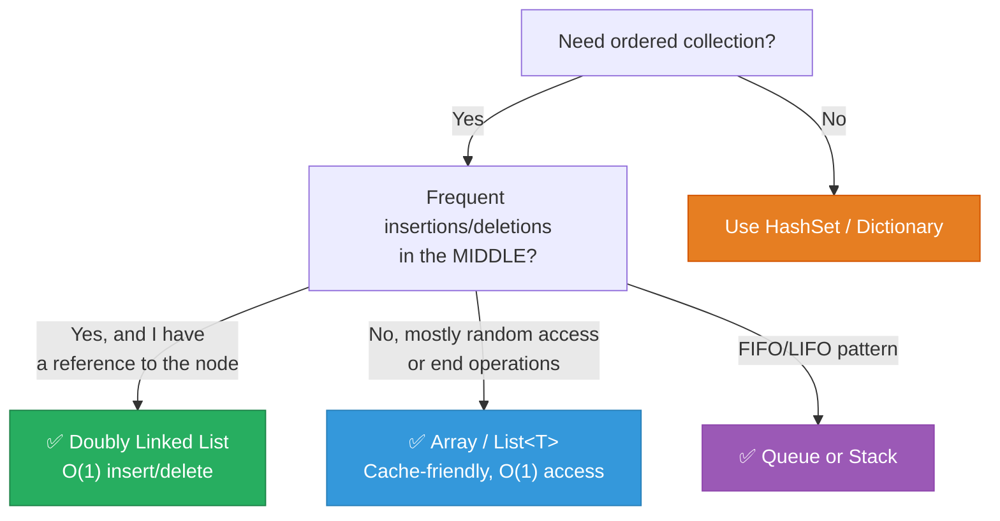

# 1. Linked Lists

## Table of Contents

- [1.1 Linked List Variants](#11-linked-list-variants)
- [1.2 Complexity Table](#12-complexity-table)
- [1.3 Implementation — Singly Linked List](#13-implementation-singly-linked-list)
- [1.4 Critical Interview Patterns](#14-critical-interview-patterns)
- [1.5 When to Use (Principal-Level Decision)](#15-when-to-use-principal-level-decision)

---


## 1.1 Linked List Variants

```mermaid
graph TD
    subgraph "Singly Linked List"
        A1["Head: 10"] -->|next| A2["20"] -->|next| A3["30"] -->|next| A4["null"]
    end

    subgraph "Doubly Linked List"
        B0["null"] <-->|prev/next| B1["Head: 10"] <-->|prev/next| B2["20"] <-->|prev/next| B3["Tail: 30"] <-->|prev/next| B4["null"]
    end

    subgraph "Circular Linked List"
        C1["10"] -->|next| C2["20"] -->|next| C3["30"] -->|next| C1
    end

    style A1 fill:#e74c3c,stroke:#c0392b,color:#fff
    style A2 fill:#e67e22,stroke:#d35400,color:#fff
    style A3 fill:#f1c40f,stroke:#f39c12,color:#000
    style B1 fill:#3498db,stroke:#2980b9,color:#fff
    style B2 fill:#2980b9,stroke:#21618c,color:#fff
    style B3 fill:#1abc9c,stroke:#16a085,color:#fff
    style C1 fill:#9b59b6,stroke:#8e44ad,color:#fff
    style C2 fill:#8e44ad,stroke:#6c3483,color:#fff
    style C3 fill:#6c3483,stroke:#5b2c6f,color:#fff
```



## 1.2 Complexity Table

| Operation | Singly | Doubly | `LinkedList<T>` (.NET) |
|---|---|---|---|
| Access by index | O(n) | O(n) | O(n) |
| Insert at head | **O(1)** | **O(1)** | **O(1)** `AddFirst` |
| Insert at tail | O(n)* / **O(1)** with tail ptr | **O(1)** | **O(1)** `AddLast` |
| Insert after node | **O(1)** | **O(1)** | **O(1)** `AddAfter` |
| Delete head | **O(1)** | **O(1)** | **O(1)** |
| Delete given node | O(n)† | **O(1)** | **O(1)** |
| Search | O(n) | O(n) | O(n) |

## 1.3 Implementation — Singly Linked List

```csharp
public class SinglyLinkedList<T>
{
    private class Node
    {
        public T Value;
        public Node? Next;
        public Node(T value) => Value = value;
    }

    private Node? _head;
    private int _count;

    public int Count => _count;

    // O(1)
    public void AddFirst(T value)
    {
        var newNode = new Node(value) { Next = _head };
        _head = newNode;
        _count++;
    }

    // O(n) — could be O(1) with tail pointer
    public void AddLast(T value)
    {
        var newNode = new Node(value);

        if (_head is null)
        {
            _head = newNode;
        }
        else
        {
            var current = _head;
            while (current.Next is not null)
                current = current.Next;
            current.Next = newNode;
        }

        _count++;
    }

    // O(1)
    public T RemoveFirst()
    {
        if (_head is null) throw new InvalidOperationException("List is empty");

        T value = _head.Value;
        _head = _head.Next;
        _count--;
        return value;
    }

    // O(n)
    public bool Contains(T value)
    {
        var current = _head;
        while (current is not null)
        {
            if (EqualityComparer<T>.Default.Equals(current.Value, value))
                return true;
            current = current.Next;
        }
        return false;
    }

    // O(n) — Reverse in-place
    public void Reverse()
    {
        Node? prev = null;
        var current = _head;

        while (current is not null)
        {
            var next = current.Next;   // Save
            current.Next = prev;       // Reverse pointer
            prev = current;            // Advance prev
            current = next;            // Advance current
        }

        _head = prev;
    }
}
```

## 1.4 Critical Interview Patterns

### Floyd's Cycle Detection (Tortoise & Hare)

```csharp
/// <summary>
/// Detects if a linked list has a cycle.
/// Time: O(n) | Space: O(1)
/// </summary>
public class ListNode
{
    public int Val;
    public ListNode? Next;
    public ListNode(int val) => Val = val;
}

public static bool HasCycle(ListNode? head)
{
    var slow = head;
    var fast = head;

    while (fast?.Next is not null)
    {
        slow = slow!.Next;
        fast = fast.Next.Next;

        if (slow == fast) return true; // They meet → cycle exists
    }

    return false;
}

/// <summary>
/// Finds the START of the cycle.
/// After detection, reset one pointer to head. 
/// Move both at speed 1 — they meet at cycle start.
/// Mathematical proof: distance from head to cycle start = 
///                     distance from meeting point to cycle start
/// </summary>
public static ListNode? FindCycleStart(ListNode? head)
{
    var slow = head;
    var fast = head;

    // Phase 1: Detect cycle
    while (fast?.Next is not null)
    {
        slow = slow!.Next;
        fast = fast.Next.Next;
        if (slow == fast) break;
    }

    if (fast?.Next is null) return null; // No cycle

    // Phase 2: Find start
    slow = head;
    while (slow != fast)
    {
        slow = slow!.Next;
        fast = fast!.Next;
    }

    return slow;
}
```

### Merge Two Sorted Lists

```csharp
/// <summary>
/// Merges two sorted linked lists into one sorted list.
/// Time: O(n + m) | Space: O(1) — reuses existing nodes
/// </summary>
public static ListNode? MergeSorted(ListNode? l1, ListNode? l2)
{
    var dummy = new ListNode(0);
    var current = dummy;

    while (l1 is not null && l2 is not null)
    {
        if (l1.Val <= l2.Val)
        {
            current.Next = l1;
            l1 = l1.Next;
        }
        else
        {
            current.Next = l2;
            l2 = l2.Next;
        }
        current = current.Next;
    }

    current.Next = l1 ?? l2; // Attach remaining

    return dummy.Next;
}
```

## 1.5 When to Use (Principal-Level Decision)



> **Principal Insight:** In real-world .NET, `LinkedList<T>` is rarely used because `List<T>` has far better cache locality. The primary use-case for linked lists in production is implementing other data structures (LRU Cache, adjacency lists, free lists in memory allocators).
