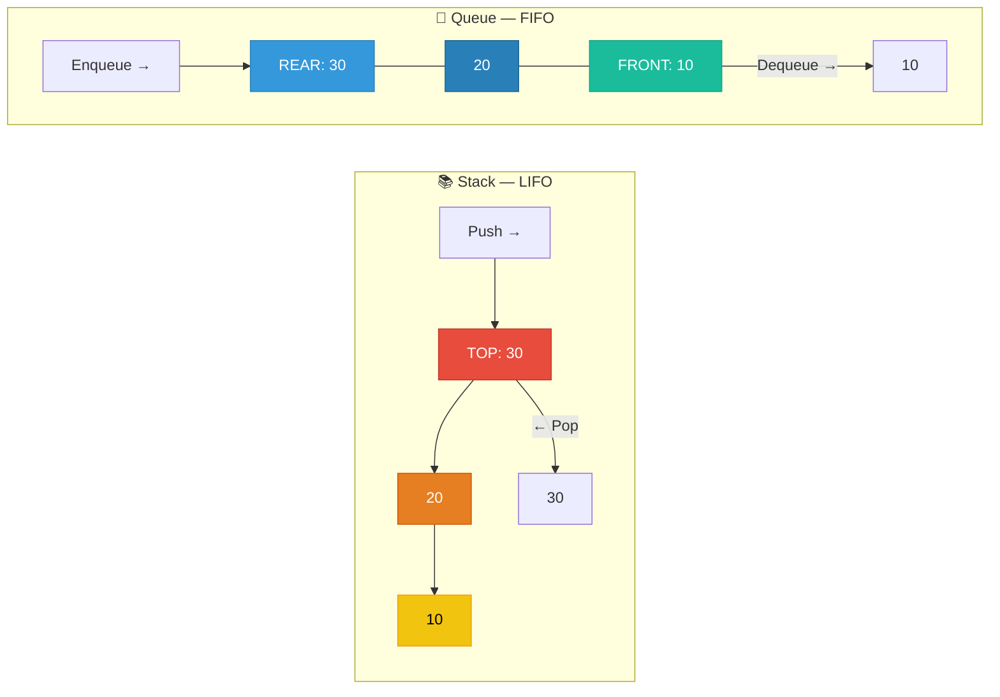

# 1. Stacks & Queues

## Table of Contents

- [1.1 Visual Comparison](#11-visual-comparison)
- [1.2 Complexity Table](#12-complexity-table)
- [1.3 Stack Interview Patterns](#13-stack-interview-patterns)
- [1.4 Queue Interview Patterns](#14-queue-interview-patterns)

---


## 1.1 Visual Comparison



## 1.2 Complexity Table

| Operation | Stack `Stack<T>` | Queue `Queue<T>` | Deque (not built-in) |
|---|---|---|---|
| Push / Enqueue | **O(1)** amortized | **O(1)** amortized | **O(1)** both ends |
| Pop / Dequeue | **O(1)** | **O(1)** | **O(1)** both ends |
| Peek | **O(1)** | **O(1)** | **O(1)** both ends |
| Search | O(n) | O(n) | O(n) |
| Space | O(n) | O(n) | O(n) |

## 1.3 Stack Interview Patterns

### Valid Parentheses

```csharp
/// <summary>
/// Validates balanced brackets: (), [], {}
/// Time: O(n) | Space: O(n)
/// </summary>
public static bool IsValid(string s)
{
    var stack = new Stack<char>();
    var pairs = new Dictionary<char, char>
    {
        { ')', '(' },
        { ']', '[' },
        { '}', '{' }
    };

    foreach (char c in s)
    {
        if (pairs.ContainsValue(c))
        {
            stack.Push(c);  // Opening bracket
        }
        else if (pairs.ContainsKey(c))
        {
            if (stack.Count == 0 || stack.Pop() != pairs[c])
                return false;
        }
    }

    return stack.Count == 0;
}
```

### Min Stack — O(1) GetMin

```csharp
/// <summary>
/// Stack that supports Push, Pop, Top, and GetMin all in O(1).
/// Uses a parallel stack to track minimums.
/// </summary>
public class MinStack
{
    private readonly Stack<int> _data = new();
    private readonly Stack<int> _mins = new(); // Tracks min at each level

    public void Push(int val)
    {
        _data.Push(val);
        int currentMin = _mins.Count == 0 ? val : Math.Min(val, _mins.Peek());
        _mins.Push(currentMin);
    }

    public void Pop()
    {
        _data.Pop();
        _mins.Pop();
    }

    public int Top() => _data.Peek();

    public int GetMin() => _mins.Peek(); // O(1)!
}
```

### Monotonic Stack — Next Greater Element

```csharp
/// <summary>
/// For each element, find the next element that is greater.
/// Time: O(n) | Space: O(n)
/// Each element is pushed and popped at most once.
/// </summary>
public static int[] NextGreaterElement(int[] nums)
{
    int n = nums.Length;
    int[] result = new int[n];
    Array.Fill(result, -1); // Default: no greater element

    var stack = new Stack<int>(); // Stores INDICES

    for (int i = 0; i < n; i++)
    {
        // Pop all elements that are smaller than current
        while (stack.Count > 0 && nums[stack.Peek()] < nums[i])
        {
            result[stack.Pop()] = nums[i];
        }
        stack.Push(i);
    }

    return result;
}
```

## 1.4 Queue Interview Patterns

### Implement Queue Using Two Stacks

```csharp
/// <summary>
/// Amortized O(1) for all operations.
/// Key insight: When outStack is empty, pour all from inStack.
/// Each element is moved at most twice (in→out), so amortized O(1).
/// </summary>
public class QueueViaStacks<T>
{
    private readonly Stack<T> _inStack = new();   // For enqueue
    private readonly Stack<T> _outStack = new();  // For dequeue

    // O(1)
    public void Enqueue(T item) => _inStack.Push(item);

    // Amortized O(1)
    public T Dequeue()
    {
        EnsureOutStack();
        return _outStack.Pop();
    }

    // Amortized O(1)
    public T Peek()
    {
        EnsureOutStack();
        return _outStack.Peek();
    }

    private void EnsureOutStack()
    {
        if (_outStack.Count == 0)
        {
            if (_inStack.Count == 0)
                throw new InvalidOperationException("Queue is empty");

            while (_inStack.Count > 0)
                _outStack.Push(_inStack.Pop());
        }
    }

    public bool IsEmpty => _inStack.Count == 0 && _outStack.Count == 0;
}
```

### Sliding Window Maximum (Monotonic Deque)

```csharp
/// <summary>
/// Find maximum in every sliding window of size k.
/// Time: O(n) | Space: O(k)
/// Uses a decreasing monotonic deque.
/// </summary>
public static int[] MaxSlidingWindow(int[] nums, int k)
{
    var result = new int[nums.Length - k + 1];
    var deque = new LinkedList<int>(); // Stores indices, front = max

    for (int i = 0; i < nums.Length; i++)
    {
        // Remove indices outside the window
        while (deque.Count > 0 && deque.First!.Value < i - k + 1)
            deque.RemoveFirst();

        // Remove smaller elements from the back (they'll never be the max)
        while (deque.Count > 0 && nums[deque.Last!.Value] < nums[i])
            deque.RemoveLast();

        deque.AddLast(i);

        // Window is fully formed starting at index k-1
        if (i >= k - 1)
            result[i - k + 1] = nums[deque.First!.Value];
    }

    return result;
}
```
