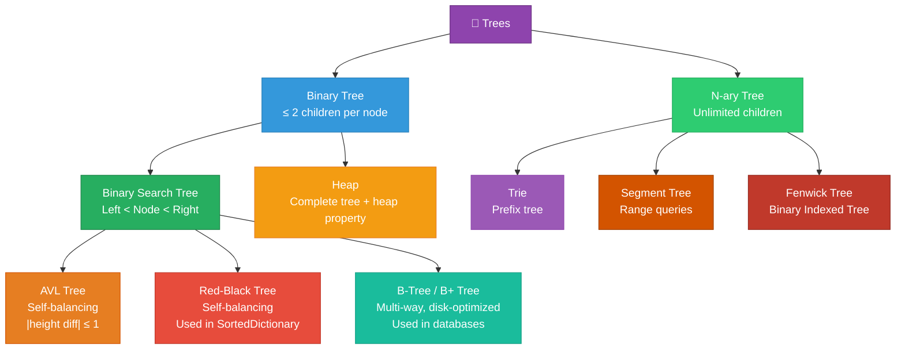
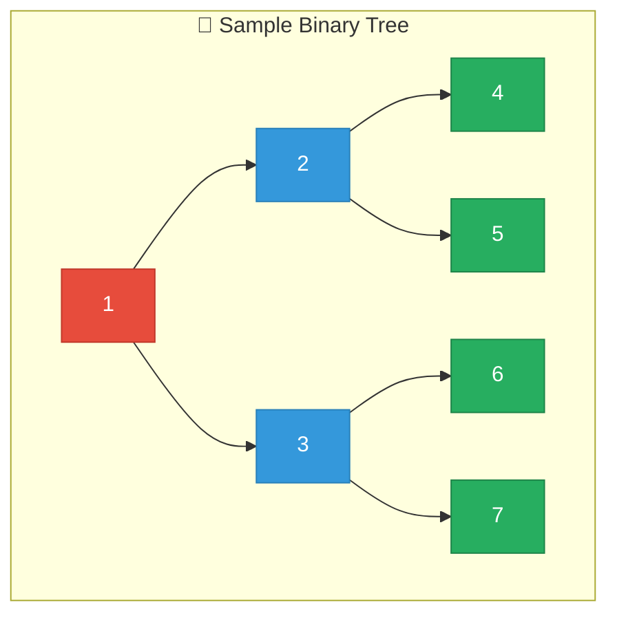
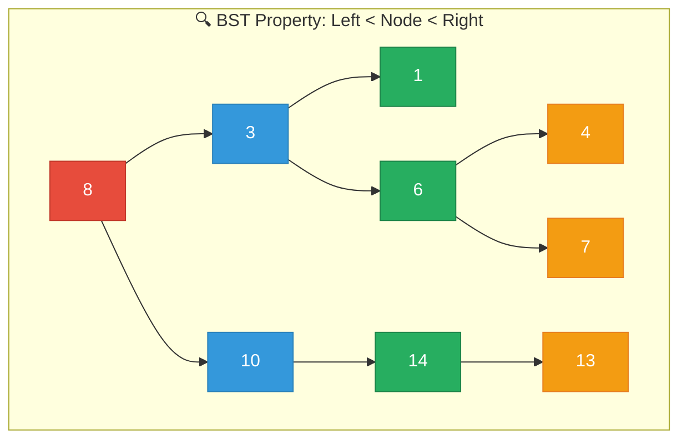
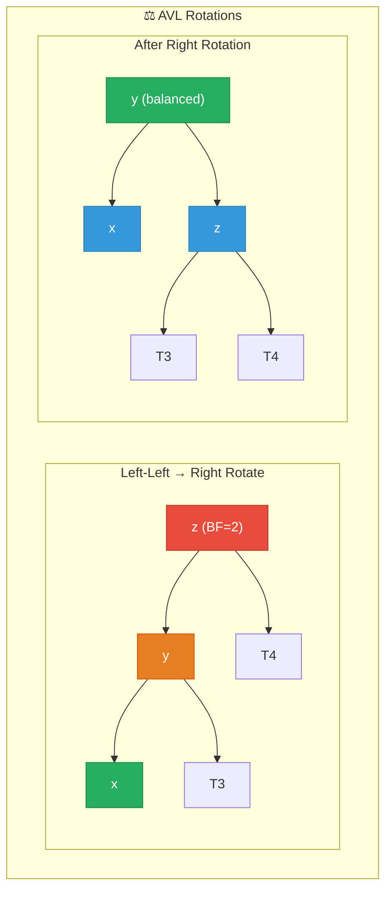
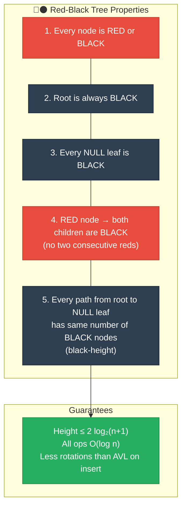
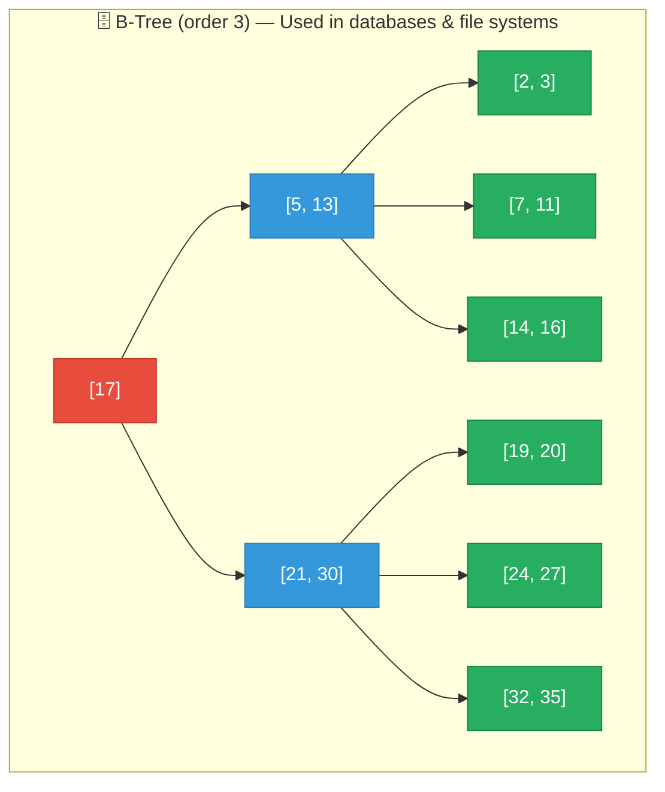

# 1. Trees

## Table of Contents

- [1.1 Tree Taxonomy](#11-tree-taxonomy)
- [1.2 Binary Tree — Traversals](#12-binary-tree-traversals)
- [1.3 Binary Search Tree (BST)](#13-binary-search-tree-bst)
- [1.4 AVL Tree (Self-Balancing BST)](#14-avl-tree-self-balancing-bst)
- [1.5 Red-Black Tree — Conceptual Understanding](#15-red-black-tree-conceptual-understanding)
- [1.6 B-Tree / B+ Tree — Principal Must-Know](#16-b-tree-b-tree-principal-must-know)
- [1.7 Essential Tree Interview Problems](#17-essential-tree-interview-problems)

---


## 1.1 Tree Taxonomy



## 1.2 Binary Tree — Traversals



| Traversal | Order | Result | Use Case |
|---|---|---|---|
| **Pre-order** | Node → Left → Right | 1,2,4,5,3,6,7 | Serialize/copy tree |
| **In-order** | Left → Node → Right | 4,2,5,1,6,3,7 | BST → sorted order |
| **Post-order** | Left → Right → Node | 4,5,2,6,7,3,1 | Delete tree, evaluate expr |
| **Level-order** | Level by level (BFS) | 1,2,3,4,5,6,7 | Find depth, shortest path |

```csharp
public class TreeNode
{
    public int Val;
    public TreeNode? Left, Right;
    public TreeNode(int val) => Val = val;
}

public class TreeTraversals
{
    // ===== RECURSIVE TRAVERSALS =====

    public static void InOrder(TreeNode? node, List<int> result)
    {
        if (node is null) return;
        InOrder(node.Left, result);
        result.Add(node.Val);              // Process node
        InOrder(node.Right, result);
    }

    public static void PreOrder(TreeNode? node, List<int> result)
    {
        if (node is null) return;
        result.Add(node.Val);              // Process node
        PreOrder(node.Left, result);
        PreOrder(node.Right, result);
    }

    public static void PostOrder(TreeNode? node, List<int> result)
    {
        if (node is null) return;
        PostOrder(node.Left, result);
        PostOrder(node.Right, result);
        result.Add(node.Val);              // Process node
    }

    // ===== ITERATIVE IN-ORDER (Stack-based) =====
    // Important for interviews — shows you understand the recursion stack
    public static List<int> InOrderIterative(TreeNode? root)
    {
        var result = new List<int>();
        var stack = new Stack<TreeNode>();
        var current = root;

        while (current is not null || stack.Count > 0)
        {
            // Go as far left as possible
            while (current is not null)
            {
                stack.Push(current);
                current = current.Left;
            }

            current = stack.Pop();
            result.Add(current.Val);
            current = current.Right;
        }

        return result;
    }

    // ===== LEVEL-ORDER (BFS) =====
    public static IList<IList<int>> LevelOrder(TreeNode? root)
    {
        var result = new List<IList<int>>();
        if (root is null) return result;

        var queue = new Queue<TreeNode>();
        queue.Enqueue(root);

        while (queue.Count > 0)
        {
            int levelSize = queue.Count;
            var level = new List<int>();

            for (int i = 0; i < levelSize; i++)
            {
                var node = queue.Dequeue();
                level.Add(node.Val);

                if (node.Left is not null) queue.Enqueue(node.Left);
                if (node.Right is not null) queue.Enqueue(node.Right);
            }

            result.Add(level);
        }

        return result;
    }
}
```

## 1.3 Binary Search Tree (BST)



### BST Complexity

| Operation | Average (balanced) | Worst (degenerate/linear) |
|---|---|---|
| Search | **O(log n)** | O(n) |
| Insert | **O(log n)** | O(n) |
| Delete | **O(log n)** | O(n) |
| Min/Max | **O(log n)** | O(n) |
| In-order traversal | O(n) | O(n) |

```csharp
public class BinarySearchTree
{
    private TreeNode? _root;

    // O(log n) average
    public void Insert(int val)
    {
        _root = InsertRecursive(_root, val);
    }

    private TreeNode InsertRecursive(TreeNode? node, int val)
    {
        if (node is null) return new TreeNode(val);

        if (val < node.Val)
            node.Left = InsertRecursive(node.Left, val);
        else if (val > node.Val)
            node.Right = InsertRecursive(node.Right, val);
        // Duplicate: ignore (or handle as needed)

        return node;
    }

    // O(log n) average
    public bool Search(int val)
    {
        var current = _root;

        while (current is not null)
        {
            if (val == current.Val) return true;
            current = val < current.Val ? current.Left : current.Right;
        }

        return false;
    }

    // O(log n) average — the trickiest BST operation
    public void Delete(int val)
    {
        _root = DeleteRecursive(_root, val);
    }

    private TreeNode? DeleteRecursive(TreeNode? node, int val)
    {
        if (node is null) return null;

        if (val < node.Val)
            node.Left = DeleteRecursive(node.Left, val);
        else if (val > node.Val)
            node.Right = DeleteRecursive(node.Right, val);
        else
        {
            // Case 1 & 2: Node with 0 or 1 child
            if (node.Left is null) return node.Right;
            if (node.Right is null) return node.Left;

            // Case 3: Node with 2 children
            // Replace with in-order successor (smallest in right subtree)
            var successor = FindMin(node.Right);
            node.Val = successor.Val;
            node.Right = DeleteRecursive(node.Right, successor.Val);
        }

        return node;
    }

    private TreeNode FindMin(TreeNode node)
    {
        while (node.Left is not null)
            node = node.Left;
        return node;
    }

    // Validate BST — classic interview question
    public bool IsValidBST() => IsValid(_root, long.MinValue, long.MaxValue);

    private bool IsValid(TreeNode? node, long min, long max)
    {
        if (node is null) return true;
        if (node.Val <= min || node.Val >= max) return false;

        return IsValid(node.Left, min, node.Val)
            && IsValid(node.Right, node.Val, max);
    }
}
```

## 1.4 AVL Tree (Self-Balancing BST)



```csharp
public class AVLTree
{
    private class AVLNode
    {
        public int Val, Height;
        public AVLNode? Left, Right;
        public AVLNode(int val) { Val = val; Height = 1; }
    }

    private AVLNode? _root;

    private int Height(AVLNode? node) => node?.Height ?? 0;

    private int BalanceFactor(AVLNode? node)
        => node is null ? 0 : Height(node.Left) - Height(node.Right);

    private void UpdateHeight(AVLNode node)
        => node.Height = 1 + Math.Max(Height(node.Left), Height(node.Right));

    // Right rotation (for Left-Left case)
    //      y            x
    //     / \          / \
    //    x   T3  →   T1   y
    //   / \              / \
    //  T1  T2           T2  T3
    private AVLNode RightRotate(AVLNode y)
    {
        var x = y.Left!;
        var T2 = x.Right;

        x.Right = y;
        y.Left = T2;

        UpdateHeight(y);
        UpdateHeight(x);

        return x; // New root
    }

    // Left rotation (for Right-Right case)
    private AVLNode LeftRotate(AVLNode x)
    {
        var y = x.Right!;
        var T2 = y.Left;

        y.Left = x;
        x.Right = T2;

        UpdateHeight(x);
        UpdateHeight(y);

        return y; // New root
    }

    // O(log n) guaranteed
    public void Insert(int val) => _root = Insert(_root, val);

    private AVLNode Insert(AVLNode? node, int val)
    {
        // Standard BST insert
        if (node is null) return new AVLNode(val);

        if (val < node.Val)
            node.Left = Insert(node.Left, val);
        else if (val > node.Val)
            node.Right = Insert(node.Right, val);
        else
            return node; // No duplicates

        UpdateHeight(node);

        int bf = BalanceFactor(node);

        // Left-Left → Right Rotate
        if (bf > 1 && val < node.Left!.Val)
            return RightRotate(node);

        // Right-Right → Left Rotate
        if (bf < -1 && val > node.Right!.Val)
            return LeftRotate(node);

        // Left-Right → Left Rotate child, then Right Rotate
        if (bf > 1 && val > node.Left!.Val)
        {
            node.Left = LeftRotate(node.Left);
            return RightRotate(node);
        }

        // Right-Left → Right Rotate child, then Left Rotate
        if (bf < -1 && val < node.Right!.Val)
        {
            node.Right = RightRotate(node.Right);
            return LeftRotate(node);
        }

        return node; // Already balanced
    }
}
```

## 1.5 Red-Black Tree — Conceptual Understanding

> Used internally by .NET's `SortedDictionary<K,V>`, `SortedSet<T>`, and Java's `TreeMap`.



| Property | AVL Tree | Red-Black Tree |
|---|---|---|
| Balancing strictness | Strict (height diff ≤ 1) | Relaxed (height ≤ 2 log n) |
| Search speed | **Faster** (more balanced) | Slightly slower |
| Insert/Delete speed | Slower (more rotations) | **Faster** (fewer rotations) |
| Use case | Read-heavy workloads | Write-heavy workloads |
| Real-world usage | Databases (AVL variants) | Language standard libraries |

## 1.6 B-Tree / B+ Tree — Principal Must-Know



> **Why B-Trees for databases?** Disk I/O is expensive. B-Trees are wide and shallow, minimizing disk reads. A B-Tree with branching factor 1000 can store 1 billion keys in just 3 levels (3 disk reads).

## 1.7 Essential Tree Interview Problems

### Lowest Common Ancestor (LCA)

```csharp
/// <summary>
/// Find LCA of two nodes in a binary tree.
/// Time: O(n) | Space: O(h) where h = height
/// </summary>
public static TreeNode? LowestCommonAncestor(TreeNode? root, TreeNode p, TreeNode q)
{
    if (root is null || root == p || root == q)
        return root;

    var left = LowestCommonAncestor(root.Left, p, q);
    var right = LowestCommonAncestor(root.Right, p, q);

    if (left is not null && right is not null)
        return root;  // p and q are on different sides

    return left ?? right;  // Both on same side
}
```

### Maximum Depth

```csharp
/// <summary>
/// Time: O(n) | Space: O(h)
/// </summary>
public static int MaxDepth(TreeNode? root)
{
    if (root is null) return 0;
    return 1 + Math.Max(MaxDepth(root.Left), MaxDepth(root.Right));
}
```

### Serialize / Deserialize Binary Tree

```csharp
public class TreeSerializer
{
    private const string NULL_MARKER = "#";
    private const char DELIMITER = ',';

    /// <summary>Pre-order serialization. Time: O(n)</summary>
    public string Serialize(TreeNode? root)
    {
        var sb = new StringBuilder();
        SerializeHelper(root, sb);
        return sb.ToString().TrimEnd(DELIMITER);
    }

    private void SerializeHelper(TreeNode? node, StringBuilder sb)
    {
        if (node is null)
        {
            sb.Append(NULL_MARKER).Append(DELIMITER);
            return;
        }

        sb.Append(node.Val).Append(DELIMITER);
        SerializeHelper(node.Left, sb);
        SerializeHelper(node.Right, sb);
    }

    /// <summary>Pre-order deserialization. Time: O(n)</summary>
    public TreeNode? Deserialize(string data)
    {
        var queue = new Queue<string>(data.Split(DELIMITER));
        return DeserializeHelper(queue);
    }

    private TreeNode? DeserializeHelper(Queue<string> queue)
    {
        string val = queue.Dequeue();

        if (val == NULL_MARKER) return null;

        var node = new TreeNode(int.Parse(val));
        node.Left = DeserializeHelper(queue);
        node.Right = DeserializeHelper(queue);

        return node;
    }
}
```
