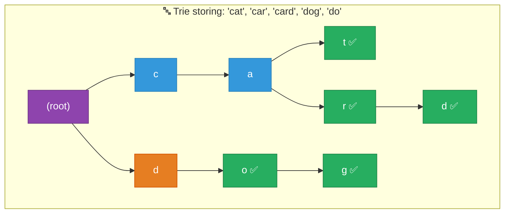

# 1. Tries (Prefix Trees)

## Table of Contents

- [1.1 Trie Structure](#11-trie-structure)
- [1.2 Complexity](#12-complexity)
- [1.3 Implementation](#13-implementation)
- [1.4 Word Search II (Trie + Backtracking)](#14-word-search-ii-trie-backtracking)

---


## 1.1 Trie Structure



## 1.2 Complexity

| Operation | Time | Space |
|---|---|---|
| Insert | **O(m)** | O(m) per word |
| Search | **O(m)** | — |
| Prefix search | **O(m)** | — |
| Delete | O(m) | — |
| Total space | — | **O(n × m × alphabet)** |

> Where **m** = word length, **n** = number of words

## 1.3 Implementation

```csharp
/// <summary>
/// Trie (Prefix Tree) — Essential for autocomplete, spell check,
/// IP routing, word games, and prefix-based problems.
/// </summary>
public class Trie
{
    private class TrieNode
    {
        public Dictionary<char, TrieNode> Children = new();
        public bool IsEndOfWord;
        public int PrefixCount; // How many words share this prefix
    }

    private readonly TrieNode _root = new();

    // O(m) where m = word length
    public void Insert(string word)
    {
        var current = _root;

        foreach (char c in word)
        {
            if (!current.Children.ContainsKey(c))
                current.Children[c] = new TrieNode();

            current = current.Children[c];
            current.PrefixCount++;
        }

        current.IsEndOfWord = true;
    }

    // O(m)
    public bool Search(string word)
    {
        var node = FindNode(word);
        return node is not null && node.IsEndOfWord;
    }

    // O(m)
    public bool StartsWith(string prefix)
    {
        return FindNode(prefix) is not null;
    }

    // O(m) — How many words have this prefix?
    public int CountWordsWithPrefix(string prefix)
    {
        var node = FindNode(prefix);
        return node?.PrefixCount ?? 0;
    }

    // Autocomplete: Return all words with given prefix
    public List<string> GetWordsWithPrefix(string prefix, int maxResults = 10)
    {
        var results = new List<string>();
        var node = FindNode(prefix);

        if (node is not null)
            CollectWords(node, new StringBuilder(prefix), results, maxResults);

        return results;
    }

    private void CollectWords(TrieNode node, StringBuilder current,
                               List<string> results, int maxResults)
    {
        if (results.Count >= maxResults) return;

        if (node.IsEndOfWord)
            results.Add(current.ToString());

        foreach (var (c, child) in node.Children)
        {
            current.Append(c);
            CollectWords(child, current, results, maxResults);
            current.Length--; // Backtrack
        }
    }

    private TrieNode? FindNode(string s)
    {
        var current = _root;

        foreach (char c in s)
        {
            if (!current.Children.TryGetValue(c, out var next))
                return null;
            current = next;
        }

        return current;
    }
}
```

## 1.4 Word Search II (Trie + Backtracking)

```csharp
/// <summary>
/// Given a board and list of words, find all words that can be formed
/// by adjacent cells. Classic interview problem.
/// Time: O(M × N × 4^L) where L = max word length
/// </summary>
public class WordSearchII
{
    private class TrieNode
    {
        public Dictionary<char, TrieNode> Children = new();
        public string? Word;
    }

    public IList<string> FindWords(char[][] board, string[] words)
    {
        // Build trie from all words
        var root = new TrieNode();
        foreach (string word in words)
        {
            var node = root;
            foreach (char c in word)
            {
                if (!node.Children.ContainsKey(c))
                    node.Children[c] = new TrieNode();
                node = node.Children[c];
            }
            node.Word = word;
        }

        var result = new List<string>();
        int rows = board.Length, cols = board[0].Length;

        for (int r = 0; r < rows; r++)
        {
            for (int c = 0; c < cols; c++)
            {
                if (root.Children.ContainsKey(board[r][c]))
                    Backtrack(board, r, c, root, result);
            }
        }

        return result;
    }

    private void Backtrack(char[][] board, int r, int c,
                           TrieNode parent, List<string> result)
    {
        char letter = board[r][c];
        var current = parent.Children[letter];

        if (current.Word is not null)
        {
            result.Add(current.Word);
            current.Word = null; // Avoid duplicates
        }

        board[r][c] = '#'; // Mark visited

        int[][] dirs = { [0, 1], [0, -1], [1, 0], [-1, 0] };
        foreach (var dir in dirs)
        {
            int nr = r + dir[0], nc = c + dir[1];
            if (nr >= 0 && nr < board.Length && nc >= 0 && nc < board[0].Length
                && current.Children.ContainsKey(board[nr][nc]))
            {
                Backtrack(board, nr, nc, current, result);
            }
        }

        board[r][c] = letter; // Restore

        // Optimization: prune empty branches
        if (current.Children.Count == 0)
            parent.Children.Remove(letter);
    }
}
```
