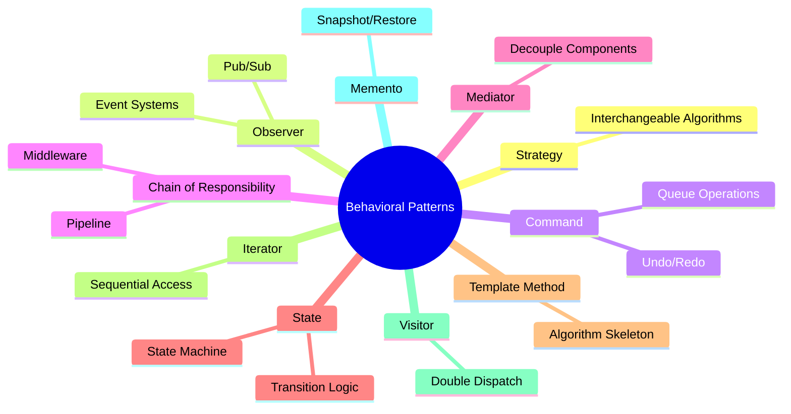
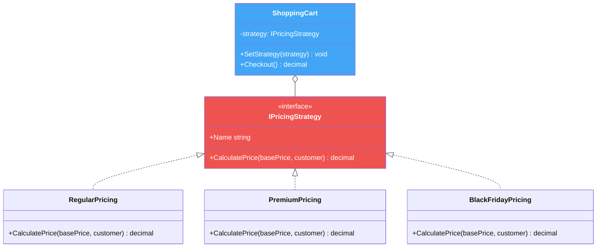
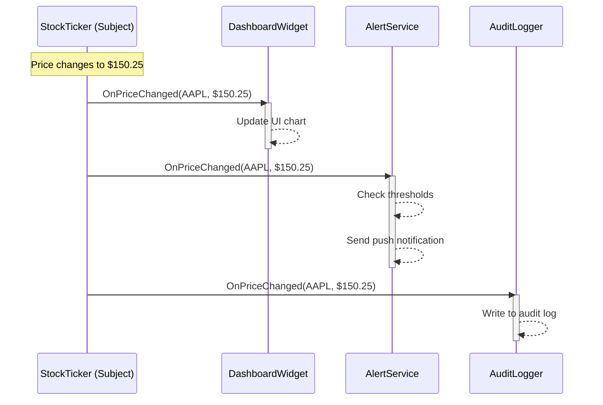
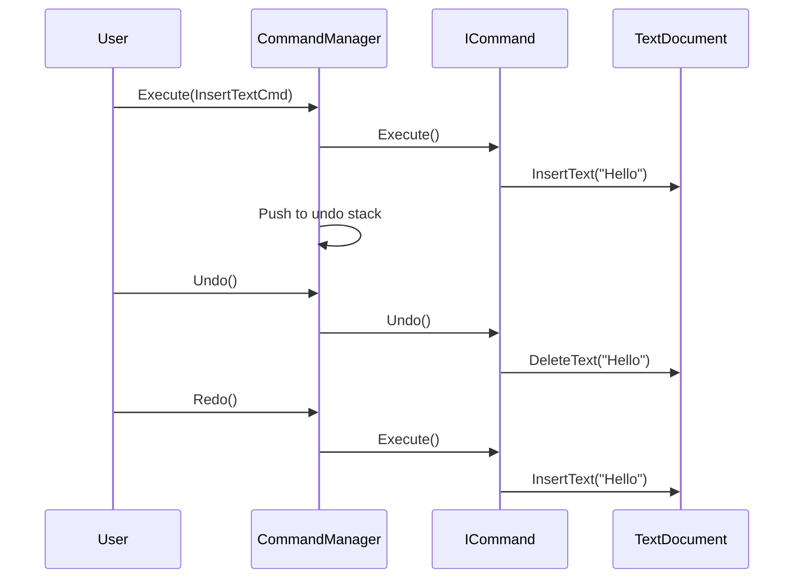
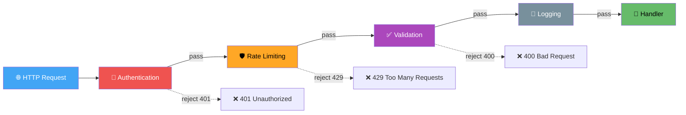
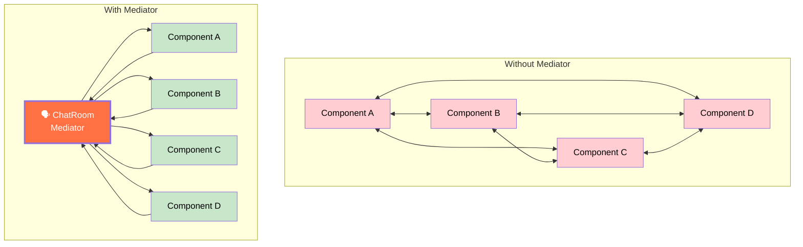
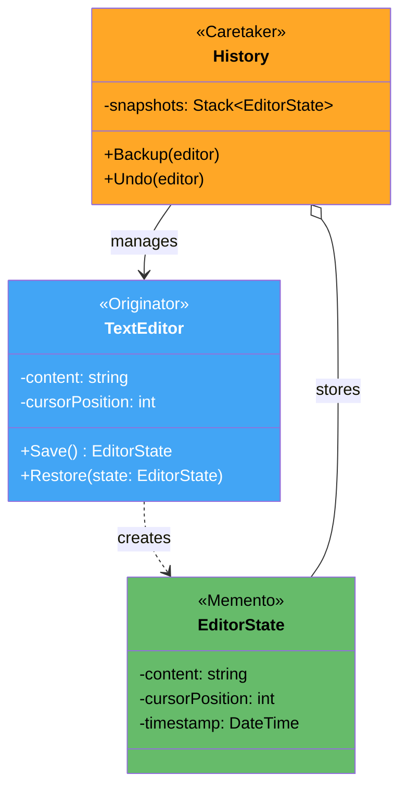
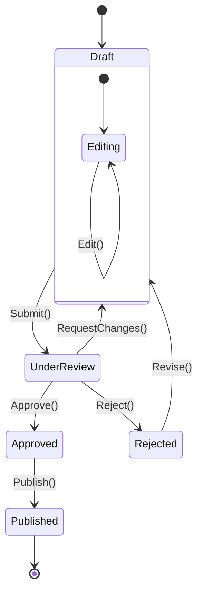
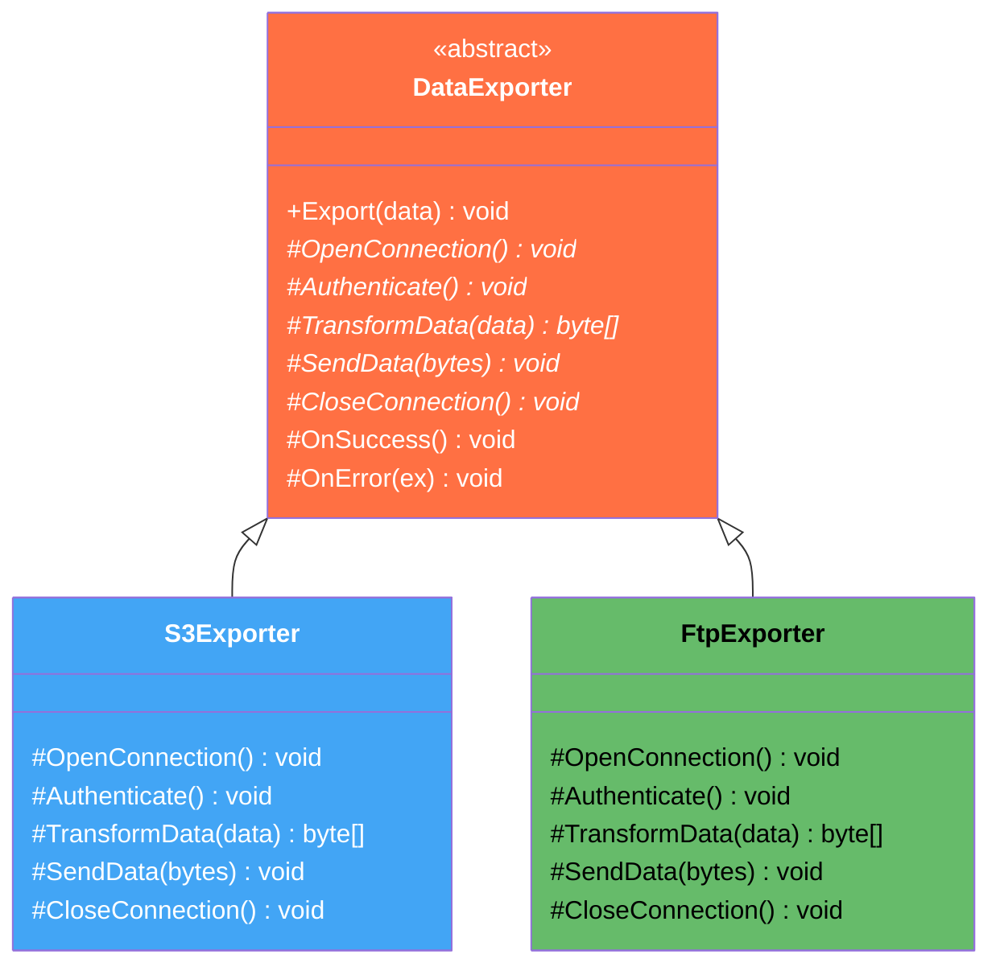

# 1. Behavioral Patterns

## Table of Contents

- [1.1 🎯 Strategy Pattern](#11-strategy-pattern)
- [1.2 📡 Observer Pattern](#12-observer-pattern)
- [1.3 💻 Command Pattern](#13-command-pattern)
- [1.4 ⛓️ Chain of Responsibility](#14-chain-of-responsibility)
- [1.5 🗣️ Mediator Pattern](#15-mediator-pattern)
- [1.6 📸 Memento Pattern](#16-memento-pattern)
- [1.7 🔄 State Pattern](#17-state-pattern)
- [1.8 📋 Template Method Pattern](#18-template-method-pattern)
- [1.9 🔁 Iterator Pattern](#19-iterator-pattern)
- [1.10 👁️ Visitor Pattern](#110-visitor-pattern)

---


> **Purpose:** Define how objects **communicate and distribute responsibility**.



---

## 1.1 🎯 Strategy Pattern

> **Intent:** Define a family of algorithms, encapsulate each one, and make them **interchangeable**. Strategy lets the algorithm vary independently from clients that use it.

### Diagram



### Implementation

```csharp
// ══════════════════════════════════════
// Strategy Interface
// ══════════════════════════════════════
public interface IPricingStrategy
{
    decimal CalculatePrice(decimal basePrice, CustomerType customerType);
    string Name { get; }
}

public enum CustomerType { Regular, Premium, VIP }

// ══════════════════════════════════════
// Concrete Strategies
// ══════════════════════════════════════
public class RegularPricing : IPricingStrategy
{
    public string Name => "Regular Pricing";

    public decimal CalculatePrice(decimal basePrice, CustomerType customerType) =>
        customerType switch
        {
            CustomerType.VIP     => basePrice * 0.90m,  // 10% loyalty discount
            CustomerType.Premium => basePrice * 0.95m,  // 5% discount
            _                    => basePrice            // No discount
        };
}

public class BlackFridayPricing : IPricingStrategy
{
    public string Name => "🖤 Black Friday Sale";

    public decimal CalculatePrice(decimal basePrice, CustomerType customerType) =>
        customerType switch
        {
            CustomerType.VIP     => basePrice * 0.50m,  // 50% off!
            CustomerType.Premium => basePrice * 0.60m,  // 40% off
            _                    => basePrice * 0.70m   // 30% off
        };
}

public class HappyHourPricing : IPricingStrategy
{
    public string Name => "🍻 Happy Hour";

    public decimal CalculatePrice(decimal basePrice, CustomerType customerType) =>
        basePrice * 0.75m; // 25% off for everyone
}

public class ClearancePricing : IPricingStrategy
{
    public string Name => "🏷️ Clearance";

    public decimal CalculatePrice(decimal basePrice, CustomerType customerType) =>
        Math.Max(basePrice * 0.30m, 5.00m); // 70% off, minimum $5
}

// ══════════════════════════════════════
// Context
// ══════════════════════════════════════
public class ShoppingCart
{
    private readonly List<(string Name, decimal Price)> _items = new();
    private IPricingStrategy _strategy;

    public ShoppingCart(IPricingStrategy strategy) => _strategy = strategy;

    public void SetStrategy(IPricingStrategy strategy)
    {
        Console.WriteLine($"  🔄 Strategy changed to: {strategy.Name}");
        _strategy = strategy;
    }

    public void AddItem(string name, decimal price) =>
        _items.Add((name, price));

    public decimal Checkout(CustomerType customerType)
    {
        Console.WriteLine($"\n  🛒 Checkout — Strategy: {_strategy.Name} | Customer: {customerType}");
        Console.WriteLine($"  {"Item",-25} {"Original",>10} {"Final",>10} {"Saved",>10}");
        Console.WriteLine($"  {new string('─', 58)}");

        decimal total = 0;
        decimal totalSaved = 0;

        foreach (var (name, basePrice) in _items)
        {
            var finalPrice = _strategy.CalculatePrice(basePrice, customerType);
            var saved = basePrice - finalPrice;
            total += finalPrice;
            totalSaved += saved;
            Console.WriteLine($"  {name,-25} {basePrice,>10:C} {finalPrice,>10:C} {saved,>10:C}");
        }

        Console.WriteLine($"  {new string('═', 58)}");
        Console.WriteLine($"  {"TOTAL",-25} {"",10} {total,>10:C} {totalSaved,>10:C}");
        return total;
    }
}

// ══════════════════════════════════════
// Usage
// ══════════════════════════════════════
var cart = new ShoppingCart(new RegularPricing());
cart.AddItem("MacBook Pro 16\"", 2499.99m);
cart.AddItem("Magic Mouse", 99.99m);
cart.AddItem("USB-C Hub", 49.99m);

// Regular pricing for a VIP customer
cart.Checkout(CustomerType.VIP);

// Black Friday hits! Swap strategy at runtime
cart.SetStrategy(new BlackFridayPricing());
cart.Checkout(CustomerType.VIP);     // VIP + Black Friday = huge savings

// Or use lambda for quick one-off strategy
// (possible because interface has single method — functional strategy)
```

---

## 1.2 📡 Observer Pattern

> **Intent:** Define a **one-to-many** dependency so that when one object changes state, all dependents are notified automatically.

### Sequence Diagram



### Implementation

```csharp
// ══════════════════════════════════════
// Event Args — rich notification data
// ══════════════════════════════════════
public class StockPriceChangedEventArgs : EventArgs
{
    public string Symbol { get; init; } = "";
    public decimal OldPrice { get; init; }
    public decimal NewPrice { get; init; }
    public DateTime Timestamp { get; init; }
    public long Volume { get; init; }

    public decimal Change => NewPrice - OldPrice;
    public decimal ChangePercent => OldPrice == 0 ? 0 : Change / OldPrice * 100;
    public string Direction => Change >= 0 ? "📈" : "📉";
}

// ══════════════════════════════════════
// Subject — uses idiomatic C# events
// ══════════════════════════════════════
public class StockTicker
{
    private readonly Dictionary<string, decimal> _prices = new();

    // C# event — THE idiomatic Observer pattern in .NET
    public event EventHandler<StockPriceChangedEventArgs>? PriceChanged;

    public void UpdatePrice(string symbol, decimal newPrice, long volume = 0)
    {
        _prices.TryGetValue(symbol, out var oldPrice);
        _prices[symbol] = newPrice;

        // Notify all observers
        PriceChanged?.Invoke(this, new StockPriceChangedEventArgs
        {
            Symbol = symbol,
            OldPrice = oldPrice,
            NewPrice = newPrice,
            Timestamp = DateTime.UtcNow,
            Volume = volume
        });
    }

    public decimal? GetPrice(string symbol) =>
        _prices.TryGetValue(symbol, out var price) ? price : null;
}

// ══════════════════════════════════════
// Observers
// ══════════════════════════════════════
public class DashboardWidget
{
    private readonly string _name;

    public DashboardWidget(string name) => _name = name;

    public void OnPriceChanged(object? sender, StockPriceChangedEventArgs e)
    {
        Console.WriteLine(
            $"  📊 [{_name}] {e.Symbol}: ${e.NewPrice:N2} " +
            $"{e.Direction} {e.ChangePercent:+0.00;-0.00}%");
    }
}

public class AlertService
{
    private readonly decimal _threshold;

    public AlertService(decimal thresholdPercent) => _threshold = thresholdPercent;

    public void OnPriceChanged(object? sender, StockPriceChangedEventArgs e)
    {
        if (Math.Abs(e.ChangePercent) >= _threshold)
        {
            Console.WriteLine(
                $"  🚨 ALERT: {e.Symbol} moved {e.ChangePercent:+0.00}% " +
                $"(${e.OldPrice:N2} → ${e.NewPrice:N2}) — exceeds {_threshold}% threshold!");
        }
    }
}

public class AuditLogger
{
    public void OnPriceChanged(object? sender, StockPriceChangedEventArgs e) =>
        Console.WriteLine(
            $"  📝 AUDIT [{e.Timestamp:O}] {e.Symbol}: " +
            $"${e.OldPrice:N2} → ${e.NewPrice:N2} (Vol: {e.Volume:N0})");
}

public class PortfolioTracker
{
    private readonly Dictionary<string, int> _holdings;
    private decimal _portfolioValue;

    public PortfolioTracker(Dictionary<string, int> holdings)
    {
        _holdings = holdings;
    }

    public void OnPriceChanged(object? sender, StockPriceChangedEventArgs e)
    {
        if (_holdings.TryGetValue(e.Symbol, out var shares))
        {
            var holdingValue = shares * e.NewPrice;
            var change = shares * e.Change;
            Console.WriteLine(
                $"  💼 PORTFOLIO: {shares} shares of {e.Symbol} = ${holdingValue:N2} " +
                $"({(change >= 0 ? "+" : "")}{change:N2})");
        }
    }
}

// ══════════════════════════════════════
// Usage
// ══════════════════════════════════════
Console.WriteLine("═══ Observer Pattern — Stock Market ═══\n");

var ticker = new StockTicker();

// Create observers
var mainDashboard = new DashboardWidget("Main");
var alerts = new AlertService(thresholdPercent: 3m);
var audit = new AuditLogger();
var portfolio = new PortfolioTracker(new Dictionary<string, int>
{
    ["AAPL"] = 50,
    ["MSFT"] = 30
});

// Subscribe (attach observers)
ticker.PriceChanged += mainDashboard.OnPriceChanged;
ticker.PriceChanged += alerts.OnPriceChanged;
ticker.PriceChanged += audit.OnPriceChanged;
ticker.PriceChanged += portfolio.OnPriceChanged;

Console.WriteLine("── Market Update 1 ──");
ticker.UpdatePrice("AAPL", 150.00m, volume: 1_200_000);

Console.WriteLine("\n── Market Update 2 (big drop → triggers alert) ──");
ticker.UpdatePrice("AAPL", 142.50m, volume: 3_500_000);

Console.WriteLine("\n── Market Update 3 ──");
ticker.UpdatePrice("MSFT", 380.25m, volume: 800_000);

// Unsubscribe dashboard (market close)
Console.WriteLine("\n── Dashboard disconnected ──");
ticker.PriceChanged -= mainDashboard.OnPriceChanged;

Console.WriteLine("\n── After-hours Update (no dashboard) ──");
ticker.UpdatePrice("AAPL", 144.00m, volume: 200_000);
```

---

## 1.3 💻 Command Pattern

> **Intent:** Encapsulate a request as an object, letting you parameterize, queue, log, and **undo/redo** operations.

### Sequence Diagram



### Implementation

```csharp
// ══════════════════════════════════════
// Command Interface
// ══════════════════════════════════════
public interface ICommand
{
    void Execute();
    void Undo();
    string Description { get; }
}

// ══════════════════════════════════════
// Receiver — the object being acted upon
// ══════════════════════════════════════
public class TextDocument
{
    private readonly StringBuilder _content = new();

    public string Content => _content.ToString();
    public int Length => _content.Length;

    public void InsertAt(int position, string text) => _content.Insert(position, text);
    public void DeleteRange(int position, int length) => _content.Remove(position, length);
    public string GetRange(int position, int length) => _content.ToString(position, length);

    public override string ToString() => $"\"{_content}\"";
}

// ══════════════════════════════════════
// Concrete Commands
// ══════════════════════════════════════
public class InsertTextCommand : ICommand
{
    private readonly TextDocument _doc;
    private readonly int _position;
    private readonly string _text;

    public InsertTextCommand(TextDocument doc, int position, string text)
    {
        _doc = doc;
        _position = position;
        _text = text;
    }

    public string Description => $"Insert \"{_text}\" at position {_position}";

    public void Execute() => _doc.InsertAt(_position, _text);
    public void Undo()    => _doc.DeleteRange(_position, _text.Length);
}

public class DeleteTextCommand : ICommand
{
    private readonly TextDocument _doc;
    private readonly int _position;
    private readonly int _length;
    private string _deletedText = ""; // Saved for undo

    public DeleteTextCommand(TextDocument doc, int position, int length)
    {
        _doc = doc;
        _position = position;
        _length = length;
    }

    public string Description => $"Delete {_length} chars at position {_position}";

    public void Execute()
    {
        _deletedText = _doc.GetRange(_position, _length); // Save before deleting
        _doc.DeleteRange(_position, _length);
    }

    public void Undo() => _doc.InsertAt(_position, _deletedText);
}

public class ReplaceTextCommand : ICommand
{
    private readonly TextDocument _doc;
    private readonly int _position;
    private readonly int _length;
    private readonly string _newText;
    private string _oldText = "";

    public ReplaceTextCommand(TextDocument doc, int position, int length, string newText)
    {
        _doc = doc;
        _position = position;
        _length = length;
        _newText = newText;
    }

    public string Description => $"Replace {_length} chars at {_position} with \"{_newText}\"";

    public void Execute()
    {
        _oldText = _doc.GetRange(_position, _length);
        _doc.DeleteRange(_position, _length);
        _doc.InsertAt(_position, _newText);
    }

    public void Undo()
    {
        _doc.DeleteRange(_position, _newText.Length);
        _doc.InsertAt(_position, _oldText);
    }
}

// ══════════════════════════════════════
// Macro Command — composite of commands
// ══════════════════════════════════════
public class MacroCommand : ICommand
{
    private readonly List<ICommand> _commands;
    public string Description { get; }

    public MacroCommand(string description, params ICommand[] commands)
    {
        Description = description;
        _commands = commands.ToList();
    }

    public void Execute()
    {
        foreach (var cmd in _commands)
            cmd.Execute();
    }

    public void Undo()
    {
        // Undo in reverse order!
        for (int i = _commands.Count - 1; i >= 0; i--)
            _commands[i].Undo();
    }
}

// ══════════════════════════════════════
// Invoker — manages execution, undo, and redo
// ══════════════════════════════════════
public class CommandManager
{
    private readonly Stack<ICommand> _undoStack = new();
    private readonly Stack<ICommand> _redoStack = new();

    public bool CanUndo => _undoStack.Count > 0;
    public bool CanRedo => _redoStack.Count > 0;

    public void Execute(ICommand command)
    {
        command.Execute();
        _undoStack.Push(command);
        _redoStack.Clear(); // New command invalidates redo history
        Console.WriteLine($"  ✅ Executed: {command.Description}");
    }

    public void Undo()
    {
        if (!CanUndo)
        {
            Console.WriteLine("  ⚠️ Nothing to undo");
            return;
        }
        var command = _undoStack.Pop();
        command.Undo();
        _redoStack.Push(command);
        Console.WriteLine($"  ↩️ Undone: {command.Description}");
    }

    public void Redo()
    {
        if (!CanRedo)
        {
            Console.WriteLine("  ⚠️ Nothing to redo");
            return;
        }
        var command = _redoStack.Pop();
        command.Execute();
        _undoStack.Push(command);
        Console.WriteLine($"  ↪️ Redone: {command.Description}");
    }

    public void ShowHistory()
    {
        Console.WriteLine($"  📜 Undo stack ({_undoStack.Count}): {string.Join(" ← ", _undoStack.Select(c => c.Description))}");
        Console.WriteLine($"  📜 Redo stack ({_redoStack.Count}): {string.Join(" → ", _redoStack.Select(c => c.Description))}");
    }
}

// ══════════════════════════════════════
// Usage
// ══════════════════════════════════════
Console.WriteLine("═══ Command Pattern — Text Editor ═══\n");

var doc = new TextDocument();
var manager = new CommandManager();

manager.Execute(new InsertTextCommand(doc, 0, "Hello World"));
Console.WriteLine($"  📄 {doc}\n");

manager.Execute(new InsertTextCommand(doc, 5, " Beautiful"));
Console.WriteLine($"  📄 {doc}\n");   // "Hello Beautiful World"

manager.Execute(new DeleteTextCommand(doc, 0, 6));
Console.WriteLine($"  📄 {doc}\n");   // "Beautiful World"

manager.Execute(new ReplaceTextCommand(doc, 0, 9, "Wonderful"));
Console.WriteLine($"  📄 {doc}\n");   // "Wonderful World"

Console.WriteLine("── Undo x2 ──");
manager.Undo();
Console.WriteLine($"  📄 {doc}");     // "Beautiful World"
manager.Undo();
Console.WriteLine($"  📄 {doc}\n");   // "Hello Beautiful World"

Console.WriteLine("── Redo ──");
manager.Redo();
Console.WriteLine($"  📄 {doc}\n");   // "Beautiful World"

manager.ShowHistory();
```

---

## 1.4 ⛓️ Chain of Responsibility

> **Intent:** Chain receiving objects and pass the request along until one handles it. Perfect for **middleware pipelines**.

### Pipeline Flow



### Implementation

```csharp
// ══════════════════════════════════════
// Request Context
// ══════════════════════════════════════
public class HttpContext
{
    public string Path { get; init; } = "/";
    public string Method { get; init; } = "GET";
    public Dictionary<string, string> Headers { get; init; } = new();
    public string? Body { get; init; }

    // Mutable state flowing through pipeline
    public string? UserId { get; set; }
    public int ResponseCode { get; set; } = 200;
    public string ResponseBody { get; set; } = "";
    public bool IsHandled { get; set; }
    public Dictionary<string, object> Items { get; } = new(); // Pipeline data bag
}

// ══════════════════════════════════════
// Abstract Handler
// ══════════════════════════════════════
public abstract class Middleware
{
    private Middleware? _next;

    public Middleware SetNext(Middleware next)
    {
        _next = next;
        return next; // Fluent chaining: a.SetNext(b).SetNext(c)
    }

    public virtual void Handle(HttpContext context)
    {
        if (!context.IsHandled && _next != null)
            _next.Handle(context);
    }
}

// ══════════════════════════════════════
// Concrete Handlers
// ══════════════════════════════════════
public class AuthenticationMiddleware : Middleware
{
    private readonly HashSet<string> _validTokens;

    public AuthenticationMiddleware(IEnumerable<string> validTokens) =>
        _validTokens = new HashSet<string>(validTokens);

    public override void Handle(HttpContext context)
    {
        if (!context.Headers.TryGetValue("Authorization", out var authHeader) ||
            !authHeader.StartsWith("Bearer "))
        {
            context.ResponseCode = 401;
            context.ResponseBody = """{"error": "Missing or invalid Authorization header"}""";
            context.IsHandled = true;
            Console.WriteLine("  🔐 AUTH: ❌ Rejected — missing token");
            return;
        }

        var token = authHeader["Bearer ".Length..];
        if (!_validTokens.Contains(token))
        {
            context.ResponseCode = 401;
            context.ResponseBody = """{"error": "Invalid token"}""";
            context.IsHandled = true;
            Console.WriteLine("  🔐 AUTH: ❌ Rejected — invalid token");
            return;
        }

        context.UserId = $"user-{token[..4]}";
        Console.WriteLine($"  🔐 AUTH: ✅ Authenticated as {context.UserId}");
        base.Handle(context);
    }
}

public class RateLimitMiddleware : Middleware
{
    private readonly Dictionary<string, Queue<DateTime>> _requestLog = new();
    private readonly int _maxRequests;
    private readonly TimeSpan _window;

    public RateLimitMiddleware(int maxRequestsPerWindow, TimeSpan window)
    {
        _maxRequests = maxRequestsPerWindow;
        _window = window;
    }

    public override void Handle(HttpContext context)
    {
        var key = context.UserId ?? context.Headers.GetValueOrDefault("X-Forwarded-For", "anonymous");
        var now = DateTime.UtcNow;

        if (!_requestLog.ContainsKey(key))
            _requestLog[key] = new Queue<DateTime>();

        var queue = _requestLog[key];

        // Remove expired entries
        while (queue.Count > 0 && now - queue.Peek() > _window)
            queue.Dequeue();

        if (queue.Count >= _maxRequests)
        {
            context.ResponseCode = 429;
            context.ResponseBody = """{"error": "Too many requests", "retryAfter": 60}""";
            context.IsHandled = true;
            Console.WriteLine($"  🛡️ RATE LIMIT: ❌ {key} exceeded {_maxRequests}/{_window.TotalSeconds}s");
            return;
        }

        queue.Enqueue(now);
        Console.WriteLine($"  🛡️ RATE LIMIT: ✅ {queue.Count}/{_maxRequests} requests used");
        base.Handle(context);
    }
}

public class ValidationMiddleware : Middleware
{
    public override void Handle(HttpContext context)
    {
        if (context.Method is "POST" or "PUT" or "PATCH" &&
            string.IsNullOrWhiteSpace(context.Body))
        {
            context.ResponseCode = 400;
            context.ResponseBody = """{"error": "Request body required"}""";
            context.IsHandled = true;
            Console.WriteLine("  ✅ VALIDATION: ❌ Empty body for write operation");
            return;
        }

        Console.WriteLine("  ✅ VALIDATION: ✅ Request is valid");
        base.Handle(context);
    }
}

public class LoggingMiddleware : Middleware
{
    public override void Handle(HttpContext context)
    {
        var sw = System.Diagnostics.Stopwatch.StartNew();
        Console.WriteLine($"  📝 LOG: → {context.Method} {context.Path}");

        base.Handle(context); // Pass to next

        sw.Stop();
        Console.WriteLine($"  📝 LOG: ← {context.ResponseCode} ({sw.ElapsedMilliseconds}ms)");
    }
}

public class RequestHandler : Middleware
{
    public override void Handle(HttpContext context)
    {
        context.ResponseCode = 200;
        context.ResponseBody = $$"""{"message": "Hello {{context.UserId}}!", "path": "{{context.Path}}"}""";
        context.IsHandled = true;
        Console.WriteLine("  🎯 HANDLER: ✅ Request processed successfully");
    }
}

// ══════════════════════════════════════
// Usage — Build and execute pipeline
// ══════════════════════════════════════
Console.WriteLine("═══ Chain of Responsibility — Middleware Pipeline ═══\n");

// Build the chain
var auth = new AuthenticationMiddleware(new[] { "abc123", "xyz789" });
var rateLimit = new RateLimitMiddleware(100, TimeSpan.FromMinutes(1));
var validation = new ValidationMiddleware();
var logging = new LoggingMiddleware();
var handler = new RequestHandler();

auth.SetNext(rateLimit)
    .SetNext(validation)
    .SetNext(logging)
    .SetNext(handler);

// Test 1: Valid request
Console.WriteLine("── Request 1 (Valid GET) ──");
var ctx1 = new HttpContext
{
    Path = "/api/users/42",
    Method = "GET",
    Headers = new() { ["Authorization"] = "Bearer abc123" }
};
auth.Handle(ctx1);
Console.WriteLine($"  Response: {ctx1.ResponseCode} — {ctx1.ResponseBody}\n");

// Test 2: Missing auth
Console.WriteLine("── Request 2 (No Auth) ──");
var ctx2 = new HttpContext { Path = "/api/users", Method = "GET" };
auth.Handle(ctx2);
Console.WriteLine($"  Response: {ctx2.ResponseCode} — {ctx2.ResponseBody}\n");

// Test 3: POST without body
Console.WriteLine("── Request 3 (POST, no body) ──");
var ctx3 = new HttpContext
{
    Path = "/api/users",
    Method = "POST",
    Headers = new() { ["Authorization"] = "Bearer xyz789" }
};
auth.Handle(ctx3);
Console.WriteLine($"  Response: {ctx3.ResponseCode} — {ctx3.ResponseBody}");
```

---

## 1.5 🗣️ Mediator Pattern

> **Intent:** Define an object that encapsulates how a set of objects interact. Promotes **loose coupling** by keeping objects from referring to each other directly.



### Implementation

```csharp
// ══════════════════════════════════════
// Mediator Interface
// ══════════════════════════════════════
public interface IChatMediator
{
    void SendMessage(string message, IChatParticipant sender, string? targetName = null);
    void AddParticipant(IChatParticipant participant);
    void RemoveParticipant(IChatParticipant participant);
}

public interface IChatParticipant
{
    string Name { get; }
    void Send(string message, string? targetName = null);
    void Receive(string message, string senderName);
    void SetMediator(IChatMediator mediator);
}

// ══════════════════════════════════════
// Concrete Mediator
// ══════════════════════════════════════
public class ChatRoom : IChatMediator
{
    private readonly string _roomName;
    private readonly List<IChatParticipant> _participants = new();
    private readonly List<string> _messageLog = new();

    public ChatRoom(string roomName) => _roomName = roomName;

    public void AddParticipant(IChatParticipant participant)
    {
        _participants.Add(participant);
        participant.SetMediator(this);
        var joinMsg = $"[{_roomName}] {participant.Name} joined the room";
        Console.WriteLine($"  💬 {joinMsg}");
        _messageLog.Add(joinMsg);
    }

    public void RemoveParticipant(IChatParticipant participant)
    {
        _participants.Remove(participant);
        Console.WriteLine($"  💬 [{_roomName}] {participant.Name} left the room");
    }

    public void SendMessage(string message, IChatParticipant sender, string? targetName = null)
    {
        _messageLog.Add($"{sender.Name}: {message}");

        if (targetName != null)
        {
            // Direct message
            var target = _participants.FirstOrDefault(p => p.Name == targetName);
            if (target != null)
            {
                target.Receive($"(DM) {message}", sender.Name);
            }
            else
            {
                sender.Receive($"User '{targetName}' not found", "System");
            }
        }
        else
        {
            // Broadcast to everyone except sender
            foreach (var participant in _participants)
            {
                if (participant != sender)
                    participant.Receive(message, sender.Name);
            }
        }
    }

    public void PrintLog()
    {
        Console.WriteLine($"\n  📜 Message Log for [{_roomName}]:");
        foreach (var msg in _messageLog)
            Console.WriteLine($"     {msg}");
    }
}

// ══════════════════════════════════════
// Concrete Participants
// ══════════════════════════════════════
public class User : IChatParticipant
{
    private IChatMediator? _mediator;
    public string Name { get; }

    public User(string name) => Name = name;

    public void SetMediator(IChatMediator mediator) => _mediator = mediator;

    public void Send(string message, string? targetName = null)
    {
        Console.WriteLine($"  📤 {Name}: {message}{(targetName != null ? $" @{targetName}" : "")}");
        _mediator?.SendMessage(message, this, targetName);
    }

    public void Receive(string message, string senderName) =>
        Console.WriteLine($"  📥 {Name} received from {senderName}: {message}");
}

public class Bot : IChatParticipant
{
    private IChatMediator? _mediator;
    public string Name { get; }

    public Bot(string name) => Name = name;

    public void SetMediator(IChatMediator mediator) => _mediator = mediator;

    public void Send(string message, string? targetName = null) =>
        _mediator?.SendMessage(message, this, targetName);

    public void Receive(string message, string senderName)
    {
        Console.WriteLine($"  🤖 {Name} received from {senderName}: {message}");

        // Auto-respond to greetings
        if (message.Contains("hello", StringComparison.OrdinalIgnoreCase) ||
            message.Contains("hi", StringComparison.OrdinalIgnoreCase))
        {
            Send($"Hello {senderName}! I'm {Name}, your friendly assistant 🤖", senderName);
        }
    }
}

// ══════════════════════════════════════
// Usage
// ══════════════════════════════════════
Console.WriteLine("═══ Mediator Pattern — Chat Room ═══\n");

var chatRoom = new ChatRoom("engineering");

var alice = new User("Alice");
var bob = new User("Bob");
var carol = new User("Carol");
var helpBot = new Bot("HelpBot");

chatRoom.AddParticipant(alice);
chatRoom.AddParticipant(bob);
chatRoom.AddParticipant(carol);
chatRoom.AddParticipant(helpBot);

Console.WriteLine();

alice.Send("Hey everyone! 👋");                     // Broadcast
Console.WriteLine();

bob.Send("Hi Alice, welcome back!");                 // Broadcast
Console.WriteLine();

carol.Send("Quick question for Bob", "Bob");         // Direct message
Console.WriteLine();

alice.Send("Hello bot, need help", "HelpBot");       // DM to bot → auto-reply
```

---

## 1.6 📸 Memento Pattern

> **Intent:** Capture and externalize an object's internal state so it can be **restored** later, without violating encapsulation.



### Implementation

```csharp
// ══════════════════════════════════════
// Memento — immutable snapshot
// ══════════════════════════════════════
public sealed class EditorMemento
{
    public string Content { get; }
    public int CursorPosition { get; }
    public DateTime Timestamp { get; }
    public string Description { get; }

    internal EditorMemento(string content, int cursorPosition, string description)
    {
        Content = content;
        CursorPosition = cursorPosition;
        Timestamp = DateTime.UtcNow;
        Description = description;
    }

    public override string ToString() =>
        $"[{Timestamp:HH:mm:ss}] \"{Content[..Math.Min(30, Content.Length)]}...\" (cursor: {CursorPosition})";
}

// ══════════════════════════════════════
// Originator — creates and restores from mementos
// ══════════════════════════════════════
public class TextEditor
{
    public string Content { get; private set; } = "";
    public int CursorPosition { get; private set; } = 0;

    public void Type(string text)
    {
        Content = Content.Insert(CursorPosition, text);
        CursorPosition += text.Length;
    }

    public void Delete(int count)
    {
        if (CursorPosition >= count)
        {
            Content = Content.Remove(CursorPosition - count, count);
            CursorPosition -= count;
        }
    }

    public void MoveCursor(int position) =>
        CursorPosition = Math.Clamp(position, 0, Content.Length);

    // Create snapshot
    public EditorMemento Save(string description) =>
        new(Content, CursorPosition, description);

    // Restore from snapshot
    public void Restore(EditorMemento memento)
    {
        Content = memento.Content;
        CursorPosition = memento.CursorPosition;
    }

    public void Print() =>
        Console.WriteLine($"  📄 \"{Content}\" (cursor at {CursorPosition})");
}

// ══════════════════════════════════════
// Caretaker — manages history
// ══════════════════════════════════════
public class EditorHistory
{
    private readonly Stack<EditorMemento> _undoStack = new();
    private readonly Stack<EditorMemento> _redoStack = new();

    public void Backup(TextEditor editor, string description)
    {
        _undoStack.Push(editor.Save(description));
        _redoStack.Clear();
    }

    public void Undo(TextEditor editor)
    {
        if (_undoStack.Count == 0)
        {
            Console.WriteLine("  ⚠️ Nothing to undo");
            return;
        }

        _redoStack.Push(editor.Save("before undo")); // Save current for redo
        var memento = _undoStack.Pop();
        editor.Restore(memento);
        Console.WriteLine($"  ↩️ Restored: {memento.Description}");
    }

    public void Redo(TextEditor editor)
    {
        if (_redoStack.Count == 0)
        {
            Console.WriteLine("  ⚠️ Nothing to redo");
            return;
        }

        _undoStack.Push(editor.Save("before redo"));
        var memento = _redoStack.Pop();
        editor.Restore(memento);
        Console.WriteLine($"  ↪️ Redone");
    }

    public void ShowHistory()
    {
        Console.WriteLine($"  📜 History ({_undoStack.Count} undo, {_redoStack.Count} redo):");
        foreach (var m in _undoStack)
            Console.WriteLine($"     {m}");
    }
}

// ══════════════════════════════════════
// Usage
// ══════════════════════════════════════
var editor = new TextEditor();
var history = new EditorHistory();

history.Backup(editor, "empty document");
editor.Type("Hello");
editor.Print();

history.Backup(editor, "typed Hello");
editor.Type(" World");
editor.Print();

history.Backup(editor, "typed World");
editor.Type("! Welcome to C#");
editor.Print(); // "Hello World! Welcome to C#"

history.Undo(editor);
editor.Print(); // "Hello World"

history.Undo(editor);
editor.Print(); // "Hello"

history.Redo(editor);
editor.Print(); // "Hello World"

history.ShowHistory();
```

---

## 1.7 🔄 State Pattern

> **Intent:** Allow an object to alter its behavior when its internal state changes. The object appears to **change its class**.

### State Machine



### Implementation

```csharp
// ══════════════════════════════════════
// State Interface
// ══════════════════════════════════════
public interface IDocumentState
{
    void Edit(DocumentContext doc, string content);
    void Submit(DocumentContext doc);
    void Approve(DocumentContext doc);
    void Reject(DocumentContext doc, string reason);
    void Publish(DocumentContext doc);
    string StateName { get; }
    ConsoleColor DisplayColor { get; }
}

// ══════════════════════════════════════
// Context — holds current state
// ══════════════════════════════════════
public class DocumentContext
{
    public IDocumentState State { get; set; }
    public string Content { get; set; } = "";
    public string Title { get; set; }
    public List<string> RevisionHistory { get; } = new();

    public DocumentContext(string title)
    {
        Title = title;
        State = new DraftState();
        RevisionHistory.Add($"Document '{title}' created");
    }

    // Delegate all operations to current state
    public void Edit(string content)            => State.Edit(this, content);
    public void Submit()                        => State.Submit(this);
    public void Approve()                       => State.Approve(this);
    public void Reject(string reason)           => State.Reject(this, reason);
    public void Publish()                       => State.Publish(this);

    public void TransitionTo(IDocumentState newState, string reason)
    {
        var oldName = State.StateName;
        State = newState;
        RevisionHistory.Add($"{oldName} → {newState.StateName}: {reason}");
        Console.ForegroundColor = newState.DisplayColor;
        Console.WriteLine($"  ▸ State: {oldName} → {newState.StateName}");
        Console.ResetColor();
    }

    public void PrintStatus()
    {
        Console.ForegroundColor = State.DisplayColor;
        Console.WriteLine($"  📄 [{State.StateName}] \"{Title}\"");
        Console.ResetColor();
    }
}

// ══════════════════════════════════════
// Concrete States
// ══════════════════════════════════════
public class DraftState : IDocumentState
{
    public string StateName => "📝 Draft";
    public ConsoleColor DisplayColor => ConsoleColor.Yellow;

    public void Edit(DocumentContext doc, string content)
    {
        doc.Content = content;
        Console.WriteLine($"  ✏️ Content updated in draft");
    }

    public void Submit(DocumentContext doc)
    {
        if (string.IsNullOrWhiteSpace(doc.Content))
        {
            Console.WriteLine("  ⚠️ Cannot submit empty document");
            return;
        }
        doc.TransitionTo(new UnderReviewState(), "Submitted for review");
    }

    public void Approve(DocumentContext doc) =>
        Console.WriteLine("  ⚠️ Cannot approve a draft — submit first");
    public void Reject(DocumentContext doc, string reason) =>
        Console.WriteLine("  ⚠️ Cannot reject a draft");
    public void Publish(DocumentContext doc) =>
        Console.WriteLine("  ⚠️ Cannot publish a draft — submit and approve first");
}

public class UnderReviewState : IDocumentState
{
    public string StateName => "🔍 Under Review";
    public ConsoleColor DisplayColor => ConsoleColor.Cyan;

    public void Edit(DocumentContext doc, string content) =>
        Console.WriteLine("  ⚠️ Cannot edit while under review");

    public void Submit(DocumentContext doc) =>
        Console.WriteLine("  ⚠️ Already submitted for review");

    public void Approve(DocumentContext doc) =>
        doc.TransitionTo(new ApprovedState(), "Approved by reviewer");

    public void Reject(DocumentContext doc, string reason) =>
        doc.TransitionTo(new DraftState(), $"Rejected: {reason}");

    public void Publish(DocumentContext doc) =>
        Console.WriteLine("  ⚠️ Must be approved before publishing");
}

public class ApprovedState : IDocumentState
{
    public string StateName => "✅ Approved";
    public ConsoleColor DisplayColor => ConsoleColor.Green;

    public void Edit(DocumentContext doc, string content) =>
        Console.WriteLine("  ⚠️ Cannot edit an approved document");

    public void Submit(DocumentContext doc) =>
        Console.WriteLine("  ⚠️ Already approved");

    public void Approve(DocumentContext doc) =>
        Console.WriteLine("  ⚠️ Already approved");

    public void Reject(DocumentContext doc, string reason) =>
        doc.TransitionTo(new DraftState(), $"Approval revoked: {reason}");

    public void Publish(DocumentContext doc) =>
        doc.TransitionTo(new PublishedState(), "Published to production");
}

public class PublishedState : IDocumentState
{
    public string StateName => "🚀 Published";
    public ConsoleColor DisplayColor => ConsoleColor.Magenta;

    public void Edit(DocumentContext doc, string c) =>
        Console.WriteLine("  ⚠️ Published document is read-only");
    public void Submit(DocumentContext doc) =>
        Console.WriteLine("  ⚠️ Already published");
    public void Approve(DocumentContext doc) =>
        Console.WriteLine("  ⚠️ Already published");
    public void Reject(DocumentContext doc, string r) =>
        Console.WriteLine("  ⚠️ Cannot reject a published document");
    public void Publish(DocumentContext doc) =>
        Console.WriteLine("  ⚠️ Already published");
}

// ══════════════════════════════════════
// Usage
// ══════════════════════════════════════
Console.WriteLine("═══ State Pattern — Document Workflow ═══\n");

var doc = new DocumentContext("Architecture Decision Record");
doc.PrintStatus();

doc.Edit("We propose using event-driven architecture for...");
doc.Approve();              // ⚠️ Can't approve a draft!

doc.Submit();               // Draft → Under Review
doc.PrintStatus();

doc.Edit("trying to edit"); // ⚠️ Can't edit under review

doc.Reject("Needs more detail on trade-offs");  // Under Review → Draft
doc.PrintStatus();

doc.Edit("Updated with detailed trade-off analysis...");
doc.Submit();               // Draft → Under Review
doc.Approve();              // Under Review → Approved
doc.Publish();              // Approved → Published
doc.PrintStatus();

doc.Edit("cannot touch");   // ⚠️ Published — read-only

Console.WriteLine("\n  📜 Revision History:");
foreach (var entry in doc.RevisionHistory)
    Console.WriteLine($"     {entry}");
```

---

## 1.8 📋 Template Method Pattern

> **Intent:** Define the **skeleton** of an algorithm, deferring some steps to subclasses. Let subclasses redefine certain steps without changing the algorithm's structure.



### Implementation

```csharp
// ══════════════════════════════════════
// Abstract Class — defines the template
// ══════════════════════════════════════
public abstract class DataExporter
{
    // 📋 TEMPLATE METHOD — final algorithm structure
    public void Export(IEnumerable<object> data)
    {
        Console.WriteLine($"  ═══ {ExporterName} Export Started ═══");
        try
        {
            if (!ValidateData(data))
            {
                OnValidationFailed(data);
                return;
            }
            OpenConnection();
            Authenticate();
            var transformed = TransformData(data);
            SendData(transformed);
            OnSuccess(transformed.Length);
        }
        catch (Exception ex)
        {
            OnError(ex);
        }
        finally
        {
            CloseConnection();
            Console.WriteLine($"  ═══ {ExporterName} Export Finished ═══\n");
        }
    }

    // Required steps — subclasses MUST implement
    protected abstract string ExporterName { get; }
    protected abstract void OpenConnection();
    protected abstract void Authenticate();
    protected abstract byte[] TransformData(IEnumerable<object> data);
    protected abstract void SendData(byte[] data);
    protected abstract void CloseConnection();

    // Hooks — optional overrides with sensible defaults
    protected virtual bool ValidateData(IEnumerable<object> data)
    {
        Console.WriteLine($"    ✅ Validating data...");
        return data.Any();
    }

    protected virtual void OnSuccess(int bytesSent) =>
        Console.WriteLine($"    🎉 Export completed — {bytesSent:N0} bytes sent");

    protected virtual void OnError(Exception ex) =>
        Console.WriteLine($"    ❌ Export failed: {ex.Message}");

    protected virtual void OnValidationFailed(IEnumerable<object> data) =>
        Console.WriteLine($"    ⚠️ Validation failed — no data to export");
}

// ══════════════════════════════════════
// Concrete Implementations
// ══════════════════════════════════════
public class S3Exporter : DataExporter
{
    private readonly string _bucket;
    private readonly string _region;

    public S3Exporter(string bucket, string region = "us-east-1")
    {
        _bucket = bucket;
        _region = region;
    }

    protected override string ExporterName => $"S3 ({_bucket})";

    protected override void OpenConnection() =>
        Console.WriteLine($"    ☁️ Connecting to AWS S3 ({_region})...");

    protected override void Authenticate() =>
        Console.WriteLine($"    🔑 Authenticating with IAM role...");

    protected override byte[] TransformData(IEnumerable<object> data)
    {
        var json = System.Text.Json.JsonSerializer.Serialize(data);
        var bytes = System.Text.Encoding.UTF8.GetBytes(json);
        Console.WriteLine($"    📦 Serialized to JSON: {bytes.Length:N0} bytes");
        return bytes;
    }

    protected override void SendData(byte[] data) =>
        Console.WriteLine($"    📤 Uploading to s3://{_bucket}/export-{DateTime.UtcNow:yyyyMMdd}.json");

    protected override void CloseConnection() =>
        Console.WriteLine($"    🔒 S3 connection closed");
}

public class FtpExporter : DataExporter
{
    private readonly string _host;

    public FtpExporter(string host) => _host = host;

    protected override string ExporterName => $"FTP ({_host})";

    protected override void OpenConnection() =>
        Console.WriteLine($"    🔌 Connecting to FTP server {_host}:21...");

    protected override void Authenticate() =>
        Console.WriteLine($"    🔑 Authenticating with FTP credentials...");

    protected override byte[] TransformData(IEnumerable<object> data)
    {
        var csv = string.Join("\n", data.Select(d => d.ToString()));
        var bytes = System.Text.Encoding.UTF8.GetBytes(csv);
        Console.WriteLine($"    📦 Converted to CSV: {bytes.Length:N0} bytes");
        return bytes;
    }

    protected override void SendData(byte[] data) =>
        Console.WriteLine($"    📤 Uploading via FTP ({data.Length:N0} bytes)...");

    protected override void CloseConnection() =>
        Console.WriteLine($"    🔒 FTP connection closed");

    // Override hook — custom success notification
    protected override void OnSuccess(int bytesSent)
    {
        base.OnSuccess(bytesSent);
        Console.WriteLine($"    📧 FTP upload notification email sent");
    }
}

// ══════════════════════════════════════
// Usage
// ══════════════════════════════════════
var data = new object[]
{
    new { Id = 1, Name = "Alice", Department = "Engineering" },
    new { Id = 2, Name = "Bob", Department = "Marketing" },
    new { Id = 3, Name = "Carol", Department = "Engineering" }
};

DataExporter exporter = new S3Exporter("my-data-lake", "us-west-2");
exporter.Export(data);

exporter = new FtpExporter("ftp.partner.com");
exporter.Export(data);
```

---

## 1.9 🔁 Iterator Pattern

> Built into C# as `IEnumerable<T>` + `yield return`. Know how to implement custom iterators.

```csharp
// ══════════════════════════════════════
// Custom Iterator — Binary Tree Traversals
// ══════════════════════════════════════
public class TreeNode<T>
{
    public T Value { get; set; }
    public TreeNode<T>? Left { get; set; }
    public TreeNode<T>? Right { get; set; }

    public TreeNode(T value, TreeNode<T>? left = null, TreeNode<T>? right = null)
    {
        Value = value;
        Left = left;
        Right = right;
    }

    // In-order: Left → Root → Right (sorted for BST)
    public IEnumerable<T> InOrder()
    {
        if (Left != null)
            foreach (var val in Left.InOrder())
                yield return val;

        yield return Value;

        if (Right != null)
            foreach (var val in Right.InOrder())
                yield return val;
    }

    // Pre-order: Root → Left → Right
    public IEnumerable<T> PreOrder()
    {
        yield return Value;

        if (Left != null)
            foreach (var val in Left.PreOrder())
                yield return val;

        if (Right != null)
            foreach (var val in Right.PreOrder())
                yield return val;
    }

    // Breadth-first (level order)
    public IEnumerable<T> BreadthFirst()
    {
        var queue = new Queue<TreeNode<T>>();
        queue.Enqueue(this);

        while (queue.Count > 0)
        {
            var node = queue.Dequeue();
            yield return node.Value;

            if (node.Left != null) queue.Enqueue(node.Left);
            if (node.Right != null) queue.Enqueue(node.Right);
        }
    }
}

// Usage
var tree = new TreeNode<int>(4,
    left: new TreeNode<int>(2,
        left: new TreeNode<int>(1),
        right: new TreeNode<int>(3)),
    right: new TreeNode<int>(6,
        left: new TreeNode<int>(5),
        right: new TreeNode<int>(7)));

Console.Write("In-order:      ");
foreach (var val in tree.InOrder()) Console.Write($"{val} ");
// 1 2 3 4 5 6 7

Console.Write("\nBreadth-first: ");
foreach (var val in tree.BreadthFirst()) Console.Write($"{val} ");
// 4 2 6 1 3 5 7

// LINQ works seamlessly!
var evenValues = tree.InOrder().Where(v => v % 2 == 0).ToList();
Console.Write($"\nEven values:   {string.Join(", ", evenValues)}");
// 2, 4, 6
```

---

## 1.10 👁️ Visitor Pattern

> **Intent:** Define a new operation on elements without changing the elements. Uses **double dispatch**.

```csharp
// ══════════════════════════════════════
// Elements
// ══════════════════════════════════════
public interface IShape
{
    void Accept(IShapeVisitor visitor);
}

public class Circle : IShape
{
    public double Radius { get; init; }
    public void Accept(IShapeVisitor visitor) => visitor.Visit(this); // Double dispatch
}

public class Rectangle : IShape
{
    public double Width { get; init; }
    public double Height { get; init; }
    public void Accept(IShapeVisitor visitor) => visitor.Visit(this);
}

public class Triangle : IShape
{
    public double A { get; init; }
    public double B { get; init; }
    public double C { get; init; }
    public void Accept(IShapeVisitor visitor) => visitor.Visit(this);
}

// ══════════════════════════════════════
// Visitor Interface
// ══════════════════════════════════════
public interface IShapeVisitor
{
    void Visit(Circle circle);
    void Visit(Rectangle rectangle);
    void Visit(Triangle triangle);
}

// ══════════════════════════════════════
// Concrete Visitors — new operations without modifying shapes
// ══════════════════════════════════════
public class AreaCalculator : IShapeVisitor
{
    public double TotalArea { get; private set; }

    public void Visit(Circle c) =>
        TotalArea += Math.PI * c.Radius * c.Radius;

    public void Visit(Rectangle r) =>
        TotalArea += r.Width * r.Height;

    public void Visit(Triangle t)
    {
        var s = (t.A + t.B + t.C) / 2; // Heron's formula
        TotalArea += Math.Sqrt(s * (s - t.A) * (s - t.B) * (s - t.C));
    }
}

public class PerimeterCalculator : IShapeVisitor
{
    public double TotalPerimeter { get; private set; }

    public void Visit(Circle c) => TotalPerimeter += 2 * Math.PI * c.Radius;
    public void Visit(Rectangle r) => TotalPerimeter += 2 * (r.Width + r.Height);
    public void Visit(Triangle t) => TotalPerimeter += t.A + t.B + t.C;
}

public class SvgExporter : IShapeVisitor
{
    private readonly List<string> _elements = new();

    public void Visit(Circle c) =>
        _elements.Add($"""<circle r="{c.Radius}" fill="blue"/>""");

    public void Visit(Rectangle r) =>
        _elements.Add($"""<rect width="{r.Width}" height="{r.Height}" fill="green"/>""");

    public void Visit(Triangle t) =>
        _elements.Add($"""<polygon points="0,0 {t.A},0 {t.B},{t.C}" fill="red"/>""");

    public string GetSvg() =>
        $"""<svg xmlns="http://www.w3.org/2000/svg">{string.Join("", _elements)}</svg>""";
}

// ══════════════════════════════════════
// Usage
// ══════════════════════════════════════
var shapes = new List<IShape>
{
    new Circle { Radius = 5 },
    new Rectangle { Width = 4, Height = 6 },
    new Triangle { A = 3, B = 4, C = 5 },
    new Circle { Radius = 2 }
};

// New operations — no changes to shape classes
var areaCalc = new AreaCalculator();
var perimCalc = new PerimeterCalculator();
var svgExport = new SvgExporter();

foreach (var shape in shapes)
{
    shape.Accept(areaCalc);
    shape.Accept(perimCalc);
    shape.Accept(svgExport);
}

Console.WriteLine($"Total area:      {areaCalc.TotalArea:F2}");
Console.WriteLine($"Total perimeter: {perimCalc.TotalPerimeter:F2}");
Console.WriteLine($"SVG output:      {svgExport.GetSvg()}");
```
