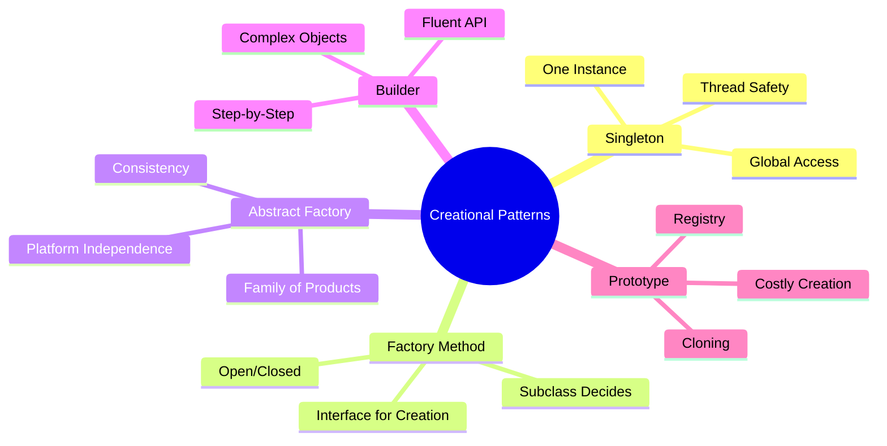
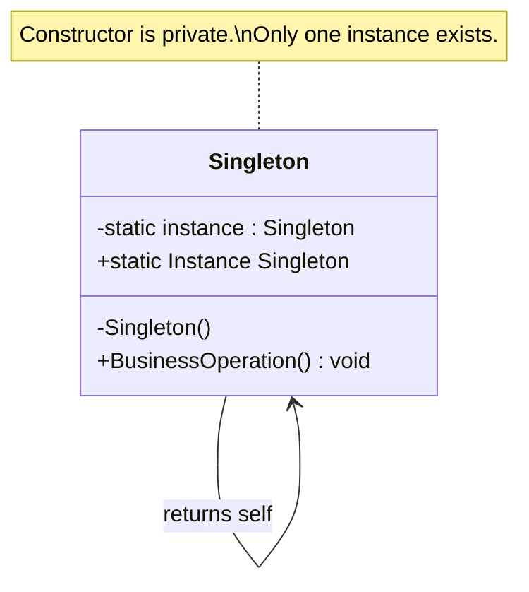
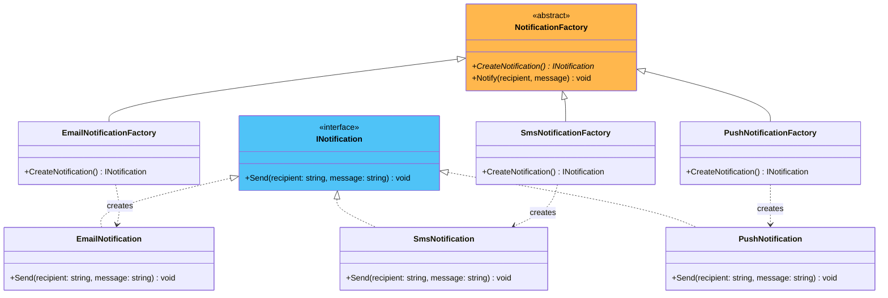
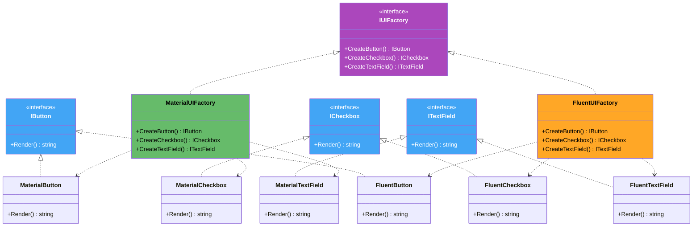
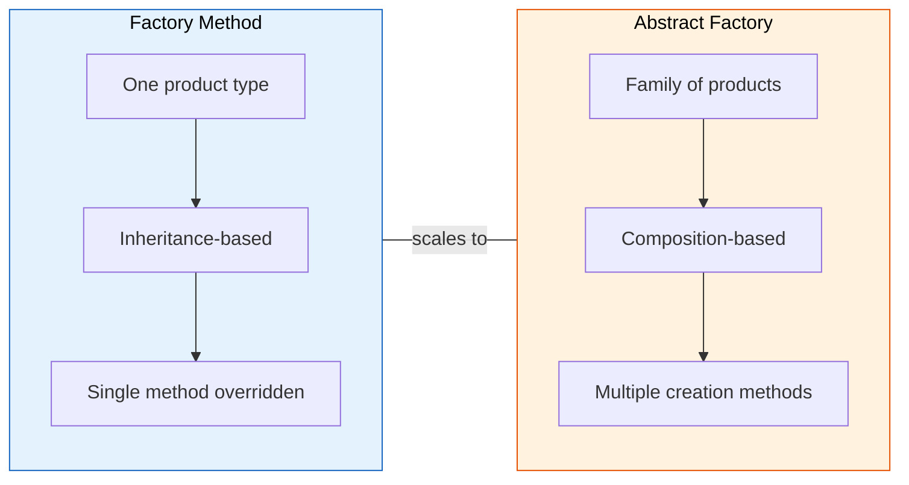
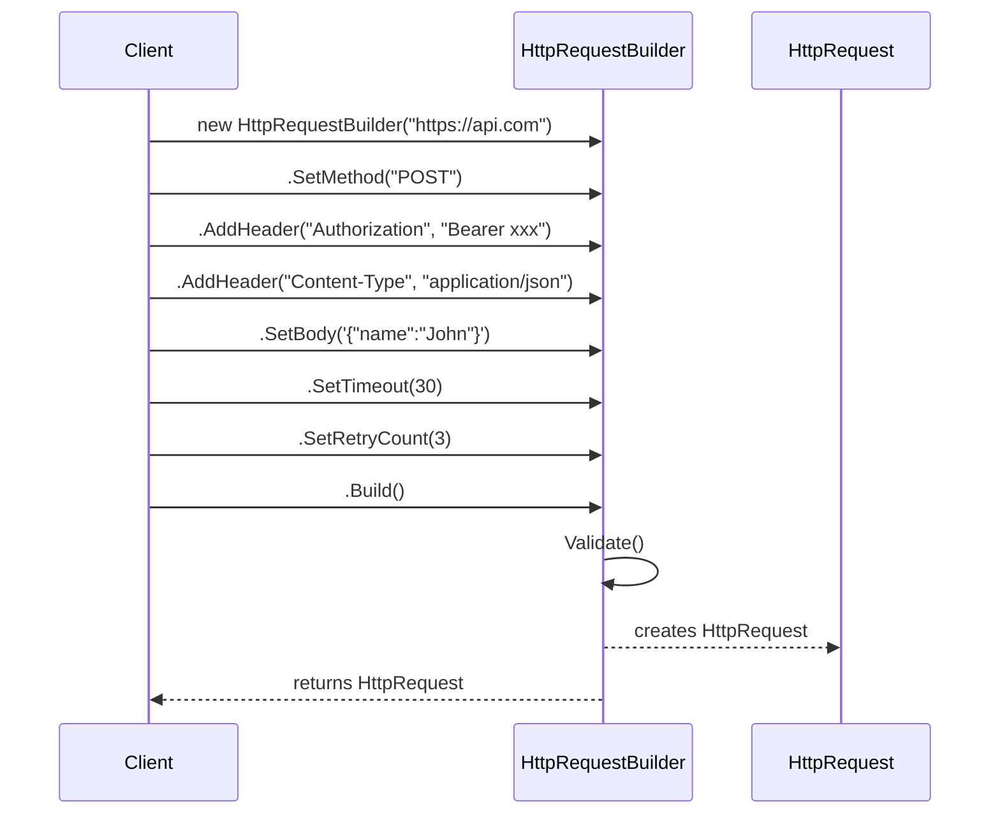
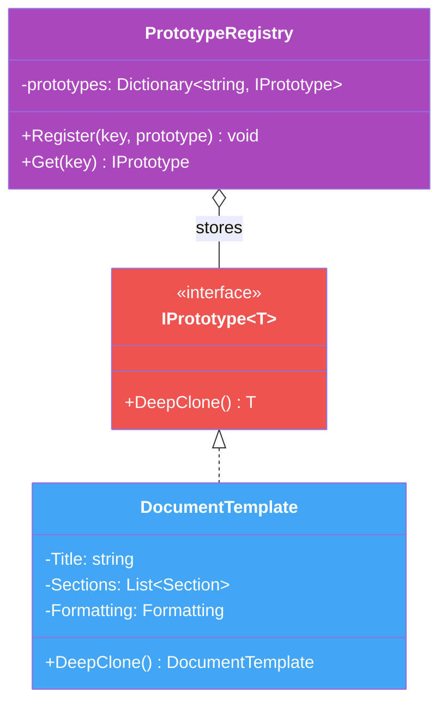

# 1. Creational Patterns

## Table of Contents

- [1.1 🔒 Singleton Pattern](#11-singleton-pattern)
- [1.2 🏭 Factory Method Pattern](#12-factory-method-pattern)
- [1.3 🏗️ Abstract Factory Pattern](#13-abstract-factory-pattern)
- [1.4 🔨 Builder Pattern](#14-builder-pattern)
- [1.5 🧬 Prototype Pattern](#15-prototype-pattern)

---


> **Purpose:** Control *how* objects are created, hiding instantiation logic and reducing coupling.



---

## 1.1 🔒 Singleton Pattern

> **Intent:** Ensure a class has **only one instance** and provide a **global point of access** to it.

### When to Use
- Logging services, configuration managers, connection pools, caches
- When exactly one object is needed to coordinate actions across the system

### Class Diagram



### ⚠️ Interview Talking Points

| Topic | Detail |
|-------|--------|
| **Thread Safety** | Naive implementation is NOT thread-safe |
| **Double-Check Locking** | Reduces lock overhead after initialization |
| **Lazy vs Eager** | Eager = created at class load; Lazy = created on first use |
| **`Lazy<T>`** | .NET built-in thread-safe lazy initializer (preferred) |
| **Testing Concern** | Hard to mock; prefer DI registration as singleton scope |
| **Static vs Singleton** | Singleton can implement interfaces, be passed as argument, support lazy init |

### Implementation

```csharp
// ══════════════════════════════════════════════════════════════
// APPROACH 1: Lazy<T> — Recommended in modern C#
// ══════════════════════════════════════════════════════════════
public sealed class ConfigurationManager
{
    // Lazy<T> guarantees thread-safe, lazy initialization
    private static readonly Lazy<ConfigurationManager> _instance =
        new(() => new ConfigurationManager());

    private readonly Dictionary<string, string> _settings;

    // Private constructor prevents external instantiation
    private ConfigurationManager()
    {
        _settings = new Dictionary<string, string>();
        LoadSettings();
    }

    public static ConfigurationManager Instance => _instance.Value;

    private void LoadSettings()
    {
        // Simulate loading from file / database / env vars
        _settings["DatabaseHost"] = "localhost";
        _settings["MaxRetries"] = "3";
        _settings["Timeout"] = "30";
    }

    public string? GetSetting(string key) =>
        _settings.TryGetValue(key, out var value) ? value : null;

    public void SetSetting(string key, string value) =>
        _settings[key] = value;
}

// ══════════════════════════════════════════════════════════════
// APPROACH 2: Double-Check Locking (Classic — know for interviews)
// ══════════════════════════════════════════════════════════════
public sealed class Logger
{
    private static volatile Logger? _instance;
    private static readonly object _lock = new();
    private readonly StreamWriter _writer;

    private Logger()
    {
        _writer = new StreamWriter(Console.OpenStandardOutput()) { AutoFlush = true };
    }

    public static Logger Instance
    {
        get
        {
            if (_instance == null)                  // First check (no lock — fast path)
            {
                lock (_lock)
                {
                    if (_instance == null)          // Second check (with lock — safe)
                    {
                        _instance = new Logger();
                    }
                }
            }
            return _instance;
        }
    }

    public void Log(LogLevel level, string message) =>
        _writer.WriteLine($"[{DateTime.UtcNow:O}] [{level}] {message}");

    public void Info(string message)  => Log(LogLevel.Info, message);
    public void Warn(string message)  => Log(LogLevel.Warn, message);
    public void Error(string message) => Log(LogLevel.Error, message);
}

public enum LogLevel { Info, Warn, Error }

// ══════════════════════════════════════════════════════════════
// APPROACH 3: Eager Initialization (simplest, if startup cost is acceptable)
// ══════════════════════════════════════════════════════════════
public sealed class AppRegistry
{
    // Created immediately when the class is first accessed
    private static readonly AppRegistry _instance = new();

    private AppRegistry() { }

    public static AppRegistry Instance => _instance;
}

// ══════════════════════════════════════════════════════════════
// Usage
// ══════════════════════════════════════════════════════════════
var config = ConfigurationManager.Instance;
Console.WriteLine(config.GetSetting("DatabaseHost")); // "localhost"

Logger.Instance.Info("Application started");
Logger.Instance.Warn("Low disk space");

// Same instance everywhere
var config2 = ConfigurationManager.Instance;
Console.WriteLine(ReferenceEquals(config, config2)); // True
```

---

## 1.2 🏭 Factory Method Pattern

> **Intent:** Define an interface for creating an object, but let **subclasses decide which class to instantiate**. Factory Method lets a class defer instantiation to subclasses.

### Class Diagram



### ⚠️ Interview Talking Points

| Principle | How Factory Method Applies |
|-----------|---------------------------|
| **Open/Closed** | Add new products without changing existing code |
| **Single Responsibility** | Creation logic separated from business logic |
| **Dependency Inversion** | Client depends on abstraction, not concrete classes |
| **vs Simple Factory** | Simple Factory uses `if/switch`; FM uses polymorphism |
| **vs `new` keyword** | `new` creates tight coupling to concrete type |

### Implementation

```csharp
// ══════════════════════════════════════
// Product Interface
// ══════════════════════════════════════
public interface INotification
{
    void Send(string recipient, string message);
    string Channel { get; }
}

// ══════════════════════════════════════
// Concrete Products
// ══════════════════════════════════════
public class EmailNotification : INotification
{
    public string Channel => "Email";

    public void Send(string recipient, string message)
    {
        Console.WriteLine($"  📧 EMAIL to {recipient}");
        Console.WriteLine($"     Subject: Notification");
        Console.WriteLine($"     Body: {message}");
    }
}

public class SmsNotification : INotification
{
    public string Channel => "SMS";

    public void Send(string recipient, string message)
    {
        // SMS messages have character limits
        var truncated = message.Length > 160 ? message[..157] + "..." : message;
        Console.WriteLine($"  📱 SMS to {recipient}: {truncated}");
    }
}

public class PushNotification : INotification
{
    public string Channel => "Push";

    public void Send(string recipient, string message)
    {
        Console.WriteLine($"  🔔 PUSH to device {recipient}");
        Console.WriteLine($"     Alert: {message}");
    }
}

// ══════════════════════════════════════
// Creator (Abstract)
// ══════════════════════════════════════
public abstract class NotificationFactory
{
    // 🏭 The Factory Method — subclasses decide what to create
    public abstract INotification CreateNotification();

    // Template method that uses the factory method
    public void Notify(string recipient, string message)
    {
        var notification = CreateNotification();
        Console.WriteLine($"  ▸ Preparing {notification.Channel} notification...");
        notification.Send(recipient, message);
        Console.WriteLine($"  ✅ {notification.Channel} notification sent.\n");
    }
}

// ══════════════════════════════════════
// Concrete Creators
// ══════════════════════════════════════
public class EmailNotificationFactory : NotificationFactory
{
    public override INotification CreateNotification() => new EmailNotification();
}

public class SmsNotificationFactory : NotificationFactory
{
    public override INotification CreateNotification() => new SmsNotification();
}

public class PushNotificationFactory : NotificationFactory
{
    public override INotification CreateNotification() => new PushNotification();
}

// ══════════════════════════════════════
// Usage
// ══════════════════════════════════════
// Client code works with the abstract factory — no knowledge of concrete types
NotificationFactory factory = new EmailNotificationFactory();
factory.Notify("john@example.com", "Welcome aboard!");

factory = new SmsNotificationFactory();
factory.Notify("+1234567890", "Your verification code is 8842");

factory = new PushNotificationFactory();
factory.Notify("device-token-abc", "You have a new follower!");

// ──── Parameterized Simple Factory (bonus — common in real code) ────
public static class NotificationFactoryProvider
{
    public static NotificationFactory GetFactory(string channel) => channel.ToLower() switch
    {
        "email" => new EmailNotificationFactory(),
        "sms"   => new SmsNotificationFactory(),
        "push"  => new PushNotificationFactory(),
        _ => throw new ArgumentException($"Unknown channel: {channel}")
    };
}

var factory2 = NotificationFactoryProvider.GetFactory("sms");
factory2.Notify("+9876543210", "Dynamic factory selection!");
```

---

## 1.3 🏗️ Abstract Factory Pattern

> **Intent:** Provide an interface for creating **families of related objects** without specifying their concrete classes.

### Class Diagram



### Factory Method vs Abstract Factory



### Implementation

```csharp
// ══════════════════════════════════════
// Abstract Products
// ══════════════════════════════════════
public interface IButton
{
    string Render();
    string OnClick();
}

public interface ICheckbox
{
    string Render();
    string OnToggle(bool isChecked);
}

public interface ITextField
{
    string Render();
    string OnInput(string value);
}

// ══════════════════════════════════════
// Material Design Family
// ══════════════════════════════════════
public class MaterialButton : IButton
{
    public string Render() => "[Material Button — Raised, Ripple Effect]";
    public string OnClick() => "Material: Ripple animation triggered";
}

public class MaterialCheckbox : ICheckbox
{
    public string Render() => "[Material Checkbox — Animated Check Mark]";
    public string OnToggle(bool isChecked) =>
        $"Material: Checkbox {(isChecked ? "✓ checked" : "☐ unchecked")} with animation";
}

public class MaterialTextField : ITextField
{
    public string Render() => "[Material TextField — Floating Label]";
    public string OnInput(string value) =>
        $"Material: Label floated, value = \"{value}\"";
}

// ══════════════════════════════════════
// Fluent Design Family
// ══════════════════════════════════════
public class FluentButton : IButton
{
    public string Render() => "[Fluent Button — Acrylic, Reveal Highlight]";
    public string OnClick() => "Fluent: Reveal highlight animation triggered";
}

public class FluentCheckbox : ICheckbox
{
    public string Render() => "[Fluent Checkbox — Smooth Toggle]";
    public string OnToggle(bool isChecked) =>
        $"Fluent: Toggle smoothly {(isChecked ? "ON" : "OFF")}";
}

public class FluentTextField : ITextField
{
    public string Render() => "[Fluent TextField — Underline Focus Animation]";
    public string OnInput(string value) =>
        $"Fluent: Underline expanded, value = \"{value}\"";
}

// ══════════════════════════════════════
// Abstract Factory Interface
// ══════════════════════════════════════
public interface IUIFactory
{
    IButton CreateButton();
    ICheckbox CreateCheckbox();
    ITextField CreateTextField();
    string ThemeName { get; }
}

public class MaterialUIFactory : IUIFactory
{
    public string ThemeName => "Material Design";
    public IButton CreateButton()       => new MaterialButton();
    public ICheckbox CreateCheckbox()   => new MaterialCheckbox();
    public ITextField CreateTextField() => new MaterialTextField();
}

public class FluentUIFactory : IUIFactory
{
    public string ThemeName => "Fluent Design";
    public IButton CreateButton()       => new FluentButton();
    public ICheckbox CreateCheckbox()   => new FluentCheckbox();
    public ITextField CreateTextField() => new FluentTextField();
}

// ══════════════════════════════════════
// Client — knows NOTHING about concrete classes
// ══════════════════════════════════════
public class FormRenderer
{
    private readonly IButton _button;
    private readonly ICheckbox _checkbox;
    private readonly ITextField _textField;
    private readonly string _theme;

    public FormRenderer(IUIFactory factory)
    {
        _button = factory.CreateButton();
        _checkbox = factory.CreateCheckbox();
        _textField = factory.CreateTextField();
        _theme = factory.ThemeName;
    }

    public void RenderLoginForm()
    {
        Console.WriteLine($"═══ Login Form ({_theme}) ═══");
        Console.WriteLine($"  Username: {_textField.Render()}");
        Console.WriteLine($"  Password: {_textField.Render()}");
        Console.WriteLine($"  Remember: {_checkbox.Render()}");
        Console.WriteLine($"  Submit:   {_button.Render()}");
        Console.WriteLine();
    }
}

// ══════════════════════════════════════
// Usage
// ══════════════════════════════════════

// Switch entire UI theme by swapping the factory
IUIFactory factory = Environment.OSVersion.Platform == PlatformID.Win32NT
    ? new FluentUIFactory()
    : new MaterialUIFactory();

var form = new FormRenderer(factory);
form.RenderLoginForm();

// Or explicitly
new FormRenderer(new MaterialUIFactory()).RenderLoginForm();
new FormRenderer(new FluentUIFactory()).RenderLoginForm();
```

---

## 1.4 🔨 Builder Pattern

> **Intent:** Separate the construction of a complex object from its representation, allowing the same construction process to create different representations.

### Sequence Diagram



### ⚠️ Interview Talking Points

| Topic | Detail |
|-------|--------|
| **Immutability** | Builder creates immutable objects — set once, read forever |
| **Validation** | `Build()` is the ideal place to validate the complete object |
| **Fluent API** | Each setter returns `this` for chaining |
| **vs Constructor** | Avoids telescoping constructors with many optional params |
| **Director** | Optional orchestrator that defines build sequences |
| **Real-World** | `StringBuilder`, `IHostBuilder`, EF `ModelBuilder`, `HttpRequestMessage` |

### Implementation

```csharp
// ══════════════════════════════════════
// Product — Immutable after construction
// ══════════════════════════════════════
public class HttpRequest
{
    public string Url { get; }
    public string Method { get; }
    public IReadOnlyDictionary<string, string> Headers { get; }
    public string? Body { get; }
    public int TimeoutSeconds { get; }
    public int RetryCount { get; }
    public bool FollowRedirects { get; }

    // Only the builder can construct this via internal access
    internal HttpRequest(
        string url, string method,
        Dictionary<string, string> headers, string? body,
        int timeoutSeconds, int retryCount, bool followRedirects)
    {
        Url = url;
        Method = method;
        Headers = new Dictionary<string, string>(headers);
        Body = body;
        TimeoutSeconds = timeoutSeconds;
        RetryCount = retryCount;
        FollowRedirects = followRedirects;
    }

    public override string ToString() =>
        $"""
        ── HTTP Request ──────────────────
        {Method} {Url}
        Headers: {string.Join(" | ", Headers.Select(h => $"{h.Key}: {h.Value}"))}
        Body: {Body ?? "(none)"}
        Timeout: {TimeoutSeconds}s | Retries: {RetryCount} | Redirects: {FollowRedirects}
        ──────────────────────────────────
        """;
}

// ══════════════════════════════════════
// Builder — Fluent API
// ══════════════════════════════════════
public class HttpRequestBuilder
{
    private readonly string _url;
    private string _method = "GET";
    private readonly Dictionary<string, string> _headers = new();
    private string? _body;
    private int _timeoutSeconds = 30;
    private int _retryCount = 0;
    private bool _followRedirects = true;

    public HttpRequestBuilder(string url)
    {
        _url = url ?? throw new ArgumentNullException(nameof(url));
    }

    public HttpRequestBuilder SetMethod(string method)
    {
        _method = method ?? throw new ArgumentNullException(nameof(method));
        return this;
    }

    public HttpRequestBuilder AddHeader(string key, string value)
    {
        _headers[key] = value;
        return this;
    }

    public HttpRequestBuilder SetBody(string body)
    {
        _body = body;
        return this;
    }

    public HttpRequestBuilder SetTimeout(int seconds)
    {
        if (seconds <= 0) throw new ArgumentOutOfRangeException(nameof(seconds));
        _timeoutSeconds = seconds;
        return this;
    }

    public HttpRequestBuilder SetRetryCount(int count)
    {
        if (count < 0) throw new ArgumentOutOfRangeException(nameof(count));
        _retryCount = count;
        return this;
    }

    public HttpRequestBuilder SetFollowRedirects(bool follow)
    {
        _followRedirects = follow;
        return this;
    }

    // Convenience methods
    public HttpRequestBuilder AsPost(string body) => SetMethod("POST").SetBody(body);
    public HttpRequestBuilder WithBearerToken(string token) =>
        AddHeader("Authorization", $"Bearer {token}");
    public HttpRequestBuilder AsJson() =>
        AddHeader("Content-Type", "application/json")
        .AddHeader("Accept", "application/json");

    public HttpRequest Build()
    {
        // ── Validation ──
        if (!Uri.IsWellFormedUriString(_url, UriKind.Absolute))
            throw new InvalidOperationException($"Invalid URL: {_url}");

        if (_method is "POST" or "PUT" or "PATCH" && string.IsNullOrEmpty(_body))
            throw new InvalidOperationException($"{_method} requests require a body");

        if (_method is "GET" or "HEAD" or "DELETE" && !string.IsNullOrEmpty(_body))
            throw new InvalidOperationException($"{_method} requests should not have a body");

        return new HttpRequest(_url, _method, _headers, _body,
            _timeoutSeconds, _retryCount, _followRedirects);
    }
}

// ══════════════════════════════════════
// Director (Optional — defines common recipes)
// ══════════════════════════════════════
public static class HttpRequestDirector
{
    public static HttpRequest CreateApiGetRequest(string url, string bearerToken) =>
        new HttpRequestBuilder(url)
            .SetMethod("GET")
            .WithBearerToken(bearerToken)
            .AsJson()
            .SetTimeout(15)
            .SetRetryCount(3)
            .Build();

    public static HttpRequest CreateApiPostRequest(string url, string bearerToken, string jsonBody) =>
        new HttpRequestBuilder(url)
            .AsPost(jsonBody)
            .WithBearerToken(bearerToken)
            .AsJson()
            .SetTimeout(30)
            .SetRetryCount(1)
            .Build();
}

// ══════════════════════════════════════
// Usage
// ══════════════════════════════════════

// Fluent builder
var request = new HttpRequestBuilder("https://api.example.com/users")
    .SetMethod("POST")
    .WithBearerToken("eyJhbGciOiJIUzI1NiJ9...")
    .AsJson()
    .SetBody("""{"name": "John Doe", "role": "admin"}""")
    .SetTimeout(15)
    .SetRetryCount(3)
    .Build();

Console.WriteLine(request);

// Director shortcut
var getRequest = HttpRequestDirector.CreateApiGetRequest(
    "https://api.example.com/users/42",
    "eyJhbGci...");

Console.WriteLine(getRequest);
```

---

## 1.5 🧬 Prototype Pattern

> **Intent:** Create new objects by **cloning** an existing instance (prototype) rather than building from scratch.

### Diagram



### ⚠️ Interview Talking Points

| Topic | Detail |
|-------|--------|
| **Shallow vs Deep** | Shallow: references shared. Deep: everything cloned recursively |
| **`ICloneable`** | Built-in .NET interface — but returns `object`, no deep/shallow contract |
| **`MemberwiseClone()`** | Protected method on `object` — shallow clone only |
| **Serialization Clone** | Serialize → deserialize for easy deep clone (but slow) |
| **Record Types** | C# records have built-in `with` expressions for cloning |
| **When to Use** | Object creation is expensive (DB queries, file parsing, network calls) |

### Implementation

```csharp
// ══════════════════════════════════════
// Prototype Interface
// ══════════════════════════════════════
public interface IPrototype<T>
{
    T DeepClone();
}

// ══════════════════════════════════════
// Complex object with nested references
// ══════════════════════════════════════
public class Section
{
    public string Title { get; set; } = "";
    public string Content { get; set; } = "";
    public List<string> Tags { get; set; } = new();

    public Section DeepClone() => new()
    {
        Title = Title,
        Content = Content,
        Tags = new List<string>(Tags)
    };
}

public class Formatting
{
    public string FontFamily { get; set; } = "Arial";
    public int FontSize { get; set; } = 12;
    public string ColorScheme { get; set; } = "Default";

    public Formatting DeepClone() => new()
    {
        FontFamily = FontFamily,
        FontSize = FontSize,
        ColorScheme = ColorScheme
    };
}

public class DocumentTemplate : IPrototype<DocumentTemplate>
{
    public string Title { get; set; } = "";
    public List<Section> Sections { get; set; } = new();
    public Formatting Formatting { get; set; } = new();
    public Dictionary<string, string> Metadata { get; set; } = new();
    public DateTime CreatedAt { get; set; } = DateTime.UtcNow;

    // Deep clone — every nested object is cloned
    public DocumentTemplate DeepClone() => new()
    {
        Title = Title,
        Sections = Sections.Select(s => s.DeepClone()).ToList(),
        Formatting = Formatting.DeepClone(),
        Metadata = new Dictionary<string, string>(Metadata),
        CreatedAt = DateTime.UtcNow  // New creation time
    };

    public void Print()
    {
        Console.WriteLine($"  📄 \"{Title}\" ({Sections.Count} sections)");
        Console.WriteLine($"     Font: {Formatting.FontFamily} {Formatting.FontSize}pt");
        Console.WriteLine($"     Metadata: {string.Join(", ", Metadata.Select(m => $"{m.Key}={m.Value}"))}");
        foreach (var section in Sections)
            Console.WriteLine($"     └─ §{section.Title}: {section.Content[..Math.Min(50, section.Content.Length)]}...");
    }
}

// ══════════════════════════════════════
// Registry — stores and retrieves prototypes
// ══════════════════════════════════════
public class PrototypeRegistry
{
    private readonly Dictionary<string, DocumentTemplate> _prototypes = new();

    public void Register(string key, DocumentTemplate prototype) =>
        _prototypes[key] = prototype;

    public DocumentTemplate Get(string key)
    {
        if (!_prototypes.ContainsKey(key))
            throw new KeyNotFoundException($"Prototype '{key}' not found");

        return _prototypes[key].DeepClone(); // Always return a clone!
    }

    public IReadOnlyList<string> AvailableTemplates =>
        _prototypes.Keys.ToList();
}

// ══════════════════════════════════════
// Usage
// ══════════════════════════════════════
var registry = new PrototypeRegistry();

// Register expensive-to-create templates
registry.Register("quarterly-report", new DocumentTemplate
{
    Title = "Quarterly Report",
    Sections = new List<Section>
    {
        new() { Title = "Executive Summary", Content = "Overview of quarterly performance and key highlights...", Tags = new() { "summary" } },
        new() { Title = "Financial Results", Content = "Revenue, expenses, and profit analysis for the quarter...", Tags = new() { "finance", "data" } },
        new() { Title = "Outlook", Content = "Forward-looking projections and strategic initiatives...", Tags = new() { "forecast" } }
    },
    Formatting = new() { FontFamily = "Calibri", FontSize = 11, ColorScheme = "Corporate Blue" },
    Metadata = new() { ["author"] = "template", ["department"] = "finance" }
});

registry.Register("meeting-notes", new DocumentTemplate
{
    Title = "Meeting Notes",
    Sections = new List<Section>
    {
        new() { Title = "Attendees", Content = "List of participants..." },
        new() { Title = "Agenda", Content = "Topics discussed..." },
        new() { Title = "Action Items", Content = "Follow-up tasks and owners..." }
    },
    Formatting = new() { FontFamily = "Arial", FontSize = 12, ColorScheme = "Minimal" },
    Metadata = new() { ["author"] = "template", ["type"] = "meeting" }
});

// Clone and customize — much faster than building from scratch
var q4Report = registry.Get("quarterly-report");
q4Report.Title = "Q4 2024 Financial Report";
q4Report.Metadata["author"] = "Jane Doe";
q4Report.Metadata["quarter"] = "Q4-2024";
q4Report.Sections[0].Content = "Q4 2024 showed record-breaking revenue growth...";

Console.WriteLine("═══ Cloned & Customized ═══");
q4Report.Print();

// Original template is unmodified (deep clone verified)
Console.WriteLine("\n═══ Original Template (unchanged) ═══");
registry.Get("quarterly-report").Print();

// ──── Bonus: C# record with 'with' expression (built-in shallow clone) ────
public record OrderSnapshot(string OrderId, string Status, decimal Total, DateTime Timestamp);

var original = new OrderSnapshot("ORD-001", "Pending", 99.99m, DateTime.UtcNow);
var updated = original with { Status = "Shipped", Timestamp = DateTime.UtcNow };
// original is unchanged, updated has new Status and Timestamp
```
