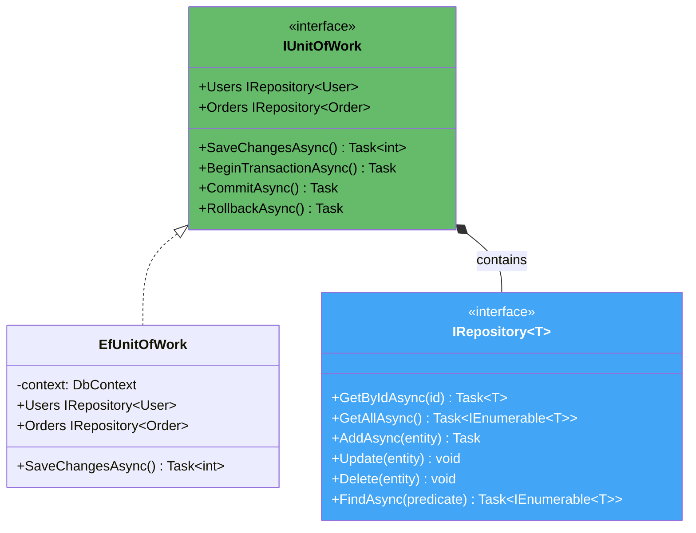
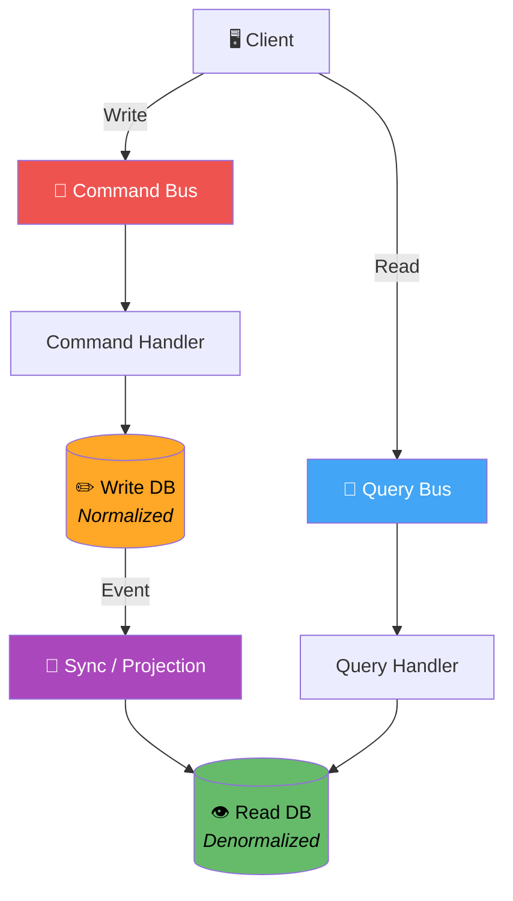
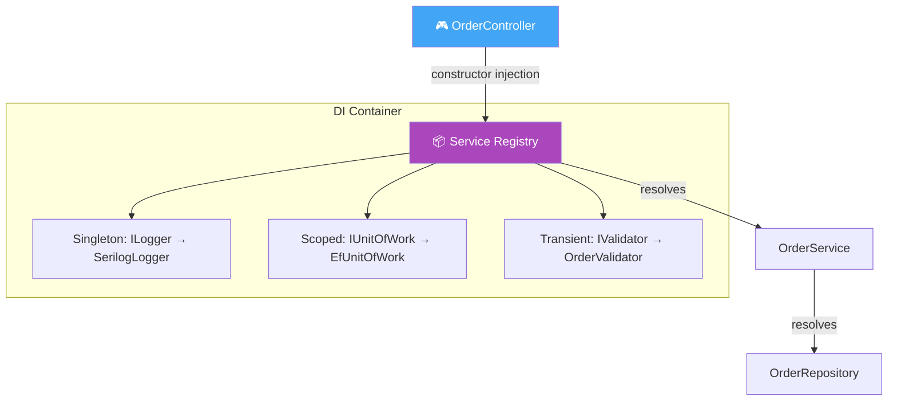

# 1. Enterprise / Modern Patterns

## Table of Contents

- [1.1 📦 Repository + Unit of Work](#11-repository-unit-of-work)
- [1.2 📬 CQRS (Command Query Responsibility Segregation)](#12-cqrs-command-query-responsibility-segregation)
- [1.3 💉 Dependency Injection](#13-dependency-injection)

---


## 1.1 📦 Repository + Unit of Work



### Implementation

```csharp
// ══════════════════════════════════════
// Generic Repository Interface
// ══════════════════════════════════════
public interface IRepository<T> where T : class, IEntity
{
    Task<T?> GetByIdAsync(Guid id, CancellationToken ct = default);
    Task<IReadOnlyList<T>> GetAllAsync(CancellationToken ct = default);
    Task<IReadOnlyList<T>> FindAsync(Expression<Func<T, bool>> predicate, CancellationToken ct = default);
    Task AddAsync(T entity, CancellationToken ct = default);
    void Update(T entity);
    void Delete(T entity);
}

public interface IEntity
{
    Guid Id { get; }
}

// ══════════════════════════════════════
// Unit of Work Interface
// ══════════════════════════════════════
public interface IUnitOfWork : IDisposable
{
    IRepository<User> Users { get; }
    IRepository<Order> Orders { get; }
    IRepository<Product> Products { get; }

    Task<int> SaveChangesAsync(CancellationToken ct = default);
    Task BeginTransactionAsync(CancellationToken ct = default);
    Task CommitAsync(CancellationToken ct = default);
    Task RollbackAsync(CancellationToken ct = default);
}

// ══════════════════════════════════════
// EF Core Implementation (sketch)
// ══════════════════════════════════════
public class EfRepository<T> : IRepository<T> where T : class, IEntity
{
    private readonly DbContext _context;
    private readonly DbSet<T> _dbSet;

    public EfRepository(DbContext context)
    {
        _context = context;
        _dbSet = context.Set<T>();
    }

    public async Task<T?> GetByIdAsync(Guid id, CancellationToken ct = default) =>
        await _dbSet.FindAsync(new object[] { id }, ct);

    public async Task<IReadOnlyList<T>> GetAllAsync(CancellationToken ct = default) =>
        await _dbSet.ToListAsync(ct);

    public async Task<IReadOnlyList<T>> FindAsync(
        Expression<Func<T, bool>> predicate, CancellationToken ct = default) =>
        await _dbSet.Where(predicate).ToListAsync(ct);

    public async Task AddAsync(T entity, CancellationToken ct = default) =>
        await _dbSet.AddAsync(entity, ct);

    public void Update(T entity) => _dbSet.Update(entity);
    public void Delete(T entity) => _dbSet.Remove(entity);
}

// ══════════════════════════════════════
// Service using Unit of Work
// ══════════════════════════════════════
public class OrderService
{
    private readonly IUnitOfWork _uow;

    public OrderService(IUnitOfWork uow) => _uow = uow;

    public async Task<Guid> CreateOrderAsync(Guid userId, List<OrderItem> items)
    {
        await _uow.BeginTransactionAsync();

        try
        {
            var user = await _uow.Users.GetByIdAsync(userId)
                ?? throw new InvalidOperationException("User not found");

            var order = new Order(userId, items);
            await _uow.Orders.AddAsync(order);

            // Update product stock
            foreach (var item in items)
            {
                var product = await _uow.Products.GetByIdAsync(item.ProductId)
                    ?? throw new InvalidOperationException($"Product {item.ProductId} not found");
                product.ReduceStock(item.Quantity);
                _uow.Products.Update(product);
            }

            await _uow.SaveChangesAsync();
            await _uow.CommitAsync();

            return order.Id;
        }
        catch
        {
            await _uow.RollbackAsync();
            throw;
        }
    }
}
```

---

## 1.2 📬 CQRS (Command Query Responsibility Segregation)



### Implementation

```csharp
// ══════════════════════════════════════
// Abstractions
// ══════════════════════════════════════
public interface ICommand { }
public interface IQuery<TResult> { }

public interface ICommandHandler<in TCommand> where TCommand : ICommand
{
    Task HandleAsync(TCommand command, CancellationToken ct = default);
}

public interface IQueryHandler<in TQuery, TResult> where TQuery : IQuery<TResult>
{
    Task<TResult> HandleAsync(TQuery query, CancellationToken ct = default);
}

// ══════════════════════════════════════
// Command Side (Write)
// ══════════════════════════════════════
public record CreateOrderCommand(
    Guid CustomerId,
    List<OrderItemDto> Items,
    string ShippingAddress) : ICommand;

public record OrderItemDto(Guid ProductId, int Quantity, decimal UnitPrice);

public class CreateOrderHandler : ICommandHandler<CreateOrderCommand>
{
    private readonly IUnitOfWork _uow;
    private readonly IEventBus _eventBus;

    public CreateOrderHandler(IUnitOfWork uow, IEventBus eventBus)
    {
        _uow = uow;
        _eventBus = eventBus;
    }

    public async Task HandleAsync(CreateOrderCommand cmd, CancellationToken ct)
    {
        // Validate
        if (!cmd.Items.Any())
            throw new ValidationException("Order must have at least one item");

        // Build domain object
        var order = Order.Create(cmd.CustomerId, cmd.Items, cmd.ShippingAddress);

        // Persist
        await _uow.Orders.AddAsync(order, ct);
        await _uow.SaveChangesAsync(ct);

        // Publish event (updates read model)
        await _eventBus.PublishAsync(new OrderCreatedEvent
        {
            OrderId = order.Id,
            CustomerId = cmd.CustomerId,
            Total = order.Total,
            ItemCount = cmd.Items.Count,
            CreatedAt = DateTime.UtcNow
        }, ct);
    }
}

// ══════════════════════════════════════
// Query Side (Read)
// ══════════════════════════════════════
public record GetOrderSummaryQuery(Guid OrderId) : IQuery<OrderSummaryDto>;

public record OrderSummaryDto(
    Guid OrderId,
    string CustomerName,
    decimal Total,
    int ItemCount,
    string Status,
    DateTime CreatedAt);

public class GetOrderSummaryHandler : IQueryHandler<GetOrderSummaryQuery, OrderSummaryDto>
{
    private readonly IReadDbContext _readDb; // Optimized read model

    public GetOrderSummaryHandler(IReadDbContext readDb) => _readDb = readDb;

    public async Task<OrderSummaryDto> HandleAsync(
        GetOrderSummaryQuery query, CancellationToken ct) =>
        await _readDb.OrderSummaries
            .Where(o => o.OrderId == query.OrderId)
            .FirstOrDefaultAsync(ct)
        ?? throw new NotFoundException($"Order {query.OrderId} not found");
}

// ══════════════════════════════════════
// Dispatcher (optional mediator)
// ══════════════════════════════════════
public class Dispatcher
{
    private readonly IServiceProvider _provider;

    public Dispatcher(IServiceProvider provider) => _provider = provider;

    public async Task SendAsync<TCommand>(TCommand command, CancellationToken ct = default)
        where TCommand : ICommand
    {
        var handler = _provider.GetRequiredService<ICommandHandler<TCommand>>();
        await handler.HandleAsync(command, ct);
    }

    public async Task<TResult> QueryAsync<TResult>(IQuery<TResult> query, CancellationToken ct = default)
    {
        var handlerType = typeof(IQueryHandler<,>).MakeGenericType(query.GetType(), typeof(TResult));
        dynamic handler = _provider.GetRequiredService(handlerType);
        return await handler.HandleAsync((dynamic)query, ct);
    }
}
```

---

## 1.3 💉 Dependency Injection



### Implementation

```csharp
// ══════════════════════════════════════
// Registration (Program.cs / Startup)
// ══════════════════════════════════════
var builder = WebApplication.CreateBuilder(args);

// Lifetime: Singleton — ONE instance for entire app
builder.Services.AddSingleton<ILogger, SerilogLogger>();
builder.Services.AddSingleton<IConfigurationService, ConfigurationService>();

// Lifetime: Scoped — ONE instance per HTTP request
builder.Services.AddScoped<IUnitOfWork, EfUnitOfWork>();
builder.Services.AddScoped<IOrderRepository, OrderRepository>();
builder.Services.AddScoped<IOrderService, OrderService>();
builder.Services.AddScoped<IPaymentProcessor, StripeAdapter>();

// Lifetime: Transient — NEW instance every time
builder.Services.AddTransient<IValidator<CreateOrderCommand>, CreateOrderValidator>();
builder.Services.AddTransient<IEmailSender, SmtpEmailSender>();

// Conditional registration
if (builder.Environment.IsDevelopment())
    builder.Services.AddScoped<IPaymentProcessor, FakePaymentProcessor>();

// Factory registration
builder.Services.AddScoped<IPaymentProcessor>(sp =>
{
    var config = sp.GetRequiredService<IConfigurationService>();
    return config.GetSetting("PaymentProvider") switch
    {
        "stripe" => new StripeAdapter(new StripeApi()),
        "paypal" => new PayPalAdapter(new PayPalApi()),
        _ => throw new InvalidOperationException("Unknown payment provider")
    };
});

// ══════════════════════════════════════
// Constructor Injection (the right way)
// ══════════════════════════════════════
public class OrderService : IOrderService
{
    private readonly IOrderRepository _orderRepo;
    private readonly IUnitOfWork _uow;
    private readonly IPaymentProcessor _payment;
    private readonly ILogger _logger;
    private readonly IValidator<CreateOrderCommand> _validator;

    // All dependencies injected via constructor
    public OrderService(
        IOrderRepository orderRepo,
        IUnitOfWork uow,
        IPaymentProcessor payment,
        ILogger logger,
        IValidator<CreateOrderCommand> validator)
    {
        _orderRepo = orderRepo;
        _uow = uow;
        _payment = payment;
        _logger = logger;
        _validator = validator;
    }

    public async Task<OrderResult> CreateOrderAsync(CreateOrderCommand command)
    {
        // 1. Validate
        var validation = await _validator.ValidateAsync(command);
        if (!validation.IsValid)
        {
            _logger.Warn("Validation failed: {Errors}", validation.Errors);
            return OrderResult.Failed(validation.Errors);
        }

        // 2. Create domain object
        var order = Order.Create(command);

        // 3. Process payment
        var paymentResult = await _payment.ProcessPaymentAsync(
            order.Total, "USD");

        if (!paymentResult.Success)
        {
            _logger.Error("Payment failed for order: {Message}", paymentResult.Message);
            return OrderResult.Failed("Payment declined");
        }

        // 4. Persist
        await _orderRepo.AddAsync(order);
        await _uow.SaveChangesAsync();

        _logger.Info("Order {OrderId} created successfully", order.Id);
        return OrderResult.Successful(order.Id);
    }
}

// ══════════════════════════════════════
// Controller — thin, delegates to service
// ══════════════════════════════════════
[ApiController]
[Route("api/[controller]")]
public class OrdersController : ControllerBase
{
    private readonly IOrderService _orderService;

    public OrdersController(IOrderService orderService) =>
        _orderService = orderService;

    [HttpPost]
    public async Task<IActionResult> CreateOrder(CreateOrderCommand command)
    {
        var result = await _orderService.CreateOrderAsync(command);
        return result.Success
            ? CreatedAtAction(nameof(GetOrder), new { id = result.OrderId }, result)
            : BadRequest(result);
    }

    [HttpGet("{id}")]
    public async Task<IActionResult> GetOrder(Guid id) { /* ... */ }
}
```

### DI Lifetime Cheat Sheet

| Lifetime | When Created | When Disposed | Use For |
|----------|-------------|---------------|---------|
| **Singleton** | First request | App shutdown | Caches, loggers, config |
| **Scoped** | Per request/scope | End of request | DbContext, UoW, per-request state |
| **Transient** | Every resolve | GC | Lightweight, stateless services |

> ⚠️ **Captive Dependency:** Never inject Scoped/Transient into Singleton — the shorter-lived service becomes a Singleton!
