# 1. Pattern Selection Cheat Sheet

## Table of Contents

- [Decision Flowchart](#decision-flowchart)
- [🔥 Common Interview Comparison Matrix](#common-interview-comparison-matrix)
- [🎯 SOLID Principles × Patterns Map](#solid-principles-patterns-map)
- [🗺️ .NET Framework Patterns in the Wild](#net-framework-patterns-in-the-wild)
- [📚 Recommended Study Order](#recommended-study-order)

---


## Decision Flowchart

```mermaid
flowchart TD
    Start{"What problem<br/>are you solving?"}

    Start -->|"Object Creation"| C{"How complex?"}
    C -->|"One instance"| Singleton["🔒 Singleton"]
    C -->|"Choose type at runtime"| Factory["🏭 Factory Method"]
    C -->|"Family of related objects"| AF["🏗️ Abstract Factory"]
    C -->|"Many optional params"| Builder["🔨 Builder"]
    C -->|"Clone existing objects"| Prototype["🧬 Prototype"]

    Start -->|"Object Structure"| S{"What structure?"}
    S -->|"Incompatible interfaces"| Adapter["🔌 Adapter"]
    S -->|"Vary abstraction & impl"| Bridge["🌉 Bridge"]
    S -->|"Tree / hierarchy"| Composite["🌳 Composite"]
    S -->|"Add behavior dynamically"| Decorator["🎀 Decorator"]
    S -->|"Simplify complex system"| Facade["🏛️ Facade"]
    S -->|"Tons of similar objects"| Flyweight["🪶 Flyweight"]
    S -->|"Control access"| Proxy["🛡️ Proxy"]

    Start -->|"Object Behavior"| B{"What behavior?"}
    B -->|"Swap algorithms"| Strategy["🎯 Strategy"]
    B -->|"React to changes"| Observer["📡 Observer"]
    B -->|"Undo/redo, queue ops"| Command["💻 Command"]
    B -->|"Pipeline / middleware"| Chain["⛓️ Chain of Resp."]
    B -->|"State changes behavior"| State["🔄 State"]
    B -->|"Algorithm skeleton"| Template["📋 Template Method"]

    style Start fill:#AB47BC,color:#fff
    style Singleton fill:#FFECB3,color:#000
    style Factory fill:#FFECB3,color:#000
    style AF fill:#FFECB3,color:#000
    style Builder fill:#FFECB3,color:#000
    style Prototype fill:#FFECB3,color:#000
    style Adapter fill:#B3E5FC,color:#000
    style Bridge fill:#B3E5FC,color:#000
    style Composite fill:#B3E5FC,color:#000
    style Decorator fill:#B3E5FC,color:#000
    style Facade fill:#B3E5FC,color:#000
    style Flyweight fill:#B3E5FC,color:#000
    style Proxy fill:#B3E5FC,color:#000
    style Strategy fill:#C8E6C9,color:#000
    style Observer fill:#C8E6C9,color:#000
    style Command fill:#C8E6C9,color:#000
    style Chain fill:#C8E6C9,color:#000
    style State fill:#C8E6C9,color:#000
    style Template fill:#C8E6C9,color:#000
```



---

## 🔥 Common Interview Comparison Matrix

| Comparison | Key Difference |
|:-----------|:---------------|
| **Strategy vs State** | Strategy: **client** picks algorithm. State: object **auto-transitions**. |
| **Factory Method vs Abstract Factory** | FM: one product, inheritance. AF: product *families*, composition. |
| **Adapter vs Facade** | Adapter: makes *one* interface compatible. Facade: simplifies an *entire subsystem*. |
| **Adapter vs Decorator** | Adapter: **changes** interface. Decorator: **same** interface, adds behavior. |
| **Proxy vs Decorator** | Proxy: controls *access*. Decorator: adds *behavior*. |
| **Composite vs Decorator** | Composite: **tree** structure. Decorator: **wrapping** chain. |
| **Observer vs Mediator** | Observer: broadcast notifications. Mediator: centralized coordination. |
| **Command vs Strategy** | Command: encapsulates *request* (what + undo). Strategy: encapsulates *algorithm* (how). |
| **Template Method vs Strategy** | Template: **inheritance**, partial override. Strategy: **composition**, full replacement. |
| **Chain vs Decorator** | Chain: can **stop** processing. Decorator: always wraps **through**. |
| **Repository vs DAO** | Repository: domain-centric, collections. DAO: data-centric, CRUD. |
| **Mediator vs Facade** | Mediator: bidirectional between peers. Facade: unidirectional simplification. |

---

## 🎯 SOLID Principles × Patterns Map

| SOLID Principle | Patterns That Exemplify It |
|:----------------|:--------------------------|
| **S** — Single Responsibility | Command, Strategy, Observer, Repository |
| **O** — Open/Closed | Strategy, Decorator, Factory Method, Visitor, Chain of Responsibility |
| **L** — Liskov Substitution | All patterns using polymorphism (Strategy, State, Factory) |
| **I** — Interface Segregation | Adapter, Facade, Observer, Repository |
| **D** — Dependency Inversion | Abstract Factory, Strategy, Bridge, DI, Repository |

---

## 🗺️ .NET Framework Patterns in the Wild

| .NET Type / Feature | Pattern Used |
|:---------------------|:-------------|
| `IEnumerable<T>` / `yield return` | Iterator |
| `Stream` → `BufferedStream` → `GZipStream` | Decorator |
| `event` / `EventHandler<T>` | Observer |
| `IServiceCollection` / `IServiceProvider` | Dependency Injection |
| `StringBuilder` | Builder |
| `DbContext` (EF Core) | Unit of Work + Repository |
| `HttpClient` + `DelegatingHandler` | Chain of Responsibility |
| LINQ `.Where().Select().OrderBy()` | Decorator / Pipeline |
| `Lazy<T>` | Proxy (Virtual) |
| ASP.NET Middleware pipeline | Chain of Responsibility |
| `IOptions<T>` | Singleton + Proxy |
| `String.Intern()` | Flyweight |

---

## 📚 Recommended Study Order

```
Week 1: Strategy → Observer → Factory Method → Singleton → Builder
Week 2: Adapter → Decorator → Proxy → Facade → Template Method
Week 3: Command → State → Chain of Responsibility → Composite → Bridge
Week 4: CQRS → Repository/UoW → DI → Mediator → Visitor → Review All
```

---

> 💡 **Principal Engineer Interview Tip:** Don't just recite patterns — articulate **trade-offs**, explain **when NOT to use** a pattern (over-engineering), and show how patterns **compose** in real systems. For example: *"Our API pipeline uses **Chain of Responsibility** for middleware, each handler uses **Strategy** for processing logic, **Command** wraps write operations for audit logging, and **Observer** broadcasts domain events to update read models in our **CQRS** architecture."*
