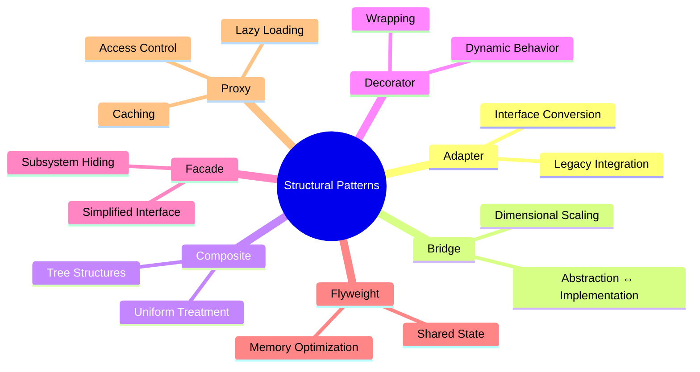
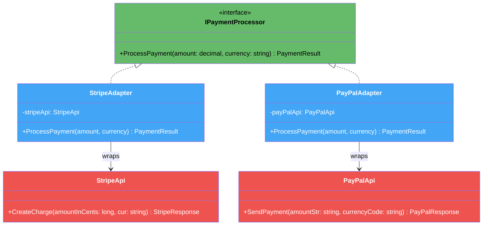
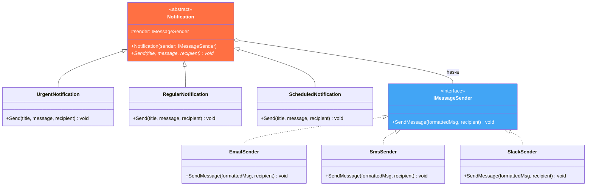
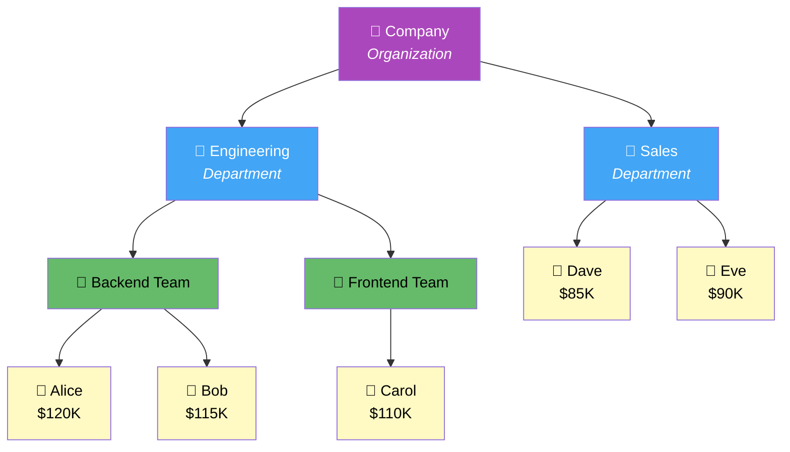
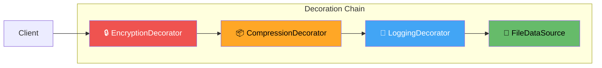
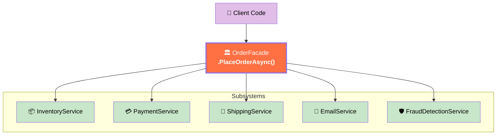
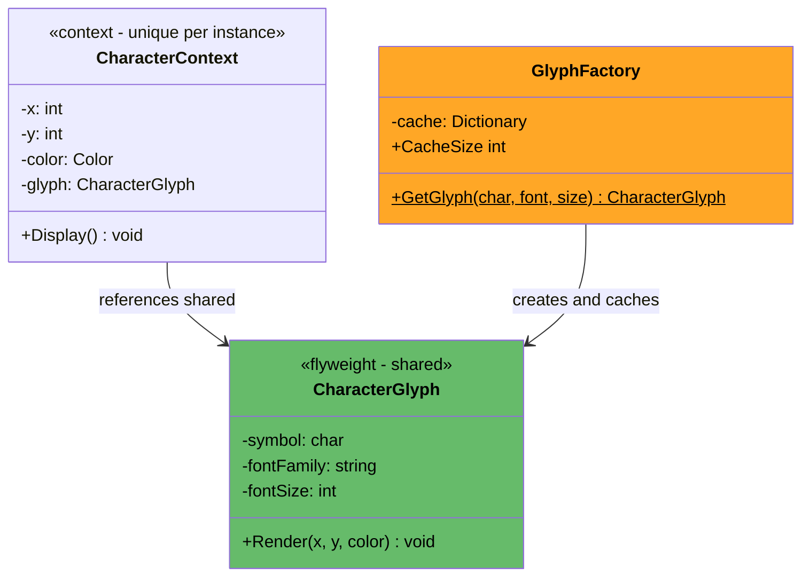
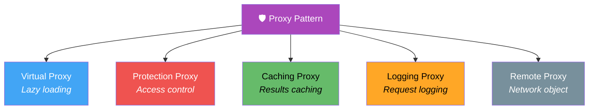

# 1. Structural Patterns

## Table of Contents

- [1.1 🔌 Adapter Pattern](#11-adapter-pattern)
- [1.2 🌉 Bridge Pattern](#12-bridge-pattern)
- [1.3 🌳 Composite Pattern](#13-composite-pattern)
- [1.4 🎀 Decorator Pattern](#14-decorator-pattern)
- [1.5 🏛️ Facade Pattern](#15-facade-pattern)
- [1.6 🪶 Flyweight Pattern](#16-flyweight-pattern)
- [1.7 🛡️ Proxy Pattern](#17-proxy-pattern)

---


> **Purpose:** Compose classes and objects into larger structures while keeping them flexible and efficient.



---

## 1.1 🔌 Adapter Pattern

> **Intent:** Convert the interface of a class into another interface that clients expect. Lets classes work together that couldn't otherwise because of incompatible interfaces.

### Diagram



### Implementation

```csharp
// ══════════════════════════════════════
// Target Interface — what our application expects
// ══════════════════════════════════════
public interface IPaymentProcessor
{
    Task<PaymentResult> ProcessPaymentAsync(decimal amount, string currency);
}

public record PaymentResult(
    bool Success,
    string TransactionId,
    string Message,
    string Provider);

// ══════════════════════════════════════
// Adaptees — third-party APIs with INCOMPATIBLE interfaces
// ══════════════════════════════════════

// Stripe uses cents (long) and lowercase currency
public class StripeApi
{
    public StripeResponse CreateCharge(long amountInCents, string cur)
    {
        Console.WriteLine($"    Stripe API: Charging {amountInCents} cents ({cur})");
        return new StripeResponse
        {
            Id = $"ch_{Guid.NewGuid().ToString("N")[..16]}",
            Paid = true,
            AmountCents = amountInCents
        };
    }
}

public class StripeResponse
{
    public string Id { get; set; } = "";
    public bool Paid { get; set; }
    public long AmountCents { get; set; }
}

// PayPal uses string amounts and uppercase currency
public class PayPalApi
{
    public PayPalResponse SendPayment(string amountStr, string currencyCode)
    {
        Console.WriteLine($"    PayPal API: Sending {amountStr} {currencyCode}");
        return new PayPalResponse
        {
            Status = "COMPLETED",
            PaymentId = $"PAY-{Guid.NewGuid().ToString("N")[..16]}"
        };
    }
}

public class PayPalResponse
{
    public string Status { get; set; } = "";
    public string PaymentId { get; set; } = "";
}

// Square uses a nested request object
public class SquareApi
{
    public SquarePaymentResult CreatePayment(SquarePaymentRequest request)
    {
        Console.WriteLine($"    Square API: Processing {request.AmountMoney.Amount} " +
            $"{request.AmountMoney.Currency}");
        return new SquarePaymentResult
        {
            PaymentId = $"sq_{Guid.NewGuid().ToString("N")[..16]}",
            Status = "COMPLETED"
        };
    }
}

public class SquarePaymentRequest
{
    public SquareMoney AmountMoney { get; set; } = new();
    public string IdempotencyKey { get; set; } = "";
}

public class SquareMoney
{
    public long Amount { get; set; }
    public string Currency { get; set; } = "";
}

public class SquarePaymentResult
{
    public string PaymentId { get; set; } = "";
    public string Status { get; set; } = "";
}

// ══════════════════════════════════════
// Adapters — translate our interface to each vendor
// ══════════════════════════════════════
public class StripeAdapter : IPaymentProcessor
{
    private readonly StripeApi _stripe;

    public StripeAdapter(StripeApi stripe) => _stripe = stripe;

    public Task<PaymentResult> ProcessPaymentAsync(decimal amount, string currency)
    {
        // Convert: decimal dollars → long cents, currency to lowercase
        long cents = (long)(amount * 100);
        var response = _stripe.CreateCharge(cents, currency.ToLower());

        return Task.FromResult(new PaymentResult(
            Success: response.Paid,
            TransactionId: response.Id,
            Message: "Stripe charge successful",
            Provider: "Stripe"));
    }
}

public class PayPalAdapter : IPaymentProcessor
{
    private readonly PayPalApi _paypal;

    public PayPalAdapter(PayPalApi paypal) => _paypal = paypal;

    public Task<PaymentResult> ProcessPaymentAsync(decimal amount, string currency)
    {
        // Convert: decimal → formatted string, currency to uppercase
        var response = _paypal.SendPayment(
            amount.ToString("F2"),
            currency.ToUpper());

        bool success = response.Status == "COMPLETED";
        return Task.FromResult(new PaymentResult(
            Success: success,
            TransactionId: response.PaymentId,
            Message: $"PayPal: {response.Status}",
            Provider: "PayPal"));
    }
}

public class SquareAdapter : IPaymentProcessor
{
    private readonly SquareApi _square;

    public SquareAdapter(SquareApi square) => _square = square;

    public Task<PaymentResult> ProcessPaymentAsync(decimal amount, string currency)
    {
        // Convert: decimal → nested request object with cents
        var request = new SquarePaymentRequest
        {
            AmountMoney = new SquareMoney
            {
                Amount = (long)(amount * 100),
                Currency = currency.ToUpper()
            },
            IdempotencyKey = Guid.NewGuid().ToString()
        };

        var response = _square.CreatePayment(request);

        return Task.FromResult(new PaymentResult(
            Success: response.Status == "COMPLETED",
            TransactionId: response.PaymentId,
            Message: "Square payment successful",
            Provider: "Square"));
    }
}

// ══════════════════════════════════════
// Usage — Client code is clean and provider-agnostic
// ══════════════════════════════════════
async Task ProcessOrder(IPaymentProcessor processor, decimal amount)
{
    Console.WriteLine($"  Processing ${amount:N2}...");
    var result = await processor.ProcessPaymentAsync(amount, "USD");
    Console.WriteLine($"  ✅ {result.Provider}: {result.Success} | Tx: {result.TransactionId}\n");
}

// Swap providers without changing any business logic
IPaymentProcessor processor = new StripeAdapter(new StripeApi());
await ProcessOrder(processor, 49.99m);

processor = new PayPalAdapter(new PayPalApi());
await ProcessOrder(processor, 149.99m);

processor = new SquareAdapter(new SquareApi());
await ProcessOrder(processor, 299.99m);

// Register in DI container
// services.AddScoped<IPaymentProcessor>(sp =>
//     new StripeAdapter(sp.GetRequiredService<StripeApi>()));
```

---

## 1.2 🌉 Bridge Pattern

> **Intent:** Decouple an **abstraction** from its **implementation** so the two can vary independently.

### Diagram



> **Key Insight:** Without Bridge, 3 notification types × 3 delivery channels = **9 classes**. With Bridge = **3 + 3 = 6 classes**.

### Implementation

```csharp
// ══════════════════════════════════════
// Implementation Interface (the "bridge")
// ══════════════════════════════════════
public interface IMessageSender
{
    void SendMessage(string formattedMessage, string recipient);
    string ChannelName { get; }
}

public class EmailSender : IMessageSender
{
    public string ChannelName => "Email";

    public void SendMessage(string formattedMessage, string recipient) =>
        Console.WriteLine($"    📧 Email to {recipient}:\n       {formattedMessage}");
}

public class SmsSender : IMessageSender
{
    public string ChannelName => "SMS";

    public void SendMessage(string formattedMessage, string recipient) =>
        Console.WriteLine($"    📱 SMS to {recipient}: {formattedMessage}");
}

public class SlackSender : IMessageSender
{
    public string ChannelName => "Slack";

    public void SendMessage(string formattedMessage, string recipient) =>
        Console.WriteLine($"    💬 Slack #{recipient}: {formattedMessage}");
}

public class TeamsSender : IMessageSender
{
    public string ChannelName => "Teams";

    public void SendMessage(string formattedMessage, string recipient) =>
        Console.WriteLine($"    🟦 Teams @{recipient}: {formattedMessage}");
}

// ══════════════════════════════════════
// Abstraction
// ══════════════════════════════════════
public abstract class Notification
{
    protected readonly IMessageSender Sender;

    protected Notification(IMessageSender sender) => Sender = sender;

    public abstract void Send(string title, string message, string recipient);

    public override string ToString() => $"{GetType().Name} via {Sender.ChannelName}";
}

// ══════════════════════════════════════
// Refined Abstractions — each formats differently
// ══════════════════════════════════════
public class UrgentNotification : Notification
{
    public UrgentNotification(IMessageSender sender) : base(sender) { }

    public override void Send(string title, string message, string recipient)
    {
        var formatted = $"🚨 URGENT: [{title.ToUpper()}] {message} — IMMEDIATE ACTION REQUIRED!";
        Console.WriteLine($"  ⚡ Sending URGENT via {Sender.ChannelName}:");
        Sender.SendMessage(formatted, recipient);
    }
}

public class RegularNotification : Notification
{
    public RegularNotification(IMessageSender sender) : base(sender) { }

    public override void Send(string title, string message, string recipient)
    {
        var formatted = $"ℹ️ {title}: {message}";
        Console.WriteLine($"  📌 Sending REGULAR via {Sender.ChannelName}:");
        Sender.SendMessage(formatted, recipient);
    }
}

public class ScheduledNotification : Notification
{
    public DateTime ScheduledTime { get; }

    public ScheduledNotification(IMessageSender sender, DateTime scheduledTime) : base(sender)
    {
        ScheduledTime = scheduledTime;
    }

    public override void Send(string title, string message, string recipient)
    {
        var formatted = $"⏰ [Scheduled {ScheduledTime:g}] {title}: {message}";
        Console.WriteLine($"  🕐 Queuing SCHEDULED via {Sender.ChannelName} for {ScheduledTime:g}:");
        Sender.SendMessage(formatted, recipient);
    }
}

// ══════════════════════════════════════
// Usage — Mix and match ANY combination freely
// ══════════════════════════════════════
Console.WriteLine("═══ Bridge Pattern Demo ═══\n");

// Urgent via Email
var urgentEmail = new UrgentNotification(new EmailSender());
urgentEmail.Send("Server Down", "Production DB is unreachable", "ops@company.com");

Console.WriteLine();

// Urgent via Slack (same notification type, different delivery)
var urgentSlack = new UrgentNotification(new SlackSender());
urgentSlack.Send("Server Down", "Production DB is unreachable", "incidents");

Console.WriteLine();

// Regular via SMS
var regularSms = new RegularNotification(new SmsSender());
regularSms.Send("Deploy Complete", "v2.3.1 deployed to staging", "+1234567890");

Console.WriteLine();

// Scheduled via Teams
var scheduled = new ScheduledNotification(
    new TeamsSender(),
    DateTime.UtcNow.AddHours(2));
scheduled.Send("Standup Reminder", "Daily standup in 15 minutes", "engineering-team");

// Adding a new channel (e.g., WhatsApp) = 1 new class
// Adding a new notification type (e.g., Digest) = 1 new class
// NO changes to existing code! (Open/Closed Principle)
```

---

## 1.3 🌳 Composite Pattern

> **Intent:** Compose objects into **tree structures** to represent part-whole hierarchies. Let clients treat individual objects and compositions **uniformly**.

### Tree Diagram



### Implementation

```csharp
// ══════════════════════════════════════
// Component — common interface for leaf and composite
// ══════════════════════════════════════
public abstract class OrganizationComponent
{
    public string Name { get; }

    protected OrganizationComponent(string name) => Name = name;

    public abstract decimal GetTotalSalary();
    public abstract int GetHeadCount();

    // Default: leaves don't support children
    public virtual void Add(OrganizationComponent component) =>
        throw new NotSupportedException($"{GetType().Name} cannot have children");

    public virtual void Remove(OrganizationComponent component) =>
        throw new NotSupportedException($"{GetType().Name} cannot have children");

    public abstract void Display(int depth = 0);

    protected string Indent(int depth) => new string(' ', depth * 3);
}

// ══════════════════════════════════════
// Leaf — individual employee
// ══════════════════════════════════════
public class Employee : OrganizationComponent
{
    public string Title { get; }
    public decimal Salary { get; }

    public Employee(string name, string title, decimal salary) : base(name)
    {
        Title = title;
        Salary = salary;
    }

    public override decimal GetTotalSalary() => Salary;
    public override int GetHeadCount() => 1;

    public override void Display(int depth = 0) =>
        Console.WriteLine($"{Indent(depth)}👤 {Name} ({Title}) — ${Salary:N0}");
}

// ══════════════════════════════════════
// Composite — department containing other components
// ══════════════════════════════════════
public class Department : OrganizationComponent
{
    private readonly List<OrganizationComponent> _children = new();

    public Department(string name) : base(name) { }

    public override void Add(OrganizationComponent component) =>
        _children.Add(component);

    public override void Remove(OrganizationComponent component) =>
        _children.Remove(component);

    public override decimal GetTotalSalary() =>
        _children.Sum(c => c.GetTotalSalary());

    public override int GetHeadCount() =>
        _children.Sum(c => c.GetHeadCount());

    public override void Display(int depth = 0)
    {
        Console.WriteLine(
            $"{Indent(depth)}📁 {Name} " +
            $"[{GetHeadCount()} people | Budget: ${GetTotalSalary():N0}]");

        foreach (var child in _children)
            child.Display(depth + 1);
    }
}

// ══════════════════════════════════════
// Usage
// ══════════════════════════════════════

// Build the tree
var company = new Department("Acme Corporation");

var engineering = new Department("Engineering");
var backend = new Department("Backend Team");
backend.Add(new Employee("Alice Johnson", "Senior Engineer", 120_000m));
backend.Add(new Employee("Bob Smith", "Engineer", 115_000m));
backend.Add(new Employee("Charlie Lee", "Junior Engineer", 85_000m));

var frontend = new Department("Frontend Team");
frontend.Add(new Employee("Carol White", "Lead Engineer", 125_000m));
frontend.Add(new Employee("Dan Brown", "Engineer", 110_000m));

engineering.Add(backend);
engineering.Add(frontend);

var sales = new Department("Sales");
sales.Add(new Employee("Eve Davis", "Sales Manager", 95_000m));
sales.Add(new Employee("Frank Wilson", "Sales Rep", 75_000m));
sales.Add(new Employee("Grace Taylor", "Sales Rep", 72_000m));

company.Add(engineering);
company.Add(sales);

// Uniform operations — work on any level
Console.WriteLine("═══ Full Organization ═══");
company.Display();

Console.WriteLine($"\n📊 Company Total Budget:   ${company.GetTotalSalary():N0}");
Console.WriteLine($"📊 Company Head Count:     {company.GetHeadCount()}");

Console.WriteLine($"\n📊 Engineering Budget:     ${engineering.GetTotalSalary():N0}");
Console.WriteLine($"📊 Engineering Head Count: {engineering.GetHeadCount()}");

Console.WriteLine($"\n📊 Backend Budget:         ${backend.GetTotalSalary():N0}");
Console.WriteLine($"📊 Backend Head Count:     {backend.GetHeadCount()}");

// Output:
// ═══ Full Organization ═══
// 📁 Acme Corporation [8 people | Budget: $797,000]
//    📁 Engineering [5 people | Budget: $555,000]
//       📁 Backend Team [3 people | Budget: $320,000]
//          👤 Alice Johnson (Senior Engineer) — $120,000
//          👤 Bob Smith (Engineer) — $115,000
//          👤 Charlie Lee (Junior Engineer) — $85,000
//       📁 Frontend Team [2 people | Budget: $235,000]
//          👤 Carol White (Lead Engineer) — $125,000
//          👤 Dan Brown (Engineer) — $110,000
//    📁 Sales [3 people | Budget: $242,000]
//       👤 Eve Davis (Sales Manager) — $95,000
//       👤 Frank Wilson (Sales Rep) — $75,000
//       👤 Grace Taylor (Sales Rep) — $72,000
```

---

## 1.4 🎀 Decorator Pattern

> **Intent:** Attach additional responsibilities to an object **dynamically**. Decorators provide a flexible alternative to subclassing for extending functionality.

### Flow Diagram



### ⚠️ Interview Talking Points

| Topic | Detail |
|-------|--------|
| **vs Inheritance** | Decorator: runtime composition. Inheritance: compile-time. |
| **vs Proxy** | Decorator adds behavior. Proxy controls access. |
| **Same Interface** | Decorator implements the same interface as what it wraps |
| **Stackable** | Multiple decorators can be stacked in any order |
| **Real-World .NET** | `Stream` → `BufferedStream` → `GZipStream` → `CryptoStream` |
| **LINQ** | `.Where().Select().OrderBy()` — each wraps the previous |

### Implementation

```csharp
// ══════════════════════════════════════
// Component Interface
// ══════════════════════════════════════
public interface IDataSource
{
    void WriteData(string data);
    string ReadData();
}

// ══════════════════════════════════════
// Concrete Component — the real thing
// ══════════════════════════════════════
public class FileDataSource : IDataSource
{
    private readonly string _filename;
    private string _content = "";

    public FileDataSource(string filename) => _filename = filename;

    public void WriteData(string data)
    {
        _content = data;
        Console.WriteLine($"    💾 FileDataSource: Written {data.Length} chars to '{_filename}'");
    }

    public string ReadData()
    {
        Console.WriteLine($"    💾 FileDataSource: Read {_content.Length} chars from '{_filename}'");
        return _content;
    }
}

// ══════════════════════════════════════
// Base Decorator — transparent wrapper
// ══════════════════════════════════════
public abstract class DataSourceDecorator : IDataSource
{
    protected readonly IDataSource Wrappee;

    protected DataSourceDecorator(IDataSource source) =>
        Wrappee = source ?? throw new ArgumentNullException(nameof(source));

    public virtual void WriteData(string data) => Wrappee.WriteData(data);
    public virtual string ReadData() => Wrappee.ReadData();
}

// ══════════════════════════════════════
// Concrete Decorators — each adds one responsibility
// ══════════════════════════════════════
public class EncryptionDecorator : DataSourceDecorator
{
    private readonly int _shift; // Caesar cipher shift for demo

    public EncryptionDecorator(IDataSource source, int shift = 3) : base(source)
    {
        _shift = shift;
    }

    public override void WriteData(string data)
    {
        var encrypted = new string(data.Select(c => (char)(c + _shift)).ToArray());
        Console.WriteLine($"    🔒 Encrypted: {data.Length} chars (shift +{_shift})");
        base.WriteData(encrypted);
    }

    public override string ReadData()
    {
        var data = base.ReadData();
        var decrypted = new string(data.Select(c => (char)(c - _shift)).ToArray());
        Console.WriteLine($"    🔓 Decrypted: {data.Length} chars (shift -{_shift})");
        return decrypted;
    }
}

public class CompressionDecorator : DataSourceDecorator
{
    public CompressionDecorator(IDataSource source) : base(source) { }

    public override void WriteData(string data)
    {
        var compressed = Convert.ToBase64String(
            System.Text.Encoding.UTF8.GetBytes(data));
        Console.WriteLine($"    📦 Compressed: {data.Length} → {compressed.Length} chars");
        base.WriteData(compressed);
    }

    public override string ReadData()
    {
        var data = base.ReadData();
        var decompressed = System.Text.Encoding.UTF8.GetString(
            Convert.FromBase64String(data));
        Console.WriteLine($"    📦 Decompressed: {data.Length} → {decompressed.Length} chars");
        return decompressed;
    }
}

public class LoggingDecorator : DataSourceDecorator
{
    private readonly string _label;

    public LoggingDecorator(IDataSource source, string label = "LOG") : base(source)
    {
        _label = label;
    }

    public override void WriteData(string data)
    {
        Console.WriteLine($"    📝 [{_label}] [{DateTime.UtcNow:HH:mm:ss.fff}] " +
            $"WRITE operation — {data.Length} chars");
        base.WriteData(data);
    }

    public override string ReadData()
    {
        Console.WriteLine($"    📝 [{_label}] [{DateTime.UtcNow:HH:mm:ss.fff}] " +
            $"READ operation");
        var result = base.ReadData();
        Console.WriteLine($"    📝 [{_label}] READ returned {result.Length} chars");
        return result;
    }
}

public class ValidationDecorator : DataSourceDecorator
{
    private readonly int _maxLength;

    public ValidationDecorator(IDataSource source, int maxLength = 10_000) : base(source)
    {
        _maxLength = maxLength;
    }

    public override void WriteData(string data)
    {
        if (string.IsNullOrEmpty(data))
            throw new ArgumentException("Data cannot be null or empty");
        if (data.Length > _maxLength)
            throw new ArgumentException($"Data exceeds max length of {_maxLength}");

        Console.WriteLine($"    ✅ Validation passed ({data.Length} ≤ {_maxLength})");
        base.WriteData(data);
    }
}

// ══════════════════════════════════════
// Usage — Stack decorators dynamically
// ══════════════════════════════════════
Console.WriteLine("═══ WRITING (with full decoration chain) ═══\n");

IDataSource source = new FileDataSource("user-data.dat");
source = new LoggingDecorator(source, "AUDIT");      // Innermost decoration
source = new ValidationDecorator(source);              // Validate before compress
source = new CompressionDecorator(source);             // Compress before encrypt
source = new EncryptionDecorator(source);              // Outermost decoration

source.WriteData("Sensitive user profile data: SSN=123-45-6789, Balance=$5,420.00");

Console.WriteLine("\n═══ READING (reverse unwrap) ═══\n");

var result = source.ReadData();
Console.WriteLine($"\n  📄 Final output: \"{result}\"");

// ──── Minimal decoration (pick and choose) ────
Console.WriteLine("\n═══ Minimal setup (logging only) ═══\n");

IDataSource simple = new FileDataSource("simple.txt");
simple = new LoggingDecorator(simple);
simple.WriteData("Just some logged data");
```

---

## 1.5 🏛️ Facade Pattern

> **Intent:** Provide a **unified, simplified interface** to a set of interfaces in a subsystem.

### Diagram



### Implementation

```csharp
// ══════════════════════════════════════
// Complex Subsystems (each with its own interface)
// ══════════════════════════════════════
public class InventoryService
{
    public bool CheckStock(string productId, int quantity)
    {
        Console.WriteLine($"  📦 Checking stock for {productId} (qty: {quantity})...");
        return quantity <= 100; // simplified
    }

    public void ReserveStock(string productId, int quantity) =>
        Console.WriteLine($"  📦 Reserved {quantity}x {productId}");

    public void ReleaseStock(string productId, int quantity) =>
        Console.WriteLine($"  📦 Released {quantity}x {productId}");
}

public class FraudDetectionService
{
    public FraudCheckResult CheckForFraud(string customerId, decimal amount, string ipAddress)
    {
        Console.WriteLine($"  🛡️ Running fraud analysis for {customerId}...");
        // Simulate fraud rules
        var riskScore = amount > 10_000 ? 0.85 : 0.12;
        var isFraudulent = riskScore > 0.8;
        Console.WriteLine($"  🛡️ Risk score: {riskScore:P0} — {(isFraudulent ? "⚠️ FLAGGED" : "✅ CLEAR")}");
        return new FraudCheckResult(isFraudulent, riskScore);
    }
}

public record FraudCheckResult(bool IsFraudulent, double RiskScore);

public class PaymentService
{
    public PaymentResponse ProcessPayment(string customerId, decimal amount, string paymentMethod)
    {
        Console.WriteLine($"  💳 Processing ${amount:N2} via {paymentMethod} for {customerId}...");
        return new PaymentResponse(true, $"txn_{Guid.NewGuid().ToString("N")[..12]}");
    }

    public void RefundPayment(string transactionId) =>
        Console.WriteLine($"  💳 Refunded transaction {transactionId}");
}

public record PaymentResponse(bool Success, string TransactionId);

public class ShippingService
{
    public string CreateShipment(string orderId, string address)
    {
        var trackingId = $"TRACK-{orderId[..8].ToUpper()}";
        Console.WriteLine($"  🚚 Created shipment {trackingId} → {address}");
        return trackingId;
    }
}

public class EmailService
{
    public void SendOrderConfirmation(string email, string orderId, string trackingId) =>
        Console.WriteLine($"  📧 Order confirmation sent to {email} (Order: {orderId})");

    public void SendOrderFailure(string email, string reason) =>
        Console.WriteLine($"  📧 Order failure notice sent to {email}: {reason}");
}

// ══════════════════════════════════════
// Request / Response DTOs
// ══════════════════════════════════════
public record OrderRequest(
    string CustomerId,
    string ProductId,
    int Quantity,
    decimal TotalAmount,
    string PaymentMethod,
    string ShippingAddress,
    string Email,
    string IpAddress = "127.0.0.1");

public record OrderResult(
    bool Success,
    string? OrderId = null,
    string? TrackingId = null,
    string? Error = null)
{
    public static OrderResult Successful(string orderId, string trackingId) =>
        new(true, orderId, trackingId);
    public static OrderResult Failed(string error) =>
        new(false, Error: error);
}

// ══════════════════════════════════════
// 🏛️ FACADE — single, simple entry point
// ══════════════════════════════════════
public class OrderFacade
{
    private readonly InventoryService _inventory;
    private readonly FraudDetectionService _fraud;
    private readonly PaymentService _payment;
    private readonly ShippingService _shipping;
    private readonly EmailService _email;

    public OrderFacade(
        InventoryService inventory,
        FraudDetectionService fraud,
        PaymentService payment,
        ShippingService shipping,
        EmailService email)
    {
        _inventory = inventory;
        _fraud = fraud;
        _payment = payment;
        _shipping = shipping;
        _email = email;
    }

    // Constructor for quick setup
    public OrderFacade() : this(
        new InventoryService(),
        new FraudDetectionService(),
        new PaymentService(),
        new ShippingService(),
        new EmailService()) { }

    /// <summary>
    /// Places an order — orchestrates 5 subsystems behind a single method call
    /// </summary>
    public OrderResult PlaceOrder(OrderRequest request)
    {
        Console.WriteLine($"═══ Processing Order for {request.CustomerId} ═══\n");

        // Step 1: Fraud check
        var fraudResult = _fraud.CheckForFraud(
            request.CustomerId, request.TotalAmount, request.IpAddress);

        if (fraudResult.IsFraudulent)
        {
            _email.SendOrderFailure(request.Email, "Order flagged by fraud detection");
            return OrderResult.Failed("Order flagged as potentially fraudulent");
        }

        // Step 2: Check inventory
        if (!_inventory.CheckStock(request.ProductId, request.Quantity))
        {
            _email.SendOrderFailure(request.Email, "Item out of stock");
            return OrderResult.Failed("Insufficient stock");
        }

        // Step 3: Process payment
        var paymentResponse = _payment.ProcessPayment(
            request.CustomerId, request.TotalAmount, request.PaymentMethod);

        if (!paymentResponse.Success)
        {
            _email.SendOrderFailure(request.Email, "Payment declined");
            return OrderResult.Failed("Payment declined");
        }

        // Step 4: Reserve inventory
        _inventory.ReserveStock(request.ProductId, request.Quantity);

        // Step 5: Create shipment
        var orderId = Guid.NewGuid().ToString("N")[..12];
        var trackingId = _shipping.CreateShipment(orderId, request.ShippingAddress);

        // Step 6: Confirmation email
        _email.SendOrderConfirmation(request.Email, orderId, trackingId);

        Console.WriteLine($"\n  🎉 Order {orderId} placed successfully!\n");
        return OrderResult.Successful(orderId, trackingId);
    }
}

// ══════════════════════════════════════
// Usage — Client code is beautifully simple
// ══════════════════════════════════════
var facade = new OrderFacade();

var result = facade.PlaceOrder(new OrderRequest(
    CustomerId: "C-001",
    ProductId: "LAPTOP-PRO-16",
    Quantity: 1,
    TotalAmount: 1299.99m,
    PaymentMethod: "credit_card",
    ShippingAddress: "123 Main St, San Francisco, CA 94102",
    Email: "john@example.com"));

Console.WriteLine($"Result: Success={result.Success}, OrderId={result.OrderId}, Tracking={result.TrackingId}");
```

---

## 1.6 🪶 Flyweight Pattern

> **Intent:** Use sharing to support **large numbers of fine-grained objects** efficiently by separating intrinsic (shared) state from extrinsic (unique) state.



### Implementation

```csharp
// ══════════════════════════════════════
// Flyweight — shared intrinsic state
// ══════════════════════════════════════
public class TreeType
{
    public string Name { get; }
    public string Color { get; }
    public string TextureData { get; } // Imagine this is a large bitmap

    public TreeType(string name, string color, string textureData)
    {
        Name = name;
        Color = color;
        TextureData = textureData;
        Console.WriteLine($"    🌲 Created TreeType: {name} ({color}) — {textureData.Length} bytes texture");
    }

    public void Draw(int x, int y, int age)
    {
        // Intrinsic state (shared): Name, Color, TextureData
        // Extrinsic state (passed in): x, y, age
        Console.WriteLine($"    Drawing {Name} tree at ({x},{y}), age {age}yrs, color={Color}");
    }
}

// ══════════════════════════════════════
// Flyweight Factory — caches and reuses
// ══════════════════════════════════════
public class TreeTypeFactory
{
    private static readonly Dictionary<string, TreeType> _cache = new();

    public static TreeType GetTreeType(string name, string color, string textureData)
    {
        var key = $"{name}_{color}";

        if (!_cache.TryGetValue(key, out var treeType))
        {
            treeType = new TreeType(name, color, textureData);
            _cache[key] = treeType;
        }

        return treeType;
    }

    public static int CacheSize => _cache.Count;
}

// ══════════════════════════════════════
// Context — unique extrinsic state per tree
// ══════════════════════════════════════
public class Tree
{
    public int X { get; }
    public int Y { get; }
    public int Age { get; }
    private readonly TreeType _type; // Reference to shared flyweight

    public Tree(int x, int y, int age, TreeType type)
    {
        X = x; Y = y; Age = age; _type = type;
    }

    public void Draw() => _type.Draw(X, Y, Age);
}

// ══════════════════════════════════════
// Forest — manages thousands of trees
// ══════════════════════════════════════
public class Forest
{
    private readonly List<Tree> _trees = new();

    public void PlantTree(int x, int y, int age, string name, string color, string texture)
    {
        var type = TreeTypeFactory.GetTreeType(name, color, texture);
        _trees.Add(new Tree(x, y, age, type));
    }

    public void DrawForest()
    {
        foreach (var tree in _trees)
            tree.Draw();
    }

    public void PrintStats()
    {
        Console.WriteLine($"\n  📊 Total trees: {_trees.Count}");
        Console.WriteLine($"  📊 Unique tree types (flyweights): {TreeTypeFactory.CacheSize}");
        Console.WriteLine($"  📊 Memory saved: ~{(_trees.Count - TreeTypeFactory.CacheSize)} texture duplicates avoided");
    }
}

// ══════════════════════════════════════
// Usage
// ══════════════════════════════════════
var forest = new Forest();
var random = new Random(42);

Console.WriteLine("═══ Planting Trees ═══\n");

// Plant 1000 trees but only a few types exist
string[] types = { "Oak", "Pine", "Birch", "Maple" };
string[] colors = { "Green", "DarkGreen" };
string fakeTexture = new string('*', 1024); // Simulates large texture data

for (int i = 0; i < 1_000; i++)
{
    forest.PlantTree(
        x: random.Next(0, 1920),
        y: random.Next(0, 1080),
        age: random.Next(1, 100),
        name: types[random.Next(types.Length)],
        color: colors[random.Next(colors.Length)],
        texture: fakeTexture);
}

forest.PrintStats();
// 📊 Total trees: 1000
// 📊 Unique tree types (flyweights): 8  ← only 8 objects shared!
// 📊 Memory saved: ~992 texture duplicates avoided
```

---

## 1.7 🛡️ Proxy Pattern

> **Intent:** Provide a surrogate or placeholder for another object to **control access** to it.

### Types of Proxy



### Implementation

```csharp
// ══════════════════════════════════════
// Subject Interface
// ══════════════════════════════════════
public interface IWeatherService
{
    Task<WeatherData> GetWeatherAsync(string city);
}

public record WeatherData(
    string City,
    double TemperatureC,
    string Condition,
    int Humidity,
    DateTime FetchedAt)
{
    public override string ToString() =>
        $"{City}: {TemperatureC:F1}°C, {Condition}, Humidity: {Humidity}% (Fetched: {FetchedAt:HH:mm:ss})";
}

// ══════════════════════════════════════
// Real Service (expensive API calls)
// ══════════════════════════════════════
public class WeatherApiService : IWeatherService
{
    public async Task<WeatherData> GetWeatherAsync(string city)
    {
        Console.WriteLine($"    🌐 Calling external weather API for '{city}'...");
        await Task.Delay(1500); // Simulate API latency

        return new WeatherData(
            City: city,
            TemperatureC: Random.Shared.Next(-10, 40) + Random.Shared.NextDouble(),
            Condition: new[] { "Sunny", "Cloudy", "Rainy", "Snowy" }[Random.Shared.Next(4)],
            Humidity: Random.Shared.Next(20, 95),
            FetchedAt: DateTime.UtcNow);
    }
}

// ══════════════════════════════════════
// PROXY 1: Caching Proxy
// ══════════════════════════════════════
public class CachingWeatherProxy : IWeatherService
{
    private readonly IWeatherService _realService;
    private readonly Dictionary<string, (WeatherData Data, DateTime CachedAt)> _cache = new();
    private readonly TimeSpan _ttl;

    public CachingWeatherProxy(IWeatherService realService, TimeSpan ttl)
    {
        _realService = realService;
        _ttl = ttl;
    }

    public async Task<WeatherData> GetWeatherAsync(string city)
    {
        var key = city.ToLower().Trim();

        if (_cache.TryGetValue(key, out var cached) &&
            DateTime.UtcNow - cached.CachedAt < _ttl)
        {
            Console.WriteLine($"    ⚡ CACHE HIT for '{city}' (age: {(DateTime.UtcNow - cached.CachedAt).TotalSeconds:F0}s)");
            return cached.Data;
        }

        Console.WriteLine($"    ❌ CACHE MISS for '{city}'");
        var data = await _realService.GetWeatherAsync(city);
        _cache[key] = (data, DateTime.UtcNow);
        return data;
    }
}

// ══════════════════════════════════════
// PROXY 2: Protection Proxy (access control)
// ══════════════════════════════════════
public class ProtectedWeatherProxy : IWeatherService
{
    private readonly IWeatherService _realService;
    private readonly HashSet<string> _allowedApiKeys;
    private readonly string _currentApiKey;

    public ProtectedWeatherProxy(IWeatherService realService, string apiKey, HashSet<string> allowedKeys)
    {
        _realService = realService;
        _currentApiKey = apiKey;
        _allowedApiKeys = allowedKeys;
    }

    public async Task<WeatherData> GetWeatherAsync(string city)
    {
        if (!_allowedApiKeys.Contains(_currentApiKey))
        {
            Console.WriteLine($"    🔐 ACCESS DENIED — invalid API key");
            throw new UnauthorizedAccessException("Invalid API key");
        }

        Console.WriteLine($"    🔐 Access granted for key '{_currentApiKey[..8]}...'");
        return await _realService.GetWeatherAsync(city);
    }
}

// ══════════════════════════════════════
// PROXY 3: Logging Proxy (cross-cutting)
// ══════════════════════════════════════
public class LoggingWeatherProxy : IWeatherService
{
    private readonly IWeatherService _realService;

    public LoggingWeatherProxy(IWeatherService realService) =>
        _realService = realService;

    public async Task<WeatherData> GetWeatherAsync(string city)
    {
        var sw = System.Diagnostics.Stopwatch.StartNew();
        Console.WriteLine($"    📝 LOG: GetWeather('{city}') — started at {DateTime.UtcNow:HH:mm:ss.fff}");

        try
        {
            var result = await _realService.GetWeatherAsync(city);
            sw.Stop();
            Console.WriteLine($"    📝 LOG: GetWeather('{city}') — completed in {sw.ElapsedMilliseconds}ms");
            return result;
        }
        catch (Exception ex)
        {
            sw.Stop();
            Console.WriteLine($"    📝 LOG: GetWeather('{city}') — FAILED in {sw.ElapsedMilliseconds}ms: {ex.Message}");
            throw;
        }
    }
}

// ══════════════════════════════════════
// Usage — Client doesn't know it's using proxies
// ══════════════════════════════════════
Console.WriteLine("═══ Proxy Pattern Demo ═══\n");

// Stack proxies: Logging → Caching → Real API
IWeatherService service = new WeatherApiService();
service = new CachingWeatherProxy(service, TimeSpan.FromMinutes(5));
service = new LoggingWeatherProxy(service);

Console.WriteLine("── Request 1 (cache miss → API call) ──");
var weather1 = await service.GetWeatherAsync("London");
Console.WriteLine($"  Result: {weather1}\n");

Console.WriteLine("── Request 2 (cache hit → instant) ──");
var weather2 = await service.GetWeatherAsync("London");
Console.WriteLine($"  Result: {weather2}\n");

Console.WriteLine("── Request 3 (new city → cache miss) ──");
var weather3 = await service.GetWeatherAsync("Tokyo");
Console.WriteLine($"  Result: {weather3}");
```
