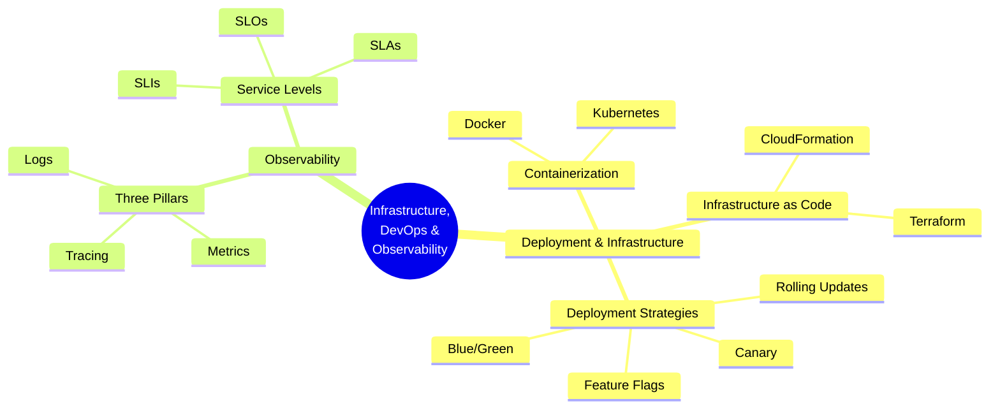

## Introduction

Modern software engineering is not just about writing code — it is equally about **how you build, ship, run, and observe** that code in production. The discipline of **DevOps** bridges the gap between development and operations, emphasizing automation, collaboration, and continuous improvement. **Observability** extends this by ensuring that once software is running, you can understand its internal state from external outputs.

This guide covers the foundational concepts every engineer should understand, regardless of whether they hold the title "DevOps Engineer."

---

