# Part I — Deployment & Infrastructure

## Table of Contents

- [1. Containerization & Orchestration](#1-containerization-and-orchestration)
  - [1.1 The Problem: "It Works on My Machine"](#11-the-problem-it-works-on-my-machine)
  - [1.2 Docker Fundamentals](#12-docker-fundamentals)
    - [Core Concepts](#core-concepts)
    - [Dockerfile Anatomy](#dockerfile-anatomy)
    - [Multi-Stage Builds Visualized](#multi-stage-builds-visualized)
    - [Containers vs Virtual Machines](#containers-vs-virtual-machines)
  - [1.3 Kubernetes Concepts](#13-kubernetes-concepts)
    - [Kubernetes Architecture Overview](#kubernetes-architecture-overview)
    - [Core Kubernetes Objects](#core-kubernetes-objects)
      - [Pod — The Smallest Deployable Unit](#pod-the-smallest-deployable-unit)
      - [Deployment — Declarative Desired State](#deployment-declarative-desired-state)
      - [Service — Stable Networking Abstraction](#service-stable-networking-abstraction)
      - [Ingress — HTTP Routing Layer](#ingress-http-routing-layer)
    - [How Kubernetes Objects Relate](#how-kubernetes-objects-relate)
- [2. Infrastructure as Code (IaC)](#2-infrastructure-as-code-iac)
  - [2.1 The Problem: Manual Infrastructure](#21-the-problem-manual-infrastructure)
  - [2.2 What Is Infrastructure as Code?](#22-what-is-infrastructure-as-code)
  - [2.3 Core IaC Principles](#23-core-iac-principles)
  - [2.4 Terraform Concepts](#24-terraform-concepts)
    - [Terraform Workflow](#terraform-workflow)
    - [Example: Terraform Configuration](#example-terraform-configuration)
    - [The State File](#the-state-file)
  - [2.5 AWS CloudFormation](#25-aws-cloudformation)
  - [2.6 Terraform vs CloudFormation](#26-terraform-vs-cloudformation)
- [3. Deployment Strategies](#3-deployment-strategies)
  - [3.1 Strategy Overview](#31-strategy-overview)
  - [3.2 Blue/Green Deployment](#32-bluegreen-deployment)
  - [3.3 Canary Deployment](#33-canary-deployment)
  - [3.4 Rolling Updates](#34-rolling-updates)
  - [3.5 Feature Flags](#35-feature-flags)
    - [Code Example](#code-example)
    - [Types of Feature Flags](#types-of-feature-flags)
  - [3.6 Strategy Comparison Matrix](#36-strategy-comparison-matrix)


---

## 1. Containerization & Orchestration

### 1.1 The Problem: "It Works on My Machine"

Before containers, deploying software meant dealing with environmental inconsistencies — different OS versions, library conflicts, and configuration drift between development, staging, and production environments.

```
Developer's Laptop        Staging Server          Production Server
┌─────────────────┐    ┌─────────────────┐    ┌─────────────────┐
│ Python 3.11     │    │ Python 3.9      │    │ Python 3.8      │
│ libssl 1.1      │    │ libssl 1.0      │    │ libssl 3.0      │
│ Ubuntu 22.04    │    │ CentOS 7        │    │ Amazon Linux 2  │
│ Config: dev.env │    │ Config: ???     │    │ Config: ???     │
└─────────────────┘    └─────────────────┘    └─────────────────┘
        ✅                    ❌ BUG!               ❌ CRASH!
```

**Containers solve this** by packaging the application *together* with its entire runtime environment into a single, portable unit.

---

### 1.2 Docker Fundamentals

**Docker** is the most widely adopted containerization platform. It allows you to define, build, ship, and run containers consistently across any environment.

#### Core Concepts

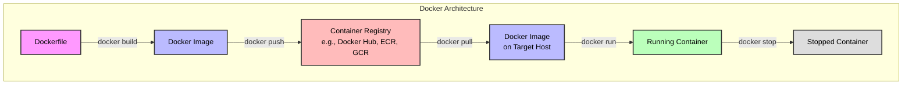

| Concept | Definition | Analogy |
|---|---|---|
| **Dockerfile** | A text file with instructions for building an image | A recipe |
| **Image** | An immutable, layered snapshot of a filesystem + metadata | A class definition |
| **Container** | A running instance of an image with its own isolated process space | An object instance |
| **Registry** | A remote storage location for images | An app store for images |
| **Volume** | Persistent storage that outlives the container lifecycle | An external hard drive |
| **Network** | Virtual networking layer allowing containers to communicate | A private LAN |

#### Dockerfile Anatomy

A `Dockerfile` contains ordered instructions that Docker executes sequentially. Each instruction creates a **layer** in the image, and Docker caches layers for efficiency.

```dockerfile
# ----------------------------------------------------------
# Stage 1: Build stage (Multi-stage build pattern)
# ----------------------------------------------------------
FROM node:20-alpine AS builder
# Use a small base image; 'AS builder' names this stage

WORKDIR /app
# Set the working directory inside the container

COPY package.json package-lock.json ./
# Copy dependency manifests first (layer caching optimization)

RUN npm ci --production
# Install dependencies. 'RUN' executes a command at build time

COPY . .
# Copy the rest of the application source code

RUN npm run build
# Build the application (e.g., compile TypeScript, bundle assets)

# ----------------------------------------------------------
# Stage 2: Production stage
# ----------------------------------------------------------
FROM node:20-alpine AS production

WORKDIR /app

# Copy ONLY the build artifacts and dependencies from Stage 1
COPY --from=builder /app/dist ./dist
COPY --from=builder /app/node_modules ./node_modules

EXPOSE 3000
# Document which port the app listens on (metadata only)

ENV NODE_ENV=production
# Set an environment variable

USER node
# Run as non-root user for security

CMD ["node", "dist/server.js"]
# The default command to run when the container starts
```

> **Key Insight — Layer Caching:** Docker caches each layer. If a layer hasn't changed, Docker reuses the cached version. This is why we `COPY package.json` *before* `COPY . .` — dependency installations are cached until `package.json` changes, even if source code changes frequently.

#### Multi-Stage Builds Visualized

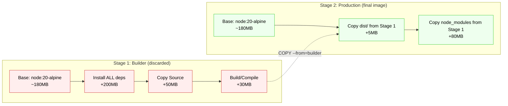

**Result:** The final image is ~265MB instead of ~460MB because build tools, source code, and dev dependencies are left behind in Stage 1.

#### Containers vs Virtual Machines

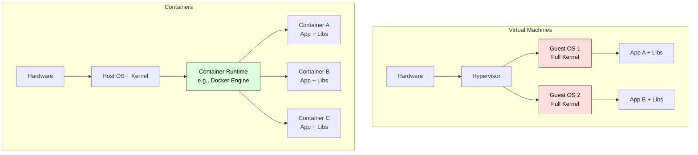

| Aspect | Virtual Machines | Containers |
|---|---|---|
| **Isolation** | Full OS-level (strongest) | Process-level (via namespaces/cgroups) |
| **Boot Time** | Minutes | Milliseconds to seconds |
| **Size** | Gigabytes | Megabytes |
| **Overhead** | High (full guest OS) | Minimal (shared kernel) |
| **Use Case** | Strong isolation needs, different OS kernels | Microservices, CI/CD, rapid scaling |

---

### 1.3 Kubernetes Concepts

Docker runs containers on a **single host**. But in production, you need to:

- Run containers across **multiple machines** (a cluster)
- **Automatically restart** failed containers
- **Scale up/down** based on load
- **Load balance** traffic across container replicas
- Perform **zero-downtime deployments**

**Kubernetes (K8s)** is an open-source container orchestration platform that solves all of these problems.

#### Kubernetes Architecture Overview

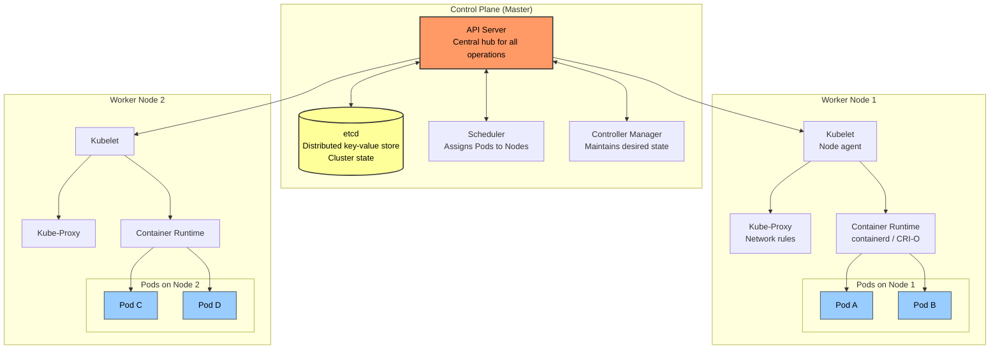

#### Core Kubernetes Objects

##### Pod — The Smallest Deployable Unit

A **Pod** is the atomic unit in Kubernetes. It wraps one or more tightly coupled containers that share the same network namespace (same IP address) and can share storage volumes.

```yaml
# pod.yaml — Rarely created directly; usually managed by a Deployment
apiVersion: v1
kind: Pod
metadata:
  name: my-app-pod
  labels:
    app: my-app          # Labels are key-value pairs for identification
    tier: backend
spec:
  containers:
    - name: app-container
      image: my-company/my-app:1.2.0
      ports:
        - containerPort: 8080
      resources:
        requests:          # Minimum guaranteed resources
          cpu: "250m"      # 250 millicores = 0.25 CPU
          memory: "128Mi"
        limits:            # Maximum allowed resources
          cpu: "500m"
          memory: "256Mi"
      livenessProbe:       # Is the container alive?
        httpGet:
          path: /healthz
          port: 8080
        initialDelaySeconds: 10
        periodSeconds: 15
      readinessProbe:      # Is the container ready to receive traffic?
        httpGet:
          path: /ready
          port: 8080
        initialDelaySeconds: 5
        periodSeconds: 10
    - name: sidecar-logger   # Sidecar pattern: second container in same Pod
      image: fluentd:latest
      volumeMounts:
        - name: log-volume
          mountPath: /var/log/app
  volumes:
    - name: log-volume
      emptyDir: {}           # Ephemeral volume shared between containers
```

> **Why not just one container per Pod?** The sidecar pattern is common — a primary application container paired with helper containers (logging agents, proxies, config reloaders) that share the Pod's network and storage.

##### Deployment — Declarative Desired State

A **Deployment** manages a set of identical Pod replicas. You tell Kubernetes the *desired state* (e.g., "I want 3 replicas of version 1.2.0"), and the Deployment controller continuously works to make the *actual state* match.

```yaml
# deployment.yaml
apiVersion: apps/v1
kind: Deployment
metadata:
  name: my-app-deployment
  namespace: production
spec:
  replicas: 3                    # Desired number of Pod replicas
  selector:
    matchLabels:
      app: my-app                # Must match the Pod template labels
  strategy:
    type: RollingUpdate          # How to perform updates
    rollingUpdate:
      maxSurge: 1                # Max Pods above desired count during update
      maxUnavailable: 0          # No Pods can be unavailable during update
  template:                      # Pod template — defines each replica
    metadata:
      labels:
        app: my-app
        version: "1.2.0"
    spec:
      containers:
        - name: my-app
          image: my-company/my-app:1.2.0
          ports:
            - containerPort: 8080
          env:
            - name: DATABASE_URL
              valueFrom:
                secretKeyRef:     # Pull sensitive config from K8s Secrets
                  name: db-credentials
                  key: url
          resources:
            requests:
              cpu: "250m"
              memory: "128Mi"
            limits:
              cpu: "500m"
              memory: "256Mi"
```

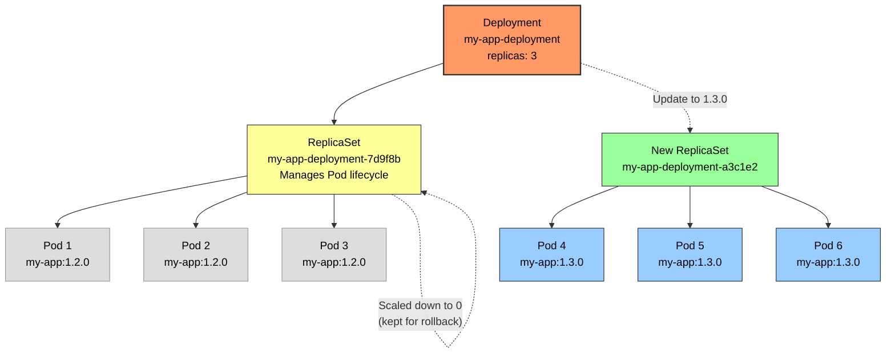

> **Declarative vs Imperative:** You don't say *"start 2 more pods."* You say *"there should be 5 pods."* Kubernetes figures out the difference and acts.

##### Service — Stable Networking Abstraction

Pods are **ephemeral** — they can be destroyed and recreated with different IP addresses at any time. A **Service** provides a stable virtual IP (ClusterIP) and DNS name that load-balances traffic to the matching Pods.

```yaml
# service.yaml
apiVersion: v1
kind: Service
metadata:
  name: my-app-service
spec:
  selector:
    app: my-app              # Route traffic to Pods with this label
  type: ClusterIP            # Internal only (default)
  ports:
    - protocol: TCP
      port: 80               # Port exposed by the Service
      targetPort: 8080       # Port on the Pod containers
```

**Service Types:**

| Type | Scope | Description |
|---|---|---|
| **ClusterIP** | Internal | Default. Reachable only within the cluster. |
| **NodePort** | External | Exposes the Service on each Node's IP at a static port (30000–32767). |
| **LoadBalancer** | External | Provisions a cloud provider's load balancer (e.g., AWS ALB/NLB). |
| **ExternalName** | DNS alias | Maps the Service to an external DNS name (CNAME record). |

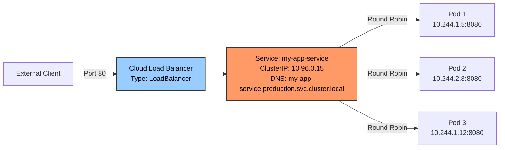

##### Ingress — HTTP Routing Layer

An **Ingress** manages external HTTP/HTTPS access to Services within the cluster. It provides host-based and path-based routing, SSL termination, and more — all from a single entry point.

```yaml
# ingress.yaml
apiVersion: networking.k8s.io/v1
kind: Ingress
metadata:
  name: my-app-ingress
  annotations:
    nginx.ingress.kubernetes.io/ssl-redirect: "true"
    cert-manager.io/cluster-issuer: "letsencrypt-prod"
spec:
  ingressClassName: nginx         # Which Ingress Controller to use
  tls:
    - hosts:
        - api.example.com
      secretName: api-tls-cert    # TLS certificate stored as K8s Secret
  rules:
    - host: api.example.com
      http:
        paths:
          - path: /users
            pathType: Prefix
            backend:
              service:
                name: users-service
                port:
                  number: 80
          - path: /orders
            pathType: Prefix
            backend:
              service:
                name: orders-service
                port:
                  number: 80
```

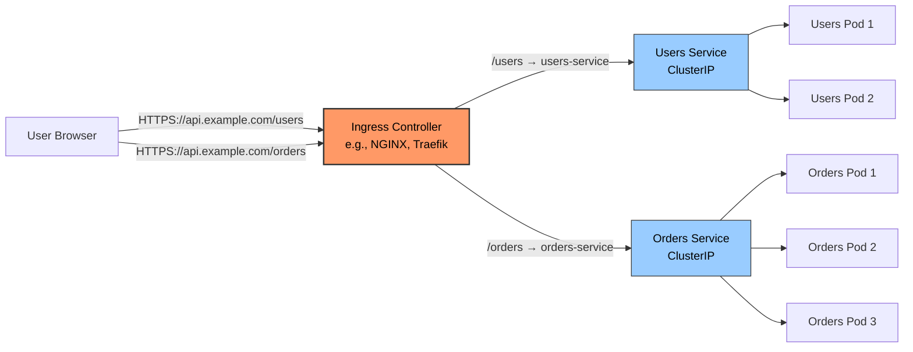

#### How Kubernetes Objects Relate

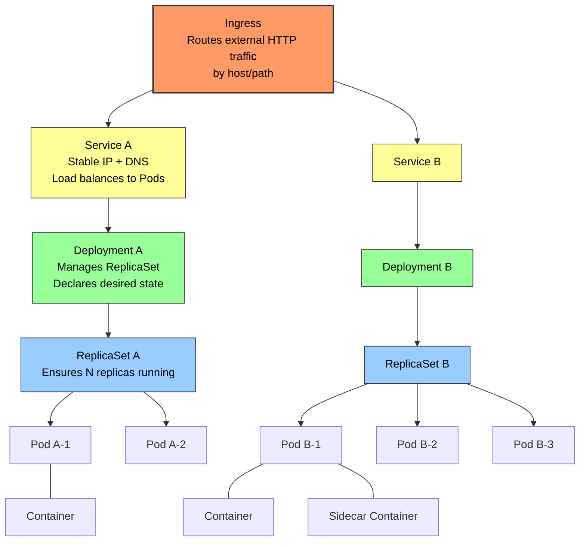

---

## 2. Infrastructure as Code (IaC)

### 2.1 The Problem: Manual Infrastructure

Before IaC, infrastructure was provisioned through:

- Clicking through cloud provider consoles (AWS, Azure, GCP)
- Running ad-hoc CLI commands
- Writing shell scripts that break when cloud APIs change

This leads to **snowflake servers** (unique, unreproducible configurations), **configuration drift** (environments diverging over time), and **no audit trail** (who changed what, when, and why?).

### 2.2 What Is Infrastructure as Code?

**Infrastructure as Code** means defining your infrastructure — servers, networks, databases, DNS records, IAM policies — in **declarative configuration files** that are version-controlled, reviewed, tested, and applied automatically.

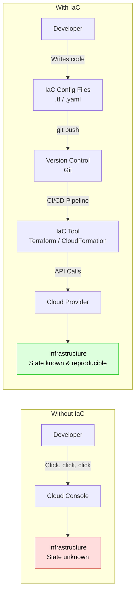

### 2.3 Core IaC Principles

| Principle | Description |
|---|---|
| **Declarative** | You describe *what* you want, not *how* to achieve it |
| **Idempotent** | Applying the same configuration multiple times yields the same result |
| **Version Controlled** | All infrastructure changes go through Git (PRs, reviews, history) |
| **Reproducible** | Spin up identical environments (dev, staging, prod) from the same code |
| **Self-Documenting** | The code *is* the documentation of your infrastructure |

### 2.4 Terraform Concepts

**Terraform** (by HashiCorp) is a cloud-agnostic IaC tool. It uses its own configuration language called **HCL (HashiCorp Configuration Language)**.

#### Terraform Workflow

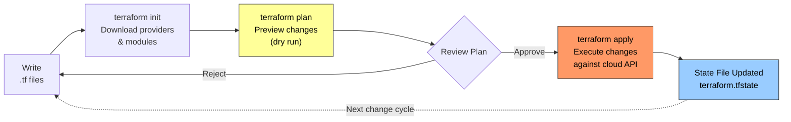

#### Example: Terraform Configuration

```hcl
# providers.tf — Configure which cloud provider to use
terraform {
  required_version = ">= 1.5.0"

  required_providers {
    aws = {
      source  = "hashicorp/aws"
      version = "~> 5.0"
    }
  }

  # Store state remotely (critical for team collaboration)
  backend "s3" {
    bucket = "my-company-terraform-state"
    key    = "production/infrastructure.tfstate"
    region = "us-east-1"
  }
}

provider "aws" {
  region = var.aws_region
}

# variables.tf — Input parameters
variable "aws_region" {
  description = "AWS region to deploy resources"
  type        = string
  default     = "us-east-1"
}

variable "environment" {
  description = "Environment name"
  type        = string
  # No default — must be provided at plan/apply time
}

# main.tf — Resource definitions
resource "aws_vpc" "main" {
  cidr_block           = "10.0.0.0/16"
  enable_dns_hostnames = true

  tags = {
    Name        = "${var.environment}-vpc"
    Environment = var.environment
    ManagedBy   = "terraform"
  }
}

resource "aws_subnet" "public" {
  count             = 2                                         # Create 2 subnets
  vpc_id            = aws_vpc.main.id                           # Reference another resource
  cidr_block        = "10.0.${count.index + 1}.0/24"
  availability_zone = data.aws_availability_zones.available.names[count.index]

  tags = {
    Name = "${var.environment}-public-${count.index + 1}"
  }
}

resource "aws_instance" "web_server" {
  ami           = "ami-0c55b159cbfafe1f0"
  instance_type = "t3.micro"
  subnet_id     = aws_subnet.public[0].id

  tags = {
    Name = "${var.environment}-web-server"
  }
}

# outputs.tf — Values to expose after apply
output "vpc_id" {
  description = "ID of the created VPC"
  value       = aws_vpc.main.id
}
```

#### The State File

The **state file** (`terraform.tfstate`) is Terraform's record of the real-world infrastructure it manages. It maps each resource in your `.tf` files to actual cloud resources.

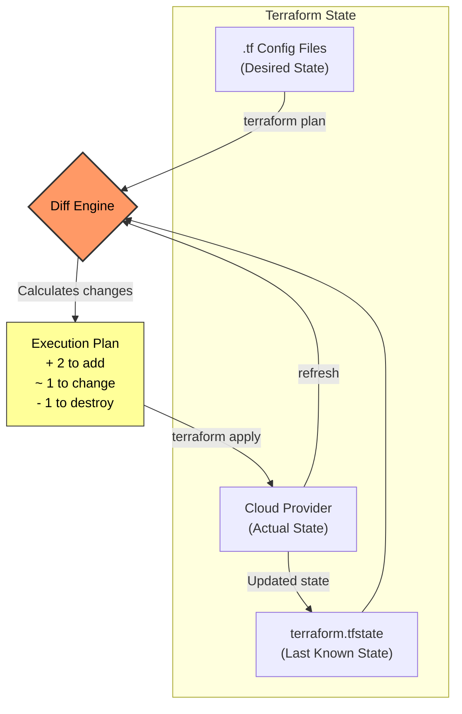

> **⚠️ Critical:** The state file often contains sensitive data (database passwords, private keys). It should be stored in a **remote backend** (S3, GCS, Terraform Cloud) with encryption, locking, and access controls — *never* committed to Git.

### 2.5 AWS CloudFormation

**CloudFormation** is AWS's native IaC service. It uses JSON or YAML templates and is deeply integrated with AWS services.

```yaml
# cloudformation-template.yaml
AWSTemplateFormatVersion: '2010-09-09'
Description: 'Simple VPC and EC2 setup'

Parameters:
  Environment:
    Type: String
    AllowedValues: [dev, staging, production]

Resources:
  MainVPC:
    Type: AWS::EC2::VPC
    Properties:
      CidrBlock: 10.0.0.0/16
      EnableDnsHostnames: true
      Tags:
        - Key: Name
          Value: !Sub '${Environment}-vpc'

  WebServer:
    Type: AWS::EC2::Instance
    Properties:
      InstanceType: t3.micro
      ImageId: ami-0c55b159cbfafe1f0
      SubnetId: !Ref PublicSubnet

Outputs:
  VpcId:
    Value: !Ref MainVPC
```

### 2.6 Terraform vs CloudFormation

| Feature | Terraform | CloudFormation |
|---|---|---|
| **Provider Support** | Multi-cloud (AWS, Azure, GCP, etc.) | AWS only |
| **Language** | HCL (HashiCorp Configuration Language) | YAML / JSON |
| **State Management** | Explicit state file (you manage it) | Managed by AWS automatically |
| **Drift Detection** | `terraform plan` (manual) | Built-in drift detection |
| **Modularity** | Modules (reusable, composable) | Nested Stacks / Modules |
| **Community** | Large open-source ecosystem | AWS-curated |
| **Rollback** | Manual (apply previous state) | Automatic on stack failure |

> **When to use which?** If you're AWS-only and want managed state, CloudFormation may be simpler. If you're multi-cloud or want flexibility, Terraform is the industry standard.

---

## 3. Deployment Strategies

How you release new versions of your application to production has a massive impact on risk, downtime, and user experience.

### 3.1 Strategy Overview

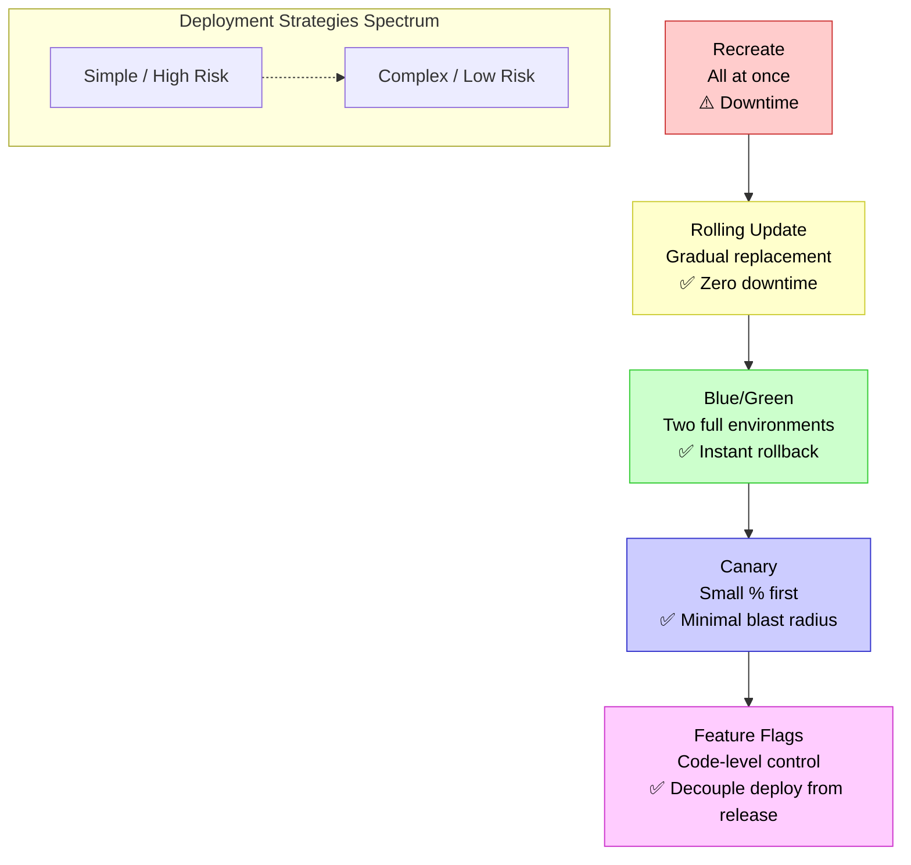

### 3.2 Blue/Green Deployment

Maintain **two identical production environments**: Blue (current) and Green (new). Switch traffic all at once after validation.

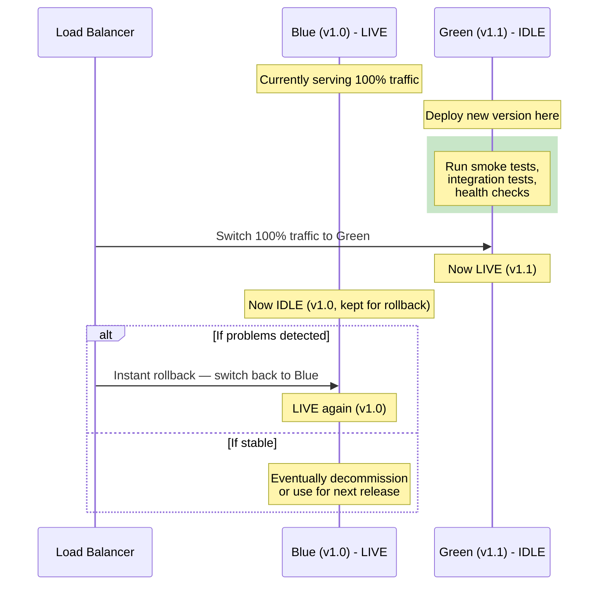

| Pros | Cons |
|---|---|
| ✅ Instant rollback (just switch traffic back) | ❌ Requires 2× infrastructure (costly) |
| ✅ Zero downtime during switch | ❌ Database migrations can be tricky |
| ✅ Full testing in production-like environment | ❌ All-or-nothing traffic switch |

### 3.3 Canary Deployment

Route a **small percentage of traffic** to the new version first. Gradually increase if metrics look healthy.

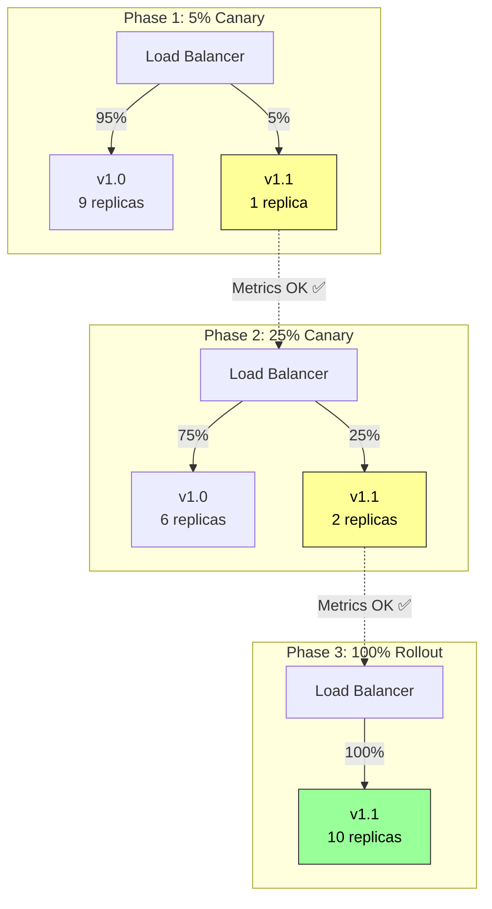

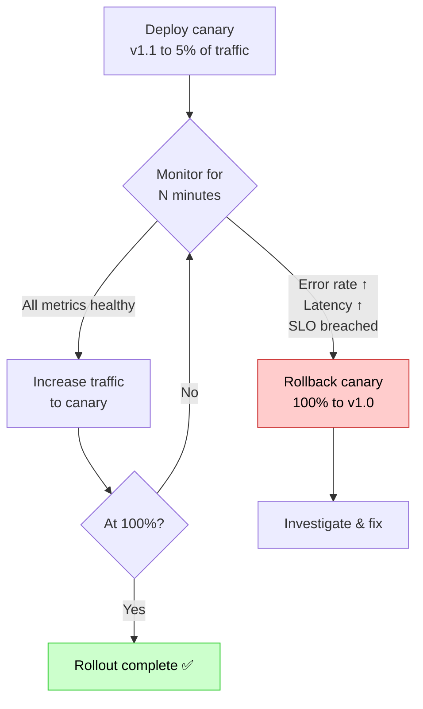

| Pros | Cons |
|---|---|
| ✅ Minimal blast radius (only small % affected) | ❌ More complex routing infrastructure |
| ✅ Real production traffic validates the change | ❌ Requires robust monitoring & automated analysis |
| ✅ Gradual confidence building | ❌ Slower full rollout compared to Blue/Green |

### 3.4 Rolling Updates

Replace instances of the old version with the new version **one (or a few) at a time**. This is the default strategy in Kubernetes Deployments.

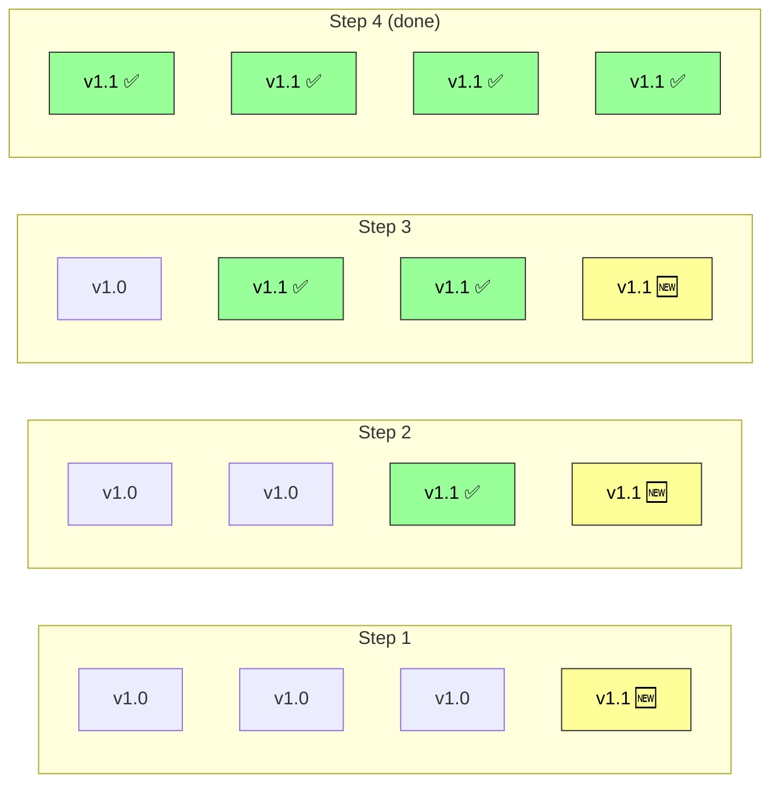

| Pros | Cons |
|---|---|
| ✅ Zero downtime | ❌ Slower rollout than Blue/Green |
| ✅ No extra infrastructure needed | ❌ Rollback requires another rolling update |
| ✅ Kubernetes does it natively | ❌ Both versions run simultaneously (compatibility needed) |

### 3.5 Feature Flags

**Feature Flags** (also called feature toggles) **decouple deployment from release**. Code is deployed to production but new features are hidden behind conditional flags that can be toggled without redeploying.

```mermaid
graph TB
    subgraph "Traditional Deployment"
        D1[Deploy v1.1] -->|"Feature immediately visible"| U1[All Users see new feature]
    end

    subgraph "Feature Flag Deployment"
        D2[Deploy v1.1<br/>with flag OFF] -->|"Feature hidden"| U2[No users see new feature]
        U2 -->|"Turn flag ON for 5%"| U3[5% see new feature]
        U3 -->|"Turn flag ON for 50%"| U4[50% see new feature]
        U4 -->|"Turn flag ON for 100%"| U5[All users see new feature]
        U3 -.->|"Bug found? Turn OFF"| U2
    end

    style D1 fill:#fcc,stroke:#c33,color:#000
    style D2 fill:#cfc,stroke:#3c3,color:#000
```

#### Code Example

```python
# Simplified feature flag usage
from feature_flags import FeatureFlagClient

ff_client = FeatureFlagClient(api_key="...")

def get_search_results(user, query):
    # Check if this user should see the new search algorithm
    if ff_client.is_enabled("new_search_algorithm", user_context={
        "user_id": user.id,
        "country": user.country,
        "plan": user.subscription_plan,
    }):
        # New code path
        return new_search_engine.search(query)
    else:
        # Existing code path
        return legacy_search_engine.search(query)
```

#### Types of Feature Flags

| Type | Lifespan | Purpose | Example |
|---|---|---|---|
| **Release Flag** | Short (days/weeks) | Safely roll out incomplete or risky features | New checkout flow |
| **Experiment Flag** | Medium (weeks) | A/B testing different variants | Button color test |
| **Ops Flag** | Indefinite | Runtime operational control | Circuit breaker, rate limiter |
| **Permission Flag** | Indefinite | Gate features by user segment or subscription | Premium-only features |

> **⚠️ Technical Debt Warning:** Feature flags that are not cleaned up after a feature is fully released become confusing dead code. Always have a process to remove flags once they're no longer needed.

### 3.6 Strategy Comparison Matrix

| Strategy | Downtime | Rollback Speed | Infrastructure Cost | Complexity | Risk Level |
|---|---|---|---|---|---|
| **Recreate** | ✅ Yes | Slow (redeploy) | Low | Very Low | 🔴 High |
| **Rolling Update** | ❌ None | Medium (re-roll) | Low | Low | 🟡 Medium |
| **Blue/Green** | ❌ None | Instant (switch) | High (2×) | Medium | 🟢 Low |
| **Canary** | ❌ None | Fast (reroute) | Medium | High | 🟢 Very Low |
| **Feature Flags** | ❌ None | Instant (toggle) | Low | Medium–High | 🟢 Very Low |

> **In practice, these strategies are often combined.** For example: use **Rolling Updates** for the deployment mechanism + **Canary** for gradual traffic shifting + **Feature Flags** for controlling feature visibility within the deployed code.

---

