# Part II — Observability

## Table of Contents

- [1. The Three Pillars of Observability](#1-the-three-pillars-of-observability)
  - [1.1 What Is Observability?](#11-what-is-observability)
  - [1.2 The Three Pillars](#12-the-three-pillars)
  - [1.3 Pillar 1: Metrics](#13-pillar-1-metrics)
    - [Types of Metrics](#types-of-metrics)
    - [Example: Prometheus Metrics Format](#example-prometheus-metrics-format)
    - [The RED Method (for request-driven services)](#the-red-method-for-request-driven-services)
    - [The USE Method (for infrastructure resources)](#the-use-method-for-infrastructure-resources)
  - [1.4 Pillar 2: Logs](#14-pillar-2-logs)
    - [Structured vs Unstructured Logs](#structured-vs-unstructured-logs)
    - [Log Levels](#log-levels)
    - [Logging Pipeline](#logging-pipeline)
  - [1.5 Pillar 3: Tracing (Distributed Tracing)](#15-pillar-3-tracing-distributed-tracing)
    - [Trace Anatomy](#trace-anatomy)
    - [Key Terminology](#key-terminology)
    - [How Context Propagation Works](#how-context-propagation-works)
    - [OpenTelemetry (OTel)](#opentelemetry-otel)
    - [OTel Code Example (Node.js)](#otel-code-example-nodejs)
  - [1.6 Connecting the Three Pillars](#16-connecting-the-three-pillars)
- [2. SLIs, SLOs, and SLAs](#2-slis-slos-and-slas)
  - [2.1 Overview & Relationships](#21-overview-and-relationships)
  - [2.2 SLIs — Service Level Indicators](#22-slis-service-level-indicators)
    - [Common SLI Categories](#common-sli-categories)
    - [Choosing Good SLIs](#choosing-good-slis)
  - [2.3 SLOs — Service Level Objectives](#23-slos-service-level-objectives)
    - [Setting SLOs](#setting-slos)
    - [Error Budgets](#error-budgets)
    - [Error Budget Policy](#error-budget-policy)
  - [2.4 SLAs — Service Level Agreements](#24-slas-service-level-agreements)
    - [Real-World SLA Example (Simplified)](#real-world-sla-example-simplified)


---

## 1. The Three Pillars of Observability

### 1.1 What Is Observability?

**Observability** is the ability to understand the **internal state of a system** by examining its **external outputs**. It answers the question: *"Why is the system behaving this way?"*

This is distinct from **monitoring**, which answers: *"Is the system working?"*

```mermaid
graph TB
    subgraph "Monitoring vs Observability"
        MON[Monitoring<br/>"Is it broken?"<br/>Known unknowns] 
        OBS[Observability<br/>"WHY is it broken?"<br/>Unknown unknowns]
    end

    MON -->|"Alert: Error rate > 5%"| Q1["What's happening?"]
    Q1 --> OBS
    OBS -->|Metrics| A1["WHEN did it start?"]
    OBS -->|Logs| A2["WHAT errors occurred?"]
    OBS -->|Traces| A3["WHERE in the system<br/>is the bottleneck?"]

    style MON fill:#ffc,stroke:#333,color:#000
    style OBS fill:#cff,stroke:#333,color:#000
```

### 1.2 The Three Pillars

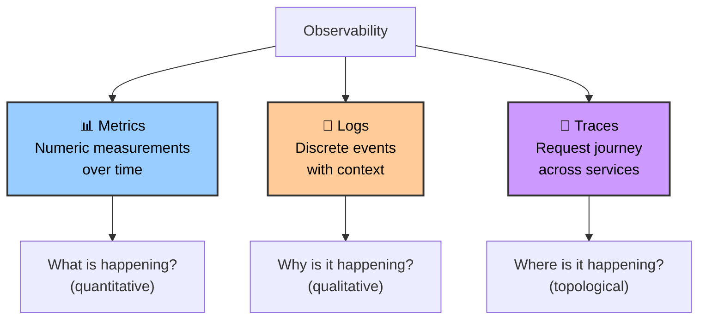

---

### 1.3 Pillar 1: Metrics

**Metrics** are numeric values measured over time. They are highly compressed, cheap to store, and ideal for alerting and dashboards.

#### Types of Metrics

| Type | Description | Example |
|---|---|---|
| **Counter** | Monotonically increasing value; only goes up (or resets to 0) | `http_requests_total`, `errors_total` |
| **Gauge** | Value that can go up or down | `temperature_celsius`, `active_connections` |
| **Histogram** | Samples observations and counts them in configurable buckets | `request_duration_seconds` (p50, p95, p99) |
| **Summary** | Similar to histogram but calculates quantiles client-side | `request_duration_seconds{quantile="0.99"}` |

#### Example: Prometheus Metrics Format

```
# HELP http_requests_total Total number of HTTP requests
# TYPE http_requests_total counter
http_requests_total{method="GET", path="/api/users", status="200"} 145289
http_requests_total{method="GET", path="/api/users", status="500"} 37
http_requests_total{method="POST", path="/api/orders", status="201"} 8923

# HELP http_request_duration_seconds HTTP request latency in seconds
# TYPE http_request_duration_seconds histogram
http_request_duration_seconds_bucket{path="/api/users", le="0.05"} 129000
http_request_duration_seconds_bucket{path="/api/users", le="0.1"}  140000
http_request_duration_seconds_bucket{path="/api/users", le="0.25"} 144500
http_request_duration_seconds_bucket{path="/api/users", le="0.5"}  145100
http_request_duration_seconds_bucket{path="/api/users", le="+Inf"} 145289

# HELP process_memory_bytes Current memory usage in bytes
# TYPE process_memory_bytes gauge
process_memory_bytes 256000000
```

#### The RED Method (for request-driven services)

| Letter | Metric | Question |
|---|---|---|
| **R** | Rate | How many requests per second? |
| **E** | Errors | How many of those requests are failing? |
| **D** | Duration | How long do the requests take? |

#### The USE Method (for infrastructure resources)

| Letter | Metric | Question |
|---|---|---|
| **U** | Utilization | What percentage of the resource is busy? |
| **S** | Saturation | How much work is queued (waiting)? |
| **E** | Errors | How many error events occurred? |

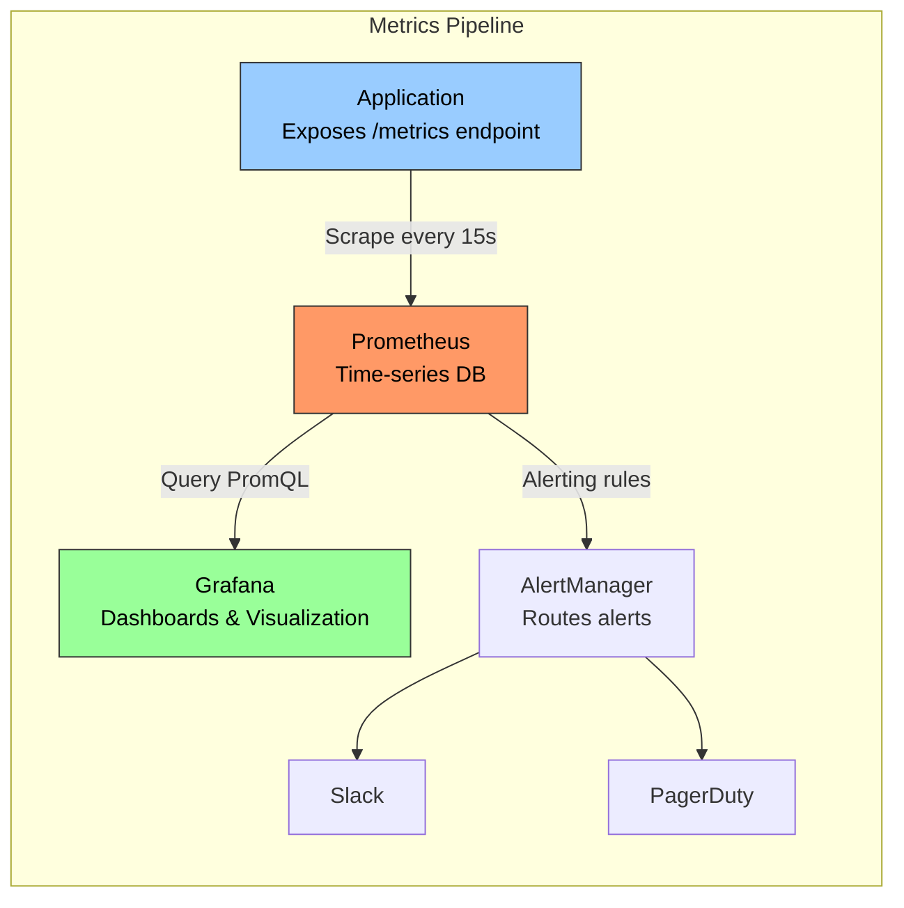

---

### 1.4 Pillar 2: Logs

**Logs** are immutable, timestamped records of discrete events that happened in the system. They provide the richest context for debugging but are the most expensive to store and query at scale.

#### Structured vs Unstructured Logs

```
# ❌ Unstructured log — hard to parse, search, and aggregate
[2024-01-15 14:23:45] ERROR: Failed to process order #12345 for user john@example.com - 
  Payment gateway timeout after 30s. Retrying (attempt 2/3)

# ✅ Structured log (JSON) — machine-parseable, filterable, aggregatable
{
  "timestamp": "2024-01-15T14:23:45.123Z",
  "level": "ERROR",
  "service": "order-service",
  "instance": "order-service-7d9f8b-x4k2n",
  "trace_id": "abc123def456",          ← Links to distributed trace
  "span_id": "span-789",
  "message": "Failed to process order",
  "order_id": "12345",
  "user_id": "usr_98765",
  "payment_gateway": "stripe",
  "error_type": "TIMEOUT",
  "timeout_seconds": 30,
  "retry_attempt": 2,
  "max_retries": 3
}
```

> **Key Insight:** Always use **structured logging** in production. It enables you to filter (`level:ERROR AND service:order-service`), aggregate (`count errors by payment_gateway`), and correlate (join with traces via `trace_id`).

#### Log Levels

| Level | When to Use | Example |
|---|---|---|
| **TRACE** | Ultra-fine-grained debugging (rarely enabled in production) | Function entry/exit |
| **DEBUG** | Detailed diagnostic information for development | Variable values, decision branches |
| **INFO** | Normal operational events worth noting | "Server started on port 8080", "Order processed" |
| **WARN** | Unexpected but recoverable situations | "Cache miss, falling back to DB", "Retry attempt 2" |
| **ERROR** | Failures that need attention but don't crash the service | "Payment failed", "External API returned 500" |
| **FATAL** | Unrecoverable errors; the process is about to crash | "Cannot connect to database on startup" |

#### Logging Pipeline

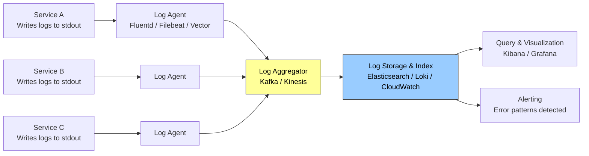

---

### 1.5 Pillar 3: Tracing (Distributed Tracing)

In a microservices architecture, a single user request often flows through **many services**. **Distributed tracing** lets you follow a request's entire journey, measuring time spent in each service and identifying bottlenecks.

#### Trace Anatomy

```mermaid
gantt
    title Distributed Trace — Order Placement (Total: 850ms)
    dateFormat X
    axisFormat %L ms

    section API Gateway
    Parse & authenticate request        :a1, 0, 50

    section Order Service
    Validate order                       :a2, 50, 100
    Check inventory (call Inventory Svc) :a3, 100, 350
    Create order record (DB write)       :a4, 350, 500

    section Inventory Service
    Query stock levels (DB read)         :a5, 120, 280
    Reserve inventory (DB write)         :a6, 280, 340

    section Payment Service
    Process payment (external API)       :a7, 500, 800

    section Notification Service
    Send confirmation email (async)      :a8, 800, 850
```

#### Key Terminology

| Term | Definition |
|---|---|
| **Trace** | The complete journey of a single request through all services. Identified by a unique `trace_id`. |
| **Span** | A single unit of work within a trace (e.g., "query database", "call payment API"). Each span has a `span_id`, `parent_span_id`, start time, and duration. |
| **Root Span** | The first span in a trace (usually the entry point, e.g., API Gateway). |
| **Context Propagation** | Passing `trace_id` and `span_id` across service boundaries via HTTP headers or message metadata. |
| **Baggage** | Key-value pairs attached to the trace context that propagate across all spans (e.g., `user_id`, `tenant_id`). |

#### How Context Propagation Works

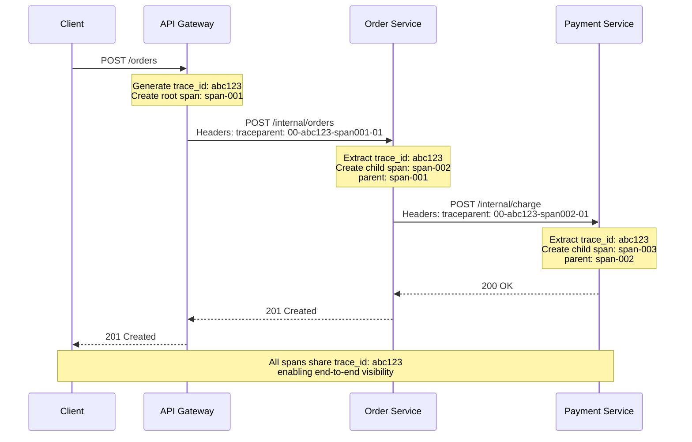

#### OpenTelemetry (OTel)

**OpenTelemetry** is the industry-standard, vendor-neutral framework for collecting all three pillars of observability data (metrics, logs, and traces) from your applications.

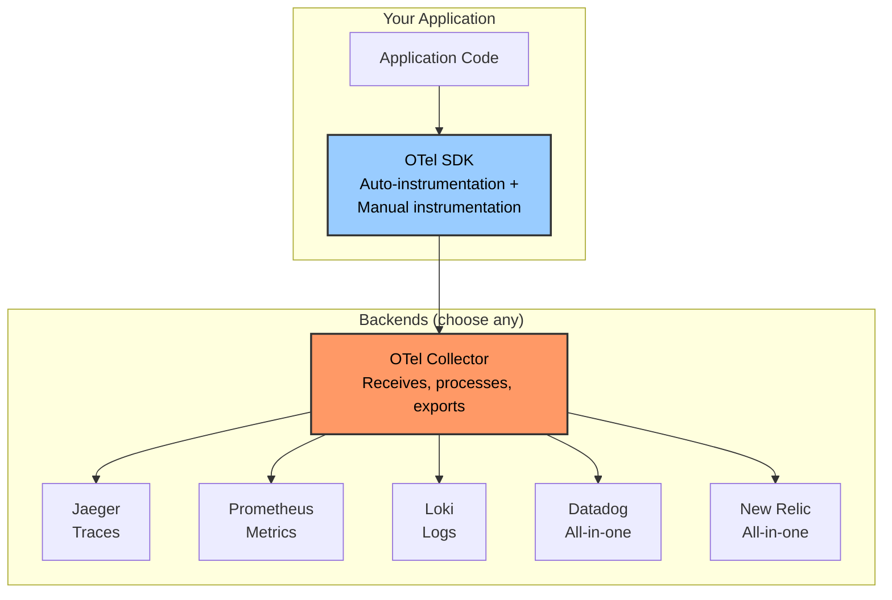

**Why OpenTelemetry matters:**

- **Vendor-neutral**: Instrument once, export to any backend
- **Auto-instrumentation**: Automatically traces HTTP calls, database queries, etc. with zero code changes
- **Unified API**: One SDK for metrics, logs, and traces
- **Context correlation**: Links metrics, logs, and traces through shared `trace_id`

#### OTel Code Example (Node.js)

```javascript
// tracing.js — Initialize OpenTelemetry (run before app starts)
const { NodeSDK } = require('@opentelemetry/sdk-node');
const { OTLPTraceExporter } = require('@opentelemetry/exporter-trace-otlp-http');
const { HttpInstrumentation } = require('@opentelemetry/instrumentation-http');
const { ExpressInstrumentation } = require('@opentelemetry/instrumentation-express');
const { PgInstrumentation } = require('@opentelemetry/instrumentation-pg');

const sdk = new NodeSDK({
  serviceName: 'order-service',
  traceExporter: new OTLPTraceExporter({
    url: 'http://otel-collector:4318/v1/traces',
  }),
  instrumentations: [
    new HttpInstrumentation(),     // Auto-trace all HTTP calls
    new ExpressInstrumentation(),  // Auto-trace Express routes
    new PgInstrumentation(),       // Auto-trace PostgreSQL queries
  ],
});

sdk.start();
```

```javascript
// order-service.js — Adding manual spans for custom logic
const { trace } = require('@opentelemetry/api');
const tracer = trace.getTracer('order-service');

async function processOrder(orderData) {
  // Create a custom span for business logic
  return tracer.startActiveSpan('processOrder', async (span) => {
    try {
      span.setAttribute('order.id', orderData.id);
      span.setAttribute('order.total', orderData.total);
      span.setAttribute('order.item_count', orderData.items.length);

      // This DB call is auto-instrumented by PgInstrumentation
      await db.query('INSERT INTO orders ...');

      // This HTTP call is auto-instrumented by HttpInstrumentation
      // trace_id is automatically propagated in headers
      await fetch('http://payment-service/charge', { ... });

      span.setStatus({ code: SpanStatusCode.OK });
    } catch (error) {
      span.setStatus({ code: SpanStatusCode.ERROR, message: error.message });
      span.recordException(error);
      throw error;
    } finally {
      span.end();
    }
  });
}
```

### 1.6 Connecting the Three Pillars

The real power of observability comes when all three pillars are **correlated**.

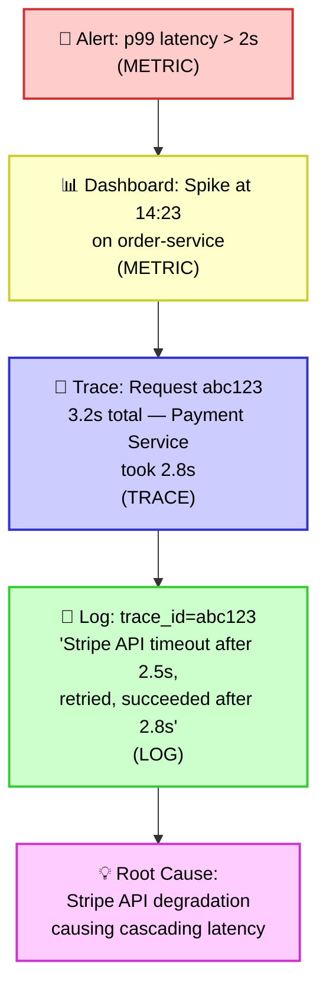

> **The debugging workflow:** Metrics tell you *something is wrong*. Traces tell you *where it's wrong*. Logs tell you *why it's wrong*.

---

## 2. SLIs, SLOs, and SLAs

These three concepts form a hierarchy for defining, measuring, and communicating the reliability of your services.

### 2.1 Overview & Relationships

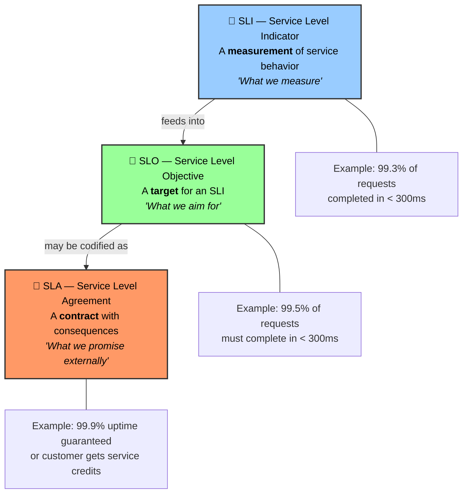

---

### 2.2 SLIs — Service Level Indicators

An **SLI** is a carefully chosen metric that quantifies an aspect of service quality **as experienced by the user**.

#### Common SLI Categories

| Category | SLI | How It's Measured |
|---|---|---|
| **Availability** | Proportion of successful requests | `successful requests / total requests` |
| **Latency** | Proportion of requests faster than a threshold | `requests < 300ms / total requests` |
| **Throughput** | Proportion of time the system serves above minimum capacity | Requests per second over threshold |
| **Error Rate** | Proportion of requests that result in errors | `error responses / total responses` |
| **Correctness** | Proportion of responses returning correct data | `correct outputs / total outputs` |
| **Freshness** | Proportion of data updated within an acceptable window | `data age < 1 minute` |

> **Important:** A good SLI reflects the **user's experience**, not internal system metrics. "CPU usage < 80%" is *not* a good SLI because users don't care about CPU — they care about whether their request was fast and successful.

#### Choosing Good SLIs

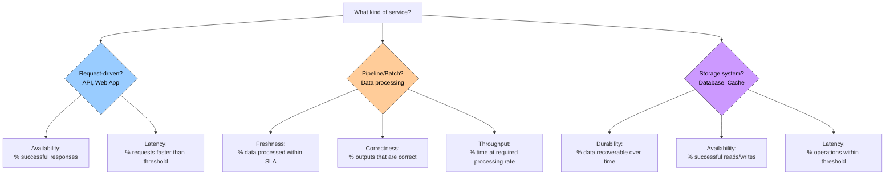

---

### 2.3 SLOs — Service Level Objectives

An **SLO** is a target value (or range) for an SLI. It represents the level of reliability you aim to provide.

#### Setting SLOs

```
SLO = SLI + Target + Time Window

Examples:
  "99.9% of HTTP requests will return successfully over a 30-day rolling window"
  "95% of API calls will complete in less than 200ms over each calendar month"
  "99.95% of data pipeline runs will complete within 1 hour of the scheduled time"
```

#### Error Budgets

The **error budget** is the inverse of the SLO — it's the acceptable amount of unreliability.

```
Error Budget = 100% − SLO target

If SLO = 99.9% availability:
  Error Budget = 0.1%
  
  In a 30-day month (43,200 minutes):
    Allowed downtime = 43,200 × 0.001 = 43.2 minutes
```

| SLO Target | Error Budget | Allowed Downtime/Month | Allowed Downtime/Year |
|---|---|---|---|
| 99% | 1% | 7.3 hours | 3.65 days |
| 99.5% | 0.5% | 3.65 hours | 1.83 days |
| 99.9% | 0.1% | 43.2 minutes | 8.76 hours |
| 99.95% | 0.05% | 21.6 minutes | 4.38 hours |
| 99.99% | 0.01% | 4.32 minutes | 52.6 minutes |
| 99.999% | 0.001% | 26 seconds | 5.26 minutes |

> **The "nines" get exponentially harder and more expensive.** Going from 99.9% to 99.99% doesn't sound like much, but it means 10× less allowed downtime. Each additional nine typically requires disproportionately more engineering investment.

#### Error Budget Policy

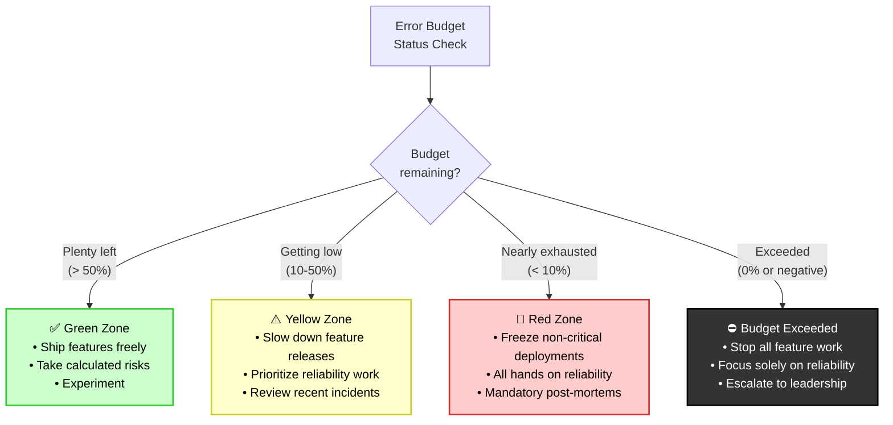

> **Key Insight:** Error budgets create a **data-driven conversation** between product teams (who want to ship features) and SRE/platform teams (who want reliability). When the budget is healthy, you can ship aggressively. When it's depleted, you focus on stability. No arguments — just math.

---

### 2.4 SLAs — Service Level Agreements

An **SLA** is a formal contract between a service provider and its customers. It defines what happens (usually financial penalties) when the service fails to meet agreed-upon levels.

| Aspect | SLO | SLA |
|---|---|---|
| **Audience** | Internal engineering teams | External customers |
| **Binding** | Aspirational target | Legally binding contract |
| **Consequence of breach** | Trigger error budget policy | Financial penalties, service credits |
| **Typical target** | More aggressive (higher bar) | More relaxed (buffer built in) |

> **SLOs should always be stricter than SLAs.** If your SLA promises 99.9% uptime, your internal SLO should target 99.95% so you have a buffer before you breach the contract.

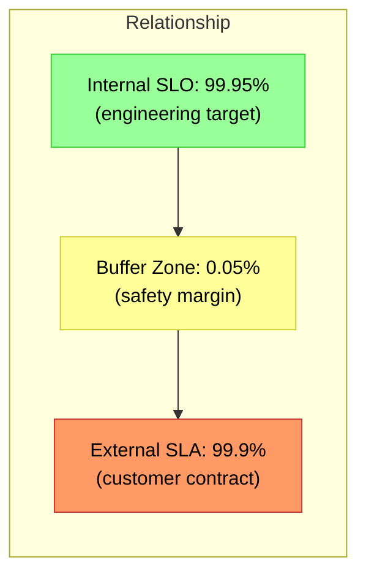

#### Real-World SLA Example (Simplified)

```
AWS EC2 SLA (simplified):

Monthly Uptime Percentage          | Service Credit
≥ 99.99%                           | None
99.0% – 99.99%                     | 10% credit
95.0% – 99.0%                      | 30% credit
< 95.0%                            | 100% credit

To claim: Customer must submit a support ticket within 
30 business days with evidence of the downtime.
```

---

#
