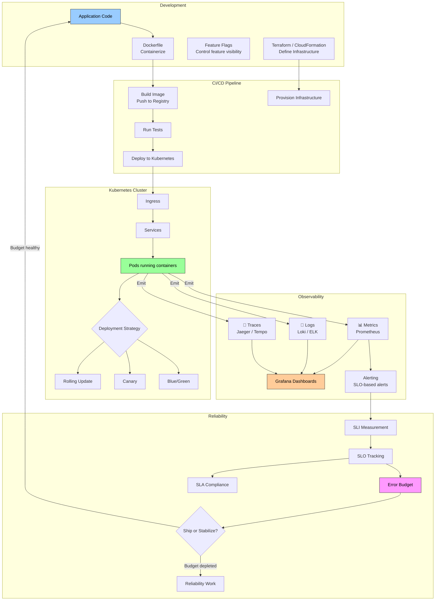

# Putting It All Together

Here's how all the concepts in this guide connect in a modern production system:

```mermaid
graph TB
    subgraph "Development"
        CODE[Application Code] --> DOCKER[Dockerfile<br/>Containerize]
        IaC[Terraform / CloudFormation<br/>Define Infrastructure]
        FF[Feature Flags<br/>Control feature visibility]
    end

    subgraph "CI/CD Pipeline"
        DOCKER --> BUILD[Build Image<br/>Push to Registry]
        BUILD --> TEST[Run Tests]
        TEST --> DEPLOY[Deploy to Kubernetes]
        IaC --> PROVISION[Provision Infrastructure]
    end

    subgraph "Kubernetes Cluster"
        DEPLOY --> ING2[Ingress]
        ING2 --> SVC[Services]
        SVC --> PODS[Pods running containers]

        PODS --> STRATEGY{Deployment Strategy}
        STRATEGY --> ROLL[Rolling Update]
        STRATEGY --> CAN[Canary]
        STRATEGY --> BGDEP[Blue/Green]
    end

    subgraph "Observability"
        PODS -->|Emit| MET[📊 Metrics<br/>Prometheus]
        PODS -->|Emit| LOGS[📝 Logs<br/>Loki / ELK]
        PODS -->|Emit| TRACES[🔗 Traces<br/>Jaeger / Tempo]

        MET --> DASH[Grafana Dashboards]
        LOGS --> DASH
        TRACES --> DASH

        MET --> ALERTING[Alerting<br/>SLO-based alerts]
    end

    subgraph "Reliability"
        ALERTING --> SLI2[SLI Measurement]
        SLI2 --> SLO2[SLO Tracking]
        SLO2 --> ERRBUD[Error Budget]
        ERRBUD --> DECISION{Ship or Stabilize?}
        DECISION -->|Budget healthy| CODE
        DECISION -->|Budget depleted| RELIABILITY[Reliability Work]
        SLO2 --> SLA2[SLA Compliance]
    end

    style CODE fill:#9cf,stroke:#333,color:#000
    style PODS fill:#9f9,stroke:#333,color:#000
    style DASH fill:#fc9,stroke:#333,color:#000
    style ERRBUD fill:#f9f,stroke:#333,color:#000
```

---

#