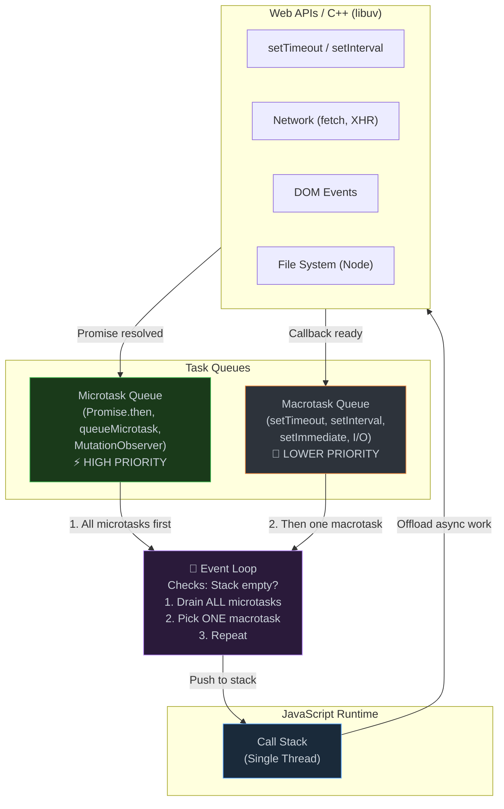
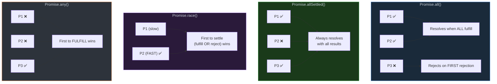

# 1. Asynchronous JavaScript & The Event Loop

## Table of Contents

- [1.1 The Event Loop Architecture](#11-the-event-loop-architecture)
- [1.2 Event Loop Priority Quiz](#12-event-loop-priority-quiz)
- [1.3 Promises Deep Dive](#13-promises-deep-dive)
- [1.4 Promise Combinators Comparison](#14-promise-combinators-comparison)
- [1.5 Async/Await Patterns](#15-asyncawait-patterns)

---


## 1.1 The Event Loop Architecture



## 1.2 Event Loop Priority Quiz

```javascript
console.log("1: Script start");                     // SYNC

setTimeout(() => console.log("2: setTimeout"), 0);   // MACROTASK

Promise.resolve()
  .then(() => console.log("3: Promise 1"))            // MICROTASK
  .then(() => console.log("4: Promise 2"));           // MICROTASK

queueMicrotask(() => console.log("5: queueMicrotask")); // MICROTASK

console.log("6: Script end");                         // SYNC

// OUTPUT ORDER:
// 1: Script start     (synchronous)
// 6: Script end       (synchronous)
// 3: Promise 1        (microtask)
// 5: queueMicrotask   (microtask)
// 4: Promise 2        (microtask — chained after Promise 1)
// 2: setTimeout       (macrotask — runs AFTER all microtasks)
```

## 1.3 Promises Deep Dive

```javascript
// === IMPLEMENTING A PROMISE FROM SCRATCH ===
class MyPromise {
  #state = "pending";   // pending | fulfilled | rejected
  #value = undefined;
  #handlers = [];

  constructor(executor) {
    const resolve = (value) => {
      if (this.#state !== "pending") return;
      
      // Handle thenable/promise resolution
      if (value && typeof value.then === "function") {
        value.then(resolve, reject);
        return;
      }
      
      this.#state = "fulfilled";
      this.#value = value;
      this.#processHandlers();
    };

    const reject = (reason) => {
      if (this.#state !== "pending") return;
      this.#state = "rejected";
      this.#value = reason;
      this.#processHandlers();
    };

    try {
      executor(resolve, reject);
    } catch (err) {
      reject(err);
    }
  }

  then(onFulfilled, onRejected) {
    return new MyPromise((resolve, reject) => {
      this.#handlers.push({
        onFulfilled: typeof onFulfilled === "function" ? onFulfilled : (v) => v,
        onRejected: typeof onRejected === "function" ? onRejected : (e) => { throw e; },
        resolve,
        reject,
      });
      this.#processHandlers();
    });
  }

  catch(onRejected) {
    return this.then(null, onRejected);
  }

  finally(callback) {
    return this.then(
      (value) => MyPromise.resolve(callback()).then(() => value),
      (reason) => MyPromise.resolve(callback()).then(() => { throw reason; })
    );
  }

  #processHandlers() {
    if (this.#state === "pending") return;

    // Microtask scheduling
    queueMicrotask(() => {
      for (const handler of this.#handlers) {
        const fn = this.#state === "fulfilled" ? handler.onFulfilled : handler.onRejected;
        try {
          const result = fn(this.#value);
          handler.resolve(result);
        } catch (err) {
          handler.reject(err);
        }
      }
      this.#handlers = [];
    });
  }

  // Static methods
  static resolve(value) { return new MyPromise(res => res(value)); }
  static reject(reason) { return new MyPromise((_, rej) => rej(reason)); }

  static all(promises) {
    return new MyPromise((resolve, reject) => {
      const results = [];
      let remaining = promises.length;
      if (remaining === 0) return resolve([]);
      
      promises.forEach((p, i) => {
        MyPromise.resolve(p).then(
          (value) => {
            results[i] = value;
            if (--remaining === 0) resolve(results);
          },
          reject
        );
      });
    });
  }

  static allSettled(promises) {
    return MyPromise.all(
      promises.map(p =>
        MyPromise.resolve(p)
          .then(value => ({ status: "fulfilled", value }))
          .catch(reason => ({ status: "rejected", reason }))
      )
    );
  }

  static race(promises) {
    return new MyPromise((resolve, reject) => {
      promises.forEach(p => MyPromise.resolve(p).then(resolve, reject));
    });
  }

  static any(promises) {
    return new MyPromise((resolve, reject) => {
      const errors = [];
      let remaining = promises.length;
      
      promises.forEach((p, i) => {
        MyPromise.resolve(p).then(resolve, (err) => {
          errors[i] = err;
          if (--remaining === 0) {
            reject(new AggregateError(errors, "All promises were rejected"));
          }
        });
      });
    });
  }
}
```

## 1.4 Promise Combinators Comparison



## 1.5 Async/Await Patterns

```javascript
// === CONCURRENT EXECUTION (not sequential!) ===
// ❌ Sequential — slow
async function fetchSequential(urls) {
  const results = [];
  for (const url of urls) {
    const res = await fetch(url); // Waits before starting next
    results.push(await res.json());
  }
  return results;
}

// ✅ Concurrent — fast
async function fetchConcurrent(urls) {
  const promises = urls.map(url => fetch(url).then(r => r.json()));
  return Promise.all(promises);
}

// ✅ Concurrent with error resilience
async function fetchResilient(urls) {
  const results = await Promise.allSettled(
    urls.map(url => fetch(url).then(r => r.json()))
  );
  
  return {
    successes: results.filter(r => r.status === "fulfilled").map(r => r.value),
    failures: results.filter(r => r.status === "rejected").map(r => r.reason),
  };
}

// === CONCURRENCY CONTROL — limit parallel requests ===
async function mapWithConcurrency(items, fn, concurrency = 5) {
  const results = [];
  const executing = new Set();
  
  for (const [index, item] of items.entries()) {
    const promise = fn(item, index).then(result => {
      executing.delete(promise);
      return result;
    });
    
    executing.add(promise);
    results.push(promise);
    
    if (executing.size >= concurrency) {
      await Promise.race(executing);
    }
  }
  
  return Promise.all(results);
}

// Usage: Fetch 100 URLs, max 5 at a time
await mapWithConcurrency(urls, url => fetch(url), 5);


// === ASYNC ITERATION ===
async function* paginate(url) {
  let nextUrl = url;
  
  while (nextUrl) {
    const response = await fetch(nextUrl);
    const data = await response.json();
    
    nextUrl = data.nextPageUrl;
    yield data.items;
  }
}

// Consuming async generator
for await (const page of paginate("/api/users?page=1")) {
  console.log(`Got ${page.length} users`);
}


// === CANCELLATION PATTERN (AbortController) ===
async function fetchWithTimeout(url, timeoutMs = 5000) {
  const controller = new AbortController();
  const timeout = setTimeout(() => controller.abort(), timeoutMs);
  
  try {
    const response = await fetch(url, { signal: controller.signal });
    return await response.json();
  } finally {
    clearTimeout(timeout);
  }
}


// === RETRY WITH EXPONENTIAL BACKOFF ===
async function retry(fn, { retries = 3, baseDelay = 1000, maxDelay = 30000 } = {}) {
  for (let attempt = 0; attempt <= retries; attempt++) {
    try {
      return await fn();
    } catch (error) {
      if (attempt === retries) throw error;
      
      const delay = Math.min(
        baseDelay * Math.pow(2, attempt) + Math.random() * 1000, // Jitter
        maxDelay
      );
      
      console.warn(`Attempt ${attempt + 1} failed, retrying in ${delay}ms...`);
      await new Promise(resolve => setTimeout(resolve, delay));
    }
  }
}
```
