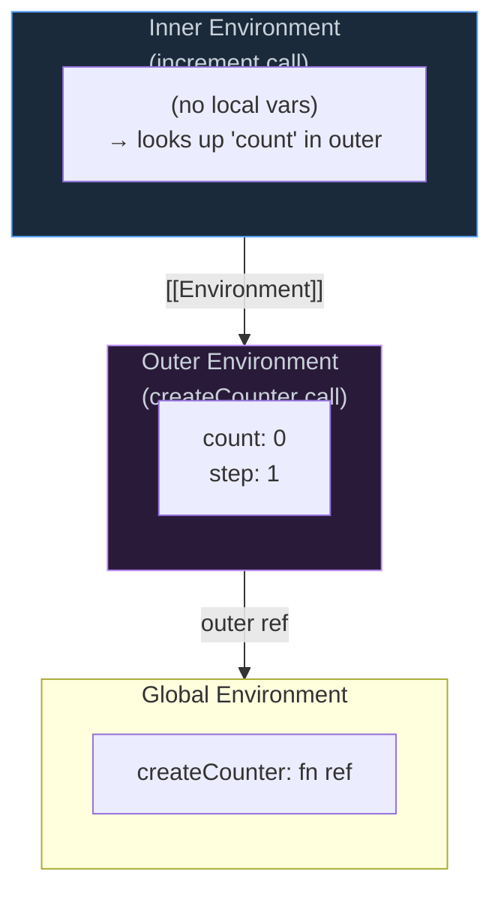

# 1. Closures & Lexical Environment

## Table of Contents

- [1.1 How Closures Work Internally](#11-how-closures-work-internally)
- [1.2 Classic Closure Pitfalls](#12-classic-closure-pitfalls)
- [1.3 Advanced Closure Patterns](#13-advanced-closure-patterns)

---


## 1.1 How Closures Work Internally



```javascript
function createCounter(step = 1) {
  let count = 0; // Closed over — survives after createCounter returns
  
  return {
    increment() { return (count += step); },
    decrement() { return (count -= step); },
    getCount()  { return count; },
    
    // Principal pattern: controlled mutation via closure
    reset() { count = 0; }
  };
}

const counter = createCounter(5);
counter.increment(); // 5
counter.increment(); // 10
counter.getCount();  // 10

// `count` is TRULY private — no way to access it directly
// This is a fundamental encapsulation pattern
```

## 1.2 Classic Closure Pitfalls

```javascript
// ❌ THE CLASSIC LOOP PROBLEM
for (var i = 0; i < 3; i++) {
  setTimeout(() => console.log(i), 100);
}
// Output: 3, 3, 3 (all reference the same `i`)

// ✅ FIX 1: Use `let` (block-scoped, new binding per iteration)
for (let i = 0; i < 3; i++) {
  setTimeout(() => console.log(i), 100);
}
// Output: 0, 1, 2

// ✅ FIX 2: IIFE (creates new scope per iteration)
for (var i = 0; i < 3; i++) {
  ((j) => {
    setTimeout(() => console.log(j), 100);
  })(i);
}

// ✅ FIX 3: bind or partial application
for (var i = 0; i < 3; i++) {
  setTimeout(console.log.bind(console, i), 100);
}
```

## 1.3 Advanced Closure Patterns

```javascript
// MEMOIZATION — essential performance pattern
function memoize(fn, resolver) {
  const cache = new Map();
  
  const memoized = function(...args) {
    const key = resolver ? resolver(...args) : args[0];
    
    if (cache.has(key)) {
      return cache.get(key);
    }
    
    const result = fn.apply(this, args);
    cache.set(key, result);
    return result;
  };
  
  memoized.cache = cache; // Expose for cache management
  memoized.clear = () => cache.clear();
  
  return memoized;
}

// PARTIAL APPLICATION via closure
function partial(fn, ...presetArgs) {
  return function(...laterArgs) {
    return fn.call(this, ...presetArgs, ...laterArgs);
  };
}

// ONCE — function that executes only once
function once(fn) {
  let called = false;
  let result;
  
  return function(...args) {
    if (!called) {
      called = true;
      result = fn.apply(this, args);
    }
    return result;
  };
}

const initialize = once(() => {
  console.log("Expensive init!");
  return { ready: true };
});

initialize(); // "Expensive init!" → { ready: true }
initialize(); // No log → { ready: true } (cached)
```
