# 1. Design Patterns

## Table of Contents

- [1.1 Patterns Map](#11-patterns-map)
- [1.2 Key Pattern Implementations](#12-key-pattern-implementations)

---


## 1.1 Patterns Map

```mermaid
flowchart TD
    DP["Design Patterns\nin JavaScript"] --> Creational
    DP --> Structural
    DP --> Behavioral
    DP --> Architectural

    Creational --> Singleton
    Creational --> Factory
    Creational --> Builder
    Creational --> ObjectPool["Object Pool"]

    Structural --> Decorator
    Structural --> Facade
    Structural --> Adapter
    Structural --> ProxyP["Proxy Pattern"]

    Behavioral --> Observer
    Behavioral --> Strategy
    Behavioral --> Iterator
    Behavioral --> Mediator
    Behavioral --> Command

    Architectural --> MVC["MVC / MVVM"]
    Architectural --> Flux["Flux / Redux"]
    Architectural --> CQRS
    Architectural --> EventSourcing["Event Sourcing"]

    style DP fill:#2a1a3a,stroke:#bc8cff,color:#c9d1d9
    style Creational fill:#1a2a3a,stroke:#58a6ff,color:#c9d1d9
    style Structural fill:#1a3a1a,stroke:#3fb950,color:#c9d1d9
    style Behavioral fill:#2d333b,stroke:#f0883e,color:#c9d1d9
    style Architectural fill:#3d1a1a,stroke:#f85149,color:#c9d1d9
```



## 1.2 Key Pattern Implementations

```javascript
// === SINGLETON (Module-based — idiomatic JS) ===
// db.js — the module IS the singleton
let instance = null;

class Database {
  #connection;
  
  constructor(connectionString) {
    if (instance) return instance;
    this.#connection = connectionString;
    instance = this;
  }
  
  query(sql) { /* ... */ }
}

export default Database;


// === FACTORY ===
class NotificationFactory {
  static #registry = new Map();
  
  static register(type, creator) {
    this.#registry.set(type, creator);
  }
  
  static create(type, message, options = {}) {
    const creator = this.#registry.get(type);
    if (!creator) {
      throw new Error(`Unknown notification type: ${type}`);
    }
    return creator(message, options);
  }
}

// Register different notification types
NotificationFactory.register("email", (msg, opts) => ({
  type: "email",
  body: msg,
  to: opts.to,
  send() { console.log(`Emailing ${this.to}: ${this.body}`); }
}));

NotificationFactory.register("sms", (msg, opts) => ({
  type: "sms",
  body: msg.slice(0, 160),
  phone: opts.phone,
  send() { console.log(`SMS to ${this.phone}: ${this.body}`); }
}));


// === OBSERVER / PUB-SUB ===
class EventBus {
  #channels = new Map();
  
  subscribe(channel, handler, { once = false, priority = 0 } = {}) {
    if (!this.#channels.has(channel)) {
      this.#channels.set(channel, []);
    }
    
    const subscription = { handler, once, priority };
    const handlers = this.#channels.get(channel);
    handlers.push(subscription);
    handlers.sort((a, b) => b.priority - a.priority);
    
    // Return unsubscribe function (cleanup pattern)
    return () => {
      const idx = handlers.indexOf(subscription);
      if (idx > -1) handlers.splice(idx, 1);
    };
  }
  
  publish(channel, data) {
    const handlers = this.#channels.get(channel) ?? [];
    const toRemove = [];
    
    for (const sub of handlers) {
      sub.handler(data);
      if (sub.once) toRemove.push(sub);
    }
    
    for (const sub of toRemove) {
      handlers.splice(handlers.indexOf(sub), 1);
    }
  }
}


// === STRATEGY PATTERN ===
class Sorter {
  #strategy;
  
  constructor(strategy) {
    this.#strategy = strategy;
  }
  
  setStrategy(strategy) {
    this.#strategy = strategy;
  }
  
  sort(data) {
    return this.#strategy(data);
  }
}

const strategies = {
  bubble: (arr) => { /* bubble sort */ },
  quick: (arr) => { /* quick sort */ },
  merge: (arr) => { /* merge sort */ },
  builtin: (arr) => [...arr].sort((a, b) => a - b),
};

const sorter = new Sorter(strategies.quick);
sorter.sort([3, 1, 4, 1, 5]);
sorter.setStrategy(strategies.merge); // Swap at runtime


// === DECORATOR PATTERN (using higher-order functions) ===
function withLogging(fn, label = fn.name) {
  return function(...args) {
    console.time(label);
    console.log(`→ ${label} called with:`, args);
    const result = fn.apply(this, args);
    console.log(`← ${label} returned:`, result);
    console.timeEnd(label);
    return result;
  };
}

function withRetry(fn, maxRetries = 3) {
  return async function(...args) {
    for (let i = 0; i <= maxRetries; i++) {
      try {
        return await fn.apply(this, args);
      } catch (err) {
        if (i === maxRetries) throw err;
        await new Promise(r => setTimeout(r, 2 ** i * 100));
      }
    }
  };
}

function withCache(fn, ttl = 60000) {
  const cache = new Map();
  
  return function(...args) {
    const key = JSON.stringify(args);
    const cached = cache.get(key);
    
    if (cached && Date.now() - cached.timestamp < ttl) {
      return cached.value;
    }
    
    const result = fn.apply(this, args);
    cache.set(key, { value: result, timestamp: Date.now() });
    return result;
  };
}

// Compose decorators
const fetchUser = pipe(
  withCache,
  withRetry,
  withLogging
)(async (id) => {
  const res = await fetch(`/api/users/${id}`);
  return res.json();
});


// === COMMAND PATTERN (with undo/redo) ===
class CommandManager {
  #history = [];
  #future = [];
  
  execute(command) {
    command.execute();
    this.#history.push(command);
    this.#future = []; // Clear redo stack
  }
  
  undo() {
    const command = this.#history.pop();
    if (command) {
      command.undo();
      this.#future.push(command);
    }
  }
  
  redo() {
    const command = this.#future.pop();
    if (command) {
      command.execute();
      this.#history.push(command);
    }
  }
}

class SetPropertyCommand {
  #target; #property; #newValue; #oldValue;
  
  constructor(target, property, value) {
    this.#target = target;
    this.#property = property;
    this.#newValue = value;
  }
  
  execute() {
    this.#oldValue = this.#target[this.#property];
    this.#target[this.#property] = this.#newValue;
  }
  
  undo() {
    this.#target[this.#property] = this.#oldValue;
  }
}
```
