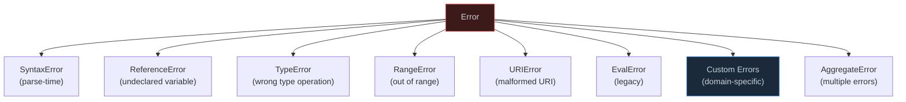

# 1. Error Handling Strategies

## 1.1 Error Taxonomy



```javascript
// === CUSTOM ERROR HIERARCHY ===
class AppError extends Error {
  constructor(message, { code, statusCode, cause, context } = {}) {
    super(message, { cause }); // ES2022 `cause` option
    this.name = this.constructor.name;
    this.code = code;
    this.statusCode = statusCode;
    this.context = context;
    this.timestamp = new Date().toISOString();
    
    // Maintain proper stack trace (V8 only)
    Error.captureStackTrace?.(this, this.constructor);
  }
  
  toJSON() {
    return {
      name: this.name,
      message: this.message,
      code: this.code,
      statusCode: this.statusCode,
      context: this.context,
      timestamp: this.timestamp,
      stack: this.stack,
    };
  }
}

class ValidationError extends AppError {
  constructor(message, errors = []) {
    super(message, { code: "VALIDATION_ERROR", statusCode: 400 });
    this.errors = errors;
  }
}

class NotFoundError extends AppError {
  constructor(resource, id) {
    super(`${resource} with id ${id} not found`, {
      code: "NOT_FOUND",
      statusCode: 404,
      context: { resource, id },
    });
  }
}

class AuthenticationError extends AppError {
  constructor(message = "Authentication required") {
    super(message, { code: "UNAUTHENTICATED", statusCode: 401 });
  }
}


// === RESULT TYPE (Rust-inspired, no exceptions) ===
class Result {
  #ok; #value;
  
  constructor(ok, value) {
    this.#ok = ok;
    this.#value = value;
  }
  
  static ok(value) { return new Result(true, value); }
  static err(error) { return new Result(false, error); }
  
  get isOk() { return this.#ok; }
  get isErr() { return !this.#ok; }
  
  map(fn) {
    return this.#ok ? Result.ok(fn(this.#value)) : this;
  }
  
  mapErr(fn) {
    return this.#ok ? this : Result.err(fn(this.#value));
  }
  
  flatMap(fn) {
    return this.#ok ? fn(this.#value) : this;
  }
  
  unwrap() {
    if (this.#ok) return this.#value;
    throw this.#value;
  }
  
  unwrapOr(defaultValue) {
    return this.#ok ? this.#value : defaultValue;
  }
  
  match({ ok, err }) {
    return this.#ok ? ok(this.#value) : err(this.#value);
  }
}

// Usage — explicit error handling without try/catch
function parseJSON(str) {
  try {
    return Result.ok(JSON.parse(str));
  } catch (e) {
    return Result.err(new ValidationError(`Invalid JSON: ${e.message}`));
  }
}

function validateUser(data) {
  if (!data.name) return Result.err(new ValidationError("Name required"));
  if (!data.email) return Result.err(new ValidationError("Email required"));
  return Result.ok(data);
}

const result = parseJSON('{"name":"Alice","email":"a@b.com"}')
  .flatMap(validateUser)
  .map(user => ({ ...user, id: crypto.randomUUID() }));

result.match({
  ok: (user) => console.log("Created user:", user),
  err: (error) => console.error("Failed:", error.message),
});
```
