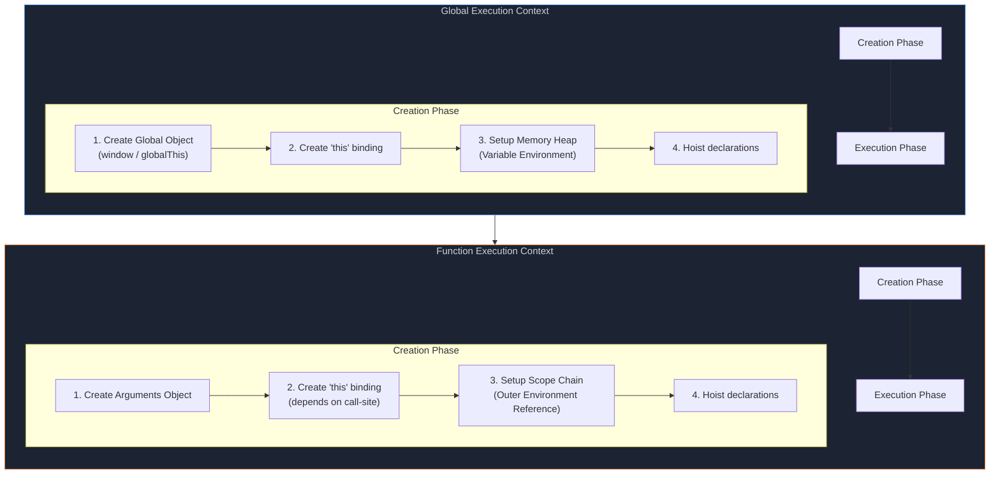
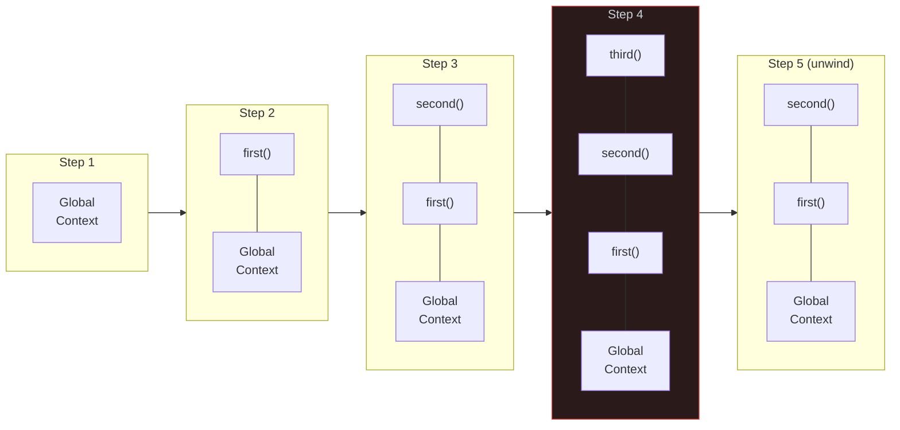
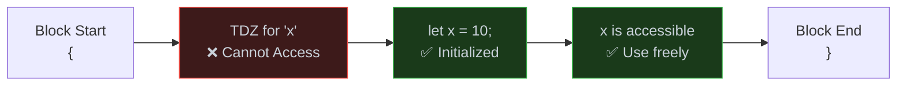

# 1. Execution Context, Scope & Hoisting

## Table of Contents

- [1.1 Execution Context Lifecycle](#11-execution-context-lifecycle)
- [1.2 The Call Stack](#12-the-call-stack)
- [1.3 Hoisting Deep Dive](#13-hoisting-deep-dive)
- [1.4 Scope Types](#14-scope-types)

---


## 1.1 Execution Context Lifecycle



## 1.2 The Call Stack

```javascript
function first() {
  console.log("first start");
  second();
  console.log("first end");
}

function second() {
  console.log("second start");
  third();
  console.log("second end");
}

function third() {
  console.log("third");
}

first();
```



## 1.3 Hoisting Deep Dive

```javascript
// What the developer writes:
console.log(a);     // undefined (not ReferenceError!)
console.log(b);     // ReferenceError: Cannot access 'b' before initialization
console.log(c);     // ReferenceError: Cannot access 'c' before initialization
console.log(fn);    // [Function: fn]
console.log(expr);  // undefined

var a = 1;
let b = 2;
const c = 3;
function fn() {}
var expr = function() {};

// How the engine sees it (conceptually):
// CREATION PHASE:
// var a        → allocated, initialized to undefined
// let b        → allocated, NOT initialized (TDZ)
// const c      → allocated, NOT initialized (TDZ)
// function fn  → allocated, initialized with function body
// var expr     → allocated, initialized to undefined
```

### Temporal Dead Zone (TDZ)



## 1.4 Scope Types

```javascript
// 1. GLOBAL SCOPE
var globalVar = "I'm global";

// 2. FUNCTION SCOPE
function outer() {
  var functionScoped = "I'm function-scoped";
  
  // 3. BLOCK SCOPE (let, const only)
  if (true) {
    let blockScoped = "I'm block-scoped";
    const alsoBlock = "Me too";
    var notBlockScoped = "I escape to function scope!";
  }
  
  console.log(notBlockScoped); // ✅ "I escape to function scope!"
  // console.log(blockScoped); // ❌ ReferenceError
  
  // 4. LEXICAL (STATIC) SCOPE — determined at write-time, not call-time
  function inner() {
    console.log(functionScoped); // ✅ Accesses parent scope
  }
}

// 5. MODULE SCOPE
// Each module has its own top-level scope
// export/import determines what crosses boundaries
```
