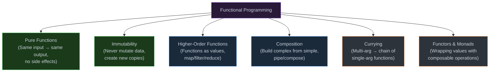

# 1. Functional Programming in JS

## Table of Contents

- [1.1 Core Principles](#11-core-principles)
- [1.2 Implementation](#12-implementation)

---


## 1.1 Core Principles



## 1.2 Implementation

```javascript
// === COMPOSITION ===
const pipe = (...fns) => (x) => fns.reduce((v, fn) => fn(v), x);
const compose = (...fns) => (x) => fns.reduceRight((v, fn) => fn(v), x);

// Example pipeline
const processUser = pipe(
  (user) => ({ ...user, name: user.name.trim() }),
  (user) => ({ ...user, email: user.email.toLowerCase() }),
  (user) => ({ ...user, slug: user.name.replace(/\s+/g, "-").toLowerCase() }),
  (user) => ({ ...user, createdAt: new Date().toISOString() })
);

const user = processUser({ name: "  John Doe  ", email: "JOHN@TEST.COM" });
// { name: "John Doe", email: "john@test.com", slug: "john-doe", createdAt: "..." }


// === CURRYING ===
function curry(fn) {
  return function curried(...args) {
    if (args.length >= fn.length) {
      return fn.apply(this, args);
    }
    return function(...moreArgs) {
      return curried.apply(this, [...args, ...moreArgs]);
    };
  };
}

const add = curry((a, b, c) => a + b + c);
add(1)(2)(3);     // 6
add(1, 2)(3);     // 6
add(1)(2, 3);     // 6
add(1, 2, 3);     // 6

// Practical curried utilities
const map = curry((fn, arr) => arr.map(fn));
const filter = curry((fn, arr) => arr.filter(fn));
const prop = curry((key, obj) => obj[key]);

const getNames = map(prop("name"));
const getActiveNames = pipe(
  filter(prop("active")),
  getNames
);

getActiveNames([
  { name: "Alice", active: true },
  { name: "Bob", active: false },
  { name: "Charlie", active: true },
]);
// ["Alice", "Charlie"]


// === IMMUTABLE UPDATES (without libraries) ===
const updateNested = (obj, path, updater) => {
  const keys = path.split(".");
  
  const recurse = (current, index) => {
    if (index === keys.length) return updater(current);
    
    const key = keys[index];
    return {
      ...current,
      [key]: recurse(current[key], index + 1),
    };
  };
  
  return recurse(obj, 0);
};

const state = { user: { profile: { name: "Alice", age: 30 } } };
const newState = updateNested(state, "user.profile.age", age => age + 1);
// state.user.profile.age === 30 (unchanged)
// newState.user.profile.age === 31


// === MONADIC PATTERNS ===
// Maybe monad — safe null/undefined handling
class Maybe {
  #value;
  
  constructor(value) {
    this.#value = value;
  }
  
  static of(value) { return new Maybe(value); }
  static empty() { return new Maybe(null); }
  
  get isNothing() {
    return this.#value === null || this.#value === undefined;
  }
  
  map(fn) {
    return this.isNothing ? this : Maybe.of(fn(this.#value));
  }
  
  flatMap(fn) {
    return this.isNothing ? this : fn(this.#value);
  }
  
  getOrElse(defaultValue) {
    return this.isNothing ? defaultValue : this.#value;
  }
  
  filter(predicate) {
    return this.isNothing ? this : predicate(this.#value) ? this : Maybe.empty();
  }
}

// Safe nested property access
const getUserCity = (user) =>
  Maybe.of(user)
    .map(u => u.address)
    .map(a => a.city)
    .map(c => c.toUpperCase())
    .getOrElse("UNKNOWN");

getUserCity({ address: { city: "Paris" } }); // "PARIS"
getUserCity({ address: {} });                 // "UNKNOWN"
getUserCity(null);                            // "UNKNOWN"


// === TRANSDUCERS (advanced composition of transformations) ===
// Eliminate intermediate arrays in map/filter chains

const mapT = (fn) => (reducer) => (acc, val) => reducer(acc, fn(val));
const filterT = (pred) => (reducer) => (acc, val) => pred(val) ? reducer(acc, val) : acc;

const xform = compose(
  filterT(x => x % 2 === 0),
  mapT(x => x * 10)
);

const result = [1, 2, 3, 4, 5].reduce(xform((acc, val) => [...acc, val]), []);
// [20, 40] — no intermediate arrays created!
```
