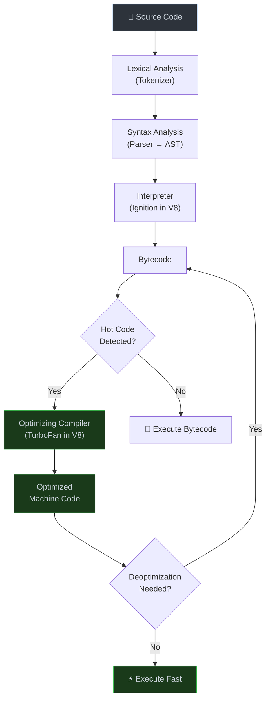
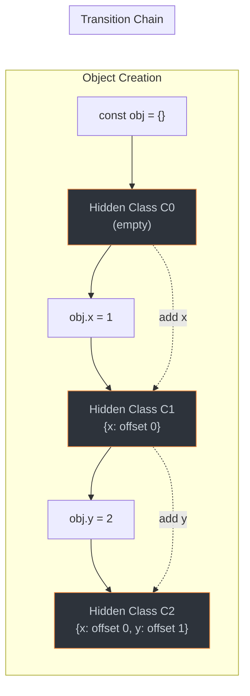

# 1. JavaScript Engine & Runtime Internals

## 1.1 How a JS Engine Works



### Key Engines
| Engine | Browser/Runtime | Compiler |
|--------|----------------|----------|
| **V8** | Chrome, Node.js, Deno, Bun | TurboFan |
| **SpiderMonkey** | Firefox | WarpMonkey |
| **JavaScriptCore** | Safari, Bun | FTL JIT |
| **Chakra** | Legacy Edge | SimpleJIT |

### 1.2 JIT Compilation: Why It Matters at Principal Level

```javascript
// V8 optimizes monomorphic call sites (same shape)
// ✅ MONOMORPHIC — fast, single hidden class
function getX(obj) {
  return obj.x;
}

const a = { x: 1, y: 2 };
const b = { x: 3, y: 4 };
getX(a); // V8 creates an inline cache for shape {x, y}
getX(b); // Same shape — cache hit, optimized

// ❌ MEGAMORPHIC — slow, multiple hidden classes
const c = { x: 5, z: 6 };       // Different shape!
const d = { x: 7, w: 8, v: 9 }; // Yet another shape!
getX(c); // Cache miss — deoptimize
getX(d); // Megamorphic state — V8 gives up optimizing
```

**Principal-Level Insight:** Understanding hidden classes and inline caches is critical when designing high-performance libraries or frameworks. Object shape consistency directly impacts JIT optimization.

### 1.3 Hidden Classes (Maps in V8)



```javascript
// ✅ Always initialize properties in the same order
class Point {
  constructor(x, y) {
    this.x = x; // Always x first
    this.y = y; // Always y second
  }
}

// ❌ Don't add properties conditionally
class BadPoint {
  constructor(x, y, hasZ) {
    this.x = x;
    if (hasZ) this.z = 0; // Creates different hidden class!
    this.y = y;
  }
}
```
