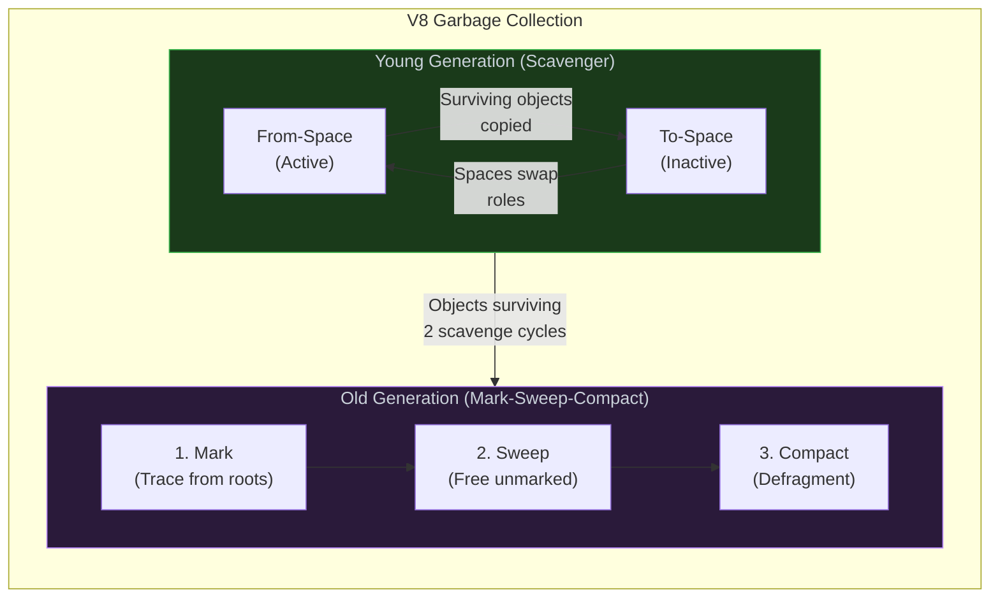

# 1. Memory Management & Garbage Collection

## Table of Contents

- [1.1 Garbage Collection Strategies](#11-garbage-collection-strategies)
- [1.2 Common Memory Leaks](#12-common-memory-leaks)

---


## 1.1 Garbage Collection Strategies



## 1.2 Common Memory Leaks

```javascript
// ❌ LEAK 1: Forgotten global references
function processData() {
  // Missing `const/let` — creates global variable!
  leakedData = new Array(1_000_000).fill("🔥");
}

// ❌ LEAK 2: Closures retaining large data
function createHandler() {
  const hugeData = new Array(1_000_000).fill("x");
  
  return function handler() {
    // Even if `hugeData` is never used here,
    // some engines may retain it because it's in the closure scope
    console.log("handling");
  };
}

// ✅ FIX: Nullify references explicitly
function createHandlerFixed() {
  let hugeData = new Array(1_000_000).fill("x");
  const summary = hugeData.length; // Extract what you need
  hugeData = null; // Allow GC to collect
  
  return function handler() {
    console.log(`Handling ${summary} items`);
  };
}

// ❌ LEAK 3: Event listeners not cleaned up
class Component {
  constructor() {
    this.handleResize = this.handleResize.bind(this);
    window.addEventListener("resize", this.handleResize);
  }
  
  handleResize() { /* ... */ }
  
  // ✅ Always provide cleanup
  destroy() {
    window.removeEventListener("resize", this.handleResize);
  }
}

// ❌ LEAK 4: Detached DOM nodes
const elements = [];
function addElement() {
  const el = document.createElement("div");
  document.body.appendChild(el);
  elements.push(el); // Array keeps reference even after removeChild!
}

// ✅ LEAK 5 FIX: Use WeakRef / WeakMap / WeakSet
const cache = new WeakMap(); // Keys are weakly held

function getCachedResult(obj) {
  if (cache.has(obj)) return cache.get(obj);
  const result = expensiveComputation(obj);
  cache.set(obj, result); // If `obj` is GC'd, entry is auto-removed
  return result;
}

// ✅ MODERN: WeakRef and FinalizationRegistry
const registry = new FinalizationRegistry((heldValue) => {
  console.log(`Object with id ${heldValue} was garbage collected`);
});

function trackObject(obj, id) {
  const ref = new WeakRef(obj);
  registry.register(obj, id);
  
  return () => {
    const derefed = ref.deref();
    if (derefed) {
      return derefed; // Object still alive
    }
    return null; // Object was GC'd
  };
}
```
