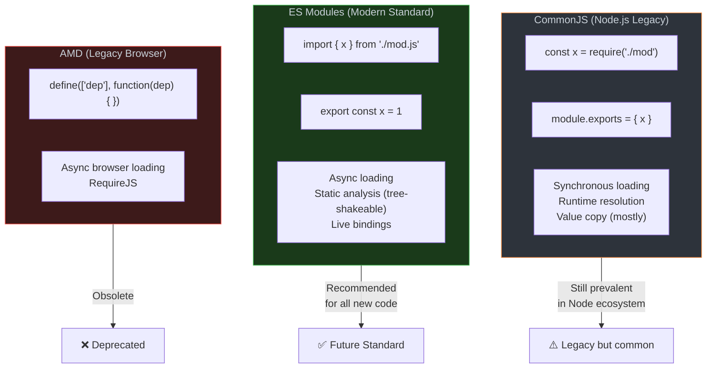

# 1. Module Systems



```javascript
// === ESM KEY FEATURES ===

// Named exports (can have many)
export const API_URL = "https://api.example.com";
export function fetchData() { /* ... */ }
export class ApiClient { /* ... */ }

// Default export (one per module)
export default class App { /* ... */ }

// Re-exporting (barrel files)
export { fetchData, ApiClient } from "./api.js";
export * from "./utils.js";
export { default as App } from "./App.js";

// Dynamic import (code splitting)
async function loadChart() {
  const { Chart } = await import("./chart.js");
  return new Chart();
}

// Import assertions (newer)
import data from "./config.json" with { type: "json" };

// === LIVE BINDINGS DEMONSTRATION ===
// counter.js
export let count = 0;
export function increment() { count++; }

// main.js
import { count, increment } from "./counter.js";
console.log(count);  // 0
increment();
console.log(count);  // 1 ← LIVE binding! CJS would still show 0

// === CIRCULAR DEPENDENCY HANDLING ===
// ESM handles circular deps with live bindings (partially evaluated)
// CJS gives you whatever was exported at the time of the cycle
```
