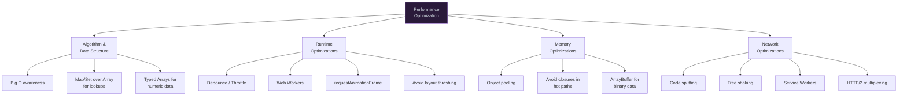

# 1. Performance Optimization

## 1.1 Performance Strategies



```javascript
// === DEBOUNCE & THROTTLE ===
function debounce(fn, delay, { leading = false, trailing = true, maxWait } = {}) {
  let timerId = null;
  let lastCallTime = 0;
  let lastArgs;
  
  function invoke() {
    const args = lastArgs;
    lastArgs = null;
    lastCallTime = Date.now();
    fn(...args);
  }
  
  const debounced = function(...args) {
    lastArgs = args;
    const now = Date.now();
    const timeSinceLastCall = now - lastCallTime;
    
    if (leading && !timerId) {
      invoke();
    }
    
    clearTimeout(timerId);
    
    if (maxWait && timeSinceLastCall >= maxWait) {
      invoke();
    } else {
      timerId = setTimeout(() => {
        if (trailing) invoke();
        timerId = null;
      }, delay);
    }
  };
  
  debounced.cancel = () => {
    clearTimeout(timerId);
    timerId = null;
    lastArgs = null;
  };
  
  debounced.flush = () => {
    if (timerId) {
      invoke();
      debounced.cancel();
    }
  };
  
  return debounced;
}

function throttle(fn, interval) {
  let lastTime = 0;
  let timerId = null;
  
  return function(...args) {
    const now = Date.now();
    const remaining = interval - (now - lastTime);
    
    if (remaining <= 0) {
      clearTimeout(timerId);
      timerId = null;
      lastTime = now;
      fn.apply(this, args);
    } else if (!timerId) {
      timerId = setTimeout(() => {
        lastTime = Date.now();
        timerId = null;
        fn.apply(this, args);
      }, remaining);
    }
  };
}


// === WEB WORKERS — offload CPU-intensive work ===
// main.js
function runInWorker(fn, data) {
  return new Promise((resolve, reject) => {
    const blob = new Blob([
      `self.onmessage = function(e) { 
        const result = (${fn.toString()})(e.data); 
        self.postMessage(result); 
      }`
    ], { type: "application/javascript" });
    
    const worker = new Worker(URL.createObjectURL(blob));
    worker.onmessage = (e) => { resolve(e.data); worker.terminate(); };
    worker.onerror = (e) => { reject(e); worker.terminate(); };
    worker.postMessage(data);
  });
}

// Usage
const sorted = await runInWorker(
  (data) => data.sort((a, b) => a - b),
  [5, 3, 1, 4, 2]
);


// === OBJECT POOL — reduce GC pressure ===
class ObjectPool {
  #create;
  #reset;
  #pool = [];
  #maxSize;
  
  constructor({ create, reset, maxSize = 100 }) {
    this.#create = create;
    this.#reset = reset;
    this.#maxSize = maxSize;
  }
  
  acquire() {
    return this.#pool.length > 0
      ? this.#pool.pop()
      : this.#create();
  }
  
  release(obj) {
    if (this.#pool.length < this.#maxSize) {
      this.#reset(obj);
      this.#pool.push(obj);
    }
  }
}

// Particle system example
const particlePool = new ObjectPool({
  create: () => ({ x: 0, y: 0, vx: 0, vy: 0, life: 0 }),
  reset: (p) => { p.x = 0; p.y = 0; p.vx = 0; p.vy = 0; p.life = 0; },
  maxSize: 10000,
});


// === STRUCTUREDCLONE vs JSON for deep copy ===
const obj = { date: new Date(), regex: /test/g, map: new Map([[1, 2]]) };

// ❌ JSON — loses Date, RegExp, Map, Set, etc.
const jsonCopy = JSON.parse(JSON.stringify(obj));
// { date: "2024-01-01T...", regex: {} } — broken!

// ✅ structuredClone — handles most types
const properCopy = structuredClone(obj);
// { date: Date, regex: RegExp, map: Map } — correct!
// Note: Cannot clone functions, DOM nodes, or Proxies
```
