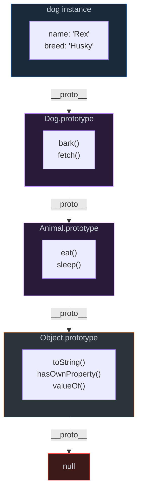
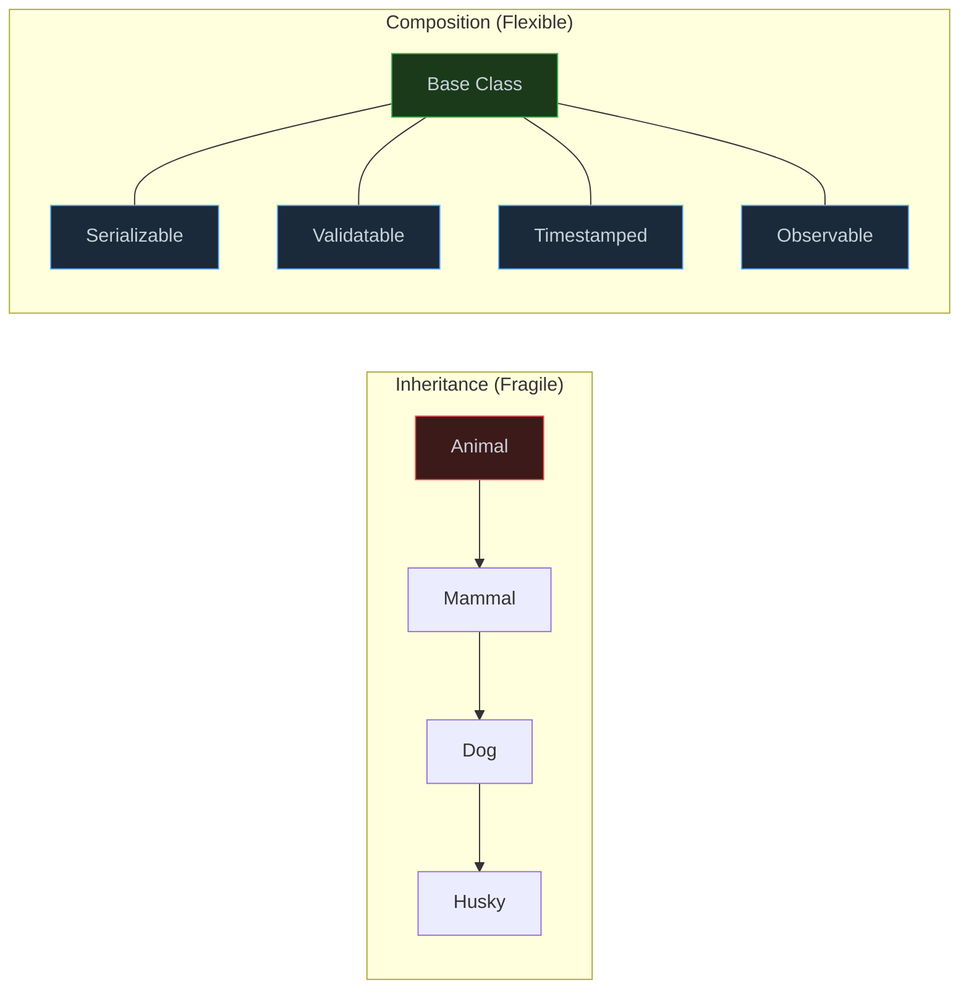

# 1. Prototypal Inheritance & OOP

## Table of Contents

- [1.1 The Prototype Chain](#11-the-prototype-chain)
- [1.2 ES6 Classes (Syntactic Sugar)](#12-es6-classes-syntactic-sugar)
- [1.3 Composition over Inheritance](#13-composition-over-inheritance)

---


## 1.1 The Prototype Chain



## 1.2 ES6 Classes (Syntactic Sugar)

```javascript
class EventEmitter {
  #listeners = new Map(); // Private field (truly private)
  #maxListeners = 10;     // Private field
  
  // Static private
  static #instances = 0;
  
  constructor() {
    EventEmitter.#instances++;
  }
  
  // Public methods
  on(event, callback) {
    if (!this.#listeners.has(event)) {
      this.#listeners.set(event, []);
    }
    
    const handlers = this.#listeners.get(event);
    
    if (handlers.length >= this.#maxListeners) {
      console.warn(`MaxListenersExceeded for "${event}"`);
    }
    
    handlers.push(callback);
    return this; // Enable chaining
  }
  
  emit(event, ...args) {
    const handlers = this.#listeners.get(event) ?? [];
    handlers.forEach(handler => handler.apply(this, args));
    return handlers.length > 0;
  }
  
  off(event, callback) {
    const handlers = this.#listeners.get(event);
    if (handlers) {
      const index = handlers.indexOf(callback);
      if (index > -1) handlers.splice(index, 1);
    }
    return this;
  }
  
  once(event, callback) {
    const wrapper = (...args) => {
      callback.apply(this, args);
      this.off(event, wrapper);
    };
    wrapper.original = callback;
    return this.on(event, wrapper);
  }
  
  // Getter
  get listenerCount() {
    let count = 0;
    for (const handlers of this.#listeners.values()) {
      count += handlers.length;
    }
    return count;
  }
  
  // Setter
  set maxListeners(n) {
    if (typeof n !== "number" || n < 0) {
      throw new RangeError("maxListeners must be a non-negative number");
    }
    this.#maxListeners = n;
  }
  
  // Static method
  static getInstanceCount() {
    return EventEmitter.#instances;
  }
}

// INHERITANCE
class TypedEmitter extends EventEmitter {
  #eventTypes;
  
  constructor(eventTypes) {
    super(); // Must call before using `this`
    this.#eventTypes = new Set(eventTypes);
  }
  
  on(event, callback) {
    if (!this.#eventTypes.has(event)) {
      throw new TypeError(`Unknown event type: "${event}"`);
    }
    return super.on(event, callback);
  }
}
```

## 1.3 Composition over Inheritance

```javascript
// Principal-level pattern: Prefer composition (mixins) over deep hierarchies

// MIXIN FUNCTIONS
const Serializable = (Base) => class extends Base {
  serialize() {
    return JSON.stringify(this);
  }
  
  static deserialize(json) {
    return Object.assign(new this(), JSON.parse(json));
  }
};

const Validatable = (Base) => class extends Base {
  #rules = new Map();
  
  addRule(field, validator) {
    this.#rules.set(field, validator);
    return this;
  }
  
  validate() {
    const errors = [];
    for (const [field, validator] of this.#rules) {
      if (!validator(this[field])) {
        errors.push(`Validation failed for: ${field}`);
      }
    }
    return { valid: errors.length === 0, errors };
  }
};

const Timestamped = (Base) => class extends Base {
  createdAt = new Date();
  updatedAt = new Date();
  
  touch() {
    this.updatedAt = new Date();
  }
};

// COMPOSITION — flat hierarchy, maximum reuse
class User extends Timestamped(Validatable(Serializable(class {}))) {
  constructor(name, email) {
    super();
    this.name = name;
    this.email = email;
    
    this.addRule("name", v => v?.length >= 2);
    this.addRule("email", v => v?.includes("@"));
  }
}
```


