# 1. System Design Considerations with JS

## Table of Contents

- [1.1 Architecture Patterns](#11-architecture-patterns)
- [1.2 State Management Architecture](#12-state-management-architecture)
- [1.3 Principal-Level Considerations Checklist](#13-principal-level-considerations-checklist)
- [🏗️ Architecture](#architecture)
- [⚡ Performance](#performance)
- [🔒 Reliability](#reliability)
- [🔐 Security](#security)
- [📊 Observability](#observability)
- [👥 Team](#team)

---


## 1.1 Architecture Patterns

```mermaid
flowchart LR
    subgraph Frontend["Frontend Architecture"]
        SPA["SPA\n(React, Vue, Angular)"]
        SSR["SSR / SSG\n(Next.js, Nuxt)"]
        Islands["Islands Architecture\n(Astro)"]
        MFE["Micro-Frontends\n(Module Federation)"]
    end

    subgraph Backend["Backend Architecture"]
        Monolith["Monolith\n(Express, Fastify)"]
        Micro["Microservices\n(Node + Docker)"]
        Serverless["Serverless\n(Lambda, Edge)"]
        BFF["BFF Pattern\n(Backend for Frontend)"]
    end

    subgraph DataLayer["Data Layer"]
        REST["REST API"]
        GQL["GraphQL"]
        TRPC["tRPC\n(Full-stack TypeScript)"]
        WS["WebSockets\n(Real-time)"]
    end

    Frontend --> DataLayer --> Backend

    style Frontend fill:#1a2a3a,stroke:#58a6ff,color:#c9d1d9
    style Backend fill:#1a3a1a,stroke:#3fb950,color:#c9d1d9
    style DataLayer fill:#2a1a3a,stroke:#bc8cff,color:#c9d1d9
```



## 1.2 State Management Architecture

```javascript
// === MINIMAL REDUX-LIKE STORE ===
function createStore(reducer, initialState, enhancer) {
  if (enhancer) return enhancer(createStore)(reducer, initialState);
  
  let state = initialState;
  let listeners = [];
  
  return {
    getState: () => state,
    
    dispatch(action) {
      state = reducer(state, action);
      listeners.forEach(listener => listener(state));
      return action;
    },
    
    subscribe(listener) {
      listeners.push(listener);
      return () => {
        listeners = listeners.filter(l => l !== listener);
      };
    },
  };
}

// Middleware
function applyMiddleware(...middlewares) {
  return (createStore) => (reducer, initialState) => {
    const store = createStore(reducer, initialState);
    
    const middlewareAPI = {
      getState: store.getState,
      dispatch: (action) => dispatch(action),
    };
    
    const chain = middlewares.map(mw => mw(middlewareAPI));
    const dispatch = chain.reduceRight(
      (next, mw) => mw(next),
      store.dispatch
    );
    
    return { ...store, dispatch };
  };
}

// Logger middleware
const logger = (store) => (next) => (action) => {
  console.log("Dispatching:", action.type);
  const result = next(action);
  console.log("New state:", store.getState());
  return result;
};

// Thunk middleware (async actions)
const thunk = (store) => (next) => (action) => {
  if (typeof action === "function") {
    return action(store.dispatch, store.getState);
  }
  return next(action);
};
```

## 1.3 Principal-Level Considerations Checklist

# ✅ Principal Engineer Checklist

---

## 🏗️ Architecture
- [ ] Can you justify monolith vs microservices for this use case?
- [ ] Have you considered the build/deploy pipeline impact?
- [ ] Is the module boundary well-defined? *(API contracts)*
- [ ] What's the migration path? *(Strangler fig pattern)*

---

## ⚡ Performance
- [ ] What are the Core Web Vitals targets?
- [ ] Bundle size budget? Code splitting strategy?
- [ ] SSR vs CSR vs ISR trade-offs for this use case?
- [ ] Are you monitoring Runtime Performance *(P95, P99)*?

---

## 🔒 Reliability
- [ ] Error boundaries and graceful degradation?
- [ ] Circuit breaker pattern for external dependencies?
- [ ] Retry strategies with backoff and jitter?
- [ ] Chaos engineering — what breaks under failure?

---

## 🔐 Security
- [ ] CSP headers configured?
- [ ] Dependency audit *(npm audit, Snyk)*?
- [ ] Input validation at boundaries?
- [ ] Supply chain attack mitigation *(lockfiles, SRI)*?

---

## 📊 Observability
- [ ] Structured logging *(correlation IDs)*?
- [ ] Distributed tracing *(OpenTelemetry)*?
- [ ] Metrics dashboards *(RED method)*?
- [ ] Alerting thresholds and runbooks?

---

## 👥 Team
- [ ] Is the architecture understandable by mid-level engineers?
- [ ] Are there clear contribution guidelines?
- [ ] Code review standards and automated quality gates?
- [ ] Documentation — ADRs for key decisions?

---

> **Tip:** Copy this into a GitHub Issue or PR template to get interactive checkboxes.

---

# 🎯 Quick Reference: Interview Topic Heat Map

```
TOPIC                          LIKELIHOOD    DEPTH EXPECTED
─────────────────────────────────────────────────────────────
Event Loop & Async             ██████████    Deep internals
Closures & Scope               █████████░    With edge cases
Prototypes & Inheritance       ████████░░    Classes + proto chain
this Binding                   ████████░░    All 4 rules
Promises (implement)           ████████░░    From scratch
Design Patterns                ████████░░    When & why
Performance Optimization       █████████░    Practical strategies
Memory Mgmt / Leaks            ███████░░░    Identification + fix
Type Coercion                  ██████░░░░    == algorithm
Error Handling                 ███████░░░    Strategy & patterns
Module Systems                 ██████░░░░    ESM vs CJS
Security                       ███████░░░    XSS, CSRF, CSP
Testing Strategy               ████████░░    Philosophy + patterns
System Design                  ██████████    Architecture decisions
Code Review / Mentoring        █████████░    Soft skills + examples
Functional Programming         ███████░░░    Composition, currying
Metaprogramming                █████░░░░░    Proxy use cases
```

---

> **Final Advice for the Principal Interview:** At this level, interviewers care less about *whether you know the syntax* and more about **why you choose one approach over another**, **what trade-offs exist**, and **how you'd teach/mentor others** on these topics. Always frame answers in terms of **impact on the team, codebase maintainability, and system reliability**.
