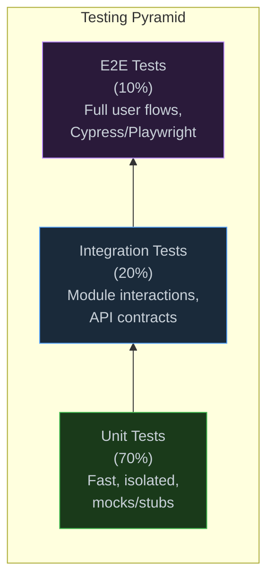

# 1. Testing Philosophies



```javascript
// === TESTING PATTERNS ===

// 1. ARRANGE-ACT-ASSERT
describe("UserService", () => {
  it("should create a user with hashed password", async () => {
    // Arrange
    const mockRepo = { save: vi.fn().mockResolvedValue({ id: 1 }) };
    const service = new UserService(mockRepo);
    
    // Act
    const user = await service.create({ name: "Alice", password: "secret" });
    
    // Assert
    expect(user.id).toBe(1);
    expect(mockRepo.save).toHaveBeenCalledTimes(1);
    expect(mockRepo.save.mock.calls[0][0].password).not.toBe("secret"); // Hashed
  });
});


// 2. PROPERTY-BASED TESTING (fuzz-like)
// Using fast-check
import * as fc from "fast-check";

describe("sort", () => {
  it("should be idempotent", () => {
    fc.assert(
      fc.property(fc.array(fc.integer()), (arr) => {
        const sorted = arr.sort((a, b) => a - b);
        const sortedAgain = [...sorted].sort((a, b) => a - b);
        expect(sorted).toEqual(sortedAgain);
      })
    );
  });
  
  it("should preserve length", () => {
    fc.assert(
      fc.property(fc.array(fc.integer()), (arr) => {
        expect(arr.sort().length).toBe(arr.length);
      })
    );
  });
});


// 3. DEPENDENCY INJECTION for testability
class OrderService {
  // Inject dependencies — easy to mock in tests
  constructor(
    orderRepo,       // Data access
    paymentGateway,  // External service
    emailService,    // Side effect
    logger           // Cross-cutting concern
  ) {
    this.orderRepo = orderRepo;
    this.paymentGateway = paymentGateway;
    this.emailService = emailService;
    this.logger = logger;
  }
  
  async placeOrder(userId, items) {
    const order = await this.orderRepo.create(userId, items);
    const payment = await this.paymentGateway.charge(order.total);
    await this.emailService.sendConfirmation(userId, order);
    this.logger.info("Order placed", { orderId: order.id });
    return order;
  }
}
```
