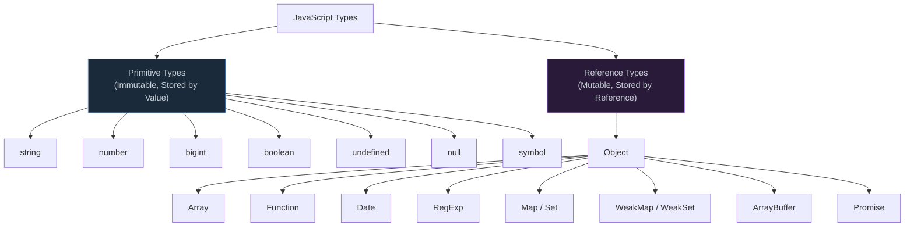

# 1. The Type System

## Table of Contents

- [1.1 Types Overview](#11-types-overview)
- [1.2 Type Coercion — The Principal Must Master This](#12-type-coercion-the-principal-must-master-this)
- [1.4 Custom Type Coercion](#14-custom-type-coercion)

---


## 1.1 Types Overview



## 1.2 Type Coercion — The Principal Must Master This

```javascript
// === ABSTRACT EQUALITY (==) ALGORITHM ===
// The source of most confusion

// Rule 1: null == undefined → true (and NOTHING else)
null == undefined;  // true
null == 0;          // false
null == "";         // false
null == false;      // false

// Rule 2: Number vs String → String converts to Number
1 == "1";           // true  ("1" → 1)
0 == "";            // true  ("" → 0)

// Rule 3: Boolean vs Anything → Boolean converts to Number first
true == 1;          // true  (true → 1)
true == "1";        // true  (true → 1, then "1" → 1)
false == 0;         // true  (false → 0)
false == "";        // true  (false → 0, "" → 0)

// Rule 4: Object vs Primitive → Object calls ToPrimitive
//   ToPrimitive tries: [Symbol.toPrimitive]() → valueOf() → toString()
[] == false;        // true  ([] → "" → 0, false → 0)
[""] == false;      // true
[0] == false;       // true
[[]] == false;      // true

// === THE INFAMOUS GOTCHAS ===
[] == ![];          // true  🤯
// Breakdown: ![] → false, then [] == false → "" == 0 → 0 == 0 → true

NaN === NaN;        // false (use Number.isNaN() or Object.is())
-0 === +0;          // true  (use Object.is(-0, +0) → false)

typeof null;        // "object" — historical bug, will never be fixed
typeof function(){}; // "function" — not in the spec as a type!
typeof [];          // "object"
typeof NaN;         // "number" 🤯
```

### 1.3 `Object.is()` vs `===` vs `==`

```javascript
// Object.is() is the most precise equality
Object.is(NaN, NaN);   // true   (=== gives false)
Object.is(-0, +0);     // false  (=== gives true)
Object.is(1, 1);       // true   (same as ===)

// Principal-level: Object.is uses the SameValue algorithm
// === uses the Strict Equality algorithm
// == uses the Abstract Equality algorithm
```

## 1.4 Custom Type Coercion

```javascript
const money = {
  amount: 42,
  currency: "USD",
  
  // Modern approach: Symbol.toPrimitive
  [Symbol.toPrimitive](hint) {
    switch (hint) {
      case "number":  return this.amount;
      case "string":  return `${this.amount} ${this.currency}`;
      case "default": return this.amount; // used by == and +
    }
  }
};

console.log(+money);          // 42
console.log(`${money}`);      // "42 USD"
console.log(money + 8);       // 50
console.log(money == 42);     // true
```
