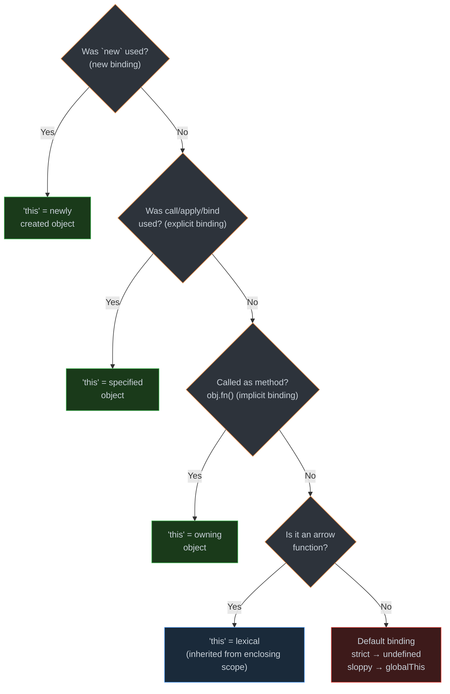

# 1. The `this` Keyword & Binding Rules

## Table of Contents

- [1.1 The Four Binding Rules (in order of precedence)](#11-the-four-binding-rules-in-order-of-precedence)
- [1.2 Implementing `bind` — Interview Classic](#12-implementing-bind-interview-classic)

---


## 1.1 The Four Binding Rules (in order of precedence)



```javascript
// 1. NEW BINDING (highest precedence)
function Person(name) {
  this.name = name;
}
const p = new Person("Alice"); // this = new object → { name: "Alice" }

// 2. EXPLICIT BINDING
function greet() { return `Hello, ${this.name}`; }
const obj = { name: "Bob" };

greet.call(obj);            // "Hello, Bob"
greet.apply(obj);           // "Hello, Bob"
const bound = greet.bind(obj);
bound();                    // "Hello, Bob"

// 3. IMPLICIT BINDING
const user = {
  name: "Charlie",
  greet() { return `Hello, ${this.name}`; }
};
user.greet();               // "Hello, Charlie"

// ❌ IMPLICIT BINDING LOSS
const fn = user.greet;     // Extracted from context!
fn();                       // "Hello, undefined" (default binding)

// 4. ARROW FUNCTIONS — lexical `this`
const team = {
  name: "Engineering",
  members: ["A", "B", "C"],
  
  // ✅ Arrow function inherits `this` from `list()` method context
  list() {
    return this.members.map(m => `${m} from ${this.name}`);
  },
  
  // ❌ Arrow function as method — `this` is outer/global scope!
  broken: () => {
    return this.name; // `this` is NOT `team`!
  }
};
```

## 1.2 Implementing `bind` — Interview Classic

```javascript
Function.prototype.myBind = function(context, ...preArgs) {
  if (typeof this !== "function") {
    throw new TypeError("Bind must be called on a function");
  }
  
  const originalFn = this;
  
  const bound = function(...callArgs) {
    // If called with `new`, `this` should be the new instance
    const isNewCall = this instanceof bound;
    return originalFn.apply(
      isNewCall ? this : context,
      [...preArgs, ...callArgs]
    );
  };
  
  // Maintain prototype chain for `new` usage
  bound.prototype = Object.create(originalFn.prototype);
  return bound;
};
```
