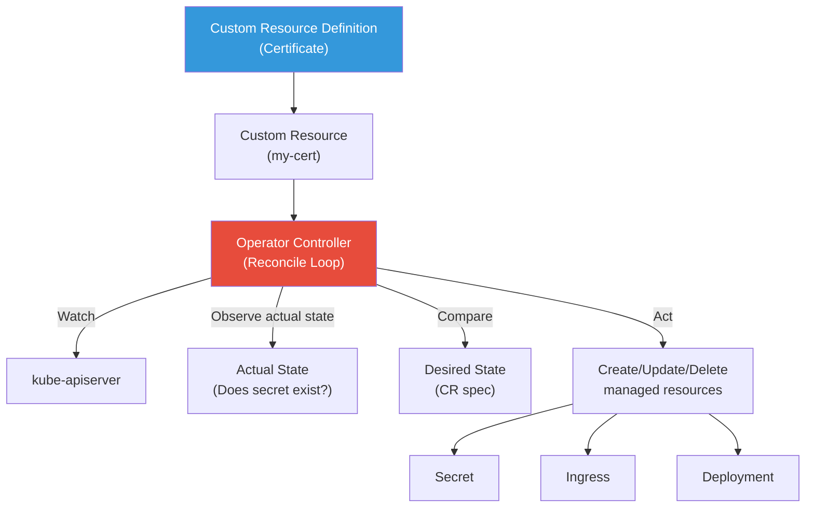
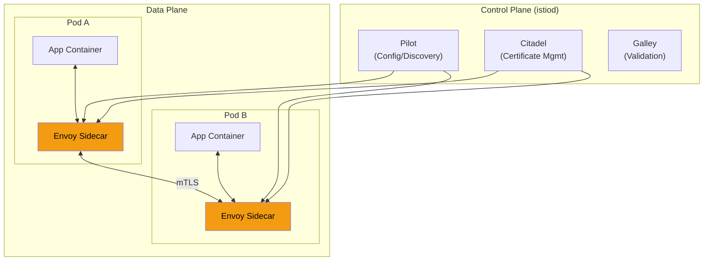

# 1. Advanced Topics

## Table of Contents

- [1.1 Custom Resource Definitions (CRDs)](#11-custom-resource-definitions-crds)
- [1.2 Operator Pattern](#12-operator-pattern)
- [1.3 Helm](#13-helm)
- [1.4 Service Mesh (Istio Concepts)](#14-service-mesh-istio-concepts)

---


## 1.1 Custom Resource Definitions (CRDs)

```yaml
apiVersion: apiextensions.k8s.io/v1
kind: CustomResourceDefinition
metadata:
  name: certificates.cert-manager.io
spec:
  group: cert-manager.io
  versions:
    - name: v1
      served: true
      storage: true
      schema:
        openAPIV3Schema:
          type: object
          properties:
            spec:
              type: object
              required: ["secretName", "issuerRef"]
              properties:
                secretName:
                  type: string
                duration:
                  type: string
                  default: "2160h"   # 90 days
                renewBefore:
                  type: string
                  default: "360h"    # 15 days
                dnsNames:
                  type: array
                  items:
                    type: string
                issuerRef:
                  type: object
                  properties:
                    name:
                      type: string
                    kind:
                      type: string
            status:
              type: object
              properties:
                conditions:
                  type: array
                  items:
                    type: object
                    properties:
                      type:
                        type: string
                      status:
                        type: string
      subresources:
        status: {}
      additionalPrinterColumns:
        - name: Ready
          type: string
          jsonPath: ".status.conditions[?(@.type=='Ready')].status"
        - name: Secret
          type: string
          jsonPath: ".spec.secretName"
        - name: Age
          type: date
          jsonPath: ".metadata.creationTimestamp"
  scope: Namespaced
  names:
    plural: certificates
    singular: certificate
    kind: Certificate
    shortNames:
      - cert

---
# Using the custom resource
apiVersion: cert-manager.io/v1
kind: Certificate
metadata:
  name: api-tls
  namespace: production
spec:
  secretName: api-tls-secret
  duration: 2160h
  renewBefore: 360h
  dnsNames:
    - api.example.com
    - "*.api.example.com"
  issuerRef:
    name: letsencrypt-prod
    kind: ClusterIssuer
```

## 1.2 Operator Pattern



### Reconciliation Loop Pseudocode

```go
func (r *CertificateReconciler) Reconcile(ctx context.Context, req ctrl.Request) (ctrl.Result, error) {
    // 1. Fetch the desired state (custom resource)
    cert := &v1.Certificate{}
    if err := r.Get(ctx, req.NamespacedName, cert); err != nil {
        if apierrors.IsNotFound(err) {
            return ctrl.Result{}, nil // Resource deleted, nothing to do
        }
        return ctrl.Result{}, err
    }

    // 2. Check actual state
    secret := &corev1.Secret{}
    err := r.Get(ctx, types.NamespacedName{
        Name:      cert.Spec.SecretName,
        Namespace: cert.Namespace,
    }, secret)

    if apierrors.IsNotFound(err) {
        // 3. Actual != Desired → Take action
        newSecret, err := r.issueCertificate(cert)
        if err != nil {
            return ctrl.Result{RequeueAfter: 1 * time.Minute}, err
        }
        if err := r.Create(ctx, newSecret); err != nil {
            return ctrl.Result{}, err
        }
    }

    // 4. Check if renewal is needed
    if r.needsRenewal(secret, cert) {
        return ctrl.Result{RequeueAfter: 1 * time.Hour}, r.renewCertificate(cert)
    }

    // 5. Update status
    cert.Status.Conditions = append(cert.Status.Conditions, v1.Condition{
        Type:   "Ready",
        Status: "True",
    })
    r.Status().Update(ctx, cert)

    // 6. Reconcile again before expiry
    return ctrl.Result{RequeueAfter: 24 * time.Hour}, nil
}
```

## 1.3 Helm

```bash
# Helm basics
helm repo add bitnami https://charts.bitnami.com/bitnami
helm repo update
helm search repo bitnami/postgresql

# Install with values
helm install my-postgres bitnami/postgresql \
  --namespace databases \
  --create-namespace \
  --version 12.5.0 \
  --values custom-values.yaml \
  --set auth.postgresPassword=secret123

# Upgrade
helm upgrade my-postgres bitnami/postgresql \
  --values custom-values.yaml \
  --set image.tag=15.3

# Rollback
helm rollback my-postgres 1

# List releases
helm list -A

# Template rendering (debug)
helm template my-postgres bitnami/postgresql --values custom-values.yaml
```

### Helm Chart Structure

```
mychart/
├── Chart.yaml          # Chart metadata
├── values.yaml         # Default values
├── templates/
│   ├── _helpers.tpl    # Template helpers
│   ├── deployment.yaml
│   ├── service.yaml
│   ├── ingress.yaml
│   ├── configmap.yaml
│   ├── hpa.yaml
│   ├── serviceaccount.yaml
│   └── tests/
│       └── test-connection.yaml
└── charts/             # Subcharts (dependencies)
```

```yaml
# templates/deployment.yaml (example with Helm templating)
apiVersion: apps/v1
kind: Deployment
metadata:
  name: {{ include "mychart.fullname" . }}
  labels:
    {{- include "mychart.labels" . | nindent 4 }}
spec:
  replicas: {{ .Values.replicaCount }}
  selector:
    matchLabels:
      {{- include "mychart.selectorLabels" . | nindent 6 }}
  template:
    metadata:
      annotations:
        checksum/config: {{ include (print $.Template.BasePath "/configmap.yaml") . | sha256sum }}
      labels:
        {{- include "mychart.selectorLabels" . | nindent 8 }}
    spec:
      containers:
        - name: {{ .Chart.Name }}
          image: "{{ .Values.image.repository }}:{{ .Values.image.tag | default .Chart.AppVersion }}"
          ports:
            - containerPort: {{ .Values.service.targetPort }}
          {{- if .Values.resources }}
          resources:
            {{- toYaml .Values.resources | nindent 12 }}
          {{- end }}
          {{- with .Values.env }}
          env:
            {{- toYaml . | nindent 12 }}
          {{- end }}
```

## 1.4 Service Mesh (Istio Concepts)



```yaml
# Istio VirtualService — Traffic Routing
apiVersion: networking.istio.io/v1beta1
kind: VirtualService
metadata:
  name: api-routing
spec:
  hosts:
    - api-server
  http:
    # Canary: 90/10 traffic split
    - route:
        - destination:
            host: api-server
            subset: v1
          weight: 90
        - destination:
            host: api-server
            subset: v2
          weight: 10
      
      # Fault injection for chaos testing
      fault:
        delay:
          percentage:
            value: 5
          fixedDelay: 2s
      
      retries:
        attempts: 3
        retryOn: 5xx

---
# Istio DestinationRule
apiVersion: networking.istio.io/v1beta1
kind: DestinationRule
metadata:
  name: api-destination
spec:
  host: api-server
  trafficPolicy:
    connectionPool:
      tcp:
        maxConnections: 100
      http:
        h2UpgradePolicy: DEFAULT
        http1MaxPendingRequests: 100
        http2MaxRequests: 1000
    
    outlierDetection:
      consecutive5xxErrors: 3
      interval: 30s
      baseEjectionTime: 30s
      maxEjectionPercent: 50
  
  subsets:
    - name: v1
      labels:
        version: v1
    - name: v2
      labels:
        version: v2
```
