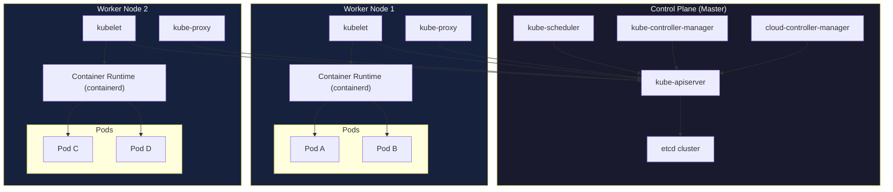
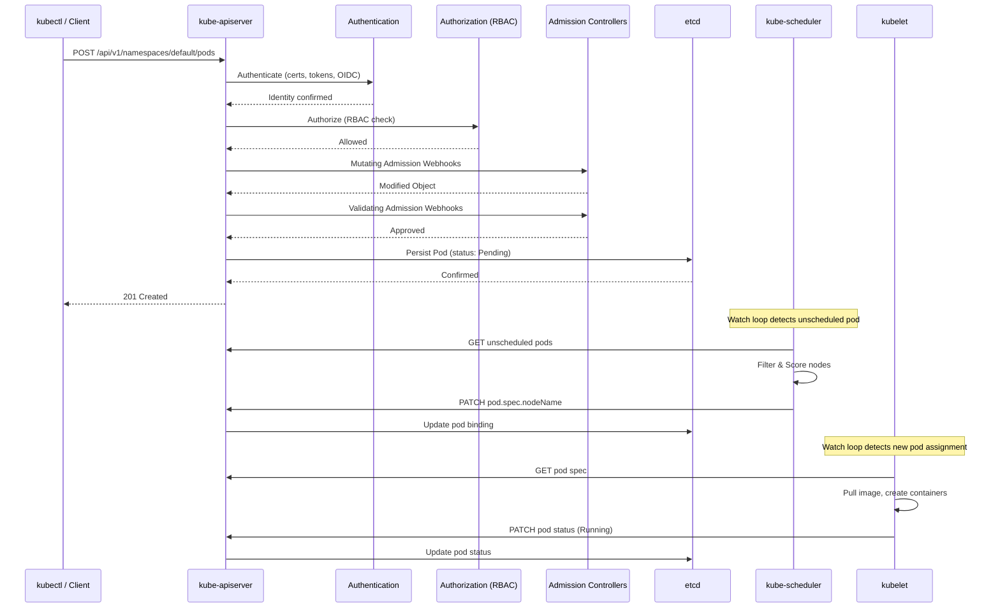

# 1. Architecture Deep Dive

## Table of Contents

- [1.1 High-Level Architecture](#11-high-level-architecture)
- [1.2 Component Responsibilities](#12-component-responsibilities)
- [1.3 API Request Flow](#13-api-request-flow)
- [1.4 etcd Deep Dive](#14-etcd-deep-dive)

---


## 1.1 High-Level Architecture



## 1.2 Component Responsibilities

### Control Plane Components

| Component | Responsibility | Key Details |
|-----------|---------------|-------------|
| **kube-apiserver** | Frontend to the control plane | REST API, authentication, authorization, admission control, only component that talks to etcd |
| **etcd** | Distributed key-value store | Stores all cluster state, uses Raft consensus, should always run in odd numbers (3, 5, 7) |
| **kube-scheduler** | Assigns pods to nodes | Filtering → Scoring pipeline; considers affinity, taints, resources |
| **kube-controller-manager** | Runs controller loops | Deployment, ReplicaSet, Node, Service Account controllers, etc. |
| **cloud-controller-manager** | Cloud-provider integration | LoadBalancer services, node lifecycle, route management |

### Node Components

| Component | Responsibility | Key Details |
|-----------|---------------|-------------|
| **kubelet** | Node agent | Manages pod lifecycle, reports node status, runs liveness/readiness probes |
| **kube-proxy** | Network proxy | Maintains network rules (iptables/IPVS), enables Service abstraction |
| **Container Runtime** | Runs containers | containerd, CRI-O (Docker shim removed in 1.24+) |

## 1.3 API Request Flow



## 1.4 etcd Deep Dive

**Why is etcd critical?**
- It is the **single source of truth** for the entire cluster
- Loss of etcd = loss of cluster state
- Uses **Raft consensus** algorithm (needs majority quorum)

```bash
# Backup etcd (critical production skill)
ETCDCTL_API=3 etcdctl snapshot save /backup/etcd-snapshot.db \
  --endpoints=https://127.0.0.1:2379 \
  --cacert=/etc/kubernetes/pki/etcd/ca.crt \
  --cert=/etc/kubernetes/pki/etcd/server.crt \
  --key=/etc/kubernetes/pki/etcd/server.key

# Verify the backup
ETCDCTL_API=3 etcdctl snapshot status /backup/etcd-snapshot.db --write-table

# Restore etcd
ETCDCTL_API=3 etcdctl snapshot restore /backup/etcd-snapshot.db \
  --data-dir=/var/lib/etcd-restored
```

**Principal-level insight:** etcd stores data in a B+ tree with MVCC (Multi-Version Concurrency Control). The `resourceVersion` field on every Kubernetes object maps to the etcd `mod_revision`. This is how **watch** and **optimistic concurrency** work.
