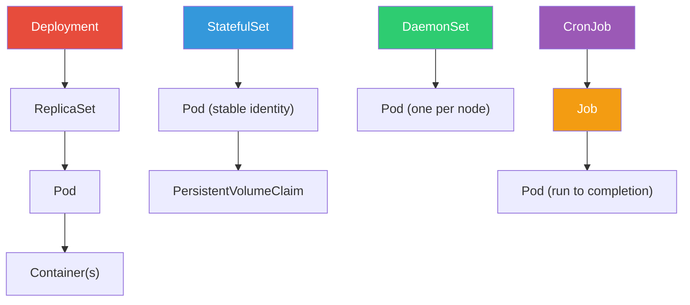
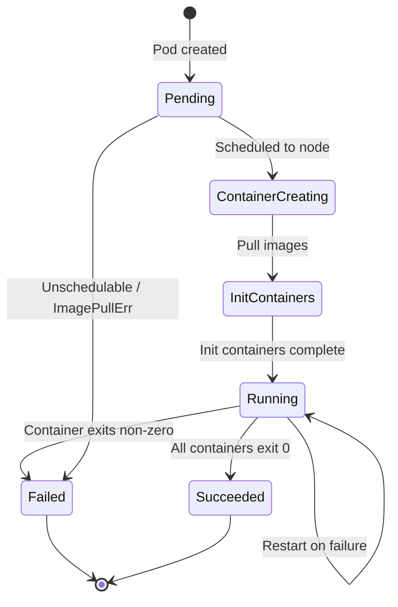
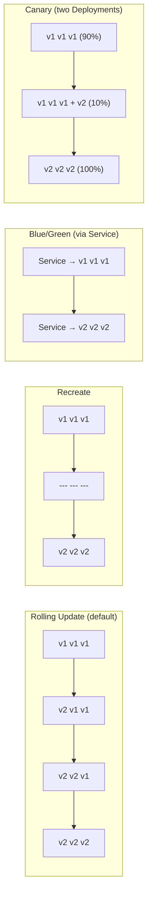

# 1. Core Objects & Workloads

## Table of Contents

- [1.1 Object Hierarchy](#11-object-hierarchy)
- [1.2 Pod — The Atomic Unit](#12-pod-the-atomic-unit)
- [1.3 Deployment](#13-deployment)
- [1.4 StatefulSet](#14-statefulset)
- [1.5 DaemonSet](#15-daemonset)
- [1.6 Jobs & CronJobs](#16-jobs-cronjobs)

---


## 1.1 Object Hierarchy



## 1.2 Pod — The Atomic Unit

```yaml
# pod-complete-example.yaml
apiVersion: v1
kind: Pod
metadata:
  name: web-app
  namespace: production
  labels:
    app: web
    tier: frontend
    version: v2
  annotations:
    prometheus.io/scrape: "true"
    prometheus.io/port: "8080"
spec:
  serviceAccountName: web-app-sa
  securityContext:
    runAsNonRoot: true
    runAsUser: 1000
    fsGroup: 2000
  
  initContainers:
    - name: db-migration
      image: myapp/migrate:v2
      command: ["./migrate", "--direction=up"]
      env:
        - name: DB_URL
          valueFrom:
            secretKeyRef:
              name: db-credentials
              key: url

  containers:
    - name: web
      image: myapp/web:v2.1.0
      ports:
        - containerPort: 8080
          name: http
          protocol: TCP
      resources:
        requests:
          cpu: "250m"       # 0.25 CPU core
          memory: "128Mi"
        limits:
          cpu: "500m"
          memory: "256Mi"
      
      # Startup probe: gives slow-starting apps time to initialize
      startupProbe:
        httpGet:
          path: /healthz
          port: http
        failureThreshold: 30
        periodSeconds: 10
      
      # Liveness: restarts the container if it fails
      livenessProbe:
        httpGet:
          path: /healthz
          port: http
        initialDelaySeconds: 0
        periodSeconds: 15
        timeoutSeconds: 3
        failureThreshold: 3
      
      # Readiness: removes from Service endpoints if it fails
      readinessProbe:
        httpGet:
          path: /ready
          port: http
        periodSeconds: 5
        failureThreshold: 2
      
      lifecycle:
        preStop:
          exec:
            command: ["/bin/sh", "-c", "sleep 15"]  # graceful drain
      
      volumeMounts:
        - name: config
          mountPath: /etc/app/config
          readOnly: true
        - name: tmp
          mountPath: /tmp

    - name: log-sidecar
      image: fluentd:v1.14
      volumeMounts:
        - name: shared-logs
          mountPath: /var/log/app

  volumes:
    - name: config
      configMap:
        name: web-config
    - name: tmp
      emptyDir: {}
    - name: shared-logs
      emptyDir: {}
  
  terminationGracePeriodSeconds: 30
  restartPolicy: Always
  dnsPolicy: ClusterFirst
  
  tolerations:
    - key: "dedicated"
      operator: "Equal"
      value: "frontend"
      effect: "NoSchedule"
  
  affinity:
    podAntiAffinity:
      preferredDuringSchedulingIgnoredDuringExecution:
        - weight: 100
          podAffinityTerm:
            labelSelector:
              matchExpressions:
                - key: app
                  operator: In
                  values: ["web"]
            topologyKey: kubernetes.io/hostname
```

### Probe Comparison Table

| Probe | Purpose | On Failure |
|-------|---------|------------|
| **startupProbe** | Wait for slow initialization | Kills container (blocks other probes) |
| **livenessProbe** | Detect deadlocks/hangs | Restarts container |
| **readinessProbe** | Check if ready for traffic | Removes from Service endpoints |

### Pod Lifecycle



## 1.3 Deployment

```yaml
# deployment.yaml
apiVersion: apps/v1
kind: Deployment
metadata:
  name: api-server
  namespace: production
  labels:
    app: api-server
spec:
  replicas: 3
  revisionHistoryLimit: 10
  
  selector:
    matchLabels:
      app: api-server
  
  strategy:
    type: RollingUpdate
    rollingUpdate:
      maxSurge: 1          # At most 4 pods during update (3+1)
      maxUnavailable: 0     # Zero-downtime deployment
  
  template:
    metadata:
      labels:
        app: api-server
        version: v3
    spec:
      containers:
        - name: api
          image: mycompany/api:v3.2.1
          ports:
            - containerPort: 8080
          resources:
            requests:
              cpu: "500m"
              memory: "256Mi"
            limits:
              cpu: "1000m"
              memory: "512Mi"
          readinessProbe:
            httpGet:
              path: /health
              port: 8080
            initialDelaySeconds: 5
            periodSeconds: 10
      
      topologySpreadConstraints:
        - maxSkew: 1
          topologyKey: topology.kubernetes.io/zone
          whenUnsatisfiable: DoNotSchedule
          labelSelector:
            matchLabels:
              app: api-server
```

### Deployment Strategies Visualized



### Key Deployment Commands

```bash
# Roll out a new version
kubectl set image deployment/api-server api=mycompany/api:v3.3.0

# Watch rollout status
kubectl rollout status deployment/api-server

# View rollout history
kubectl rollout history deployment/api-server

# Rollback to previous version
kubectl rollout undo deployment/api-server

# Rollback to specific revision
kubectl rollout undo deployment/api-server --to-revision=2

# Pause/Resume rollout (canary-like manual control)
kubectl rollout pause deployment/api-server
kubectl rollout resume deployment/api-server

# Scale
kubectl scale deployment/api-server --replicas=5
```

## 1.4 StatefulSet

**Use when you need: Stable network identity, stable persistent storage, ordered deployment/scaling.**

```yaml
apiVersion: apps/v1
kind: StatefulSet
metadata:
  name: postgres
spec:
  serviceName: "postgres-headless"   # Required: headless service
  replicas: 3
  podManagementPolicy: OrderedReady  # or Parallel
  
  selector:
    matchLabels:
      app: postgres
  
  template:
    metadata:
      labels:
        app: postgres
    spec:
      containers:
        - name: postgres
          image: postgres:15
          ports:
            - containerPort: 5432
              name: tcp-postgres
          env:
            - name: POSTGRES_PASSWORD
              valueFrom:
                secretKeyRef:
                  name: pg-secret
                  key: password
          volumeMounts:
            - name: data
              mountPath: /var/lib/postgresql/data
  
  # Each pod gets its own PVC — survives pod restarts
  volumeClaimTemplates:
    - metadata:
        name: data
      spec:
        accessModes: ["ReadWriteOnce"]
        storageClassName: fast-ssd
        resources:
          requests:
            storage: 50Gi

---
# Headless service required for StatefulSet DNS
apiVersion: v1
kind: Service
metadata:
  name: postgres-headless
spec:
  clusterIP: None             # Headless!
  selector:
    app: postgres
  ports:
    - port: 5432
      targetPort: tcp-postgres
```

**DNS names created:**
```
postgres-0.postgres-headless.default.svc.cluster.local
postgres-1.postgres-headless.default.svc.cluster.local
postgres-2.postgres-headless.default.svc.cluster.local
```

### StatefulSet vs Deployment

| Feature | Deployment | StatefulSet |
|---------|-----------|-------------|
| Pod names | Random suffix (api-7d8f4b) | Ordinal index (postgres-0) |
| Scaling order | All at once | Sequential (0→1→2) |
| Storage | Shared or ephemeral | Per-pod PVC |
| Network identity | Interchangeable | Stable DNS per pod |
| Use case | Stateless apps | Databases, message queues |

## 1.5 DaemonSet

```yaml
apiVersion: apps/v1
kind: DaemonSet
metadata:
  name: node-exporter
  namespace: monitoring
spec:
  selector:
    matchLabels:
      app: node-exporter
  
  updateStrategy:
    type: RollingUpdate
    rollingUpdate:
      maxUnavailable: 1
  
  template:
    metadata:
      labels:
        app: node-exporter
    spec:
      hostNetwork: true
      hostPID: true
      tolerations:
        - operator: Exists     # Run on ALL nodes including masters
      containers:
        - name: node-exporter
          image: prom/node-exporter:v1.6.0
          ports:
            - containerPort: 9100
              hostPort: 9100
          securityContext:
            privileged: false
            readOnlyRootFilesystem: true
```

## 1.6 Jobs & CronJobs

```yaml
# Job
apiVersion: batch/v1
kind: Job
metadata:
  name: data-migration
spec:
  completions: 5          # Total successful completions needed
  parallelism: 2          # Run 2 pods at a time
  backoffLimit: 4          # Max retries
  activeDeadlineSeconds: 600
  ttlSecondsAfterFinished: 3600  # Auto-cleanup after 1 hour
  
  template:
    spec:
      restartPolicy: Never     # or OnFailure
      containers:
        - name: migrate
          image: myapp/migration:v1
          command: ["python", "migrate.py"]

---
# CronJob
apiVersion: batch/v1
kind: CronJob
metadata:
  name: daily-backup
spec:
  schedule: "0 2 * * *"           # 2 AM daily
  concurrencyPolicy: Forbid       # Allow | Forbid | Replace
  successfulJobsHistoryLimit: 3
  failedJobsHistoryLimit: 5
  startingDeadlineSeconds: 200
  
  jobTemplate:
    spec:
      template:
        spec:
          restartPolicy: OnFailure
          containers:
            - name: backup
              image: myapp/backup:v1
              command: ["./backup.sh"]
```
