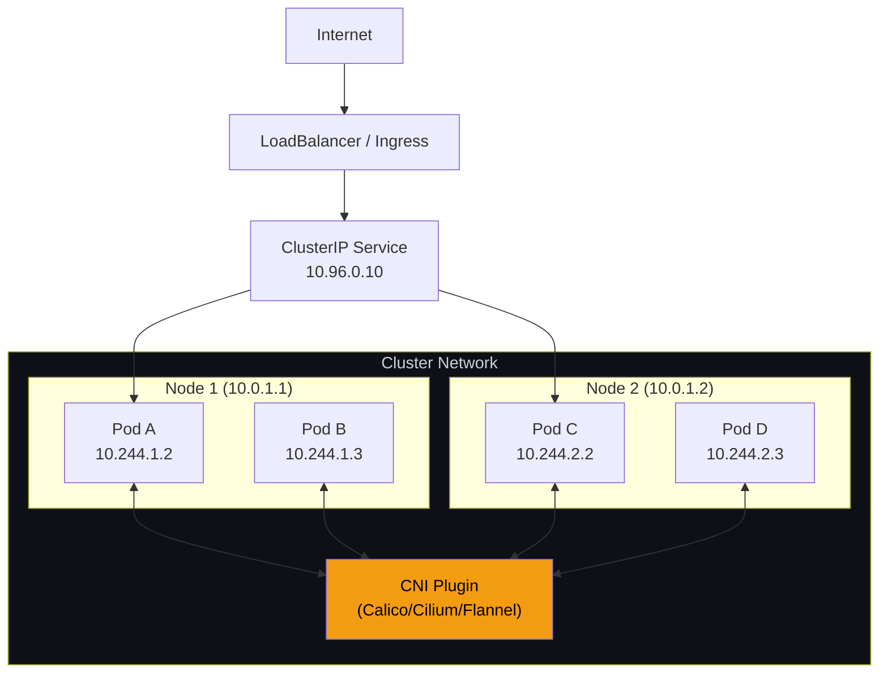
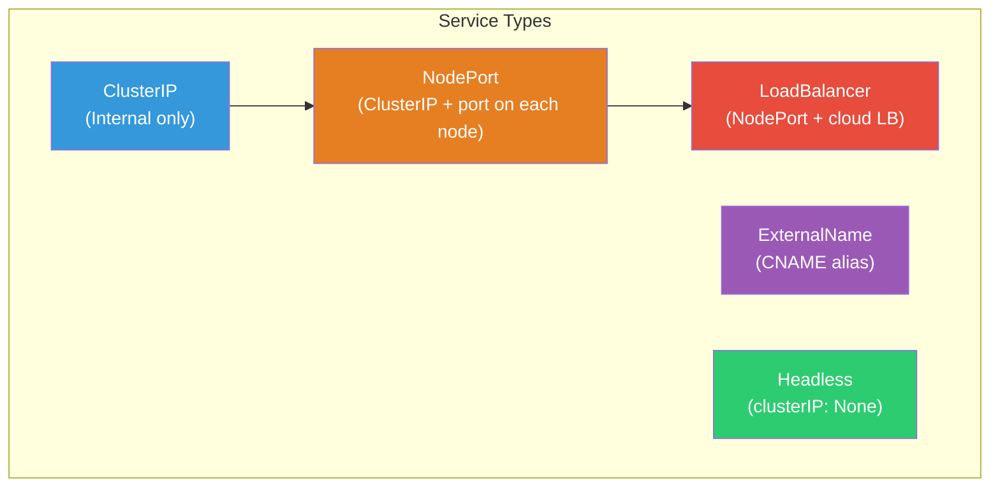
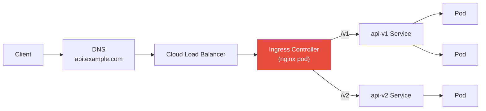
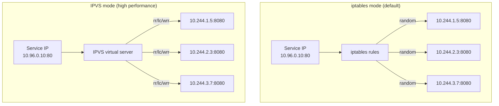

# 1. Networking

## Table of Contents

- [1.1 Kubernetes Network Model](#11-kubernetes-network-model)
- [1.2 Services](#12-services)
- [1.3 Ingress](#13-ingress)
- [1.4 Network Policies](#14-network-policies)
- [1.5 kube-proxy Modes](#15-kube-proxy-modes)

---


## 1.1 Kubernetes Network Model

**Three fundamental rules:**
1. Every pod gets its own IP address
2. Pods on any node can communicate with all pods on any other node without NAT
3. Agents on a node can communicate with all pods on that node



## 1.2 Services



```yaml
# ClusterIP Service
apiVersion: v1
kind: Service
metadata:
  name: api-service
spec:
  type: ClusterIP       # Default
  selector:
    app: api-server
  ports:
    - name: http
      port: 80           # Service port
      targetPort: 8080    # Container port
      protocol: TCP

---
# NodePort Service
apiVersion: v1
kind: Service
metadata:
  name: api-nodeport
spec:
  type: NodePort
  selector:
    app: api-server
  ports:
    - port: 80
      targetPort: 8080
      nodePort: 30080     # 30000-32767 range

---
# LoadBalancer Service
apiVersion: v1
kind: Service
metadata:
  name: api-lb
  annotations:
    service.beta.kubernetes.io/aws-load-balancer-type: "nlb"
    service.beta.kubernetes.io/aws-load-balancer-scheme: "internet-facing"
spec:
  type: LoadBalancer
  selector:
    app: api-server
  ports:
    - port: 443
      targetPort: 8080

---
# Headless Service (for StatefulSets or client-side discovery)
apiVersion: v1
kind: Service
metadata:
  name: db-headless
spec:
  clusterIP: None
  selector:
    app: database
  ports:
    - port: 5432
```

### Service DNS Resolution

```
<service-name>.<namespace>.svc.cluster.local

# Examples:
api-service.default.svc.cluster.local
api-service.default     # shortened form
api-service             # within same namespace
```

## 1.3 Ingress

```yaml
apiVersion: networking.k8s.io/v1
kind: Ingress
metadata:
  name: main-ingress
  annotations:
    nginx.ingress.kubernetes.io/ssl-redirect: "true"
    nginx.ingress.kubernetes.io/rate-limit: "100"
    cert-manager.io/cluster-issuer: "letsencrypt-prod"
spec:
  ingressClassName: nginx
  tls:
    - hosts:
        - api.example.com
        - www.example.com
      secretName: tls-secret
  
  rules:
    - host: api.example.com
      http:
        paths:
          - path: /v1
            pathType: Prefix
            backend:
              service:
                name: api-v1
                port:
                  number: 80
          - path: /v2
            pathType: Prefix
            backend:
              service:
                name: api-v2
                port:
                  number: 80
    
    - host: www.example.com
      http:
        paths:
          - path: /
            pathType: Prefix
            backend:
              service:
                name: web-frontend
                port:
                  number: 80
```

### Ingress Traffic Flow



## 1.4 Network Policies

```yaml
apiVersion: networking.k8s.io/v1
kind: NetworkPolicy
metadata:
  name: api-network-policy
  namespace: production
spec:
  podSelector:
    matchLabels:
      app: api-server
  
  policyTypes:
    - Ingress
    - Egress
  
  ingress:
    # Allow traffic from frontend pods
    - from:
        - podSelector:
            matchLabels:
              app: frontend
        - namespaceSelector:
            matchLabels:
              env: production
      ports:
        - protocol: TCP
          port: 8080
    
    # Allow traffic from monitoring namespace
    - from:
        - namespaceSelector:
            matchLabels:
              name: monitoring
      ports:
        - protocol: TCP
          port: 9090
  
  egress:
    # Allow DNS
    - to: []
      ports:
        - protocol: UDP
          port: 53
        - protocol: TCP
          port: 53
    
    # Allow database access
    - to:
        - podSelector:
            matchLabels:
              app: postgres
      ports:
        - protocol: TCP
          port: 5432
    
    # Allow external HTTPS
    - to:
        - ipBlock:
            cidr: 0.0.0.0/0
            except:
              - 10.0.0.0/8
              - 172.16.0.0/12
              - 192.168.0.0/16
      ports:
        - protocol: TCP
          port: 443
```

### Default Deny Policies (Security Best Practice)

```yaml
# Deny all ingress traffic in a namespace
apiVersion: networking.k8s.io/v1
kind: NetworkPolicy
metadata:
  name: default-deny-ingress
  namespace: production
spec:
  podSelector: {}          # Matches ALL pods
  policyTypes:
    - Ingress
    # No ingress rules = deny all

---
# Deny all egress traffic in a namespace
apiVersion: networking.k8s.io/v1
kind: NetworkPolicy
metadata:
  name: default-deny-egress
  namespace: production
spec:
  podSelector: {}
  policyTypes:
    - Egress
```

## 1.5 kube-proxy Modes



**Principal-level insight:** IPVS mode is preferred for large clusters (>1000 services) because it uses hash tables (O(1) lookup) vs iptables' linear chain scanning (O(n)). IPVS also supports richer load-balancing algorithms (round-robin, least-connections, weighted).
