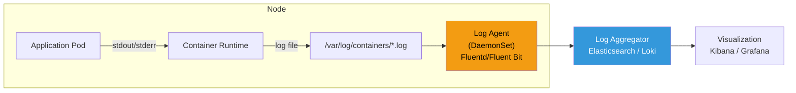

# 1. Observability

## Table of Contents

- [1.1 Logging Strategy](#11-logging-strategy)
- [1.2 Monitoring Stack](#12-monitoring-stack)
- [1.3 Key kubectl Debugging Commands](#13-key-kubectl-debugging-commands)

---


## 1.1 Logging Strategy



### Key Logging Commands

```bash
# View logs
kubectl logs pod-name
kubectl logs pod-name -c container-name     # Multi-container pod
kubectl logs pod-name --previous             # Previous crashed container
kubectl logs -f pod-name                     # Stream/follow logs
kubectl logs -l app=api-server --all-containers  # By label
kubectl logs deployment/api-server           # From deployment
kubectl logs pod-name --since=1h             # Last hour
kubectl logs pod-name --tail=100             # Last 100 lines
```

## 1.2 Monitoring Stack

```yaml
# ServiceMonitor for Prometheus Operator
apiVersion: monitoring.coreos.com/v1
kind: ServiceMonitor
metadata:
  name: api-monitor
  labels:
    release: prometheus
spec:
  selector:
    matchLabels:
      app: api-server
  endpoints:
    - port: metrics
      interval: 15s
      path: /metrics
  namespaceSelector:
    matchNames:
      - production
```

## 1.3 Key kubectl Debugging Commands

```bash
# Cluster info
kubectl cluster-info
kubectl get nodes -o wide
kubectl top nodes
kubectl top pods --sort-by=memory -n production

# Describe (event history + configuration)
kubectl describe pod pod-name
kubectl describe node node-name

# Get events
kubectl get events --sort-by=.metadata.creationTimestamp -n production
kubectl get events --field-selector reason=Failed

# Interactive debugging
kubectl exec -it pod-name -- /bin/sh
kubectl exec -it pod-name -c container-name -- /bin/bash

# Port forwarding
kubectl port-forward pod/pod-name 8080:8080
kubectl port-forward svc/service-name 8080:80

# Copy files
kubectl cp pod-name:/var/log/app.log ./app.log

# Ephemeral debug container (K8s 1.25+)
kubectl debug -it pod-name --image=busybox --target=app-container

# Debug a node
kubectl debug node/node-name -it --image=ubuntu
```
