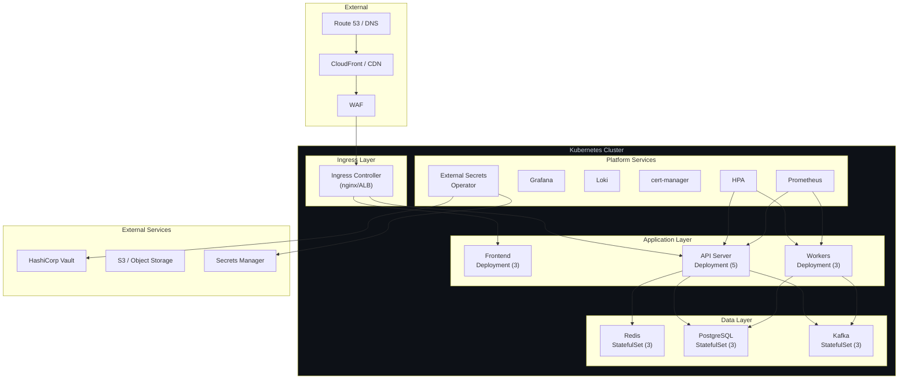
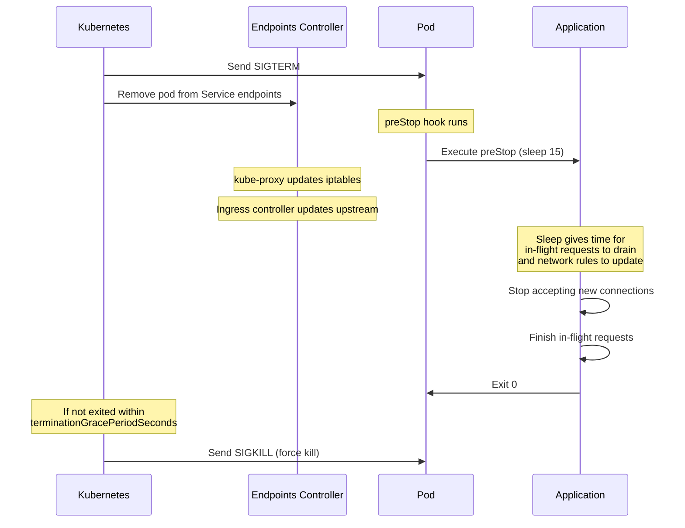

# 1. Production Patterns & Best Practices

## Table of Contents

- [1.1 Complete Production-Ready Architecture](#11-complete-production-ready-architecture)
- [1.2 Best Practices Checklist](#12-best-practices-checklist)
- [1.3 Graceful Shutdown Sequence](#13-graceful-shutdown-sequence)

---


## 1.1 Complete Production-Ready Architecture



## 1.2 Best Practices Checklist

### Workloads

```yaml
# ✅ Production-ready pod template
spec:
  # 1. Always set resource requests and limits
  containers:
    - resources:
        requests:
          cpu: "250m"
          memory: "256Mi"
        limits:
          # Note: Many teams set CPU limit = request (Guaranteed QoS)
          # Others omit CPU limits to avoid throttling
          cpu: "500m"
          memory: "256Mi"    # Memory limit should ALWAYS be set
      
      # 2. Always set probes
      readinessProbe: { ... }
      livenessProbe: { ... }
      
      # 3. Security hardening
      securityContext:
        runAsNonRoot: true
        runAsUser: 1000
        readOnlyRootFilesystem: true
        allowPrivilegeEscalation: false
        capabilities:
          drop: ["ALL"]
      
      # 4. Use specific image tags, never 'latest'
      image: myapp:v2.1.3   # ✅
      # image: myapp:latest  # ❌
      # image: myapp          # ❌
  
  # 5. Use a non-default service account
  serviceAccountName: my-app-sa
  automountServiceAccountToken: false
  
  # 6. Pod anti-affinity for high availability
  affinity:
    podAntiAffinity:
      preferredDuringSchedulingIgnoredDuringExecution:
        - weight: 100
          podAffinityTerm:
            labelSelector:
              matchLabels:
                app: my-app
            topologyKey: kubernetes.io/hostname
  
  # 7. Topology spread for even distribution
  topologySpreadConstraints:
    - maxSkew: 1
      topologyKey: topology.kubernetes.io/zone
      whenUnsatisfiable: DoNotSchedule
      labelSelector:
        matchLabels:
          app: my-app
  
  # 8. Graceful shutdown
  terminationGracePeriodSeconds: 30
  containers:
    - lifecycle:
        preStop:
          exec:
            command: ["/bin/sh", "-c", "sleep 15"]
```

### Namespace Organization

```bash
# Environment separation
kubectl create namespace production
kubectl create namespace staging
kubectl create namespace development

# Functional separation
kubectl create namespace monitoring
kubectl create namespace logging
kubectl create namespace cert-manager
kubectl create namespace ingress-nginx
```

### Labels & Annotations Convention

```yaml
metadata:
  labels:
    # Recommended labels (kubernetes.io conventions)
    app.kubernetes.io/name: api-server
    app.kubernetes.io/instance: api-server-production
    app.kubernetes.io/version: "2.1.3"
    app.kubernetes.io/component: backend
    app.kubernetes.io/part-of: ecommerce-platform
    app.kubernetes.io/managed-by: helm
    
    # Custom business labels
    team: platform
    cost-center: engineering
    environment: production
```

## 1.3 Graceful Shutdown Sequence



**Why the `sleep 15` preStop hook?** There's a race condition: SIGTERM and endpoint removal happen in parallel. The sleep ensures network rules have updated before the app starts shutting down, preventing dropped connections.
