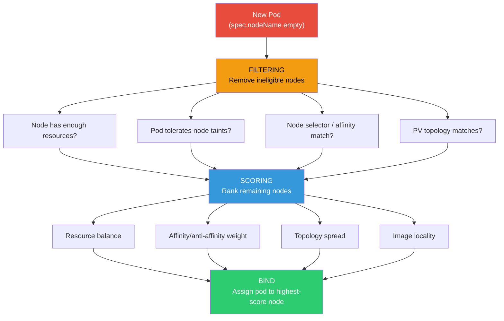
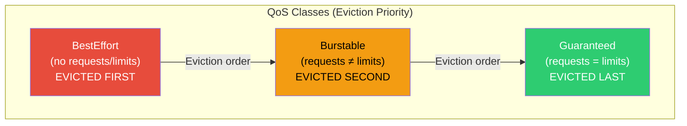

# 1. Scheduling & Resource Management

## Table of Contents

- [1.1 Scheduler Decision Flow](#11-scheduler-decision-flow)
- [1.2 Taints & Tolerations](#12-taints-tolerations)
- [1.3 Node Affinity & Pod Affinity](#13-node-affinity-pod-affinity)
- [1.4 Topology Spread Constraints](#14-topology-spread-constraints)
- [1.5 Resource Management](#15-resource-management)
- [1.6 Horizontal Pod Autoscaler (HPA)](#16-horizontal-pod-autoscaler-hpa)
- [1.7 Vertical Pod Autoscaler (VPA) & Pod Disruption Budget](#17-vertical-pod-autoscaler-vpa-pod-disruption-budget)

---


## 1.1 Scheduler Decision Flow



## 1.2 Taints & Tolerations

```bash
# Add a taint to a node
kubectl taint nodes node1 dedicated=gpu:NoSchedule
kubectl taint nodes node2 maintenance=true:NoExecute

# Remove a taint
kubectl taint nodes node1 dedicated=gpu:NoSchedule-
```

```yaml
# Pod that tolerates the taint
spec:
  tolerations:
    - key: "dedicated"
      operator: "Equal"
      value: "gpu"
      effect: "NoSchedule"
    
    - key: "maintenance"
      operator: "Exists"
      effect: "NoExecute"
      tolerationSeconds: 3600   # Evict after 1 hour
```

**Taint Effects:**

| Effect | Behavior |
|--------|----------|
| `NoSchedule` | New pods won't be scheduled unless they tolerate |
| `PreferNoSchedule` | Soft version; scheduler tries to avoid but isn't required |
| `NoExecute` | Existing pods evicted if they don't tolerate |

## 1.3 Node Affinity & Pod Affinity

```yaml
spec:
  affinity:
    # NODE AFFINITY: Schedule on specific nodes
    nodeAffinity:
      requiredDuringSchedulingIgnoredDuringExecution:
        nodeSelectorTerms:
          - matchExpressions:
              - key: topology.kubernetes.io/zone
                operator: In
                values: ["us-east-1a", "us-east-1b"]
              - key: node.kubernetes.io/instance-type
                operator: In
                values: ["m5.xlarge", "m5.2xlarge"]
      
      preferredDuringSchedulingIgnoredDuringExecution:
        - weight: 80
          preference:
            matchExpressions:
              - key: gpu
                operator: Exists
    
    # POD AFFINITY: Schedule near other pods
    podAffinity:
      requiredDuringSchedulingIgnoredDuringExecution:
        - labelSelector:
            matchExpressions:
              - key: app
                operator: In
                values: ["cache"]
          topologyKey: kubernetes.io/hostname
          # "I must be on the same node as a cache pod"
    
    # POD ANTI-AFFINITY: Schedule away from other pods
    podAntiAffinity:
      requiredDuringSchedulingIgnoredDuringExecution:
        - labelSelector:
            matchExpressions:
              - key: app
                operator: In
                values: ["api-server"]
          topologyKey: kubernetes.io/hostname
          # "Don't put two api-server pods on the same node"
```

## 1.4 Topology Spread Constraints

```yaml
spec:
  topologySpreadConstraints:
    # Spread evenly across zones
    - maxSkew: 1
      topologyKey: topology.kubernetes.io/zone
      whenUnsatisfiable: DoNotSchedule    # or ScheduleAnyway
      labelSelector:
        matchLabels:
          app: api-server
    
    # Also spread across nodes within each zone
    - maxSkew: 1
      topologyKey: kubernetes.io/hostname
      whenUnsatisfiable: ScheduleAnyway
      labelSelector:
        matchLabels:
          app: api-server
```

## 1.5 Resource Management

### QoS Classes



```yaml
# Guaranteed QoS (requests == limits for ALL containers)
containers:
  - name: app
    resources:
      requests:
        cpu: "500m"
        memory: "256Mi"
      limits:
        cpu: "500m"
        memory: "256Mi"

# Burstable QoS (requests != limits OR only requests set)
containers:
  - name: app
    resources:
      requests:
        cpu: "250m"
        memory: "128Mi"
      limits:
        cpu: "500m"
        memory: "256Mi"

# BestEffort QoS (no requests or limits at all)
containers:
  - name: app
    image: myapp:v1
    # No resources specified
```

### Resource Quotas & Limit Ranges

```yaml
# ResourceQuota — namespace-level limits
apiVersion: v1
kind: ResourceQuota
metadata:
  name: production-quota
  namespace: production
spec:
  hard:
    requests.cpu: "20"
    requests.memory: "40Gi"
    limits.cpu: "40"
    limits.memory: "80Gi"
    pods: "50"
    services: "20"
    persistentvolumeclaims: "30"
    count/deployments.apps: "20"

---
# LimitRange — per-pod/container defaults and constraints
apiVersion: v1
kind: LimitRange
metadata:
  name: container-limits
  namespace: production
spec:
  limits:
    - type: Container
      default:           # Applied if no limits specified
        cpu: "500m"
        memory: "256Mi"
      defaultRequest:    # Applied if no requests specified
        cpu: "100m"
        memory: "128Mi"
      max:
        cpu: "4"
        memory: "8Gi"
      min:
        cpu: "50m"
        memory: "64Mi"
    
    - type: Pod
      max:
        cpu: "8"
        memory: "16Gi"
```

## 1.6 Horizontal Pod Autoscaler (HPA)

```yaml
apiVersion: autoscaling/v2
kind: HorizontalPodAutoscaler
metadata:
  name: api-hpa
spec:
  scaleTargetRef:
    apiVersion: apps/v1
    kind: Deployment
    name: api-server
  
  minReplicas: 3
  maxReplicas: 50
  
  metrics:
    # CPU-based scaling
    - type: Resource
      resource:
        name: cpu
        target:
          type: Utilization
          averageUtilization: 70
    
    # Memory-based scaling
    - type: Resource
      resource:
        name: memory
        target:
          type: AverageValue
          averageValue: 500Mi
    
    # Custom metric (e.g., from Prometheus)
    - type: Pods
      pods:
        metric:
          name: http_requests_per_second
        target:
          type: AverageValue
          averageValue: "1000"
    
    # External metric
    - type: External
      external:
        metric:
          name: sqs_queue_length
          selector:
            matchLabels:
              queue: "orders"
        target:
          type: Value
          value: "100"
  
  behavior:
    scaleUp:
      stabilizationWindowSeconds: 60
      policies:
        - type: Percent
          value: 100
          periodSeconds: 60
        - type: Pods
          value: 10
          periodSeconds: 60
      selectPolicy: Max
    
    scaleDown:
      stabilizationWindowSeconds: 300   # 5 min cooldown
      policies:
        - type: Percent
          value: 10
          periodSeconds: 60
```

## 1.7 Vertical Pod Autoscaler (VPA) & Pod Disruption Budget

```yaml
# VPA
apiVersion: autoscaling.k8s.io/v1
kind: VerticalPodAutoscaler
metadata:
  name: api-vpa
spec:
  targetRef:
    apiVersion: apps/v1
    kind: Deployment
    name: api-server
  updatePolicy:
    updateMode: "Auto"    # Off | Initial | Recreate | Auto
  resourcePolicy:
    containerPolicies:
      - containerName: api
        minAllowed:
          cpu: "100m"
          memory: "128Mi"
        maxAllowed:
          cpu: "4"
          memory: "8Gi"

---
# PodDisruptionBudget
apiVersion: policy/v1
kind: PodDisruptionBudget
metadata:
  name: api-pdb
spec:
  selector:
    matchLabels:
      app: api-server
  minAvailable: 2            # OR use maxUnavailable: 1
  # maxUnavailable: "25%"    # Percentage also works
```
