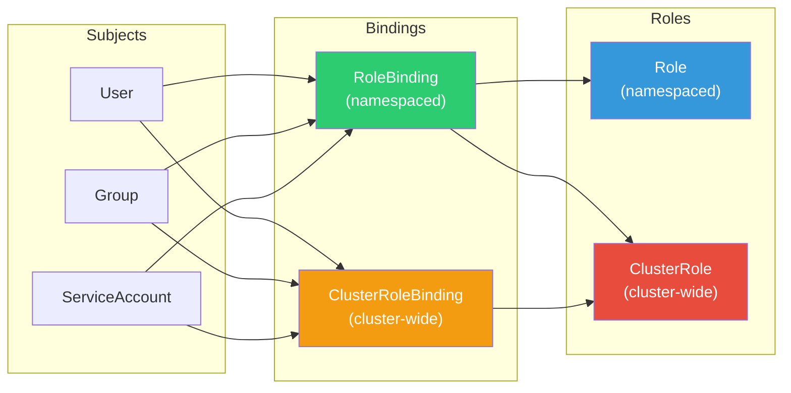

# 1. Security

## Table of Contents

- [1.1 RBAC (Role-Based Access Control)](#11-rbac-role-based-access-control)
- [1.2 Service Accounts](#12-service-accounts)
- [1.3 Pod Security Standards (PSS) & Pod Security Admission (PSA)](#13-pod-security-standards-pss-pod-security-admission-psa)

---


## 1.1 RBAC (Role-Based Access Control)



```yaml
# Role — namespaced permissions
apiVersion: rbac.authorization.k8s.io/v1
kind: Role
metadata:
  name: pod-reader
  namespace: production
rules:
  - apiGroups: [""]          # core API group
    resources: ["pods", "pods/log"]
    verbs: ["get", "list", "watch"]
  
  - apiGroups: ["apps"]
    resources: ["deployments"]
    verbs: ["get", "list", "watch"]
  
  - apiGroups: [""]
    resources: ["configmaps"]
    verbs: ["get", "list"]
    resourceNames: ["app-config"]   # Restrict to specific resource

---
# ClusterRole — cluster-wide permissions
apiVersion: rbac.authorization.k8s.io/v1
kind: ClusterRole
metadata:
  name: node-viewer
rules:
  - apiGroups: [""]
    resources: ["nodes"]
    verbs: ["get", "list", "watch"]
  - apiGroups: ["metrics.k8s.io"]
    resources: ["nodes", "pods"]
    verbs: ["get", "list"]

---
# RoleBinding
apiVersion: rbac.authorization.k8s.io/v1
kind: RoleBinding
metadata:
  name: read-pods-production
  namespace: production
subjects:
  - kind: User
    name: jane@example.com
    apiGroup: rbac.authorization.k8s.io
  - kind: Group
    name: developers
    apiGroup: rbac.authorization.k8s.io
  - kind: ServiceAccount
    name: monitoring-sa
    namespace: monitoring
roleRef:
  kind: Role
  name: pod-reader
  apiGroup: rbac.authorization.k8s.io

---
# ClusterRoleBinding
apiVersion: rbac.authorization.k8s.io/v1
kind: ClusterRoleBinding
metadata:
  name: global-node-viewer
subjects:
  - kind: Group
    name: ops-team
    apiGroup: rbac.authorization.k8s.io
roleRef:
  kind: ClusterRole
  name: node-viewer
  apiGroup: rbac.authorization.k8s.io
```

### RBAC Debugging Commands

```bash
# Check if you can perform an action
kubectl auth can-i create deployments --namespace production
kubectl auth can-i delete pods --namespace kube-system

# Check as another user
kubectl auth can-i create pods --namespace production --as jane@example.com
kubectl auth can-i '*' '*' --as system:serviceaccount:default:my-sa

# List all permissions for a user
kubectl auth can-i --list --as jane@example.com --namespace production
```

## 1.2 Service Accounts

```yaml
apiVersion: v1
kind: ServiceAccount
metadata:
  name: app-service-account
  namespace: production
  annotations:
    # AWS IRSA (IAM Roles for Service Accounts)
    eks.amazonaws.com/role-arn: "arn:aws:iam::123456789:role/app-role"
automountServiceAccountToken: false   # Security best practice

---
# Use in a pod
apiVersion: v1
kind: Pod
metadata:
  name: secure-pod
spec:
  serviceAccountName: app-service-account
  automountServiceAccountToken: true   # Only when needed
  containers:
    - name: app
      image: myapp:v1
```

## 1.3 Pod Security Standards (PSS) & Pod Security Admission (PSA)

```yaml
# Namespace-level enforcement (replaces deprecated PodSecurityPolicy)
apiVersion: v1
kind: Namespace
metadata:
  name: production
  labels:
    pod-security.kubernetes.io/enforce: restricted
    pod-security.kubernetes.io/audit: restricted
    pod-security.kubernetes.io/warn: restricted

---
# A pod that complies with "restricted" profile
apiVersion: v1
kind: Pod
metadata:
  name: secure-pod
  namespace: production
spec:
  securityContext:
    runAsNonRoot: true
    seccompProfile:
      type: RuntimeDefault
  containers:
    - name: app
      image: myapp:v1
      securityContext:
        allowPrivilegeEscalation: false
        readOnlyRootFilesystem: true
        runAsUser: 1000
        capabilities:
          drop: ["ALL"]
```

### Pod Security Standards Levels

| Level | Description |
|-------|-------------|
| **privileged** | Unrestricted, no restrictions applied |
| **baseline** | Prevents known privilege escalations (no hostNetwork, hostPID, privileged containers) |
| **restricted** | Heavily restricted. Must runAsNonRoot, drop ALL capabilities, read-only rootfs, seccomp |
