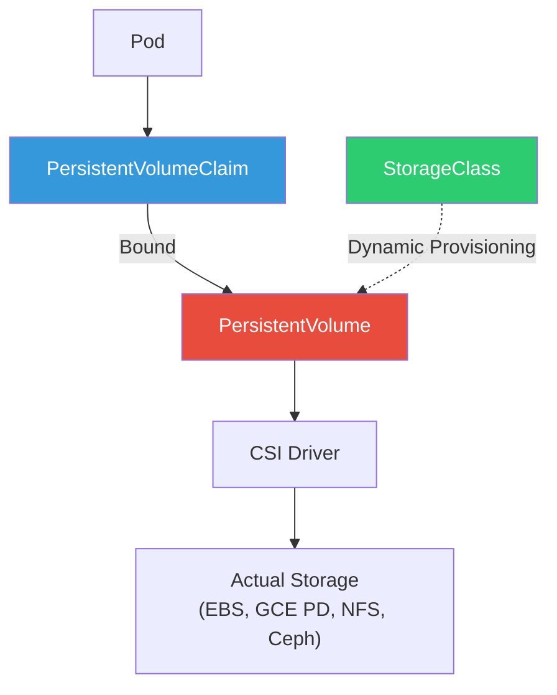

# 1. Storage

## Table of Contents

- [1.1 Storage Architecture](#11-storage-architecture)
- [1.2 Storage Examples](#12-storage-examples)

---


## 1.1 Storage Architecture



## 1.2 Storage Examples

```yaml
# StorageClass for dynamic provisioning
apiVersion: storage.k8s.io/v1
kind: StorageClass
metadata:
  name: fast-ssd
provisioner: ebs.csi.aws.com
parameters:
  type: gp3
  iops: "5000"
  throughput: "250"
  encrypted: "true"
reclaimPolicy: Retain        # Delete | Retain
volumeBindingMode: WaitForFirstConsumer  # Better scheduling
allowVolumeExpansion: true

---
# PersistentVolumeClaim
apiVersion: v1
kind: PersistentVolumeClaim
metadata:
  name: app-data
spec:
  accessModes:
    - ReadWriteOnce          # RWO | ROX | RWX
  storageClassName: fast-ssd
  resources:
    requests:
      storage: 100Gi

---
# Using in a Pod
apiVersion: v1
kind: Pod
metadata:
  name: data-app
spec:
  containers:
    - name: app
      image: myapp:v1
      volumeMounts:
        - mountPath: /data
          name: persistent-data
  volumes:
    - name: persistent-data
      persistentVolumeClaim:
        claimName: app-data
```

### Access Modes Explained

| Mode | Abbreviation | Description |
|------|-------------|-------------|
| ReadWriteOnce | RWO | Mounted read-write by a single node |
| ReadOnlyMany | ROX | Mounted read-only by many nodes |
| ReadWriteMany | RWX | Mounted read-write by many nodes |
| ReadWriteOncePod | RWOP | Mounted read-write by a single pod (K8s 1.27+) |

### Volume Types Quick Reference

```yaml
volumes:
  # Ephemeral storage shared between containers
  - name: scratch
    emptyDir:
      sizeLimit: 500Mi
  
  # ConfigMap as files
  - name: config
    configMap:
      name: app-config
      items:
        - key: app.conf
          path: application.conf
  
  # Secret as files
  - name: certs
    secret:
      secretName: tls-certs
      defaultMode: 0400
  
  # Host filesystem (use sparingly!)
  - name: host-logs
    hostPath:
      path: /var/log
      type: DirectoryOrCreate
  
  # Projected volume (combine multiple sources)
  - name: combined
    projected:
      sources:
        - configMap:
            name: app-config
        - secret:
            name: app-secrets
        - serviceAccountToken:
            audience: vault
            expirationSeconds: 3600
            path: token
```
