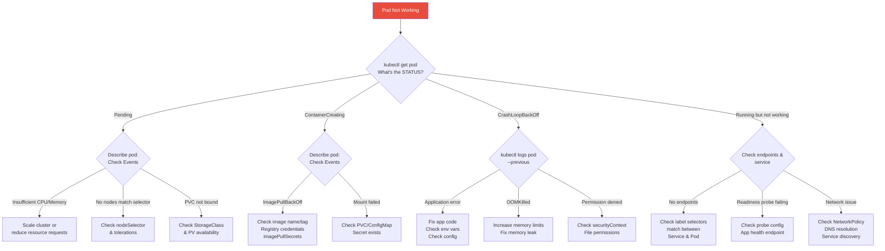

# 1. Troubleshooting Scenarios

## Table of Contents

- [1.1 Troubleshooting Decision Tree](#11-troubleshooting-decision-tree)
- [1.2 Common Troubleshooting Commands](#12-common-troubleshooting-commands)
- [1.3 Common Issues Quick Reference](#13-common-issues-quick-reference)

---


## 1.1 Troubleshooting Decision Tree



## 1.2 Common Troubleshooting Commands

```bash
# === POD ISSUES ===

# Why is my pod pending?
kubectl describe pod <pod-name> | grep -A 20 "Events"

# Why is my pod crashing?
kubectl logs <pod-name> --previous
kubectl describe pod <pod-name> | grep -A 5 "Last State"

# Is it an OOMKill?
kubectl describe pod <pod-name> | grep -i "oom\|killed\|reason"
kubectl get pod <pod-name> -o jsonpath='{.status.containerStatuses[0].lastState}'

# === SERVICE ISSUES ===

# Does the service have endpoints?
kubectl get endpoints <service-name>

# Test DNS resolution
kubectl run dns-test --rm -it --image=busybox -- nslookup <service-name>

# Test connectivity
kubectl run curl-test --rm -it --image=curlimages/curl -- \
  curl -v http://<service-name>:<port>/health

# === NODE ISSUES ===

# Node status and conditions
kubectl describe node <node-name> | grep -A 20 "Conditions"

# Check node resource pressure
kubectl top nodes
kubectl describe node <node-name> | grep -A 5 "Allocated resources"

# === CLUSTER-WIDE ===

# All unhealthy pods
kubectl get pods -A --field-selector=status.phase!=Running,status.phase!=Succeeded

# Recent events across cluster
kubectl get events -A --sort-by='.lastTimestamp' | tail -30

# API server health
kubectl get --raw /healthz
kubectl get --raw /readyz

# etcd health
kubectl get --raw /healthz/etcd
```

## 1.3 Common Issues Quick Reference

| Symptom | Likely Cause | Fix |
|---------|-------------|-----|
| `ImagePullBackOff` | Wrong image name, private registry without credentials | Fix image ref, add `imagePullSecrets` |
| `CrashLoopBackOff` | App crashing, wrong command, missing config | Check logs (`--previous`), verify env vars |
| `OOMKilled` | Container exceeded memory limit | Increase limit or fix memory leak |
| `Pending` (no events) | No nodes available, resource constraints | Check scheduler, node capacity |
| `0/3 nodes are available` | Taints, affinity mismatch, insufficient resources | Add tolerations, fix affinity, scale cluster |
| Endpoints: `<none>` | Label selector mismatch | Match Service `selector` to Pod `labels` |
| `Connection refused` | App not listening on expected port | Verify `containerPort`, app bind address |
| `502 Bad Gateway` | Pod not ready, incorrect targetPort | Check readiness probe, port mapping |
| DNS resolution failure | CoreDNS issue, wrong service name | Check CoreDNS pods, verify FQDN |
