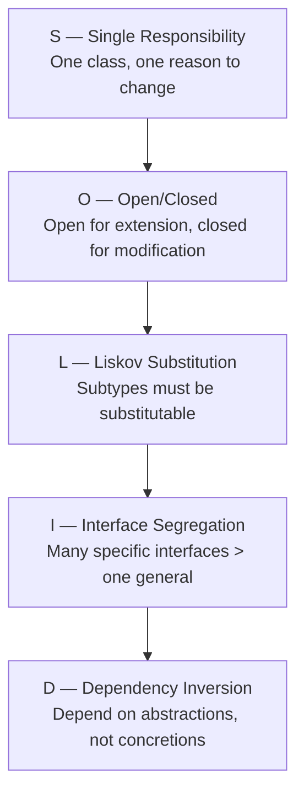

# PART 2: ADVANCED PYTHON PATTERNS
# ━━━━━━━━━━━━━━━━━━━━━━━━━━━━━━━━━━━━━━━━━━━━━━

## 1.1 SOLID Principles in Python



```python
from abc import ABC, abstractmethod
from dataclasses import dataclass

# ═══════════════════════════════════════════
# S — Single Responsibility
# ═══════════════════════════════════════════

# BAD: One class does everything
class UserManagerBad:
    def create_user(self, data): ...
    def send_email(self, user): ...      # Not its job
    def generate_report(self, user): ... # Not its job

# GOOD: Separate responsibilities
class UserService:
    def create_user(self, data: dict) -> "User": ...
    def get_user(self, user_id: int) -> "User": ...

class EmailService:
    def send_welcome_email(self, user: "User") -> None: ...

class ReportService:
    def generate_user_report(self, user: "User") -> str: ...


# ═══════════════════════════════════════════
# O — Open/Closed via Strategy Pattern
# ═══════════════════════════════════════════

class NotificationChannel(ABC):
    @abstractmethod
    def send(self, recipient: str, message: str) -> bool: ...

class EmailNotification(NotificationChannel):
    def send(self, recipient: str, message: str) -> bool:
        print(f"Email to {recipient}: {message}")
        return True

class SMSNotification(NotificationChannel):
    def send(self, recipient: str, message: str) -> bool:
        print(f"SMS to {recipient}: {message}")
        return True

class SlackNotification(NotificationChannel):
    def send(self, recipient: str, message: str) -> bool:
        print(f"Slack to {recipient}: {message}")
        return True

class NotificationService:
    """Open for extension (new channels), closed for modification."""
    def __init__(self, channels: list[NotificationChannel]):
        self.channels = channels

    def notify_all(self, recipient: str, message: str) -> None:
        for channel in self.channels:
            channel.send(recipient, message)

# Adding Slack required ZERO changes to NotificationService
service = NotificationService([
    EmailNotification(),
    SMSNotification(),
    SlackNotification(),
])


# ═══════════════════════════════════════════
# D — Dependency Inversion
# ═══════════════════════════════════════════

# Abstraction
class UserRepository(ABC):
    @abstractmethod
    async def get_by_id(self, user_id: int) -> dict | None: ...
    @abstractmethod
    async def save(self, user: dict) -> int: ...

# Concrete implementations
class PostgresUserRepository(UserRepository):
    async def get_by_id(self, user_id: int) -> dict | None:
        # ... actual DB query ...
        return {"id": user_id, "name": "Alice"}

    async def save(self, user: dict) -> int:
        # ... actual DB insert ...
        return 1

class InMemoryUserRepository(UserRepository):
    """For testing."""
    def __init__(self):
        self._store: dict[int, dict] = {}
        self._next_id = 1

    async def get_by_id(self, user_id: int) -> dict | None:
        return self._store.get(user_id)

    async def save(self, user: dict) -> int:
        uid = self._next_id
        self._next_id += 1
        user["id"] = uid
        self._store[uid] = user
        return uid

# Service depends on ABSTRACTION, not concrete DB
class UserApplicationService:
    def __init__(self, repo: UserRepository):
        self.repo = repo  # injected dependency

    async def register_user(self, name: str, email: str) -> int:
        user = {"name": name, "email": email}
        return await self.repo.save(user)
```

---

## 1.2 Design Patterns in Python

```python
# ═══════════════════════════════════════════
# REPOSITORY PATTERN (already shown above)
# STRATEGY PATTERN (already shown above)
# ═══════════════════════════════════════════

# ═══════════════════════════════════════════
# FACTORY PATTERN
# ═══════════════════════════════════════════

class Serializer(ABC):
    @abstractmethod
    def serialize(self, data: dict) -> str: ...

class JSONSerializer(Serializer):
    def serialize(self, data: dict) -> str:
        import json
        return json.dumps(data)

class XMLSerializer(Serializer):
    def serialize(self, data: dict) -> str:
        # simplified
        items = "".join(f"<{k}>{v}</{k}>" for k, v in data.items())
        return f"<root>{items}</root>"

class YAMLSerializer(Serializer):
    def serialize(self, data: dict) -> str:
        import yaml
        return yaml.dump(data)

def create_serializer(format: str) -> Serializer:
    """Factory function."""
    registry: dict[str, type[Serializer]] = {
        "json": JSONSerializer,
        "xml":  XMLSerializer,
        "yaml": YAMLSerializer,
    }
    cls = registry.get(format.lower())
    if cls is None:
        raise ValueError(f"Unsupported format: {format}")
    return cls()


# ═══════════════════════════════════════════
# OBSERVER / EVENT PATTERN
# ═══════════════════════════════════════════

from collections import defaultdict

class EventBus:
    def __init__(self):
        self._subscribers: dict[str, list[Callable]] = defaultdict(list)

    def subscribe(self, event: str, handler: Callable) -> None:
        self._subscribers[event].append(handler)

    def unsubscribe(self, event: str, handler: Callable) -> None:
        self._subscribers[event].remove(handler)

    def publish(self, event: str, **data) -> None:
        for handler in self._subscribers.get(event, []):
            handler(**data)

    def on(self, event: str):
        """Decorator form."""
        def decorator(func):
            self.subscribe(event, func)
            return func
        return decorator

bus = EventBus()

@bus.on("user.created")
def send_welcome(user_id: int, email: str, **_):
    print(f"Welcome email → {email}")

@bus.on("user.created")
def init_profile(user_id: int, **_):
    print(f"Profile created for user {user_id}")

bus.publish("user.created", user_id=42, email="a@b.com")


# ═══════════════════════════════════════════
# CIRCUIT BREAKER PATTERN
# ═══════════════════════════════════════════

import enum

class CircuitState(enum.Enum):
    CLOSED = "closed"        # Normal operation
    OPEN = "open"            # Failing, reject calls
    HALF_OPEN = "half_open"  # Testing recovery

class CircuitBreaker:
    def __init__(
        self,
        failure_threshold: int = 5,
        recovery_timeout: float = 30.0,
        expected_exception: type[Exception] = Exception,
    ):
        self.failure_threshold = failure_threshold
        self.recovery_timeout = recovery_timeout
        self.expected_exception = expected_exception
        self._state = CircuitState.CLOSED
        self._failure_count = 0
        self._last_failure_time: float | None = None

    @property
    def state(self) -> CircuitState:
        if self._state == CircuitState.OPEN:
            if (
                self._last_failure_time
                and time.time() - self._last_failure_time >= self.recovery_timeout
            ):
                self._state = CircuitState.HALF_OPEN
        return self._state

    def __call__(self, func: Callable[P, R]) -> Callable[P, R]:
        @functools.wraps(func)
        def wrapper(*args: P.args, **kwargs: P.kwargs) -> R:
            if self.state == CircuitState.OPEN:
                raise RuntimeError(f"Circuit breaker OPEN for {func.__name__}")

            try:
                result = func(*args, **kwargs)
                self._on_success()
                return result
            except self.expected_exception as e:
                self._on_failure()
                raise

        return wrapper

    def _on_success(self):
        self._failure_count = 0
        self._state = CircuitState.CLOSED

    def _on_failure(self):
        self._failure_count += 1
        self._last_failure_time = time.time()
        if self._failure_count >= self.failure_threshold:
            self._state = CircuitState.OPEN

# Usage
api_breaker = CircuitBreaker(failure_threshold=3, recovery_timeout=60)

@api_breaker
def call_external_api(endpoint: str) -> dict:
    # ... HTTP call ...
    return {}
```

---

# ━━━━━━━━━━━━━━━━━━━━━━━━━━━━━━━━━━━━━━━━━━━━━━