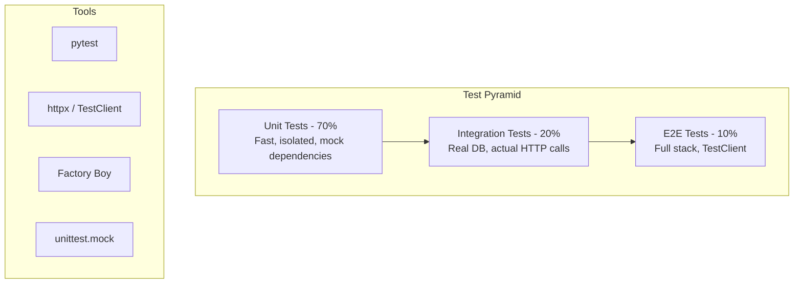

# PART 6: TESTING
# ━━━━━━━━━━━━━━━━━━━━━━━━━━━━━━━━━━━━━━━━━━━━━━



```python
# tests/conftest.py
import pytest
import asyncio
from httpx import AsyncClient, ASGITransport
from sqlalchemy.ext.asyncio import create_async_engine, AsyncSession, async_sessionmaker
from app.main import create_app
from app.db.session import Base, get_db
from app.config import Settings, get_settings

# Use SQLite for tests
TEST_DATABASE_URL = "sqlite+aiosqlite:///./test.db"


def get_test_settings() -> Settings:
    return Settings(
        database_url=TEST_DATABASE_URL,
        secret_key="test-secret-key-minimum-32-chars!!!",
        debug=True,
    )


@pytest.fixture(scope="session")
def event_loop():
    loop = asyncio.new_event_loop()
    yield loop
    loop.close()


@pytest.fixture(scope="session")
async def test_engine():
    engine = create_async_engine(TEST_DATABASE_URL, echo=True)
    async with engine.begin() as conn:
        await conn.run_sync(Base.metadata.create_all)
    yield engine
    async with engine.begin() as conn:
        await conn.run_sync(Base.metadata.drop_all)
    await engine.dispose()


@pytest.fixture
async def db_session(test_engine):
    """Each test gets a fresh session with transaction rollback."""
    session_factory = async_sessionmaker(
        bind=test_engine, class_=AsyncSession, expire_on_commit=False
    )
    async with session_factory() as session:
        async with session.begin():
            yield session
        await session.rollback()


@pytest.fixture
async def client(db_session):
    """Async test client with overridden dependencies."""
    app = create_app()

    async def override_get_db():
        yield db_session

    app.dependency_overrides[get_db] = override_get_db
    app.dependency_overrides[get_settings] = get_test_settings

    transport = ASGITransport(app=app)
    async with AsyncClient(transport=transport, base_url="http://test") as c:
        yield c

    app.dependency_overrides.clear()
```

```python
# tests/test_users.py
import pytest
from httpx import AsyncClient


@pytest.mark.asyncio
class TestUserAPI:
    async def test_create_user(self, client: AsyncClient):
        response = await client.post("/api/v1/users/", json={
            "username": "testuser",
            "email": "test@example.com",
            "password": "SecurePass123!",
            "password_confirm": "SecurePass123!",
            "full_name": "Test User",
        })
        assert response.status_code == 201
        data = response.json()
        assert data["username"] == "testuser"
        assert data["email"] == "test@example.com"
        assert "password" not in data  # password should NEVER be returned

    async def test_create_user_duplicate_email(self, client: AsyncClient):
        # Create first user
        user_data = {
            "username": "user1",
            "email": "dupe@example.com",
            "password": "SecurePass123!",
            "password_confirm": "SecurePass123!",
            "full_name": "User One",
        }
        await client.post("/api/v1/users/", json=user_data)

        # Try to create another with same email
        user_data["username"] = "user2"
        response = await client.post("/api/v1/users/", json=user_data)
        assert response.status_code == 409

    async def test_create_user_password_mismatch(self, client: AsyncClient):
        response = await client.post("/api/v1/users/", json={
            "username": "testuser",
            "email": "test@example.com",
            "password": "SecurePass123!",
            "password_confirm": "DifferentPass!",
            "full_name": "Test User",
        })
        assert response.status_code == 422  # Validation error

    async def test_create_user_invalid_email(self, client: AsyncClient):
        response = await client.post("/api/v1/users/", json={
            "username": "testuser",
            "email": "not-an-email",
            "password": "SecurePass123!",
            "password_confirm": "SecurePass123!",
            "full_name": "Test User",
        })
        assert response.status_code == 422


# ─── Unit Tests with Mocking ───
from unittest.mock import AsyncMock, MagicMock
from app.services.user_service import UserService
from app.models.user import UserCreate, UserResponse


@pytest.mark.asyncio
class TestUserService:
    async def test_create_user_calls_repo(self):
        # Arrange
        mock_repo = AsyncMock()
        mock_repo.exists.return_value = False
        mock_repo.create.return_value = MagicMock(
            id=1,
            username="alice",
            email="alice@example.com",
            full_name="Alice Smith",
            role="user",
            is_active=True,
            created_at="2024-01-01T00:00:00",
            updated_at="2024-01-01T00:00:00",
        )

        service = UserService(repo=mock_repo)

        data = UserCreate(
            username="alice",
            email="alice@example.com",
            password="SecurePass123!",
            password_confirm="SecurePass123!",
            full_name="Alice Smith",
        )

        # Act
        result = await service.create_user(data)

        # Assert
        mock_repo.exists.assert_called_once()
        mock_repo.create.assert_called_once()
        assert result.username == "alice"
```

---

# ━━━━━━━━━━━━━━━━━━━━━━━━━━━━━━━━━━━━━━━━━━━━━━