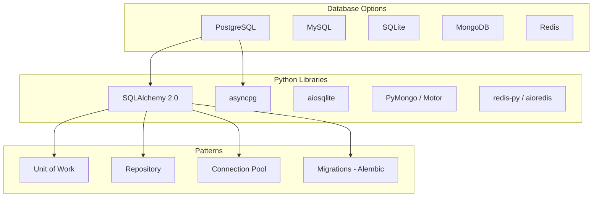

# PART 5: DATABASE CONNECTIONS & PATTERNS
# ━━━━━━━━━━━━━━━━━━━━━━━━━━━━━━━━━━━━━━━━━━━━━━



## 1.1 SQLAlchemy 2.0 — Complete Reference

**(Already shown in FastAPI sections above. Here are additional patterns.)**

```python
# ─── Raw SQL with SQLAlchemy (when ORM is overkill) ───
from sqlalchemy import text

async def execute_raw_query(session: AsyncSession):
    # Parameterized query (NEVER use f-strings for SQL!)
    stmt = text("""
        SELECT u.id, u.username, COUNT(p.id) as post_count
        FROM users u
        LEFT JOIN posts p ON p.author_id = u.id
        WHERE u.is_active = :is_active
        GROUP BY u.id, u.username
        HAVING COUNT(p.id) > :min_posts
        ORDER BY post_count DESC
        LIMIT :limit
    """)

    result = await session.execute(stmt, {
        "is_active": True,
        "min_posts": 5,
        "limit": 10,
    })

    rows = result.fetchall()
    return [{"id": r.id, "username": r.username, "posts": r.post_count} for r in rows]


# ─── Bulk Operations ───
async def bulk_insert_users(session: AsyncSession, users_data: list[dict]):
    from sqlalchemy.dialects.postgresql import insert

    stmt = insert(UserDB).values(users_data)
    # Upsert (PostgreSQL-specific)
    stmt = stmt.on_conflict_do_update(
        index_elements=["email"],
        set_={"full_name": stmt.excluded.full_name},
    )
    await session.execute(stmt)
    await session.commit()


# ─── Complex Queries ───
from sqlalchemy import select, func, case, and_, or_

async def user_statistics(session: AsyncSession):
    stmt = (
        select(
            UserDB.role,
            func.count(UserDB.id).label("total"),
            func.count(
                case((UserDB.is_active == True, 1))
            ).label("active"),
            func.avg(
                func.extract("epoch", func.now() - UserDB.created_at) / 86400
            ).label("avg_age_days"),
        )
        .group_by(UserDB.role)
    )
    result = await session.execute(stmt)
    return result.fetchall()
```

## 1.2 Alembic Migrations

```python
# alembic/env.py (key parts)
from app.db.session import Base
from app.db.models import UserDB, PostDB  # Import all models

target_metadata = Base.metadata

# Configure async support
# alembic init -t async alembic

"""
Terminal commands:

# Generate migration from model changes
alembic revision --autogenerate -m "add users table"

# Apply migrations
alembic upgrade head

# Rollback one step
alembic downgrade -1

# Show current revision
alembic current

# Show migration history
alembic history --verbose
"""
```

```python
# Example migration file: alembic/versions/001_add_users.py
"""add users table

Revision ID: abc123
"""
from alembic import op
import sqlalchemy as sa


def upgrade() -> None:
    op.create_table(
        "users",
        sa.Column("id", sa.Integer(), primary_key=True),
        sa.Column("username", sa.String(50), unique=True, nullable=False),
        sa.Column("email", sa.String(255), unique=True, nullable=False),
        sa.Column("hashed_password", sa.String(255), nullable=False),
        sa.Column("is_active", sa.Boolean(), server_default="true"),
        sa.Column("created_at", sa.DateTime(timezone=True), server_default=sa.func.now()),
    )
    op.create_index("ix_users_email", "users", ["email"])


def downgrade() -> None:
    op.drop_index("ix_users_email")
    op.drop_table("users")
```

## 1.3 Redis Integration

```python
# app/cache/redis.py
import redis.asyncio as redis
from typing import Any
import json
from app.config import get_settings

settings = get_settings()


class RedisCache:
    def __init__(self, url: str = ""):
        self.url = url or settings.redis_url
        self._pool: redis.ConnectionPool | None = None
        self._client: redis.Redis | None = None

    async def connect(self) -> None:
        self._pool = redis.ConnectionPool.from_url(
            self.url,
            max_connections=20,
            decode_responses=True,
        )
        self._client = redis.Redis(connection_pool=self._pool)

    async def disconnect(self) -> None:
        if self._client:
            await self._client.close()

    @property
    def client(self) -> redis.Redis:
        if self._client is None:
            raise RuntimeError("Redis not connected. Call connect() first.")
        return self._client

    # ─── Key-Value Operations ───
    async def get(self, key: str) -> Any | None:
        value = await self.client.get(key)
        if value is not None:
            try:
                return json.loads(value)
            except (json.JSONDecodeError, TypeError):
                return value
        return None

    async def set(
        self, key: str, value: Any, ttl: int | None = 300
    ) -> None:
        serialized = json.dumps(value) if not isinstance(value, str) else value
        if ttl:
            await self.client.setex(key, ttl, serialized)
        else:
            await self.client.set(key, serialized)

    async def delete(self, key: str) -> None:
        await self.client.delete(key)

    async def delete_pattern(self, pattern: str) -> int:
        """Delete all keys matching pattern."""
        keys = []
        async for key in self.client.scan_iter(match=pattern):
            keys.append(key)
        if keys:
            return await self.client.delete(*keys)
        return 0

    # ─── Cache-aside pattern ───
    async def get_or_set(
        self,
        key: str,
        factory,  # async callable
        ttl: int = 300,
    ) -> Any:
        """Return cached value or compute and cache it."""
        cached = await self.get(key)
        if cached is not None:
            return cached

        value = await factory()
        await self.set(key, value, ttl=ttl)
        return value


# ─── Cache Decorator ───
from functools import wraps

cache = RedisCache()

def cached(prefix: str, ttl: int = 300):
    """Decorator for caching function results in Redis."""
    def decorator(func):
        @wraps(func)
        async def wrapper(*args, **kwargs):
            # Build cache key from function name + arguments
            key_parts = [prefix, func.__name__]
            key_parts.extend(str(a) for a in args)
            key_parts.extend(f"{k}={v}" for k, v in sorted(kwargs.items()))
            cache_key = ":".join(key_parts)

            # Check cache
            result = await cache.get(cache_key)
            if result is not None:
                return result

            # Compute and cache
            result = await func(*args, **kwargs)
            await cache.set(cache_key, result, ttl=ttl)
            return result
        return wrapper
    return decorator

# Usage
@cached(prefix="users", ttl=60)
async def get_user_profile(user_id: int) -> dict:
    # ... expensive DB query ...
    return {"id": user_id, "name": "Alice"}
```

## 1.4 MongoDB with Motor (Async)

```python
# app/db/mongo.py
from motor.motor_asyncio import AsyncIOMotorClient, AsyncIOMotorDatabase
from pydantic import BaseModel
from typing import Any
from datetime import datetime


class MongoConnection:
    def __init__(self, uri: str, db_name: str):
        self.client = AsyncIOMotorClient(uri)
        self.db: AsyncIOMotorDatabase = self.client[db_name]

    async def close(self):
        self.client.close()


# ─── Document Repository ───
class MongoRepository:
    def __init__(self, db: AsyncIOMotorDatabase, collection: str):
        self.collection = db[collection]

    async def find_one(self, filter: dict) -> dict | None:
        doc = await self.collection.find_one(filter)
        if doc:
            doc["id"] = str(doc.pop("_id"))
        return doc

    async def find_many(
        self,
        filter: dict | None = None,
        skip: int = 0,
        limit: int = 100,
        sort: list[tuple[str, int]] | None = None,
    ) -> list[dict]:
        cursor = self.collection.find(filter or {})
        if sort:
            cursor = cursor.sort(sort)
        cursor = cursor.skip(skip).limit(limit)

        docs = []
        async for doc in cursor:
            doc["id"] = str(doc.pop("_id"))
            docs.append(doc)
        return docs

    async def insert_one(self, document: dict) -> str:
        document["created_at"] = datetime.utcnow()
        result = await self.collection.insert_one(document)
        return str(result.inserted_id)

    async def update_one(self, filter: dict, update: dict) -> bool:
        update["updated_at"] = datetime.utcnow()
        result = await self.collection.update_one(
            filter, {"$set": update}
        )
        return result.modified_count > 0

    async def delete_one(self, filter: dict) -> bool:
        result = await self.collection.delete_one(filter)
        return result.deleted_count > 0

    async def count(self, filter: dict | None = None) -> int:
        return await self.collection.count_documents(filter or {})

    async def aggregate(self, pipeline: list[dict]) -> list[dict]:
        cursor = self.collection.aggregate(pipeline)
        return [doc async for doc in cursor]


# Usage
# mongo = MongoConnection("mongodb://localhost:27017", "myapp")
# events_repo = MongoRepository(mongo.db, "events")
# await events_repo.insert_one({"type": "click", "user_id": 42, "page": "/home"})
```

---

# ━━━━━━━━━━━━━━━━━━━━━━━━━━━━━━━━━━━━━━━━━━━━━━