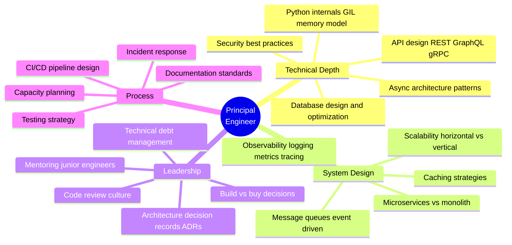

# PART 8: INTERVIEW CHEAT SHEET
# ━━━━━━━━━━━━━━━━━━━━━━━━━━━━━━━━━━━━━━━━━━━━━━



## Key Topics to Articulate

| Topic | What to Demonstrate |
|-------|-------------------|
| **GIL** | Explain what it is, when it matters, workarounds (multiprocessing, C extensions, free-threaded 3.13) |
| **async vs threading** | I/O-bound → async/threading; CPU-bound → multiprocessing. Know when NOT to use async |
| **Connection pooling** | Why it matters, how SQLAlchemy manages it, pool sizing heuristics |
| **N+1 queries** | Detect, explain, fix with eager loading (selectinload, joinedload) |
| **Dependency injection** | FastAPI's Depends(), testability, loose coupling |
| **12-Factor App** | Config via env vars, stateless processes, disposability, dev/prod parity |
| **API versioning** | URL prefix (/v1/), header-based, why and when |
| **Idempotency** | PUT is idempotent, POST is not, idempotency keys for payment APIs |
| **CQRS** | Command vs Query separation, when it's worth the complexity |
| **Event-driven** | Pub/Sub, event sourcing, eventual consistency trade-offs |
| **Observability** | Structured logging, distributed tracing (OpenTelemetry), metrics (Prometheus) |
| **Security** | OWASP Top 10, SQL injection prevention (parameterized queries), JWT best practices |

---

## Docker Setup for Development

```dockerfile
# Dockerfile
FROM python:3.12-slim

WORKDIR /app

# Install system deps
RUN apt-get update && apt-get install -y --no-install-recommends \
    build-essential libpq-dev \
    && rm -rf /var/lib/apt/lists/*

# Install Python deps
COPY pyproject.toml .
RUN pip install --no-cache-dir -e ".[dev]"

COPY . .

CMD ["uvicorn", "app.main:app", "--host", "0.0.0.0", "--port", "8000"]
```

```yaml
# docker-compose.yml
services:
  api:
    build: .
    ports:
      - "8000:8000"
    environment:
      - DATABASE_URL=postgresql+asyncpg://postgres:postgres@db:5432/myapp
      - REDIS_URL=redis://redis:6379/0
      - SECRET_KEY=dev-secret-key-must-be-at-least-32-chars
    depends_on:
      db:
        condition: service_healthy
      redis:
        condition: service_healthy
    volumes:
      - .:/app
    command: uvicorn app.main:app --host 0.0.0.0 --port 8000 --reload

  db:
    image: postgres:16-alpine
    environment:
      POSTGRES_USER: postgres
      POSTGRES_PASSWORD: postgres
      POSTGRES_DB: myapp
    ports:
      - "5432:5432"
    volumes:
      - pgdata:/var/lib/postgresql/data
    healthcheck:
      test: ["CMD-SHELL", "pg_isready -U postgres"]
      interval: 5s
      timeout: 5s
      retries: 5

  redis:
    image: redis:7-alpine
    ports:
      - "6379:6379"
    healthcheck:
      test: ["CMD", "redis-cli", "ping"]
      interval: 5s
      timeout: 5s
      retries: 5

volumes:
  pgdata:
```

---

> **Study approach**: Don't just read — **type out and run** each section. Build a small project that combines FastAPI + SQLAlchemy + Redis + tests. Be prepared to whiteboard any architecture diagram above and explain trade-offs. A principal engineer is expected to **justify decisions**, not just implement them.