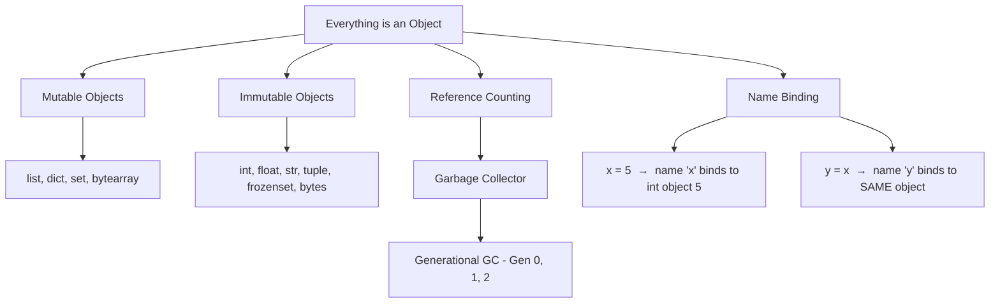
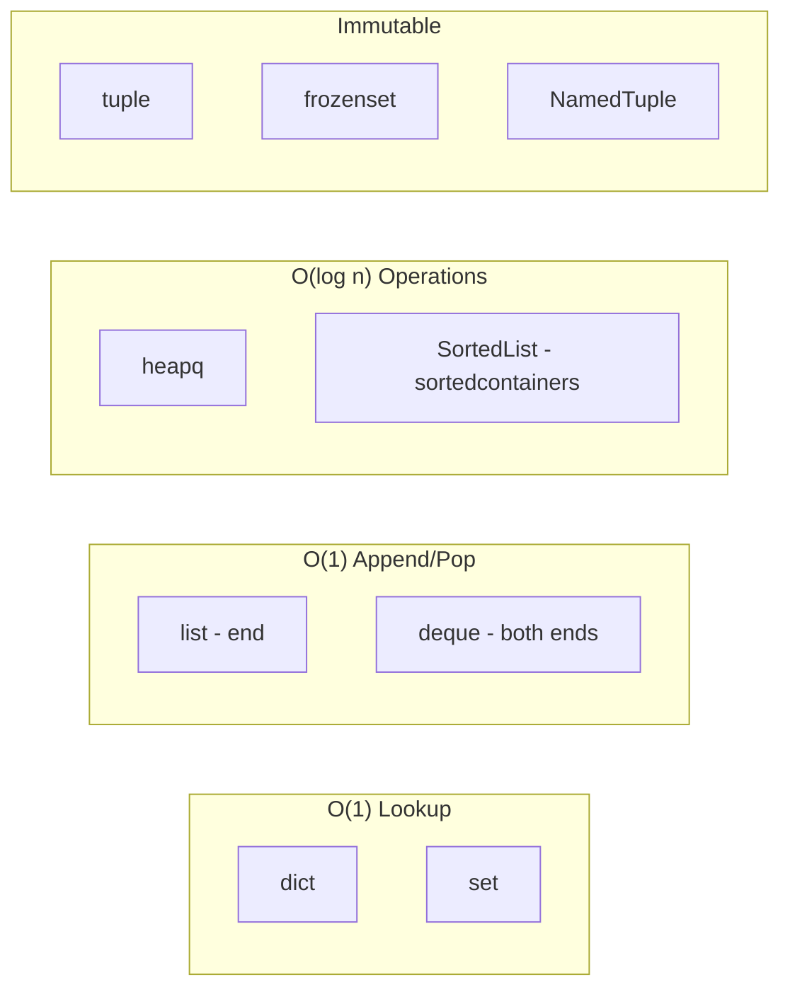
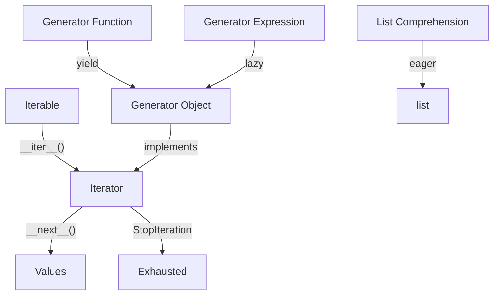
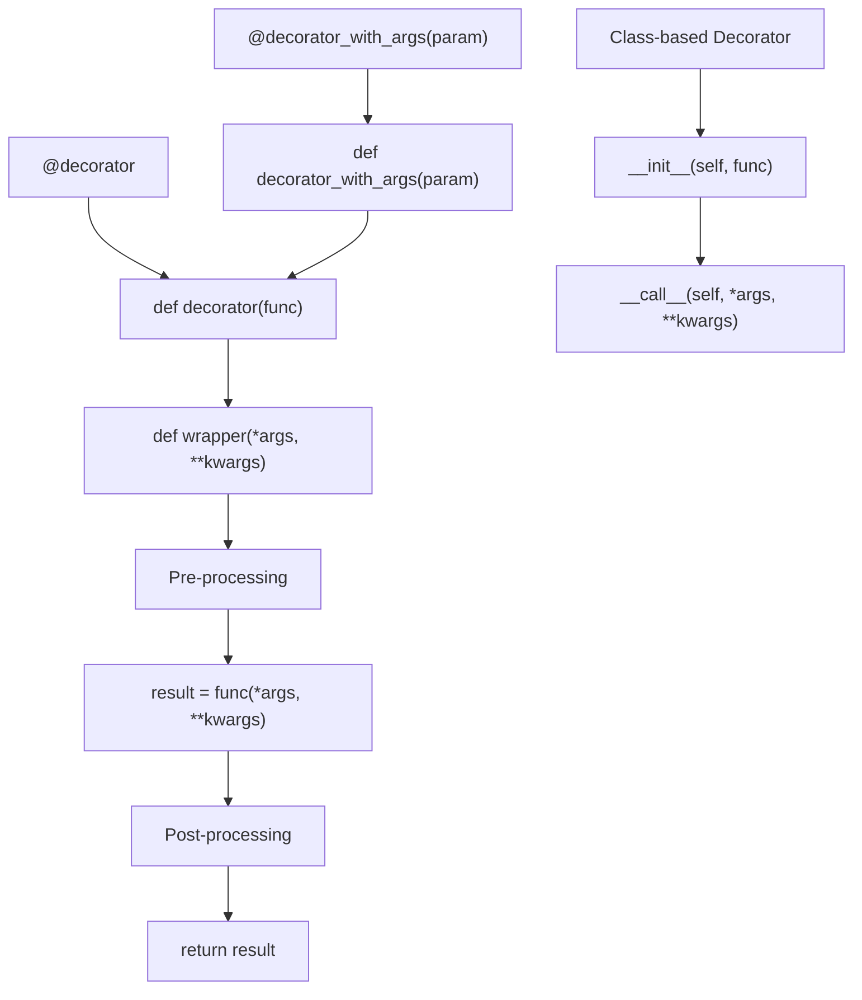
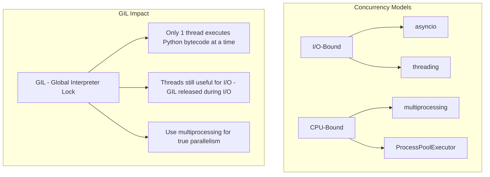

# PART 1: PYTHON CORE MASTERY
# ━━━━━━━━━━━━━━━━━━━━━━━━━━━━━━━━━━━━━━━━━━━━━━

## 1.1 Python Memory Model & Object System



### Key Concepts Every Principal Must Know

```python
import sys

# ─── Reference Counting ───
a = [1, 2, 3]
print(sys.getrefcount(a))  # 2 (a + getrefcount arg)

b = a          # refcount → 3
c = a          # refcount → 4
del b          # refcount → 3

# ─── Identity vs Equality ───
x = [1, 2, 3]
y = [1, 2, 3]
z = x

print(x == y)   # True  (value equality)
print(x is y)   # False (different objects)
print(x is z)   # True  (same object)

# ─── Integer Interning (CPython implementation detail) ───
a = 256
b = 256
print(a is b)  # True — CPython caches [-5, 256]

a = 257
b = 257
print(a is b)  # False (outside cache range, may vary)

# ─── String Interning ───
s1 = "hello"
s2 = "hello"
print(s1 is s2)  # True — simple strings are interned

# ─── Shallow vs Deep Copy ───
import copy

original = [[1, 2], [3, 4]]
shallow  = copy.copy(original)
deep     = copy.deepcopy(original)

original[0][0] = 99
print(shallow[0][0])  # 99 — inner list is shared
print(deep[0][0])     # 1  — completely independent
```

### Mutable Default Arguments Trap

```python
# ─── THE BUG ───
def append_to(element, target=[]):
    """WRONG: default list is shared across all calls."""
    target.append(element)
    return target

print(append_to(1))  # [1]
print(append_to(2))  # [1, 2] ← unexpected!

# ─── THE FIX ───
def append_to(element, target=None):
    """CORRECT: use None sentinel and create new list."""
    if target is None:
        target = []
    target.append(element)
    return target
```

---

## 1.2 Python Data Structures — When & Why



```python
from collections import (
    defaultdict, Counter, OrderedDict, deque, ChainMap, namedtuple
)
from dataclasses import dataclass, field
from typing import NamedTuple
import heapq

# ─── defaultdict: Automatic default values ───
word_count = defaultdict(int)
for word in ["apple", "banana", "apple", "cherry", "banana", "apple"]:
    word_count[word] += 1
# {'apple': 3, 'banana': 2, 'cherry': 1}

# Grouping pattern
groups = defaultdict(list)
records = [("eng", "Alice"), ("sales", "Bob"), ("eng", "Carol")]
for dept, name in records:
    groups[dept].append(name)
# {'eng': ['Alice', 'Carol'], 'sales': ['Bob']}

# ─── Counter: Frequency analysis ───
text = "abracadabra"
freq = Counter(text)
print(freq.most_common(3))  # [('a', 5), ('b', 2), ('r', 2)]

# Counter arithmetic
c1 = Counter(a=3, b=1)
c2 = Counter(a=1, b=2)
print(c1 + c2)  # Counter({'a': 4, 'b': 3})
print(c1 - c2)  # Counter({'a': 2})  — drops zero/negative

# ─── deque: O(1) operations on both ends ───
dq = deque(maxlen=5)
for i in range(7):
    dq.append(i)
print(dq)  # deque([2, 3, 4, 5, 6], maxlen=5) — auto-eviction

dq.appendleft(99)
dq.rotate(2)  # rotate right

# ─── heapq: Priority queue (min-heap) ───
tasks = [(3, "low"), (1, "critical"), (2, "medium")]
heapq.heapify(tasks)
print(heapq.heappop(tasks))  # (1, 'critical')

# nlargest / nsmallest
data = [15, 3, 92, 7, 41, 28]
print(heapq.nlargest(3, data))   # [92, 41, 28]
print(heapq.nsmallest(2, data))  # [3, 7]

# ─── ChainMap: Layered lookups (config, env, defaults) ───
defaults  = {"color": "red", "size": "medium"}
env_vars  = {"color": "blue"}
cli_args  = {"size": "large"}

config = ChainMap(cli_args, env_vars, defaults)
print(config["color"])  # blue (from env_vars)
print(config["size"])   # large (from cli_args)

# ─── Modern NamedTuple (typed) ───
class Point(NamedTuple):
    x: float
    y: float
    z: float = 0.0

p = Point(1.0, 2.0)
print(p.x, p.y, p.z)  # 1.0 2.0 0.0
print(p[0])            # 1.0  — still indexable

# ─── dataclass: The modern struct ───
@dataclass(frozen=True, slots=True)
class Config:
    host: str
    port: int = 8080
    tags: list[str] = field(default_factory=list)

    @property
    def base_url(self) -> str:
        return f"http://{self.host}:{self.port}"

c = Config(host="localhost")
print(c.base_url)  # http://localhost:8080
```

---

## 1.3 Type Hints — Production-Grade Typing

```python
from typing import (
    Optional, Union, TypeVar, Generic, Protocol,
    Literal, TypeAlias, Annotated, TypeGuard,
    overload, Final, ClassVar
)
from collections.abc import Callable, Iterator, AsyncIterator, Sequence

# ─── Basic Types (3.10+ syntax) ───
def greet(name: str, age: int | None = None) -> str:
    if age is not None:
        return f"Hello {name}, age {age}"
    return f"Hello {name}"

# ─── TypeAlias ───
JSON: TypeAlias = dict[str, "JSON"] | list["JSON"] | str | int | float | bool | None
UserId: TypeAlias = int

# ─── TypeVar and Generics ───
T = TypeVar("T")
K = TypeVar("K")
V = TypeVar("V")

class Registry(Generic[K, V]):
    def __init__(self) -> None:
        self._store: dict[K, V] = {}

    def register(self, key: K, value: V) -> None:
        self._store[key] = value

    def get(self, key: K) -> V | None:
        return self._store.get(key)

    def all(self) -> list[V]:
        return list(self._store.values())

# Usage
reg = Registry[str, int]()
reg.register("users", 42)

# ─── Protocol: Structural Subtyping (duck typing with types) ───
class Renderable(Protocol):
    def render(self) -> str: ...

class HTMLWidget:
    def render(self) -> str:
        return "<div>Hello</div>"

class JSONResponse:
    def render(self) -> str:
        return '{"status": "ok"}'

def display(item: Renderable) -> None:
    """Accepts ANY object with a render() -> str method."""
    print(item.render())

display(HTMLWidget())     # works
display(JSONResponse())   # works — no inheritance required

# ─── TypeGuard for type narrowing ───
def is_string_list(val: list[object]) -> TypeGuard[list[str]]:
    return all(isinstance(x, str) for x in val)

def process(data: list[object]) -> None:
    if is_string_list(data):
        # type checker now knows data is list[str]
        print(", ".join(data))

# ─── Callable types ───
Handler = Callable[[str, int], bool]

def retry(fn: Handler, retries: int = 3) -> bool:
    for _ in range(retries):
        if fn("test", 1):
            return True
    return False

# ─── overload for different return types ───
@overload
def parse(raw: str) -> dict[str, str]: ...
@overload
def parse(raw: bytes) -> list[int]: ...

def parse(raw: str | bytes) -> dict[str, str] | list[int]:
    if isinstance(raw, str):
        return {"data": raw}
    return list(raw)

# ─── Literal ───
def set_mode(mode: Literal["read", "write", "append"]) -> None:
    print(f"Mode: {mode}")

set_mode("read")    # OK
# set_mode("delete")  # type error

# ─── Final & ClassVar ───
MAX_RETRIES: Final = 3

@dataclass
class Connection:
    _pool_size: ClassVar[int] = 10  # class-level, not instance
    host: str
    port: int
```

---

## 1.4 Iterators, Generators & Comprehensions



```python
from collections.abc import Iterator, Generator
from itertools import (
    chain, islice, groupby, product, combinations,
    permutations, accumulate, starmap, tee, zip_longest
)

# ─── Custom Iterator ───
class Fibonacci:
    """Infinite Fibonacci iterator."""
    def __init__(self):
        self.a, self.b = 0, 1

    def __iter__(self) -> "Fibonacci":
        return self

    def __next__(self) -> int:
        result = self.a
        self.a, self.b = self.b, self.a + self.b
        return result

# Take first 10 Fibonacci numbers
fib = Fibonacci()
first_10 = list(islice(fib, 10))
# [0, 1, 1, 2, 3, 5, 8, 13, 21, 34]

# ─── Generator Function ───
def read_large_file(path: str, chunk_size: int = 8192) -> Generator[str, None, None]:
    """Memory-efficient file reader."""
    with open(path, "r") as f:
        while True:
            chunk = f.read(chunk_size)
            if not chunk:
                break
            yield chunk

# ─── Generator with send() — Coroutine Pattern ───
def running_average() -> Generator[float, float, str]:
    """Accepts values via send(), yields running average."""
    total = 0.0
    count = 0
    while True:
        value = yield (total / count if count else 0.0)
        if value is None:
            break
        total += value
        count += 1
    return f"Final: {total/count:.2f} over {count} values"

avg = running_average()
next(avg)           # prime the generator
avg.send(10)        # 10.0
avg.send(20)        # 15.0
avg.send(30)        # 20.0

# ─── Generator Pipelines (Unix-pipe style) ───
def read_lines(path: str) -> Generator[str, None, None]:
    with open(path) as f:
        yield from f  # delegation with yield from

def strip_lines(lines):
    for line in lines:
        yield line.strip()

def filter_nonempty(lines):
    for line in lines:
        if line:
            yield line

def to_upper(lines):
    for line in lines:
        yield line.upper()

# Pipeline: read → strip → filter → uppercase
# pipeline = to_upper(filter_nonempty(strip_lines(read_lines("data.txt"))))
# for line in pipeline:
#     print(line)

# ─── itertools Mastery ───

# chain: Flatten multiple iterables
merged = list(chain([1, 2], [3, 4], [5, 6]))
# [1, 2, 3, 4, 5, 6]

# groupby: Group consecutive elements (MUST be sorted first)
data = sorted([
    {"dept": "eng", "name": "Alice"},
    {"dept": "sales", "name": "Bob"},
    {"dept": "eng", "name": "Carol"},
], key=lambda x: x["dept"])

for dept, members in groupby(data, key=lambda x: x["dept"]):
    print(dept, list(members))

# accumulate: Running totals
from operator import mul
list(accumulate([1, 2, 3, 4, 5]))         # [1, 3, 6, 10, 15]
list(accumulate([1, 2, 3, 4, 5], mul))     # [1, 2, 6, 24, 120]

# product: Cartesian product
list(product("AB", [1, 2]))  # [('A',1),('A',2),('B',1),('B',2)]

# tee: Clone an iterator
orig = iter(range(5))
a, b = tee(orig, 2)  # two independent copies

# ─── Comprehension Patterns ───
matrix = [[1, 2, 3], [4, 5, 6], [7, 8, 9]]

# Flatten
flat = [x for row in matrix for x in row]

# Transpose
transposed = [[row[i] for row in matrix] for i in range(3)]

# Dict comprehension with filtering
scores = {"alice": 85, "bob": 62, "carol": 91, "dave": 55}
passing = {name: score for name, score in scores.items() if score >= 70}

# Set comprehension
unique_lengths = {len(word) for word in ["hello", "world", "hi", "hey"]}

# Walrus operator in comprehension (3.8+)
results = [
    cleaned
    for raw in ["  hello  ", "", "  world  ", "   "]
    if (cleaned := raw.strip())
]
# ['hello', 'world']
```

---

## 1.5 Decorators — From Basics to Production



```python
import functools
import time
import logging
from typing import TypeVar, ParamSpec, Callable, Any

P = ParamSpec("P")
R = TypeVar("R")

logger = logging.getLogger(__name__)

# ─── 1. Basic Decorator ───
def timer(func: Callable[P, R]) -> Callable[P, R]:
    """Measure execution time."""
    @functools.wraps(func)  # preserves __name__, __doc__, etc.
    def wrapper(*args: P.args, **kwargs: P.kwargs) -> R:
        start = time.perf_counter()
        result = func(*args, **kwargs)
        elapsed = time.perf_counter() - start
        logger.info(f"{func.__name__} took {elapsed:.4f}s")
        return result
    return wrapper

@timer
def slow_function():
    time.sleep(0.1)
    return "done"

# ─── 2. Decorator WITH Arguments ───
def retry(
    max_attempts: int = 3,
    exceptions: tuple[type[Exception], ...] = (Exception,),
    delay: float = 1.0,
    backoff: float = 2.0,
):
    """Retry with exponential backoff."""
    def decorator(func: Callable[P, R]) -> Callable[P, R]:
        @functools.wraps(func)
        def wrapper(*args: P.args, **kwargs: P.kwargs) -> R:
            current_delay = delay
            last_exception: Exception | None = None
            for attempt in range(1, max_attempts + 1):
                try:
                    return func(*args, **kwargs)
                except exceptions as e:
                    last_exception = e
                    logger.warning(
                        f"{func.__name__} attempt {attempt}/{max_attempts} "
                        f"failed: {e}. Retrying in {current_delay}s..."
                    )
                    time.sleep(current_delay)
                    current_delay *= backoff
            raise last_exception  # type: ignore
        return wrapper
    return decorator

@retry(max_attempts=3, exceptions=(ConnectionError, TimeoutError), delay=0.5)
def fetch_data(url: str) -> dict:
    # ... HTTP call ...
    return {}

# ─── 3. Class-based Decorator (stateful) ───
class CallCounter:
    """Track how many times a function is called."""
    def __init__(self, func: Callable) -> None:
        functools.update_wrapper(self, func)
        self.func = func
        self.count = 0

    def __call__(self, *args: Any, **kwargs: Any) -> Any:
        self.count += 1
        logger.info(f"{self.func.__name__} called {self.count} times")
        return self.func(*args, **kwargs)

    def reset(self) -> None:
        self.count = 0

@CallCounter
def process_item(item_id: int) -> None:
    pass

process_item(1)
process_item(2)
print(process_item.count)  # 2
process_item.reset()

# ─── 4. Stacking Decorators ───
def log_call(func: Callable[P, R]) -> Callable[P, R]:
    @functools.wraps(func)
    def wrapper(*args: P.args, **kwargs: P.kwargs) -> R:
        logger.info(f"Calling {func.__name__}")
        return func(*args, **kwargs)
    return wrapper

def validate_positive(func: Callable) -> Callable:
    @functools.wraps(func)
    def wrapper(*args: Any, **kwargs: Any) -> Any:
        for arg in args:
            if isinstance(arg, (int, float)) and arg < 0:
                raise ValueError(f"Negative value not allowed: {arg}")
        return func(*args, **kwargs)
    return wrapper

@log_call             # outermost — runs first
@validate_positive    # inner
@timer                # innermost — runs closest to function
def calculate(x: int, y: int) -> int:
    return x + y

# Execution order: log_call → validate_positive → timer → calculate

# ─── 5. Decorator that works with AND without parentheses ───
def cache(func: Callable | None = None, *, maxsize: int = 128):
    """Works as @cache or @cache(maxsize=256)."""
    if func is not None:
        # Called without arguments: @cache
        return functools.lru_cache(maxsize=maxsize)(func)
    # Called with arguments: @cache(maxsize=256)
    def decorator(f: Callable) -> Callable:
        return functools.lru_cache(maxsize=maxsize)(f)
    return decorator

@cache
def fibonacci(n: int) -> int:
    if n < 2:
        return n
    return fibonacci(n - 1) + fibonacci(n - 2)

@cache(maxsize=256)
def factorial(n: int) -> int:
    if n < 2:
        return 1
    return n * factorial(n - 1)
```

---

## 1.6 Context Managers

```python
from contextlib import contextmanager, asynccontextmanager, suppress
import time

# ─── Class-based Context Manager ───
class DatabaseTransaction:
    def __init__(self, connection):
        self.connection = connection

    def __enter__(self):
        self.connection.begin()
        return self.connection

    def __exit__(self, exc_type, exc_val, exc_tb):
        if exc_type is not None:
            self.connection.rollback()
            logger.error(f"Transaction rolled back: {exc_val}")
            return False  # re-raise exception
        self.connection.commit()
        return False

# ─── Generator-based Context Manager ───
@contextmanager
def timed_block(label: str):
    """Time a block of code."""
    start = time.perf_counter()
    try:
        yield  # control goes to the with-block
    except Exception as e:
        logger.error(f"{label} failed: {e}")
        raise
    finally:
        elapsed = time.perf_counter() - start
        logger.info(f"{label} took {elapsed:.4f}s")

with timed_block("data processing"):
    data = [i ** 2 for i in range(1_000_000)]

# ─── Async Context Manager ───
@asynccontextmanager
async def managed_httpx_client():
    import httpx
    client = httpx.AsyncClient(timeout=30.0)
    try:
        yield client
    finally:
        await client.aclose()

# ─── suppress: Ignore specific exceptions ───
with suppress(FileNotFoundError):
    import os
    os.remove("nonexistent_file.txt")
    # No error raised even if file doesn't exist
```

---

## 1.7 Concurrency & Parallelism



```python
import asyncio
import aiohttp
from concurrent.futures import ThreadPoolExecutor, ProcessPoolExecutor, as_completed
import threading
from queue import Queue

# ─── asyncio: Modern async I/O ───
async def fetch_url(session: aiohttp.ClientSession, url: str) -> dict:
    async with session.get(url) as response:
        return {"url": url, "status": response.status}

async def fetch_all(urls: list[str]) -> list[dict]:
    """Fetch multiple URLs concurrently."""
    async with aiohttp.ClientSession() as session:
        # Create tasks for concurrent execution
        tasks = [
            asyncio.create_task(fetch_url(session, url))
            for url in urls
        ]
        # gather collects all results
        results = await asyncio.gather(*tasks, return_exceptions=True)
        return [r for r in results if isinstance(r, dict)]

# Semaphore to limit concurrency
async def fetch_with_limit(urls: list[str], max_concurrent: int = 10):
    semaphore = asyncio.Semaphore(max_concurrent)

    async def limited_fetch(session, url):
        async with semaphore:
            return await fetch_url(session, url)

    async with aiohttp.ClientSession() as session:
        tasks = [limited_fetch(session, url) for url in urls]
        return await asyncio.gather(*tasks, return_exceptions=True)

# ─── asyncio.TaskGroup (3.11+) ───
async def process_batch(items: list[str]):
    async with asyncio.TaskGroup() as tg:
        tasks = [tg.create_task(process_item_async(item)) for item in items]
    # All tasks guaranteed done here; any exception cancels all

async def process_item_async(item: str) -> str:
    await asyncio.sleep(0.1)
    return item.upper()

# ─── ThreadPoolExecutor: I/O-bound with sync libraries ───
def fetch_sync(url: str) -> str:
    import urllib.request
    with urllib.request.urlopen(url) as response:
        return response.read().decode()

def parallel_fetch_threads(urls: list[str], max_workers: int = 10) -> list[str]:
    results = []
    with ThreadPoolExecutor(max_workers=max_workers) as executor:
        future_to_url = {executor.submit(fetch_sync, url): url for url in urls}
        for future in as_completed(future_to_url):
            url = future_to_url[future]
            try:
                data = future.result()
                results.append(data)
            except Exception as e:
                logger.error(f"Failed {url}: {e}")
    return results

# ─── ProcessPoolExecutor: CPU-bound ───
def compute_heavy(n: int) -> int:
    """CPU-intensive computation."""
    return sum(i * i for i in range(n))

def parallel_compute(workloads: list[int]) -> list[int]:
    with ProcessPoolExecutor() as executor:
        results = list(executor.map(compute_heavy, workloads))
    return results

# ─── Thread-safe patterns ───
class ThreadSafeCounter:
    def __init__(self):
        self._value = 0
        self._lock = threading.Lock()

    def increment(self):
        with self._lock:
            self._value += 1

    @property
    def value(self) -> int:
        with self._lock:
            return self._value

# ─── Producer-Consumer with Queue ───
def producer(queue: Queue, items: list[str]):
    for item in items:
        queue.put(item)
        time.sleep(0.1)
    queue.put(None)  # Sentinel to signal completion

def consumer(queue: Queue):
    while True:
        item = queue.get()
        if item is None:
            break
        print(f"Processing: {item}")
        queue.task_done()
```

---

## 1.8 Metaclasses & Descriptors

```python
# ─── Descriptors: The machinery behind @property ───
class Validated:
    """Descriptor that validates values."""
    def __init__(self, validator, error_msg: str = "Invalid value"):
        self.validator = validator
        self.error_msg = error_msg

    def __set_name__(self, owner, name):
        self.public_name = name
        self.private_name = f"_{name}"

    def __get__(self, obj, objtype=None):
        if obj is None:
            return self
        return getattr(obj, self.private_name, None)

    def __set__(self, obj, value):
        if not self.validator(value):
            raise ValueError(f"{self.public_name}: {self.error_msg} (got {value!r})")
        setattr(obj, self.private_name, value)

class User:
    name  = Validated(lambda v: isinstance(v, str) and len(v) > 0, "must be non-empty string")
    age   = Validated(lambda v: isinstance(v, int) and 0 < v < 150, "must be int 1-149")
    email = Validated(lambda v: isinstance(v, str) and "@" in v, "must contain @")

    def __init__(self, name: str, age: int, email: str):
        self.name = name    # triggers Validated.__set__
        self.age = age
        self.email = email

user = User("Alice", 30, "alice@example.com")
# User("", 30, "alice@example.com")  → ValueError

# ─── Metaclass: Singleton Pattern ───
class SingletonMeta(type):
    _instances: dict[type, Any] = {}

    def __call__(cls, *args, **kwargs):
        if cls not in cls._instances:
            cls._instances[cls] = super().__call__(*args, **kwargs)
        return cls._instances[cls]

class AppConfig(metaclass=SingletonMeta):
    def __init__(self):
        self.debug = False
        self.version = "1.0.0"

c1 = AppConfig()
c2 = AppConfig()
assert c1 is c2  # Same instance

# ─── Metaclass: Auto-registration ───
class PluginRegistry(type):
    plugins: dict[str, type] = {}

    def __init__(cls, name, bases, namespace):
        super().__init__(name, bases, namespace)
        if bases:  # Skip the base class itself
            PluginRegistry.plugins[name.lower()] = cls

class Plugin(metaclass=PluginRegistry):
    def execute(self): ...

class CSVExporter(Plugin):
    def execute(self):
        return "Exporting CSV"

class JSONExporter(Plugin):
    def execute(self):
        return "Exporting JSON"

print(PluginRegistry.plugins)
# {'csvexporter': <class 'CSVExporter'>, 'jsonexporter': <class 'JSONExporter'>}

# Factory using registry
def get_plugin(name: str) -> Plugin:
    cls = PluginRegistry.plugins.get(name.lower())
    if cls is None:
        raise ValueError(f"Unknown plugin: {name}")
    return cls()

exporter = get_plugin("csvexporter")
print(exporter.execute())  # "Exporting CSV"
```

---

## 1.9 `__dunder__` Methods — Making Classes Pythonic

```python
from __future__ import annotations
from functools import total_ordering

@total_ordering  # fills in __le__, __gt__, __ge__ from __lt__ and __eq__
@dataclass
class Money:
    amount: float
    currency: str = "USD"

    # ─── String representations ───
    def __repr__(self) -> str:
        return f"Money({self.amount}, {self.currency!r})"

    def __str__(self) -> str:
        return f"${self.amount:,.2f} {self.currency}"

    def __format__(self, spec: str) -> str:
        if spec == "short":
            return f"${self.amount:.0f}"
        return str(self)

    # ─── Arithmetic ───
    def _check_currency(self, other: Money) -> None:
        if self.currency != other.currency:
            raise ValueError(f"Cannot mix {self.currency} and {other.currency}")

    def __add__(self, other: Money) -> Money:
        self._check_currency(other)
        return Money(self.amount + other.amount, self.currency)

    def __sub__(self, other: Money) -> Money:
        self._check_currency(other)
        return Money(self.amount - other.amount, self.currency)

    def __mul__(self, factor: int | float) -> Money:
        return Money(self.amount * factor, self.currency)

    def __rmul__(self, factor: int | float) -> Money:
        return self.__mul__(factor)

    # ─── Comparison ───
    def __eq__(self, other: object) -> bool:
        if not isinstance(other, Money):
            return NotImplemented
        return self.amount == other.amount and self.currency == other.currency

    def __lt__(self, other: Money) -> bool:
        self._check_currency(other)
        return self.amount < other.amount

    # ─── Container-like ───
    def __bool__(self) -> bool:
        return self.amount != 0

    def __hash__(self) -> int:
        return hash((self.amount, self.currency))

# Usage
price = Money(29.99)
tax = Money(2.40)
total = price + tax      # Money(32.39, 'USD')
doubled = 2 * price      # Money(59.98, 'USD')
print(f"{total}")         # $32.39 USD
print(f"{total:short}")   # $32
```

---

# ━━━━━━━━━━━━━━━━━━━━━━━━━━━━━━━━━━━━━━━━━━━━━━