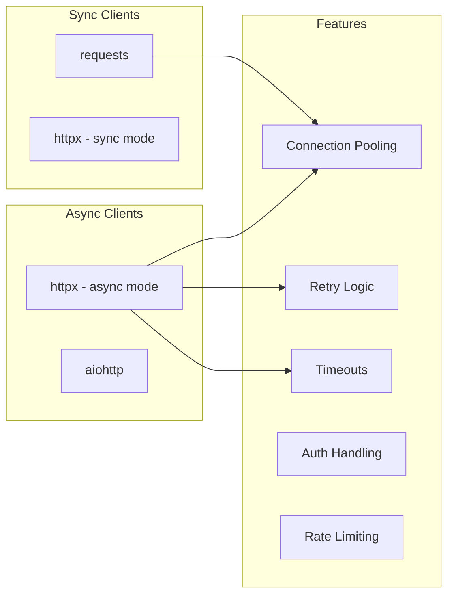

# PART 3: REST CLIENTS IN PYTHON
# ━━━━━━━━━━━━━━━━━━━━━━━━━━━━━━━━━━━━━━━━━━━━━━



## 1.1 Production-Grade REST Client

```python
"""
production_client.py — A complete, production-ready REST client.
"""
import httpx
import asyncio
import logging
from dataclasses import dataclass, field
from typing import Any
from enum import Enum
from contextlib import asynccontextmanager

logger = logging.getLogger(__name__)


# ─── Configuration ───
@dataclass(frozen=True)
class ClientConfig:
    base_url: str
    timeout: float = 30.0
    max_retries: int = 3
    backoff_factor: float = 0.5
    max_connections: int = 100
    max_keepalive: int = 20
    api_key: str | None = None
    bearer_token: str | None = None

    @property
    def headers(self) -> dict[str, str]:
        h: dict[str, str] = {
            "Content-Type": "application/json",
            "Accept": "application/json",
        }
        if self.api_key:
            h["X-API-Key"] = self.api_key
        if self.bearer_token:
            h["Authorization"] = f"Bearer {self.bearer_token}"
        return h


# ─── Response Wrapper ───
@dataclass
class APIResponse:
    status_code: int
    data: Any
    headers: dict[str, str]
    elapsed_ms: float

    @property
    def is_success(self) -> bool:
        return 200 <= self.status_code < 300

    @property
    def is_client_error(self) -> bool:
        return 400 <= self.status_code < 500

    @property
    def is_server_error(self) -> bool:
        return self.status_code >= 500


class APIError(Exception):
    def __init__(self, status_code: int, detail: str, response: APIResponse | None = None):
        self.status_code = status_code
        self.detail = detail
        self.response = response
        super().__init__(f"HTTP {status_code}: {detail}")


# ─── Async REST Client ───
class RestClient:
    """
    Production async REST client with:
    - Connection pooling
    - Automatic retries with exponential backoff
    - Structured error handling
    - Request/response logging
    - Timeout management
    """

    def __init__(self, config: ClientConfig):
        self.config = config
        self._client: httpx.AsyncClient | None = None

    async def _get_client(self) -> httpx.AsyncClient:
        if self._client is None or self._client.is_closed:
            self._client = httpx.AsyncClient(
                base_url=self.config.base_url,
                headers=self.config.headers,
                timeout=httpx.Timeout(self.config.timeout),
                limits=httpx.Limits(
                    max_connections=self.config.max_connections,
                    max_keepalive_connections=self.config.max_keepalive,
                ),
                follow_redirects=True,
            )
        return self._client

    async def close(self) -> None:
        if self._client and not self._client.is_closed:
            await self._client.aclose()

    async def __aenter__(self):
        return self

    async def __aexit__(self, *args):
        await self.close()

    async def _request(
        self,
        method: str,
        path: str,
        *,
        params: dict | None = None,
        json_data: Any = None,
        headers: dict | None = None,
        retry: bool = True,
    ) -> APIResponse:
        """Core request method with retry logic."""
        client = await self._get_client()
        last_exception: Exception | None = None
        max_attempts = self.config.max_retries if retry else 1

        for attempt in range(1, max_attempts + 1):
            try:
                logger.debug(f"→ {method} {path} (attempt {attempt}/{max_attempts})")

                response = await client.request(
                    method=method,
                    url=path,
                    params=params,
                    json=json_data,
                    headers=headers,
                )

                api_response = APIResponse(
                    status_code=response.status_code,
                    data=response.json() if response.content else None,
                    headers=dict(response.headers),
                    elapsed_ms=response.elapsed.total_seconds() * 1000,
                )

                logger.debug(
                    f"← {response.status_code} ({api_response.elapsed_ms:.1f}ms)"
                )

                # Don't retry client errors (4xx)
                if api_response.is_client_error:
                    raise APIError(
                        api_response.status_code,
                        str(api_response.data),
                        api_response,
                    )

                # Retry server errors (5xx)
                if api_response.is_server_error:
                    raise APIError(
                        api_response.status_code,
                        str(api_response.data),
                        api_response,
                    )

                return api_response

            except (httpx.ConnectError, httpx.ReadTimeout, APIError) as e:
                last_exception = e
                if attempt < max_attempts:
                    delay = self.config.backoff_factor * (2 ** (attempt - 1))
                    logger.warning(f"Retry {attempt}/{max_attempts} after {delay}s: {e}")
                    await asyncio.sleep(delay)

        raise last_exception  # type: ignore

    # ─── Convenience Methods ───
    async def get(self, path: str, *, params: dict | None = None) -> APIResponse:
        return await self._request("GET", path, params=params)

    async def post(self, path: str, *, data: Any = None) -> APIResponse:
        return await self._request("POST", path, json_data=data)

    async def put(self, path: str, *, data: Any = None) -> APIResponse:
        return await self._request("PUT", path, json_data=data)

    async def patch(self, path: str, *, data: Any = None) -> APIResponse:
        return await self._request("PATCH", path, json_data=data)

    async def delete(self, path: str) -> APIResponse:
        return await self._request("DELETE", path)


# ─── Usage Example ───
async def main():
    config = ClientConfig(
        base_url="https://api.example.com/v1",
        bearer_token="your-token-here",
        timeout=15.0,
        max_retries=3,
    )

    async with RestClient(config) as client:
        # GET with query params
        users = await client.get("/users", params={"page": 1, "limit": 50})
        print(f"Found {len(users.data)} users")

        # POST
        new_user = await client.post("/users", data={
            "name": "Alice",
            "email": "alice@example.com",
        })
        print(f"Created user: {new_user.data}")

        # Concurrent requests
        tasks = [
            client.get(f"/users/{uid}")
            for uid in range(1, 11)
        ]
        results = await asyncio.gather(*tasks, return_exceptions=True)
        successful = [r for r in results if isinstance(r, APIResponse) and r.is_success]
        print(f"Fetched {len(successful)}/10 users successfully")


# asyncio.run(main())
```

## 1.2 Sync Client with `requests` + Session

```python
import requests
from requests.adapters import HTTPAdapter
from urllib3.util.retry import Retry

def create_session(
    base_url: str = "",
    retries: int = 3,
    backoff: float = 0.3,
    status_forcelist: tuple = (500, 502, 503, 504),
) -> requests.Session:
    """Create a production-ready requests session."""
    session = requests.Session()

    retry_strategy = Retry(
        total=retries,
        backoff_factor=backoff,
        status_forcelist=status_forcelist,
        allowed_methods=["GET", "POST", "PUT", "DELETE"],
    )

    adapter = HTTPAdapter(
        max_retries=retry_strategy,
        pool_connections=20,
        pool_maxsize=20,
    )

    session.mount("http://", adapter)
    session.mount("https://", adapter)

    session.headers.update({
        "Content-Type": "application/json",
        "Accept": "application/json",
    })

    return session


# Usage
session = create_session()
session.headers["Authorization"] = "Bearer token123"

response = session.get("https://api.example.com/users", params={"page": 1})
response.raise_for_status()  # Raises for 4xx/5xx
data = response.json()
```

---

# ━━━━━━━━━━━━━━━━━━━━━━━━━━━━━━━━━━━━━━━━━━━━━━