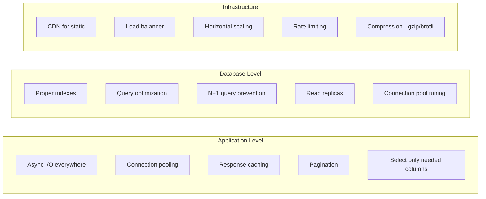

# PART 7: PERFORMANCE & OBSERVABILITY
# ━━━━━━━━━━━━━━━━━━━━━━━━━━━━━━━━━━━━━━━━━━━━━━

## 1.1 Structured Logging

```python
# app/core/logging_config.py
import logging
import json
import sys
from datetime import datetime, timezone


class JSONFormatter(logging.Formatter):
    def format(self, record: logging.LogRecord) -> str:
        log_data = {
            "timestamp": datetime.now(timezone.utc).isoformat(),
            "level": record.levelname,
            "logger": record.name,
            "message": record.getMessage(),
            "module": record.module,
            "function": record.funcName,
            "line": record.lineno,
        }

        if record.exc_info:
            log_data["exception"] = self.formatException(record.exc_info)

        # Include extra fields
        for key in ["request_id", "user_id", "duration_ms"]:
            if hasattr(record, key):
                log_data[key] = getattr(record, key)

        return json.dumps(log_data)


def setup_logging(level: str = "INFO") -> None:
    root = logging.getLogger()
    root.setLevel(level)

    handler = logging.StreamHandler(sys.stdout)
    handler.setFormatter(JSONFormatter())
    root.addHandler(handler)

    # Quiet noisy libraries
    logging.getLogger("uvicorn.access").setLevel(logging.WARNING)
    logging.getLogger("sqlalchemy.engine").setLevel(logging.WARNING)
```

## 1.2 Performance Checklist for Principal Engineers



```python
# ─── Avoiding N+1 Queries ───
from sqlalchemy.orm import selectinload, joinedload

# BAD: N+1 — one query per user's posts
async def get_users_bad(session: AsyncSession):
    result = await session.execute(select(UserDB))
    users = result.scalars().all()
    for user in users:
        # Each access triggers a NEW query
        print(user.posts)  # N additional queries!

# GOOD: Eager loading
async def get_users_good(session: AsyncSession):
    stmt = select(UserDB).options(selectinload(UserDB.posts))
    result = await session.execute(stmt)
    users = result.scalars().all()
    for user in users:
        print(user.posts)  # Already loaded — zero additional queries


# ─── Profiling ───
import cProfile
import pstats

def profile_function(func, *args, **kwargs):
    profiler = cProfile.Profile()
    profiler.enable()
    result = func(*args, **kwargs)
    profiler.disable()

    stats = pstats.Stats(profiler)
    stats.sort_stats("cumulative")
    stats.print_stats(20)  # Top 20 functions
    return result
```

---

# ━━━━━━━━━━━━━━━━━━━━━━━━━━━━━━━━━━━━━━━━━━━━━━