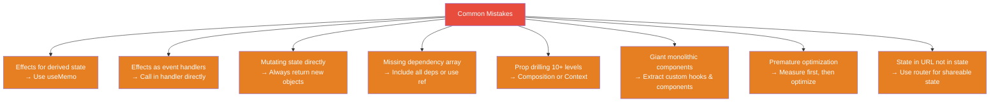

# 1. Anti-Patterns & Common Pitfalls

## 1.1 Anti-Pattern Catalogue

### ❌ Derived State in useState

```jsx
// ❌ BAD: State derived from props
function UserList({ users }) {
  const [sortedUsers, setSortedUsers] = useState(
    [...users].sort(byName)
  );

  // Now you need useEffect to sync... 🤮
  useEffect(() => {
    setSortedUsers([...users].sort(byName));
  }, [users]);

  return sortedUsers.map(/* ... */);
}

// ✅ GOOD: Derive during render
function UserList({ users }) {
  const sortedUsers = useMemo(
    () => [...users].sort(byName),
    [users]
  );
  return sortedUsers.map(/* ... */);
}
```

### ❌ useEffect as Event Handler

```jsx
// ❌ BAD: Effect to "respond" to a state change
const [submitted, setSubmitted] = useState(false);

useEffect(() => {
  if (submitted) {
    sendAnalytics('form_submitted');
    showToast('Success!');
    navigate('/dashboard');
  }
}, [submitted]);

function handleSubmit() {
  setSubmitted(true);
}

// ✅ GOOD: Just do it in the event handler
async function handleSubmit() {
  await api.submit(formData);
  sendAnalytics('form_submitted');
  showToast('Success!');
  navigate('/dashboard');
}
```

### ❌ Over-Engineering with Context

```jsx
// ❌ BAD: Context for state that's only used by one subtree
<GlobalUIContext.Provider value={{
  modalOpen, setModalOpen,
  sidebarCollapsed, setSidebarCollapsed,
  activeTab, setActiveTab,
  tooltipTarget, setTooltipTarget,
  // 20 more state values...
}}>

// ✅ GOOD: Local state or focused contexts
// Each piece of state lives where it's used
```

### ❌ Keys Anti-Patterns

```jsx
// ❌ BAD: Index as key for dynamic lists
{items.map((item, index) => (
  <Item key={index} data={item} />
  // Bug: reordering/inserting corrupts state
))}

// ❌ BAD: Random key (forces remount every render)
<Item key={Math.random()} />

// ❌ BAD: Non-unique key
{items.map(item => (
  <Item key={item.category} />  // Multiple items share key
))}

// ✅ GOOD: Stable, unique identifier
{items.map(item => (
  <Item key={item.id} data={item} />
))}

// ✅ GOOD: Key to intentionally reset state
<ProfileForm key={userId} userId={userId} />
// When userId changes, component fully remounts with fresh state
```

### ❌ Stale Closures

```jsx
// ❌ BAD: Stale closure in interval
function Timer() {
  const [count, setCount] = useState(0);

  useEffect(() => {
    const id = setInterval(() => {
      setCount(count + 1); // Always captures initial count (0)
    }, 1000);
    return () => clearInterval(id);
  }, []); // count not in deps

  // ✅ FIX 1: Functional update
  useEffect(() => {
    const id = setInterval(() => {
      setCount(c => c + 1); // Always uses latest
    }, 1000);
    return () => clearInterval(id);
  }, []);

  // ✅ FIX 2: Use ref for reading, state for rendering
  const countRef = useRef(count);
  countRef.current = count;

  useEffect(() => {
    const id = setInterval(() => {
      console.log('Current count:', countRef.current);
    }, 1000);
    return () => clearInterval(id);
  }, []);
}
```

## 1.2 Quick Reference



---
