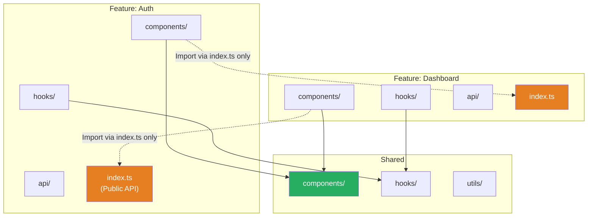
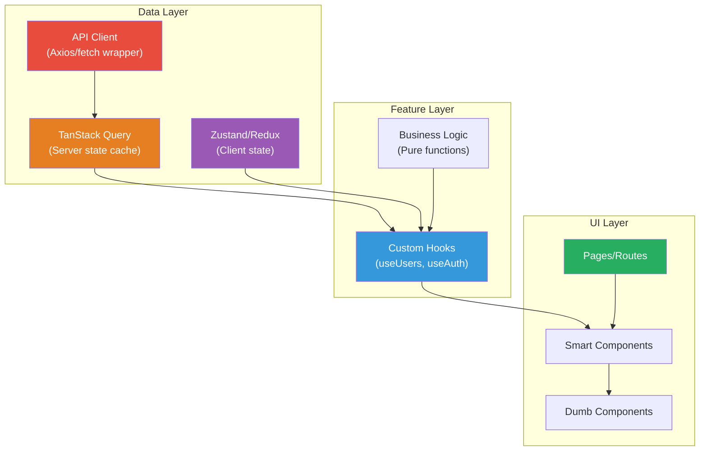
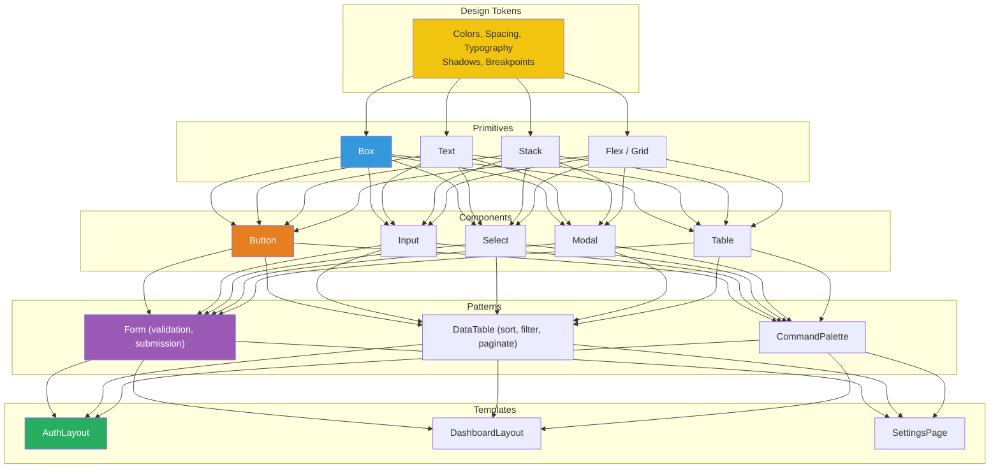

# 1. Architecture & System Design

## 1.1 Project Structure (Feature-based)

```
src/
├── app/                     # App-level setup
│   ├── App.tsx
│   ├── providers.tsx        # All context providers composed
│   ├── routes.tsx            # Route configuration
│   └── global.css
├── features/                # Feature modules (domain-driven)
│   ├── auth/
│   │   ├── components/
│   │   │   ├── LoginForm.tsx
│   │   │   └── LoginForm.test.tsx
│   │   ├── hooks/
│   │   │   └── useAuth.ts
│   │   ├── api/
│   │   │   └── authApi.ts
│   │   ├── types/
│   │   │   └── auth.types.ts
│   │   └── index.ts         # Public API (barrel export)
│   ├── dashboard/
│   │   ├── components/
│   │   ├── hooks/
│   │   ├── api/
│   │   └── index.ts
│   └── settings/
├── shared/                  # Shared across features
│   ├── components/          # Button, Modal, Table, etc.
│   ├── hooks/               # useDebounce, useMediaQuery, etc.
│   ├── utils/               # formatDate, classNames, etc.
│   ├── types/               # Global types
│   └── constants/
├── infrastructure/          # Technical concerns
│   ├── api/                 # API client setup
│   ├── monitoring/          # Error tracking, analytics
│   └── storage/             # localStorage helpers
└── test/                    # Test utilities
    ├── setup.ts
    ├── mocks/
    └── helpers/
```

## 1.2 Module Boundaries



> **Principal-level rule:** Features import from other features ONLY through their `index.ts` barrel exports. This creates clear module boundaries and makes refactoring safe.

## 1.3 Data Flow Architecture



## 1.4 Design System Architecture



---
