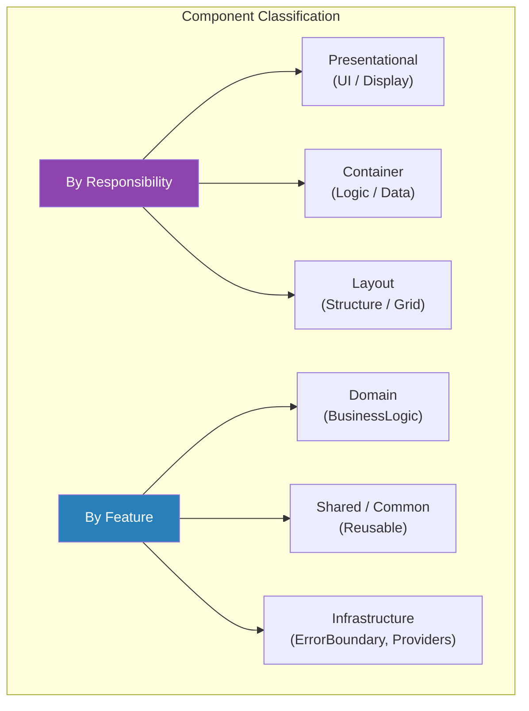
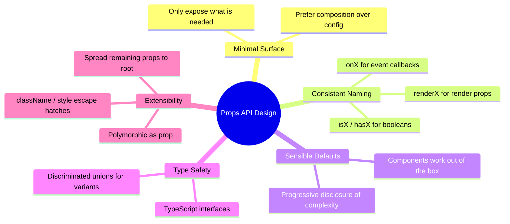

# 1. Component Design & Composition

## 1.1 Component Taxonomy



## 1.2 Composition Patterns

### Children as the Primary Composition Mechanism

```jsx
// ❌ Prop-based configuration — rigid
<Card
  title="Hello"
  subtitle="World"
  body="Content"
  footer={<Button>OK</Button>}
/>

// ✅ Composition with children and slots — flexible
<Card>
  <Card.Header>
    <h2>Hello</h2>
    <Badge>New</Badge>
  </Card.Header>
  <Card.Body>
    <p>Anything goes here</p>
  </Card.Body>
  <Card.Footer>
    <Button>OK</Button>
  </Card.Footer>
</Card>
```

### Compound Component Pattern

```jsx
import { createContext, useContext, useState } from 'react';

const AccordionContext = createContext();

function Accordion({ children, defaultOpen = null }) {
  const [openItem, setOpenItem] = useState(defaultOpen);

  const toggle = (id) => {
    setOpenItem((prev) => (prev === id ? null : id));
  };

  return (
    <AccordionContext.Provider value={{ openItem, toggle }}>
      <div className="accordion">{children}</div>
    </AccordionContext.Provider>
  );
}

function Item({ id, children }) {
  const { openItem, toggle } = useContext(AccordionContext);
  const isOpen = openItem === id;

  return (
    <div className="accordion-item">
      <button onClick={() => toggle(id)} aria-expanded={isOpen}>
        {children[0]} {/* Header */}
      </button>
      {isOpen && <div className="accordion-panel">{children[1]}</div>}
    </div>
  );
}

Accordion.Item = Item;

// Usage
<Accordion defaultOpen="faq-1">
  <Accordion.Item id="faq-1">
    <span>What is React?</span>
    <p>A library for building user interfaces.</p>
  </Accordion.Item>
  <Accordion.Item id="faq-2">
    <span>What is JSX?</span>
    <p>A syntax extension for JavaScript.</p>
  </Accordion.Item>
</Accordion>
```

### Render Props (Still Relevant for Headless Components)

```jsx
function useMousePosition() {
  const [position, setPosition] = useState({ x: 0, y: 0 });

  useEffect(() => {
    const handler = (e) => setPosition({ x: e.clientX, y: e.clientY });
    window.addEventListener('mousemove', handler);
    return () => window.removeEventListener('mousemove', handler);
  }, []);

  return position;
}

// Headless component via render prop
function MouseTracker({ children }) {
  const position = useMousePosition();
  return children(position);
}

// Usage
<MouseTracker>
  {({ x, y }) => (
    <div>
      Mouse: {x}, {y}
    </div>
  )}
</MouseTracker>
```

## 1.3 Props API Design Principles



### Polymorphic Components (TypeScript)

```tsx
import { ElementType, ComponentPropsWithoutRef, ReactNode } from 'react';

type ButtonProps<T extends ElementType = 'button'> = {
  as?: T;
  variant?: 'primary' | 'secondary' | 'ghost';
  children: ReactNode;
} & ComponentPropsWithoutRef<T>;

function Button<T extends ElementType = 'button'>({
  as,
  variant = 'primary',
  children,
  ...rest
}: ButtonProps<T>) {
  const Component = as || 'button';
  return (
    <Component className={`btn btn-${variant}`} {...rest}>
      {children}
    </Component>
  );
}

// Usage
<Button variant="primary" onClick={handleClick}>Click</Button>
<Button as="a" href="/home" variant="ghost">Go Home</Button>
<Button as={Link} to="/dashboard">Dashboard</Button>
```

---
