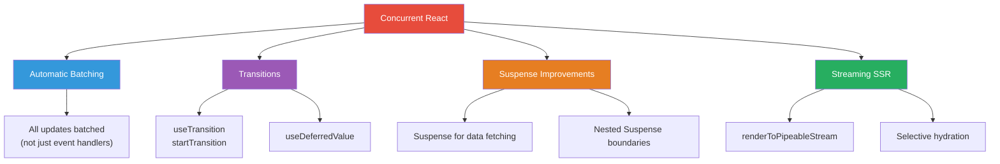
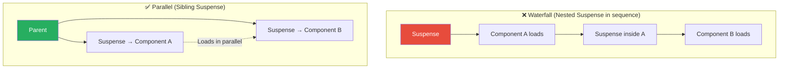

# 1. Concurrent React (React 18/19)

## 1.1 Concurrent Features Overview



## 1.2 useTransition

Marks a state update as **non-urgent** — React can interrupt it to handle more urgent updates (typing, clicking).

```jsx
function SearchableList({ items }) {
  const [query, setQuery] = useState('');
  const [filteredItems, setFilteredItems] = useState(items);
  const [isPending, startTransition] = useTransition();

  const handleSearch = (e) => {
    const value = e.target.value;

    // Urgent: update the input immediately
    setQuery(value);

    // Non-urgent: filter the list (can be interrupted)
    startTransition(() => {
      const filtered = items.filter(item =>
        item.name.toLowerCase().includes(value.toLowerCase())
      );
      setFilteredItems(filtered);
    });
  };

  return (
    <>
      <input value={query} onChange={handleSearch} />
      {isPending && <Spinner />}
      <ItemList items={filteredItems} />
    </>
  );
}
```

## 1.3 useDeferredValue

```jsx
function SearchResults({ query }) {
  // query updates urgently, but deferredQuery lags behind
  const deferredQuery = useDeferredValue(query);
  const isStale = query !== deferredQuery;

  const results = useMemo(
    () => heavySearch(deferredQuery),
    [deferredQuery]
  );

  return (
    <div style={{ opacity: isStale ? 0.6 : 1 }}>
      <ResultsList results={results} />
    </div>
  );
}
```

## 1.4 Suspense

```jsx
import { Suspense, lazy } from 'react';

// Code splitting
const LazyDashboard = lazy(() => import('./Dashboard'));

// Data fetching (with compatible library like TanStack Query)
function App() {
  return (
    <Suspense fallback={<AppSkeleton />}>
      <Layout>
        <Suspense fallback={<SidebarSkeleton />}>
          <Sidebar />
        </Suspense>
        <Suspense fallback={<ContentSkeleton />}>
          <LazyDashboard />
        </Suspense>
      </Layout>
    </Suspense>
  );
}
```

### Suspense Cascading vs. Parallel



---
