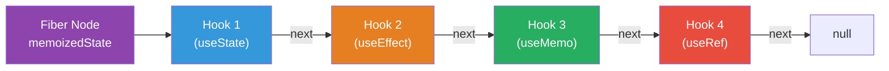
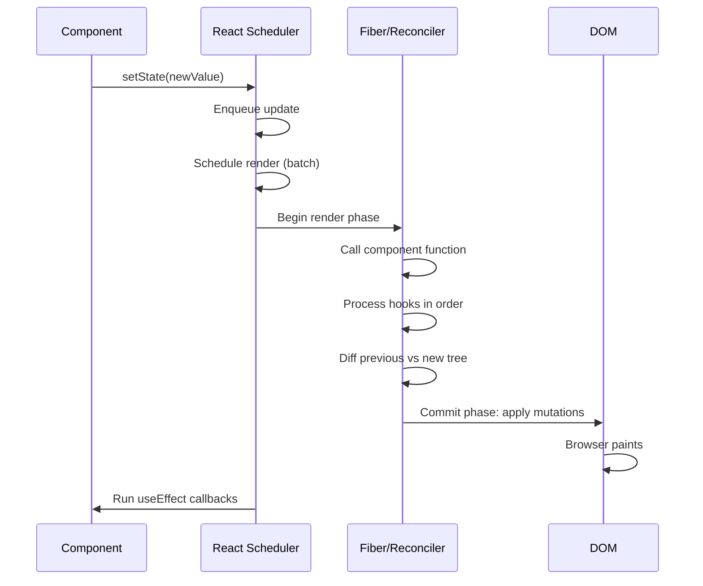
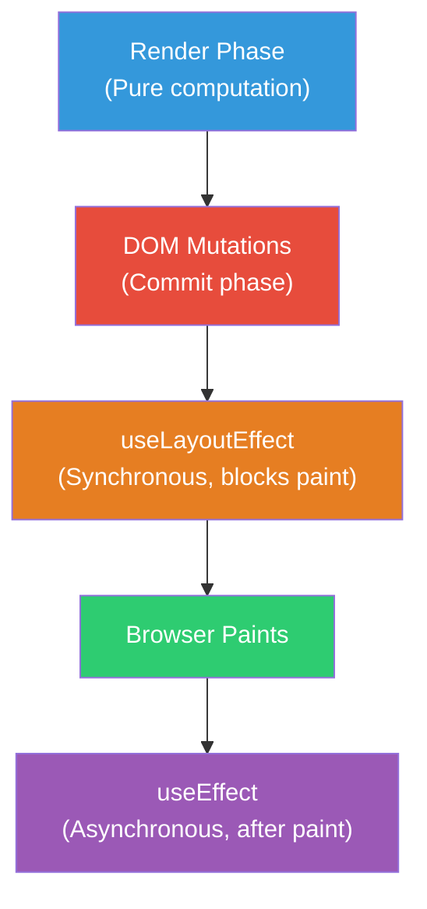
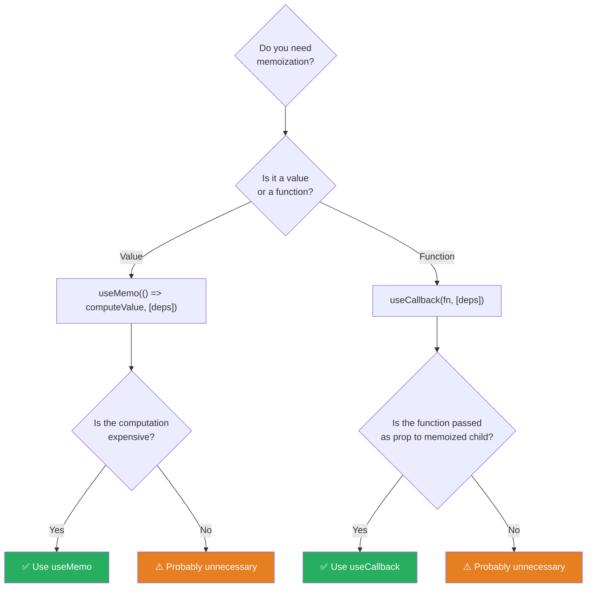
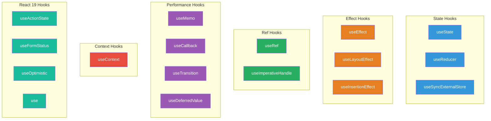

# 1. Hooks — Deep Dive

## 1.1 Hooks Mental Model

Hooks are an **ordered linked list** stored on the fiber node. This is why they must be called in the same order every render.



## 1.2 useState — In Depth

```jsx
// Basic
const [count, setCount] = useState(0);

// Lazy initialization (function runs only on mount)
const [data, setData] = useState(() => {
  return JSON.parse(localStorage.getItem('expensive-data'));
});

// Functional updates (when new state depends on previous)
setCount(prev => prev + 1); // ✅ Always correct
setCount(count + 1);        // ⚠️ Stale closure risk in async

// Batching (React 18+: automatic for ALL updates)
function handleClick() {
  setCount(c => c + 1);
  setFlag(f => !f);
  setText('updated');
  // Only ONE re-render in React 18+ (even in setTimeout, promises)
}
```

### State Update Lifecycle



## 1.3 useEffect — The Full Picture

```jsx
useEffect(() => {
  // 1. Effect runs AFTER paint (asynchronous)
  const subscription = api.subscribe(id);

  return () => {
    // 2. Cleanup runs BEFORE next effect or on unmount
    subscription.unsubscribe();
  };
}, [id]); // 3. Dependency array determines when effect re-runs
```

### Effect Timing



### Common Effect Patterns

```jsx
// 1. Run once on mount
useEffect(() => {
  initializeSDK();
  return () => cleanupSDK();
}, []);

// 2. Synchronize with external system
useEffect(() => {
  const ws = new WebSocket(`wss://api.example.com/${roomId}`);
  ws.onmessage = (event) => setMessages(m => [...m, event.data]);
  return () => ws.close();
}, [roomId]);

// 3. Debounced search
useEffect(() => {
  const timer = setTimeout(() => {
    if (query.length > 2) {
      fetchResults(query).then(setResults);
    }
  }, 300);
  return () => clearTimeout(timer);
}, [query]);

// 4. Event listener
useEffect(() => {
  const handler = (e) => {
    if (e.key === 'Escape') onClose();
  };
  document.addEventListener('keydown', handler);
  return () => document.removeEventListener('keydown', handler);
}, [onClose]);
```

## 1.4 useRef — Beyond DOM References

```jsx
// 1. DOM reference
const inputRef = useRef(null);
useEffect(() => { inputRef.current?.focus(); }, []);

// 2. Mutable value that doesn't trigger re-render
const renderCount = useRef(0);
useEffect(() => { renderCount.current += 1; });

// 3. Previous value pattern
function usePrevious(value) {
  const ref = useRef();
  useEffect(() => {
    ref.current = value;
  });
  return ref.current; // Returns value from PREVIOUS render
}

// 4. Stable callback reference (avoids effect re-runs)
function useEventCallback(fn) {
  const ref = useRef(fn);
  useLayoutEffect(() => {
    ref.current = fn;
  });
  return useCallback((...args) => ref.current(...args), []);
}

// 5. Instance variable (like class this.x)
function Timer() {
  const intervalRef = useRef(null);

  const start = () => {
    intervalRef.current = setInterval(() => tick(), 1000);
  };

  const stop = () => {
    clearInterval(intervalRef.current);
  };

  // ...
}
```

## 1.5 useMemo and useCallback



```jsx
// useMemo: memoize expensive computation
const sortedItems = useMemo(() => {
  return [...items].sort((a, b) => a.name.localeCompare(b.name));
}, [items]);

// useCallback: stable function identity
const handleSubmit = useCallback((values) => {
  api.submit(id, values);
}, [id]);

// useCallback is syntactic sugar:
useCallback(fn, deps)  ===  useMemo(() => fn, deps)
```

> **Principal-level insight:** Premature memoization adds complexity without measurable benefit. Memoize when you have *evidence* of performance issues, when passing callbacks to `React.memo` components, or when values are used in other hooks' dependency arrays.

## 1.6 useReducer — Complex State Logic

```jsx
const initialState = {
  status: 'idle',       // 'idle' | 'loading' | 'success' | 'error'
  data: null,
  error: null,
};

function fetchReducer(state, action) {
  switch (action.type) {
    case 'FETCH_START':
      return { ...state, status: 'loading', error: null };
    case 'FETCH_SUCCESS':
      return { status: 'success', data: action.payload, error: null };
    case 'FETCH_ERROR':
      return { status: 'error', data: null, error: action.payload };
    case 'RESET':
      return initialState;
    default:
      throw new Error(`Unknown action: ${action.type}`);
  }
}

function useFetch(url) {
  const [state, dispatch] = useReducer(fetchReducer, initialState);

  useEffect(() => {
    const controller = new AbortController();
    dispatch({ type: 'FETCH_START' });

    fetch(url, { signal: controller.signal })
      .then(res => res.json())
      .then(data => dispatch({ type: 'FETCH_SUCCESS', payload: data }))
      .catch(err => {
        if (err.name !== 'AbortError') {
          dispatch({ type: 'FETCH_ERROR', payload: err.message });
        }
      });

    return () => controller.abort();
  }, [url]);

  return state;
}
```

## 1.7 Custom Hooks — Extracting Logic

```jsx
// Reusable debounced value
function useDebounce(value, delay = 300) {
  const [debouncedValue, setDebouncedValue] = useState(value);

  useEffect(() => {
    const timer = setTimeout(() => setDebouncedValue(value), delay);
    return () => clearTimeout(timer);
  }, [value, delay]);

  return debouncedValue;
}

// Intersection observer
function useIntersection(ref, options = {}) {
  const [entry, setEntry] = useState(null);

  useEffect(() => {
    const node = ref.current;
    if (!node) return;

    const observer = new IntersectionObserver(
      ([entry]) => setEntry(entry),
      options
    );

    observer.observe(node);
    return () => observer.disconnect();
  }, [ref, options.threshold, options.root, options.rootMargin]);

  return entry;
}

// Local storage sync
function useLocalStorage(key, initialValue) {
  const [value, setValue] = useState(() => {
    try {
      const stored = localStorage.getItem(key);
      return stored !== null ? JSON.parse(stored) : initialValue;
    } catch {
      return initialValue;
    }
  });

  useEffect(() => {
    try {
      localStorage.setItem(key, JSON.stringify(value));
    } catch (e) {
      console.warn(`Failed to save ${key}:`, e);
    }
  }, [key, value]);

  return [value, setValue];
}
```

## 1.8 Full Hooks Reference



---
